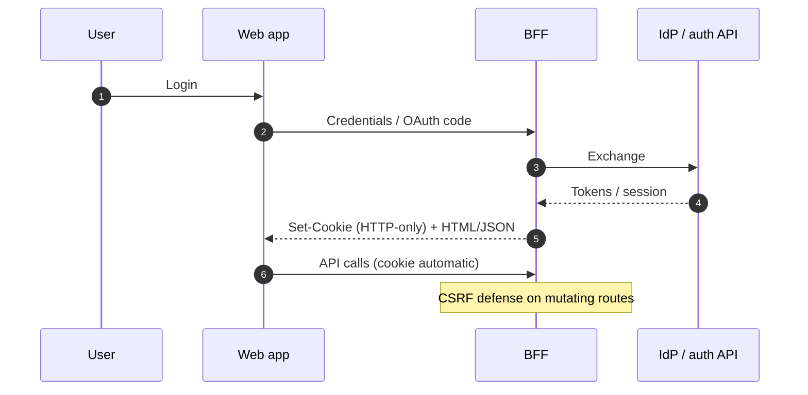

# Auth UX

> **Related:** API(Application Programming Interface) auth models → [api-design §4 Auth model](../../api-design-and-protection/includes/04-auth-model.md) · Enterprise identity → [api-design §12](../../api-design-and-protection/includes/12-identity-rbac-iam-ad.md) · Secrets not in the browser → [enterprise-security §5](../../enterprise-security-compliance/includes/05-secrets-beyond-database.md) · XSS(Cross-Site Scripting)/CSRF(Cross-Site Request Forgery) classes → [enterprise-security §3](../../enterprise-security-compliance/includes/03-owasp-and-common-vulns.md)

## At a glance

| Pattern | Browser storage | CSRF(Cross-Site Request Forgery) | Good for |
|---------|-----------------|----------------------------------|----------|
| **Session cookie (HTTP-only, Secure, SameSite)** | Cookie jar | Yes — token/header or strict SameSite + careful | First-party web + BFF(Backend for Frontend) |
| **Access token in memory + refresh cookie** | Memory + HTTP(Hypertext Transfer Protocol)-only refresh | Refresh cookie needs CSRF care | SPA with BFF refresh |
| **Access token in localStorage** | JS-readable | CSRF less relevant; **XSS steals tokens** | Avoid for high-value apps |
| **Bearer only (native / partner)** | OS secure storage / no browser | N/A | Mobile / API clients |

**Rule of thumb:** For first-party web, prefer **HTTP-only cookies via BFF**; never put long-lived refresh tokens in `localStorage`.

## Session vs token (UX lens)

| Concern | Cookie session | SPA Bearer in JS |
|---------|----------------|------------------|
| XSS impact | Session cookie not readable by JS (still dangerous actions) | Token theft trivial if in JS storage |
| CSRF | Must mitigate | Less CSRF if Authorization header set by JS |
| SSR(Server-Side Rendering) friendliness | Natural | Harder |
| Cross-site embeds | SameSite policy | Explicit headers |

## Refresh UX

| Requirement | Practice |
|-------------|----------|
| Silent refresh | BFF refresh endpoint; single-flight lock |
| Expiry mid-form | Queue mute; re-auth modal; preserve draft |
| Hard revoke | Fail closed; clear cookie; redirect login with `returnTo` |
| Multi-tab | BroadcastChannel / cookie change handling |

## CSRF for cookie-authenticated browsers

| Control | Notes |
|---------|-------|
| `SameSite=Lax` or `Strict` | Baseline; `None` needs Secure + strong CSRF |
| Anti-CSRF token | Double-submit or synchronizer for state-changing requests |
| Custom header requirement | Helps; not sufficient alone if CORS misconfigured |
| Don’t CSRF-protect Bearer-from-header APIs blindly | Different threat model |

Detail on API-side OAuth(Open Authorization)/PKCE(Proof Key for Code Exchange) → [api-design §4](../../api-design-and-protection/includes/04-auth-model.md).

## UX checklist

- Clear signed-in identity and logout
- Step-up MFA(Multi-Factor Authentication) prompts with reason
- Error messages without account enumeration where policy requires
- Accessible login (labels, errors, focus) → [§6](06-accessibility-bar.md)

## Common mistakes

| Mistake | Fix |
|---------|-----|
| Refresh token in localStorage | HTTP-only cookie + BFF |
| Disabling CSRF because “we have JWT(JSON Web Token)” | JWT in cookie still needs CSRF |
| `SameSite=None` without Secure | Always Secure for cross-site |
| Login return URL open redirect | Allowlist return paths |
| Showing stack traces on auth failures | Stable codes + correlation id |