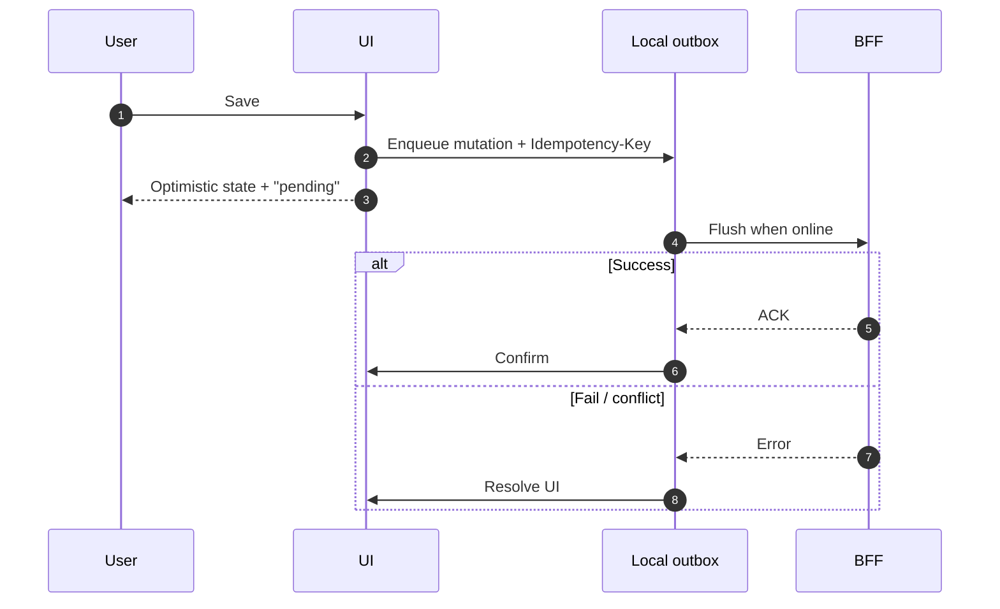

# Offline and Flaky Network

> **Related:** Idempotent writes → [api-design §13](../../api-design-and-protection/includes/13-idempotency.md) · Async jobs → [api-design §10A](../../api-design-and-protection/includes/10A-async-jobs-polling.md) · Realtime reconnect → [§5](05-realtime-ux.md) · Error UX → [§1](01-frontend-architecture.md)

## At a glance

| Scenario | UX goal | Engineering |
|----------|---------|-------------|
| Brief blip | Retry silently once/twice | Idempotent POST + backoff |
| Offline editing | Don’t lose input | Local draft queue |
| Chronic flaky mobile | Honest status + resume | Outbox pattern in client |
| Conflict after sync | Explain & resolve | Version vectors / ETags |

**Rule of thumb:** Treat the network as **unreliable by default**; optimistic UI without an outbox is a data-loss bug.

## Client outbox

## Patterns

| Pattern | Use when |
|---------|----------|
| **Retry with jitter** | GET and idempotent writes |
| **Idempotency-Key** | Payments, creates, anything costly → [api-design §13](../../api-design-and-protection/includes/13-idempotency.md) |
| **Local draft** | Forms; persist to IndexedDB |
| **Read cache + revalidate** | List/detail while offline-capable |
| **Queue + drain** | Multi-mutation offline sessions |
| **Conflict UI** | Collaborative or multi-device edits |

## What to show users

| State | Presentation |
|-------|--------------|
| Offline | Banner; disable non-queued actions |
| Syncing | Subtle progress; keep UI usable |
| Synced | Clear pending badges |
| Conflict | Diff or “keep mine / keep server” |
| Hard fail | Support code / correlation id |

Avoid infinite spinners; prefer last-known data + stale label.

## Service workers

| Use | Caution |
|-----|---------|
| Precache app shell | Version carefully; avoid sticky old HTML |
| Runtime cache for static | Fingerprint assets |
| API(Application Programming Interface) caching | Only for safe GET; never cache sensitive without care |
| Background sync | Great with outbox; test browser support |

## Flaky ≠ offline

Timeouts, 502s, and 429s need the same backoff discipline. On 429 honor `Retry-After` → [api-rate-limiting](../../api-rate-limiting/README.md).

## Common mistakes

| Mistake | Fix |
|---------|-----|
| Optimistic UI without durable queue | Outbox + idempotency keys |
| Retrying non-idempotent POST forever | Keyed creates; show conflict |
| Blank screen when offline | Cached shell + drafts |
| Service worker caching authenticated JSON broadly | Network-first / private |
| No multi-tab outbox coordination | Single flusher lock |