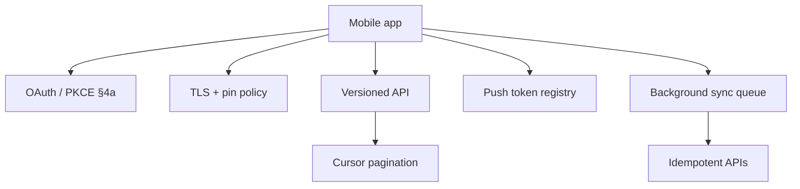

# Mobile API Contracts

Mobile clients add constraints that ordinary browser OAuth(Open Authorization) and REST(Representational State Transfer) docs often omit: certificate pinning expectations, push-token lifecycle, background sync with idempotency, pagination under flaky networks, and versioning that tolerates **app-store lag**. Auth redirect safety → [auth §4a](../../auth-oauth-oidc-and-login-security/includes/04A-third-party-cookies-and-mobile-redirects.md). HTTP(Hypertext Transfer Protocol) versioning → [api-design §14](../../api-design-and-protection/includes/14-api-versioning-and-deprecation.md). Offline UX → [§8](08-offline-and-flaky-network.md).

> **Scope:** **Mobile↔API contract concerns beyond login** — pinning policy, push tokens, background sync, resilient pagination, and slow client upgrades. OAuth/OIDC(OpenID Connect) mobile redirects and PKCE(Proof Key for Code Exchange) → [auth §4a](../../auth-oauth-oidc-and-login-security/includes/04A-third-party-cookies-and-mobile-redirects.md). Browser/BFF(Backend for Frontend) auth UX → [§7](07-auth-ux.md). Generic offline patterns → [§8](08-offline-and-flaky-network.md).
>
> **Related:** [§8 Offline and flaky network](08-offline-and-flaky-network.md) · Auth mobile redirects → [auth §4a](../../auth-oauth-oidc-and-login-security/includes/04A-third-party-cookies-and-mobile-redirects.md) · API versioning → [api §14](../../api-design-and-protection/includes/14-api-versioning-and-deprecation.md) · Idempotency → [api §13](../../api-design-and-protection/includes/13-idempotency.md) · Push notifications → [api §10D](../../api-design-and-protection/includes/10D-notification-delivery.md)

---

## At a glance

| Concern | Mobile contract default |
|---------|-------------------------|
| **TLS(Transport Layer Security) pinning** | Document expectation; ship pin rotation without bricking |
| **Push tokens** | Register / rotate / invalidate; platform-specific (APNs / FCM) |
| **Background sync** | Idempotent mutations; conflict policy; battery-aware |
| **Pagination** | Cursor-based; tolerate duplicates; resume after kill |
| **Versioning** | Coexist N app versions; deprecate with store rollout lag in mind |

**Rule of thumb:** Assume a non-trivial fraction of users run a **build weeks or months behind** HEAD. Breaking mobile clients is a multi-week incident, not a same-day deploy fix.

---

## Beyond OAuth

Login and token storage are necessary but not sufficient. The API must also specify how the installed app behaves when the network flaps, when certificates rotate, and when the OS wakes a background task.

---

## Certificate pinning expectations

| Topic | Contract guidance |
|-------|-------------------|
| **Whether to pin** | High-threat apps may pin; many consumer apps rely on system trust + ATS/NSAppTransport |
| **What to pin** | Prefer SPKI(Subject Public Key Info) hashes of intermediates you control; avoid leaf-only pins |
| **Rotation** | Always ship **backup pins**; rotate before primary expiry |
| **Emergency bypass** | Remote config kill-switch for pins (signed) if a bad pin would brick the fleet |
| **Server side** | Document cipher/TLS minimums; do not surprise-break old OS TLS stacks without a force-upgrade path |

Pinning mistakes cause **total client outage** with no server rollback. Treat pin changes like a staged mobile release, not a silent infra tweak.

---

## Push token lifecycle

| Event | API / client duty |
|-------|-------------------|
| **Login / grant notification permission** | `POST` token + platform + app version + device id |
| **Token refresh** (OS rotation) | Upsert; retire old token |
| **Logout / uninstall signal** | Delete or mark inactive |
| **Provider bounce / invalid token** | Server suppresses and requests re-register — [api §10D](../../api-design-and-protection/includes/10D-notification-delivery.md) · [§10E](../../api-design-and-protection/includes/10E-notification-provider-operations.md) |

| Field | Why |
|-------|-----|
| `platform` | APNs vs FCM routing |
| `app_id` / bundle id | Multi-app backends |
| `token` | Opaque; store hashed if required by policy |
| `user_id` / install id | Target and dedup |
| `last_seen_at` | Prune stale |

Never send secrets in push payloads; use push as a **wake** to fetch over the authenticated API.

---

## Background sync and idempotency

| Pattern | Requirement |
|---------|-------------|
| **Mutation queue** | Durable on device; drain with backoff — [§8](08-offline-and-flaky-network.md) |
| **Idempotency-Key** | Per user-intent operation — [api §13](../../api-design-and-protection/includes/13-idempotency.md) |
| **Conflict policy** | Last-write-wins vs server-wins vs merge; document per resource |
| **Auth refresh** | Background refresh without interactive UI when possible; else pause queue |
| **Partial failure** | Per-item status; do not re-apply whole batch blindly |

Background work must respect OS budget (iOS background modes / Android Doze). Design APIs that complete in short bursts.

---

## Pagination for flaky networks

| Practice | Why |
|----------|-----|
| **Cursor / opaque page token** | Stable under inserts; better than fragile offset |
| **Idempotent page fetch** | Retries must not skip or double-apply side effects |
| **Dedup by resource id** | Client may receive overlapping pages after retry |
| **Bounded page size** | Large pages fail more on flaky links |
| **`Retry-After` / 429** | Honor backoff — [api-rate-limiting](../../api-rate-limiting/README.md) |

Document whether cursors expire and how to restart from a bookmark after app kill.

---

## Versioning for app-store lag

| Tactic | Use |
|--------|-----|
| **Additive OpenAPI changes** | Default; old apps ignore new fields |
| **Parallel `/vN`** | Breaking changes; keep old N alive through store adoption curve — [api §14](../../api-design-and-protection/includes/14-api-versioning-and-deprecation.md) |
| **Min app version header** | Soft prompt upgrade; hard block only for security |
| **Feature flags** | Gate server behavior for capable builds — [deployment §7](../../deployment-strategies/includes/07-feature-flags.md) |
| **Deprecation window** | Measure active versions in analytics before sunset |

| Anti-pattern | Fix |
|--------------|-----|
| Break JSON field types in place | New field or new version |
| Assume force-upgrade reaches 100% in days | Weeks–months; enterprise MDMs differ |
| Remove old OAuth redirect overnight | Coordinate with shipped apps — [auth §4a](../../auth-oauth-oidc-and-login-security/includes/04A-third-party-cookies-and-mobile-redirects.md) |

---

## Operational checklist

- [ ] Pin policy and rotation runbook (if pinning)
- [ ] Push token register / rotate / invalidate APIs
- [ ] Idempotent write APIs for offline queue
- [ ] Cursor pagination + client dedup guidance
- [ ] Active app-version dashboards before API sunset
- [ ] Min-version and force-upgrade policy documented
- [ ] Sandbox + try-it for mobile redirect URIs — [auth §4a](../../auth-oauth-oidc-and-login-security/includes/04A-third-party-cookies-and-mobile-redirects.md)

---

## Common mistakes

| Mistake | Fix |
|---------|-----|
| Leaf cert pin with no backup | SPKI + backup pins + remote bypass |
| Push token write-only, never prune | Invalid-token webhooks + delete on logout |
| Background POST without idempotency | `Idempotency-Key` per intent |
| Offset pagination on live feeds | Cursors + dedup |
| Breaking API the day after app release | Parallel versions + adoption metrics |
| Treating mobile like a fresh SPA deploy | App-store lag is the release constraint |

---

## Pros and cons

### Explicit mobile contract (pin, push, sync, version lag)

**Pros:** Fewer bricked installs, safer offline writes, predictable deprecations.

**Cons:** More API surface and ops discipline; version coexistence cost.

### “Same as web API”

**Pros:** Simpler docs.

**Cons:** Silent data loss offline, push spam to dead tokens, forced emergencies on pin/TLS changes.