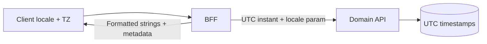

# i18n Locale and Timezones

Internationalization (i18n) is a **contract across API(Application Programming Interface), BFF(Backend for Frontend), and clients**. Locale affects formatting, sorting, and copy; timezones affect deadlines, billing windows, and “today” — mismatches show up as wrong dates, broken filters, and support tickets.

> **Scope:** Locale and timezone contracts between domain APIs and BFF/clients. Mobile offline patterns → [§8A](08A-mobile-api-contracts.md). Rendering and hydration → [§2](02-rendering-tradeoffs.md).
>
> **Related:** [§8A Mobile API contracts](08A-mobile-api-contracts.md) · [§8 Offline and flaky network](08-offline-and-flaky-network.md) · API date conventions → [api-design §1](../../api-design-and-protection/includes/01-api-design.md) · Accessibility copy → [§6](06-accessibility-bar.md)

---

## At a glance

| Concern | Contract |
|---------|----------|
| **API storage** | UTC instants (`2026-06-14T18:30:00Z`); avoid ambiguous local strings |
| **API transport** | ISO 8601; separate `timezone` field when calendar semantics matter |
| **Locale** | `Accept-Language` or explicit `locale` query; document fallback chain |
| **BFF** | Formats for display; never re-parse localized strings back to API |
| **Client** | `Intl` / ICU(International Components for Unicode); user TZ(Time Zone) for “local day” |
| **FX(Foreign Exchange)** | Money as minor units + ISO currency code; rate timestamp when converting |

**Rule of thumb:** Store and compute in **UTC**; localize at the **edge** (BFF or client) with explicit locale and timezone context.

---

## Data flow

| Field type | API shape | BFF/client role |
|------------|-----------|-----------------|
| Instant | `occurred_at` UTC | Format with user TZ |
| Local calendar date | `date` + `timezone` or `local_date` + `tz` | Render pickers; no DST(Daylight Saving Time) math in API strings |
| Money | `amount_minor` + `currency` | Format with locale; FX at quoted rate time |
| Sortable text | Canonical Unicode | Locale-aware sort in DB or index when required |

---

## Locale negotiation

| Mechanism | Use |
|-----------|-----|
| `Accept-Language` | HTTP(Hypertext Transfer Protocol)-standard; good for BFF aggregation |
| Explicit `?locale=fr-CA` | Cache-friendly; document in OpenAPI — [api-design §7](../../api-design-and-protection/includes/07-openapi-swagger.md) |
| User profile locale | Default; allow guest `Accept-Language` |
| Fallback | `fr-CA` → `fr` → `en`; never silent wrong language |

`Vary: Accept-Language` when CDN(Content Delivery Network) caches localized GET responses — [api-design §1A](../../api-design-and-protection/includes/01A-http-caching-and-conditional-requests.md).

---

## Timezone rules

| Scenario | Pattern |
|----------|---------|
| “Remind me at 9am local” | Store `local_time` + IANA TZ id (`America/Toronto`) |
| Reporting “business day” | Define anchor TZ per tenant or user |
| DST transitions | Never encode local wall time as UTC without TZ |
| Relative labels | Compute “today” in client/BFF with user TZ |

APIs return **both** UTC instant and intended local context when users care about calendar boundaries (subscriptions, SLA(Service Level Agreement) windows).

---

## Operational checklist

- [ ] OpenAPI documents date/time fields as UTC unless noted
- [ ] BFF does not send localized date strings to write APIs
- [ ] Tests cover DST boundary and `fr-CA` vs `fr-FR` formatting
- [ ] Money never as floats; currency always explicit
- [ ] Error messages translatable; codes stable for client mapping

---

## Common mistakes

| Mistake | Fix |
|---------|-----|
| `new Date("2026-06-14")` ambiguity | Full ISO with offset or separate date + TZ |
| Server formats dates in server locale | User locale at BFF/client |
| Sorting UTF-8 bytes | Locale-aware collation when product requires |
| Caching localized HTML without `Vary` | `Vary: Accept-Language` or edge disable |
| FX without rate timestamp | Store rate id + as-of instant |
| i18n only in UI strings | Locale-aware API errors and validation messages |
