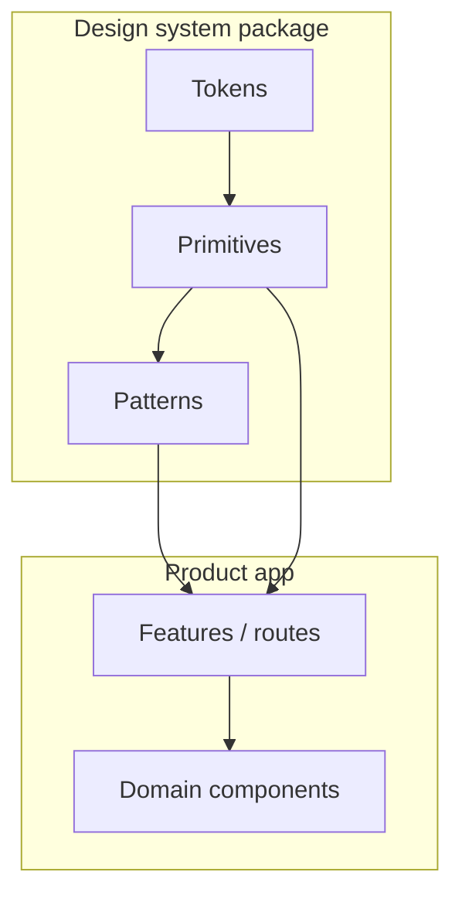

# Design-System Boundaries

> **Related:** Accessibility bar → [§6](06-accessibility-bar.md) · Frontend architecture → [§1](01-frontend-architecture.md) · Feature flags / experiments → [deployment §5](../../deployment-strategies/includes/05-ab-testing.md) / [§7](../../deployment-strategies/includes/07-feature-flags.md)

## At a glance

| Layer | Contains | Does not contain |
|-------|----------|------------------|
| **Foundations** | Tokens (color, space, type), motion | Product copy |
| **Primitives** | Button, Input, Dialog, Menu | Domain fields like `OrderStatusBadge` business rules |
| **Patterns** | PageHeader, FormField layout | One-off marketing sections |
| **Product features** | Screens composing DS | Forked buttons with new a11y behavior |

**Rule of thumb:** If two products need the same **behavior**, it belongs in the design system; if only one needs the **business meaning**, it stays in the product.

## Ownership boundary

| Change type | Owner | Release |
|-------------|-------|---------|
| New primitive (e.g. Combobox) | DS team + a11y review | Semver DS release |
| Token theme tweak | DS | Versioned tokens |
| `InvoiceTable` columns | Product | App release |
| Patch Dialog focus trap bug | DS (hotfix) | Patch version |

## Versioning and consumption

| Practice | Why |
|----------|-----|
| Semver on DS package | Apps upgrade deliberately |
| Codemods for breaking changes | Reduce fear of upgrades |
| No deep imports of private internals | Prevent brittle coupling |
| Peer deps on React aligned | Avoid duplicate runtimes |
| Changelog with a11y notes | Call out behavior changes |

## What must stay in the DS

- Keyboard and focus behavior for overlays
- Contrast-safe token pairs
- Form control labeling patterns
- Toast / live-region conventions

Products may theme tokens within approved ranges; they may not ship a second Dialog implementation “for speed.”

## Escape hatches

| Allowed | Process |
|---------|---------|
| `unstable_` preview primitive | Flag + DS roadmap issue |
| Local CSS for one marketing page | Time-boxed; don’t promote to shared kit casually |
| Product-domain composite | Lives in app; promote only after second consumer |

## Common mistakes

| Mistake | Fix |
|---------|-----|
| Copy-paste Button into app to “tweak” | Extend DS API(Application Programming Interface) or request variant |
| DS includes billing business logic | Keep domain out |
| Mega bundle import | Path exports / tree-shake |
| Breaking a11y in a “visual-only” release | a11y in DS DoD → [§6](06-accessibility-bar.md) |
| Five products on five DS majors forever | Upgrade cadence owned by fullstack TL |