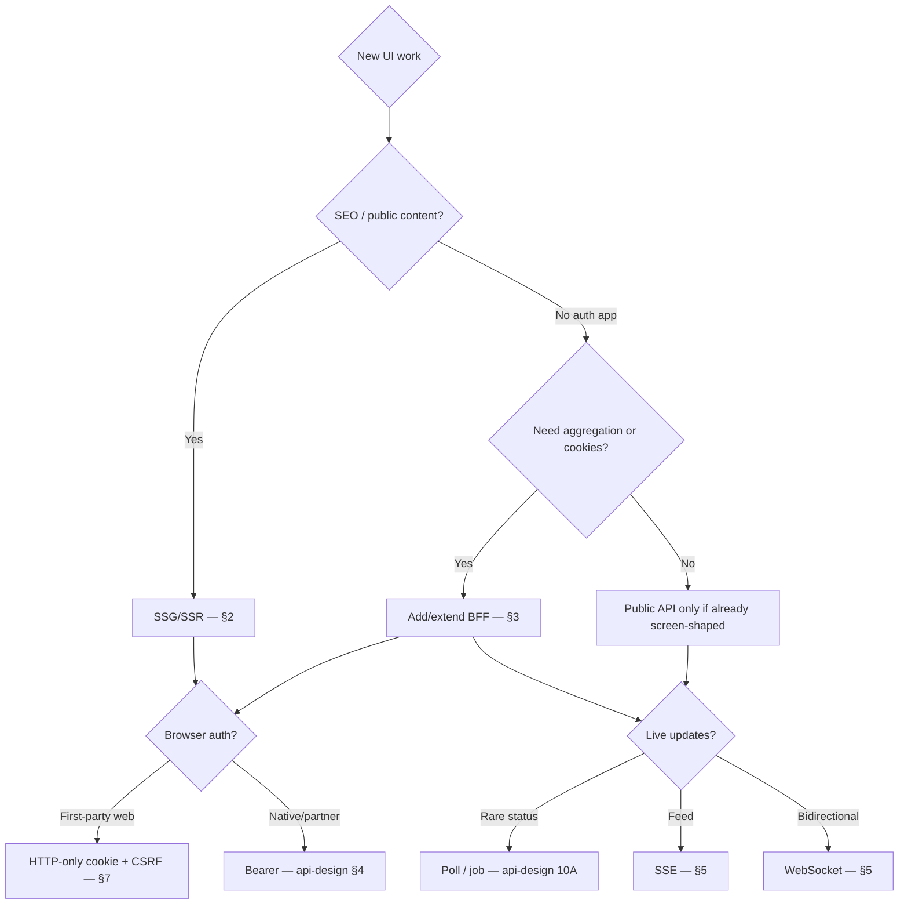

# Decision Guide

> **Related:** Overview → [§0](00-overview.md) · Rendering → [§2](02-rendering-tradeoffs.md) · BFF(Backend for Frontend) → [§3](03-bff-ownership.md) · Auth UX → [§7](07-auth-ux.md) · API(Application Programming Interface) async → [api-design §10](../../api-design-and-protection/includes/10-async-patterns.md)

## Decision flow

## Pick rendering

| Situation | Choice |
|-----------|--------|
| Docs / marketing | SSG(Static Site Generation) |
| Personalized but SEO matters | SSR(Server-Side Rendering) |
| Internal dense admin | CSR(Client-Side Rendering) OK |
| Mixed product | Per-route mix → [§2](02-rendering-tradeoffs.md) |

## Pick BFF depth

| Situation | Choice |
|-----------|--------|
| Web would call ≥3 services for one screen | BFF aggregate |
| Need cookie session bridge | BFF |
| Single mobile client, stable public API | Thin gateway / direct API |
| Partners | Public API versioning — not web BFF |

## Pick auth storage

| Situation | Choice |
|-----------|--------|
| First-party SaaS(Software as a Service) web | HTTP(Hypertext Transfer Protocol)-only session/refresh via BFF |
| High XSS(Cross-Site Scripting) sensitivity | Avoid JS-readable tokens |
| Native mobile | OS secure storage + refresh rotation |
| Third-party embeds | Explicit token postMessage design + threat model |

## Control minimums by stage

| Stage | Minimum bar |
|-------|-------------|
| **MVP** | One BFF or clear API; accessible forms; basic error UX; HTTPS cookies |
| **GA** | Web Vitals budgets; a11y CI(Continuous Integration) on critical flows; CSRF(Cross-Site Request Forgery) correct; contract tests |
| **Scale** | Partial BFF responses; realtime backoff; offline outbox for key writes |

## Pros and cons — BFF vs direct API

| | BFF | Direct public API |
|--|-----|-------------------|
| **Pros** | Shape for UI; hide internals; cookie auth | Fewer hops; one contract for all clients |
| **Cons** | Extra service to run | Chatty clients; harder cookie story |

## Common mistakes

| Mistake | Fix |
|---------|-----|
| WebSocket by default | Start with poll/SSE(Server-Sent Events) |
| localStorage refresh tokens | §7 cookie pattern |
| CSR-only marketing site | SSG/SSR for LCP(Largest Contentful Paint)/SEO |
| No owner for UI↔API seam | Name fullstack TL; use §0 RACI(Responsible, Accountable, Consulted, Informed) |
| Skipping a11y until lawsuit | §6 bar in DoD |

## Quick reference — which guide?

| Question | Guide |
|----------|-------|
| Resource design, AuthZ(Authorization), OpenAPI | [api-design-and-protection](../../api-design-and-protection/README.md) |
| Jobs, webhooks, SSE protocols | [api-design §10](../../api-design-and-protection/includes/10-async-patterns.md) |
| Secrets / CSRF threat class | [enterprise-security-compliance](../../enterprise-security-compliance/README.md) |
| CDN(Content Delivery Network) / edge throughput | [high-throughput-systems](../../high-throughput-systems/README.md) |
| UI architecture, BFF, vitals, a11y | This guide |