# High Throughput Systems Guide (Full)

> Combined view of all sections. Modular sources live in `includes/`.

---

# Overview — High Throughput Systems

High throughput means handling **many useful operations per second** — HTTP requests, events, or writes — without breaking SLOs on latency, error rate, or data consistency.

**Rule of thumb:** Optimize in order. Measure first, reduce work per operation, fix the database hot path, cache, scale horizontally, async deferrable work, then protect under overload. Skipping steps wastes money and complexity.

> **Related:**
> - Entry architecture → [api-design-and-protection/includes/03-api-gateway.md](../api-design-and-protection/includes/03-api-gateway.md)
> - Stateless scaling → [api-design-and-protection/includes/11-stateless-architecture.md](../api-design-and-protection/includes/11-stateless-architecture.md)
> - PostgreSQL performance → [postgresql-performance/README.md](../postgresql-performance/README.md)
> - Rate limiting → [api-rate-limiting/README.md](../api-rate-limiting/README.md)
> - Decision guide → [12-decision-guide-and-common-mistakes.md](12-decision-guide-and-common-mistakes.md)

---

## At a glance

| Concept | Definition | Example |
|---------|------------|---------|
| **Throughput** | Operations completed per unit time | 10,000 RPS, 500k events/sec |
| **Latency** | Time for one operation | p99 = 200ms |
| **Concurrency** | In-flight operations at once | 500 open requests |
| **Capacity** | Max sustained throughput within SLO | 8k RPS at p99 < 250ms |

Throughput, latency, and concurrency are related — not interchangeable.

---

## Throughput vs latency vs concurrency

| | **Throughput** | **Latency** | **Concurrency** |
|--|----------------|---------------|-----------------|
| **Question** | How many per second? | How long per one? | How many at once? |
| **Improve by** | Cheaper ops, more parallelism | Faster hot path, fewer hops | More instances, async I/O |
| **Tradeoff** | Batch/async may add latency | Aggressive caching → staleness | High concurrency → queueing delay |

### Little's Law

**L = λ × W**

- **L** — average concurrency (in-flight work)
- **λ** — arrival rate (throughput)
- **W** — average time per operation (latency)

At fixed concurrency, **lower latency → higher throughput**. At fixed latency, **more concurrency → higher throughput** — until a shared resource saturates.

### The throughput equation

```
Sustainable throughput ≈ (instances × concurrency per instance) / average operation cost
```

Bounded by the **slowest shared resource** — usually the database, cache hot key, or external API.

---

## Layers at a glance

| Layer | Throughput lever | Deep dive |
|-------|------------------|-----------|
| **Edge / CDN** | Cache static responses; block abuse early | [02-entry-and-edge.md](02-entry-and-edge.md) |
| **API gateway** | Auth, routing, coarse rate limits | [03-api-gateway.md](../api-design-and-protection/includes/03-api-gateway.md) |
| **Load balancer** | Horizontal scale of app instances | [02-entry-and-edge.md](02-entry-and-edge.md) |
| **App tier** | Stateless replicas, bounded concurrency | [03-stateless-app-tier.md](03-stateless-app-tier.md) |
| **Cache** | Avoid repeated expensive work | [04-caching-layers.md](04-caching-layers.md) |
| **Database** | Indexes, pooling, partitioning | [05-database-throughput.md](05-database-throughput.md) |
| **Queue / workers** | Decouple accept from process | [06-async-queues-workers.md](06-async-queues-workers.md) |
| **Stream** | Fan-out events at scale | [07-streaming-pipelines.md](07-streaming-pipelines.md) |
| **Batch** | Bulk ingest off hot path | [08-batch-and-etl.md](08-batch-and-etl.md) |
| **Backpressure** | Reject or queue overload | [09-backpressure-and-limits.md](09-backpressure-and-limits.md) |

---

## Reference architecture

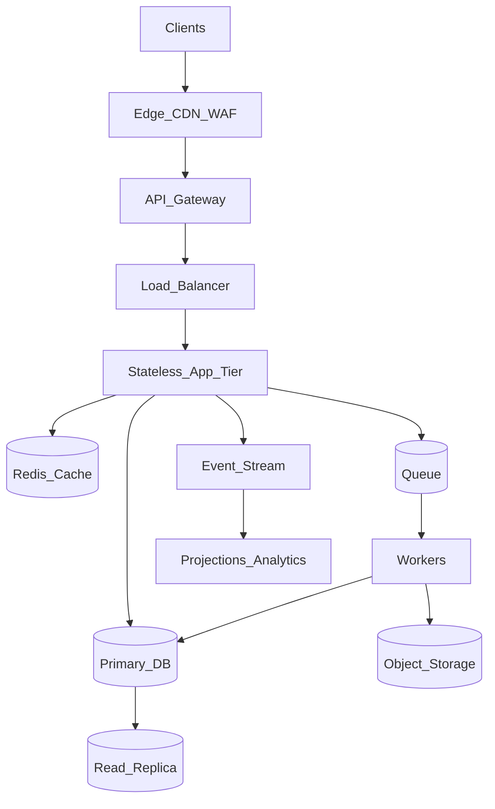

---

## Build order (non-negotiable sequence)

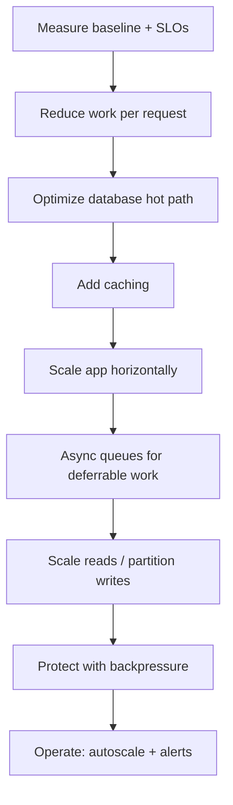

| Step | Why this order |
|------|----------------|
| 1. Measure | Avoid optimizing the wrong layer |
| 2. Reduce per-request cost | Cheapest throughput multiplier |
| 3. Database hot path | Usually the ceiling |
| 4. Cache | Multiplier for repeated reads |
| 5. Horizontal scale | Works only when app is stateless and DB isn't saturated |
| 6. Async | Moves slow work off the request path |
| 7. Scale reads / partition writes | After single-node fixes |
| 8. Backpressure | Protect when at capacity |
| 9. Operate | Autoscale and alert on saturation |

---

## Default recommendations by scenario

| Scenario | First 3 actions |
|----------|-----------------|
| Public read API hitting limits | Load test list/search paths → cache hot keys → index slow queries |
| Write spike on OLTP | Short transactions → batch INSERT → queue for non-critical writes |
| Long exports blocking API | Async job pattern → scale workers on queue depth |
| High event volume | Stream with partitioned topics → consumer groups → monitor lag |
| Nightly bulk import | Staging table + `COPY` → merge → `ANALYZE` |
| Traffic spike / abuse | Edge rate limit → gateway tier limits → app concurrency caps |

---

## Document map

| # | Topic | File |
|---|-------|------|
| 1 | Measurement and SLOs | [01-measurement-and-slo.md](01-measurement-and-slo.md) |
| 2 | Entry and edge | [02-entry-and-edge.md](02-entry-and-edge.md) |
| 3 | Stateless app tier | [03-stateless-app-tier.md](03-stateless-app-tier.md) |
| 4 | Caching layers | [04-caching-layers.md](04-caching-layers.md) |
| 5 | Database throughput | [05-database-throughput.md](05-database-throughput.md) |
| 6 | Async, queues, workers | [06-async-queues-workers.md](06-async-queues-workers.md) |
| 7 | Streaming pipelines | [07-streaming-pipelines.md](07-streaming-pipelines.md) |
| 8 | Batch and ETL | [08-batch-and-etl.md](08-batch-and-etl.md) |
| 9 | Backpressure and limits | [09-backpressure-and-limits.md](09-backpressure-and-limits.md) |
| 10 | Scale and deploy | [10-scale-and-deploy.md](10-scale-and-deploy.md) |
| 11 | Observability | [11-observability.md](11-observability.md) |
| 12 | Decision guide and common mistakes | [12-decision-guide-and-common-mistakes.md](12-decision-guide-and-common-mistakes.md) |

## Common mistakes

| Mistake | Fix |
|---------|-----|
| Scale replicas before fixing DB hot path | Measure → index → then horizontal scale |
| Cache before knowing what's hot | Profile top endpoints first |
| Async queue without DLQ | Dead-letter queue + alert on depth |
| Optimize `/health` load tests only | Test auth + DB + business paths |
| No backpressure when at capacity | 429, queue limits, circuit breakers |

---

# Measurement and SLOs

You cannot optimize throughput blind. Define targets, load test realistic paths, profile each layer, and find the actual bottleneck before scaling.

> **Scope:** **System-wide lens** — SLOs, load testing, profiling each layer (edge, app, DB, cache, queue). Database tools (`EXPLAIN`, `pg_stat_statements`) → [postgresql-performance §1 Measurement](../postgresql-performance/includes/01-measurement.md).
>
> **Related:** DB measurement → [postgresql-performance §1 Measurement](../postgresql-performance/includes/01-measurement.md) · Observability signals → [11-observability.md](11-observability.md) · Build order → [00-overview.md](00-overview.md)

---

## At a glance

| Metric | What it tells you | Typical SLO example |
|--------|-------------------|---------------------|
| **RPS / QPS** | Request or query rate | 10,000 RPS sustained |
| **p50 / p99 latency** | User experience under load | p99 < 200ms |
| **Error rate** | Reliability under stress | < 0.1% 5xx at peak |
| **Replication lag** | Read staleness ceiling | < 5s |
| **Queue depth / consumer lag** | Processing backlog | Depth < 1,000 messages |
| **Pool wait time** | Connection exhaustion | p99 wait < 10ms |

**Rule of thumb:** Set SLOs before load testing. Optimize until you meet them — not until hardware is maxed.

---

## Define SLOs first

| SLO type | Include |
|----------|---------|
| **Throughput** | Sustained RPS at peak; burst tolerance |
| **Latency** | p50 and p99 per endpoint class (read vs write) |
| **Availability** | Error rate, timeout rate |
| **Consistency** | Max replication lag for replica reads |
| **Processing** | Max queue depth or consumer lag before alert |

Document which endpoints require **strong consistency** (primary DB) vs **eventual consistency** (replica, cache).

---

## Load testing

### What to test

| Path | Why |
|------|-----|
| **List / search** | Often the heaviest read — pagination, joins, sort |
| **Hot key read** | Same resource fetched repeatedly — cache effectiveness |
| **Write burst** | INSERT/UPDATE spikes — lock contention, WAL pressure |
| **Mixed realistic ratio** | Match production read/write mix |
| **Expensive async trigger** | Export, report, bulk search enqueue rate |

### How to test well

1. **Warm up** — JIT, connection pools, cache population
2. **Ramp gradually** — find knee of the curve, not instant cliff
3. **Realistic payloads** — size, headers, auth tokens
4. **Run long enough** — catch memory leaks, GC pauses, replication lag
5. **Test from near production** — same region, similar network path

### Tools and regression workflow

| Tool | Best for |
|------|----------|
| **k6** | Scriptable HTTP; CI-friendly; threshold assertions |
| **Locust** | Python scenarios; interactive ramp |
| **Gatling** | JVM shops; detailed reports |
| **Vegeta** | Quick constant-rate HTTP flood |

**Regression workflow:**

1. Commit `load/` scripts (scenarios + env config) in app repo
2. Baseline: store p99, RPS ceiling, error rate in CI artifact or doc
3. After each throughput change, re-run same script
4. Fail CI if p99 regresses &gt; X% vs baseline at same RPS

Example k6 threshold:

```javascript
export const options = {
  thresholds: {
    http_req_duration: ['p(99)<200'],
    http_req_failed: ['rate<0.001'],
  },
};
```

Pair with deploy rollback → [deployment-strategies §13](../deployment-strategies/includes/13-slo-rollback-triggers.md).

### Anti-pattern

Load-testing **`/health` or `/ready` only** — these skip auth, DB, and business logic. They tell you nothing about real throughput capacity.

---

## Find the bottleneck

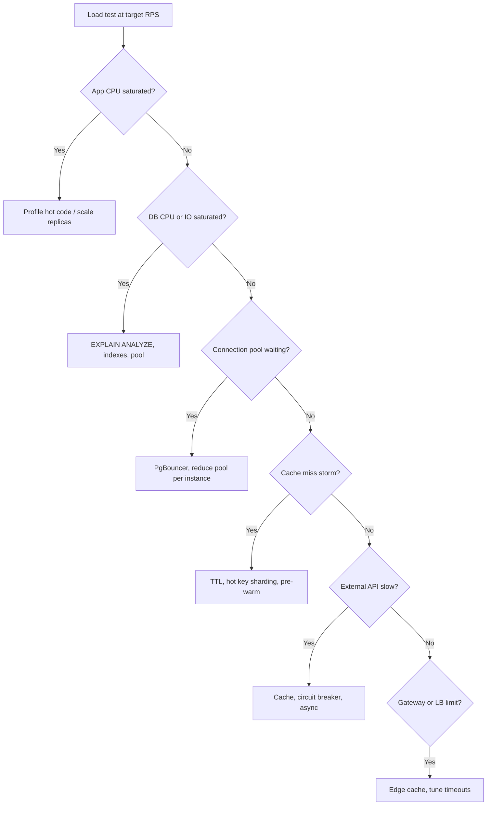

| Symptom | Likely bottleneck |
|---------|-------------------|
| App CPU 90%+, DB idle | App code, serialization, too many instances under-provisioned DB |
| DB CPU/IO 90%+, app idle | Missing index, bad query, write bloat |
| Pool wait time rising | Too many connections, slow queries holding connections |
| Redis latency spikes | Hot key, memory pressure, network |
| Queue depth growing | Workers too slow or under-provisioned |
| p99 up, CPU moderate | Lock contention, GC, sync external calls |

---

## Profile each layer

| Layer | What to measure | Tools |
|-------|-----------------|-------|
| **Edge / CDN** | Cache hit rate, origin requests | CDN analytics |
| **Gateway** | Added latency, 429 rate, auth time | Gateway metrics, access logs |
| **Load balancer** | Active connections, unhealthy targets | LB metrics |
| **App** | CPU, GC, thread pool queue, handler time | APM, profiling |
| **Database** | Top queries by total time, locks, connections | `pg_stat_statements`, `pg_stat_activity` |
| **Cache** | Hit rate, latency, evictions | Redis INFO, metrics |
| **Queue** | Depth, age of oldest message, consumer lag | Queue metrics |
| **External APIs** | Latency, timeout rate, circuit state | Client metrics |

Link → [postgresql-performance/includes/01-measurement.md](../postgresql-performance/includes/01-measurement.md) for `EXPLAIN ANALYZE`, `pg_stat_statements`, and buffer analysis.

---

## Little's Law in practice

**L = λ × W**

If average request takes **W = 200ms** and you want **λ = 5,000 RPS**, you need roughly **L = 1,000** concurrent in-flight requests across all instances.

| Lever | Effect |
|-------|--------|
| Reduce **W** (latency) | Same concurrency serves more RPS |
| Increase **L** (concurrency) | More RPS until resource saturates |
| Reduce operation cost | Lowers **W** without adding hardware |

---

## Baseline checklist

Before any optimization:

- [ ] Document current **p50/p99** and **RPS** at normal and peak load
- [ ] Identify **top 5 endpoints** by total time and by call count
- [ ] Capture **DB top queries** via `pg_stat_statements`
- [ ] Record **cache hit rate** and **replication lag**
- [ ] Note **error rate** and **429 rate** under load
- [ ] Save load test config for regression after changes

---

## Pros and cons

### Measuring first

**Pros:** Avoid wasted scaling spend; find real ceiling; regression baseline for changes.

**Cons:** Takes time; load tests can miss production traffic patterns if payloads are wrong.

### Aggressive SLOs without measurement

**Pros:** None for throughput work.

**Cons:** Over-engineering or under-provisioning; optimizing wrong layer.

## Common mistakes

| Mistake | Fix |
|---------|-----|
| Load test `/health` only | Include auth, DB, and business endpoints |
| Scale app while DB is saturated | Fix database bottleneck first |
| No baseline before optimization | Save p99/RPS for regression comparison |
| SLOs without error budget policy | Define when to stop feature work for reliability |
| Ignore queue consumer lag | Alert on depth and oldest message age |

---

# Entry and Edge

Absorb traffic **before it hits origin** — CDN cache, WAF, edge rate limits, then API gateway and load balancer for policy and distribution.

> **Scope:** **Throughput lens** — reduce origin RPS, shed abuse early, minimize hops and TLS CPU on the hot path. LB vs gateway definitions, request flows, and product selection → [api-design §3 Gateway](../api-design-and-protection/includes/03-api-gateway.md).
>
> **Related:** Full gateway + LB guide → [api-design §3 Gateway](../api-design-and-protection/includes/03-api-gateway.md) · Edge rate limits → [api-rate-limiting §7](../api-rate-limiting/includes/07-deployment-layers.md)

---

## At a glance

| Layer | Throughput job |
|-------|----------------|
| **CDN / Edge** | Cache responses; block abuse; terminate TLS near users |
| **WAF / DDoS** | Drop malicious traffic before app CPU |
| **API Gateway** | Auth, routing, tier rate limits, request size caps |
| **Load Balancer** | Distribute to healthy app instances |

**Rule of thumb:** Every hop adds latency. Put **coarse protection** at the edge; put **API-aware policy** at the gateway; keep the **hot path** as short as policy allows.

---

## Traffic flow

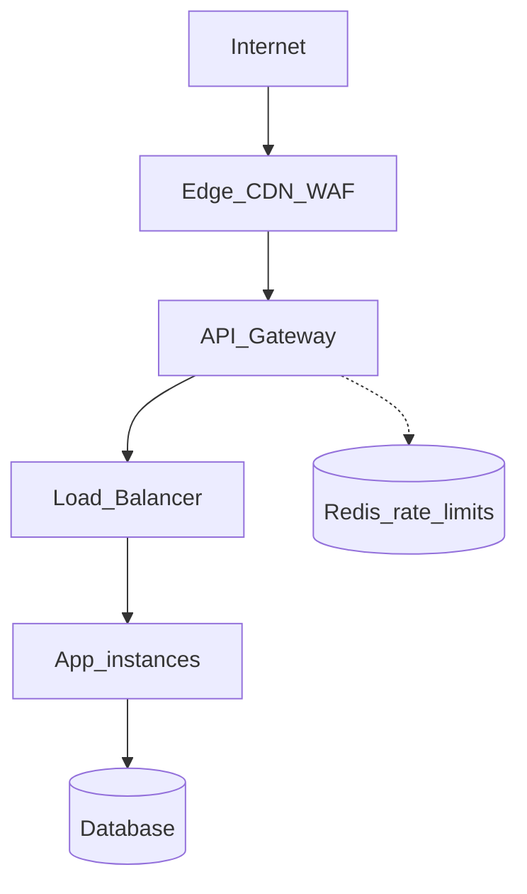

This extends the diagram in [03-api-gateway.md](../api-design-and-protection/includes/03-api-gateway.md).

---

## Absorb traffic early

| Technique | Throughput effect |
|-----------|-------------------|
| **CDN cache** | Origin RPS drops for cacheable GET |
| **Edge rate limiting** | Bad traffic never reaches origin |
| **WAF bot rules** | Frees app threads for legitimate users |
| **DDoS scrubbing** | Network-layer absorption |

Block garbage at the **edge** — cheapest place to say no.

---

## Gateway + load balancer together

| Component | Role |
|-----------|------|
| **Gateway** | Which API? Which client? How fast? |
| **Load balancer** | Which healthy instance? |

At scale, typical pattern:

```
Client → Gateway (auth, /v1/users → Users service)
       → Users LB → User pod 1 | 2 | 3
```

See [Flow 3 — Both together](../api-design-and-protection/includes/03-api-gateway.md#flow-3--both-together-common-at-scale).

---

## Minimize hops on hot path

| Situation | Consider |
|-----------|----------|
| Internal service-to-service | mTLS mesh may replace gateway |
| Simple internal API | L7 LB with path routing may suffice |
| Public API with tiers | Gateway worth the ~1–5ms |
| Global users | CDN + edge gateway (Cloudflare-style) |

Do not duplicate the same rate limit at every layer without reason — **edge (coarse) + gateway (API key) + app (tier)** is enough.

---

## TLS termination placement

| Where | Pros | Cons |
|-------|------|------|
| **CDN / Edge** | Offload CPU; close to user | Cert management at edge |
| **Gateway** | Central policy | Extra hop if CDN also terminates |
| **Load balancer** | Simple L7 routing | Less API policy |
| **App** | End-to-end if needed | CPU cost per instance |

**Throughput tip:** Terminate TLS at edge or gateway so app CPU serves business logic.

---

## When to use what

| Scenario | Stack |
|----------|-------|
| Public SaaS API | Cloudflare → Kong/AWS API Gateway → ALB per service |
| Internal microservices | Istio/Linkerd east-west; ingress for north-south |
| Startup MVP | Cloudflare + single gateway; add LB per service at scale |

Full stack tables → [03-api-gateway.md — Tech stacks by scenario](../api-design-and-protection/includes/03-api-gateway.md#tech-stacks-by-scenario).

---

## Common mistakes

| Mistake | Fix |
|---------|-----|
| No WAF on public API | Enable edge WAF + bot management |
| Gateway as policy junk drawer | Business AuthZ stays in app |
| Skip health checks on LB | Enable checks; drain unhealthy targets |
| Same hostname, no path routing | Gateway routes `/users`, `/orders` to correct pools |

---

# Stateless App Tier

Horizontal throughput requires **interchangeable app instances** — no sticky sessions, bounded concurrency, pooled connections, and minimal work per request.

> **Scope:** **Throughput lens** — per-request cost, bounded concurrency, pool sizing, when to scale replicas. Full stateless architecture (auth flows, migration, checklist) → [api-design §11 Stateless architecture](../api-design-and-protection/includes/11-stateless-architecture.md).
>
> **Related:** Full stateless guide → [api-design §11](../api-design-and-protection/includes/11-stateless-architecture.md) · Connection pooling → [postgresql-performance §7](../postgresql-performance/includes/07-connection-management.md) · API design → [api-design §1](../api-design-and-protection/includes/01-api-design.md)

---

## At a glance

| Requirement | Why it matters for throughput |
|-------------|-------------------------------|
| **Stateless handlers** | Any instance serves any request — LB scales freely |
| **Bounded concurrency** | Prevents connection storms and OOM |
| **Connection pooling** | Reuse DB connections — don't open per request |
| **Cheap requests** | Higher RPS at fixed CPU |

**Rule of thumb:** Scale **replicas** only when each instance is doing minimal necessary work and pools are sized correctly.

---

## Horizontal scale prerequisites

Stateless app tier is required before horizontal scale pays off. Architecture, auth flows, migration steps, and full checklist → [api-design §11 Stateless architecture](../api-design-and-protection/includes/11-stateless-architecture.md).

**Throughput-specific prerequisites:**

- **Bounded concurrency** — thread pools, semaphores, and DB pool limits per instance
- **Shared rate-limit counters** — Redis at gateway or app, not per instance → [api-rate-limiting §11](../api-rate-limiting/includes/11-common-mistakes-and-architecture.md)
- **Connection pooling** — `(pool_size × instances)` must fit DB capacity → [postgresql-performance §7](../postgresql-performance/includes/07-connection-management.md)

---

## Request cost breakdown

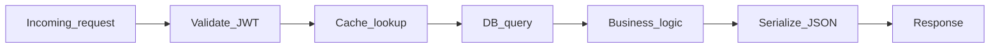

| Phase | Optimization |
|-------|--------------|
| **Auth** | Local JWT verify; cache introspection if opaque token |
| **Cache** | Redis hit avoids DB |
| **DB** | Index, eliminate N+1, pagination cap |
| **Logic** | Move heavy work to queue |
| **Serialize** | Field selection; smaller payloads |

Profile which phase dominates before adding instances.

---

## Bounded concurrency

| Resource | Limit |
|----------|-------|
| **HTTP server threads / workers** | Match CPU and I/O profile |
| **DB pool per instance** | `(pool_size × instances) < DB max safe connections` |
| **Outbound HTTP clients** | Cap parallel calls to partners |
| **Expensive handlers** | Global semaphore (exports, search) |

**Unbounded concurrency** → memory growth, pool exhaustion, cascading timeouts.

### Pool sizing example

```
10 app instances × 20 pool connections = 200 DB connections
→ Use PgBouncer if PostgreSQL max_connections is ~100–300
```

See [postgresql-performance/includes/07-connection-management.md](../postgresql-performance/includes/07-connection-management.md).

---

## I/O model

| Workload | Typical approach |
|----------|------------------|
| **I/O-bound** (DB, HTTP, cache) | Async runtime — Node, Go goroutines, Java virtual threads |
| **CPU-bound** (crypto, encoding) | Fixed worker pool; scale instances |
| **Mixed** | Async I/O + bounded pool for CPU sections |

Match model to profile — async does not help CPU-bound hot loops.

---

## Reduce per-request cost

| Technique | Throughput impact |
|-----------|-------------------|
| **Cursor pagination + max `limit`** | Bounded response size |
| **Field selection / sparse fieldsets** | Less DB and JSON work |
| **Eliminate N+1** | One query or batch load |
| **Batch endpoints** | Amortize auth and HTTP overhead |
| **Compression** (gzip/brotli) | Bandwidth — trade CPU |

API design details → [01-api-design.md](../api-design-and-protection/includes/01-api-design.md).

---

## Workers are stateless too

Async workers follow the same rules — pull from queue, read/write shared stores, exit. Scale worker count on **queue depth**, not CPU alone.

See [06-async-queues-workers.md](06-async-queues-workers.md).

---

## Common mistakes

| Mistake | Fix |
|---------|-----|
| Sticky sessions enabled | Token auth + external state |
| `pool_size = 100` per instance | Size pool × instances vs DB limit |
| Sync call to 5 microservices | Parallelize, cache, or aggregate in BFF |
| No pagination cap | Enforce max `limit` |
| Rate limit in app memory only | Shared Redis counters → [api-rate-limiting §11](../api-rate-limiting/includes/11-common-mistakes-and-architecture.md) |

---

## Checklist (throughput)

| Check | Pass? |
|-------|-------|
| DB pool sized with PgBouncer if needed | |
| Expensive ops have concurrency caps | |
| Heavy work enqueued — not blocking request thread | |
| Per-request cost profiled before adding replicas | |

Full stateless checklist (identity, externalized state, deploy safety) → [api-design §11](../api-design-and-protection/includes/11-stateless-architecture.md#checklist-is-your-app-tier-stateless).

---

# Caching Layers

Caching is often the largest throughput multiplier for read-heavy systems — if you accept defined staleness and invalidate correctly.

> **Related:** PostgreSQL read scaling → [postgresql-performance/includes/11-read-scaling-and-caching.md](../postgresql-performance/includes/11-read-scaling-and-caching.md) · Consistency in API design → [api-design-and-protection/includes/01-api-design.md](../api-design-and-protection/includes/01-api-design.md)

---

## At a glance

| Layer | Latency | Throughput gain | Staleness |
|-------|---------|-----------------|-----------|
| **CDN** | Edge (~ms) | Very high for cacheable GET | TTL-based |
| **Application (Redis)** | Sub-ms to low ms | High for hot keys | TTL or event invalidation |
| **Materialized view** | Query time | High for heavy aggregations | Refresh interval |
| **Read replica** | DB round trip | Medium — offloads primary | Replication lag |

**Rule of thumb:** Cache **after** fixing slow queries on the primary. A cache in front of a bad query still pays full cost on miss — and miss storms hurt worse.

---

## Layered read path

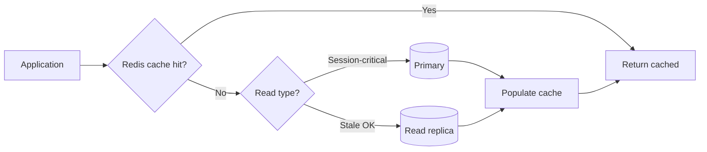

For public cacheable GET responses, insert **CDN** before the app:

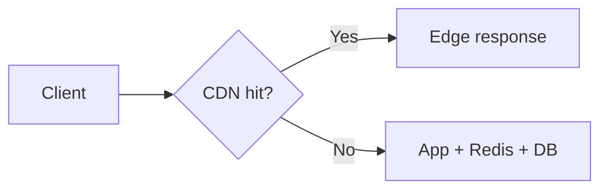

---

## Cache-aside vs write-through

| Pattern | Flow | When to use |
|---------|------|-------------|
| **Cache-aside** | App reads cache → miss → DB → populate cache | Default for most APIs |
| **Write-through** | App writes DB and cache together | Strong need for fresh cache after write |
| **Write-behind** | App writes cache; async flush to DB | Extreme write throughput; complexity high |

### Cache-aside (typical)

```
GET:  cache.get(key) → miss → db.query → cache.set(key, ttl)
POST: db.write → cache.delete(key)   // or update
```

### Invalidation strategies

| Strategy | Pros | Cons |
|----------|------|------|
| **TTL only** | Simplest | Stale until TTL expires |
| **Delete on write** | Fresher reads | Must know all affected keys |
| **Event-driven** | Accurate across services | Requires pub/sub or stream |
| **Version in key** | Instant logical invalidation | Key proliferation |

---

## Hot key problem

A single Redis key (global counter, viral product page) becomes a **throughput ceiling** — one shard, one CPU core.

| Mitigation | How |
|------------|-----|
| **Key sharding** | `product:123:shard-{0..N}` spread reads |
| **Local shadow cache** | Brief in-process cache; reduce Redis round trips |
| **Pre-warm on deploy** | Avoid cold miss storm after release |
| **CDN for public reads** | Edge absorbs viral traffic |

---

## CDN for public GET APIs

| Concern | Guidance |
|---------|----------|
| **Cache key** | URL path + relevant query params; exclude auth Vary unless designed |
| **`Cache-Control`** | `public, max-age=60` for semi-static; `private` for user-specific |
| **Invalidation** | Purge API on publish; version in URL (`/v1/assets/logo.png?v=2`) |
| **Do not cache** | POST/PUT/PATCH/DELETE; personalized authenticated responses unless keyed |

---

## Consistency matrix

| Endpoint type | Read from | After write |
|---------------|-----------|-------------|
| User profile (read-your-writes) | Primary or invalidate cache | Delete cache key |
| Public product catalog | CDN + Redis | Purge CDN + delete Redis |
| Dashboard (minutes stale OK) | Materialized view or replica | Scheduled refresh |
| Search index | Dedicated index + cache | Async reindex via queue |

Document per endpoint in your API contract which consistency tier applies.

---

## When to use what

| Scenario | Recommendation |
|----------|----------------|
| Same key read thousands/sec | Redis with TTL + consider CDN |
| Heavy SQL aggregation | Materialized view + periodic refresh |
| 10× read vs write ratio | Replica + app routing + Redis |
| Global low-latency public reads | CDN + regional replica |
| Session or cart data | Redis keyed by `user_id` — not CDN |

---

## Common mistakes

| Mistake | Fix |
|---------|-----|
| Cache before fixing slow query | Index and rewrite query first |
| No TTL on any key | Set TTL per data class |
| Cache user-specific data at CDN | `Cache-Control: private` or skip CDN |
| Invalidate one key on bulk update | Batch delete or version bump |
| Read replica immediately after write | Route to primary or use read-your-writes pattern |
| Cache stampede on hot key expiry | Singleflight, stagger TTL, early refresh — see below |

---

## Cache stampede and thundering herd

When a popular key expires (or cold start after deploy), many requests miss at once and hammer the database.

| Mitigation | How |
|------------|-----|
| **Singleflight / request coalescing** | One backend fetch per key; others wait on same result |
| **Jitter on TTL** | `ttl + random(0..60s)` — keys don't expire simultaneously |
| **Early refresh** | Background refresh at 80% of TTL before expiry |
| **Probabilistic early expiration** | Recompute before expiry with small probability per request |
| **Circuit on miss storm** | Short-circuit DB after N concurrent misses on same key |

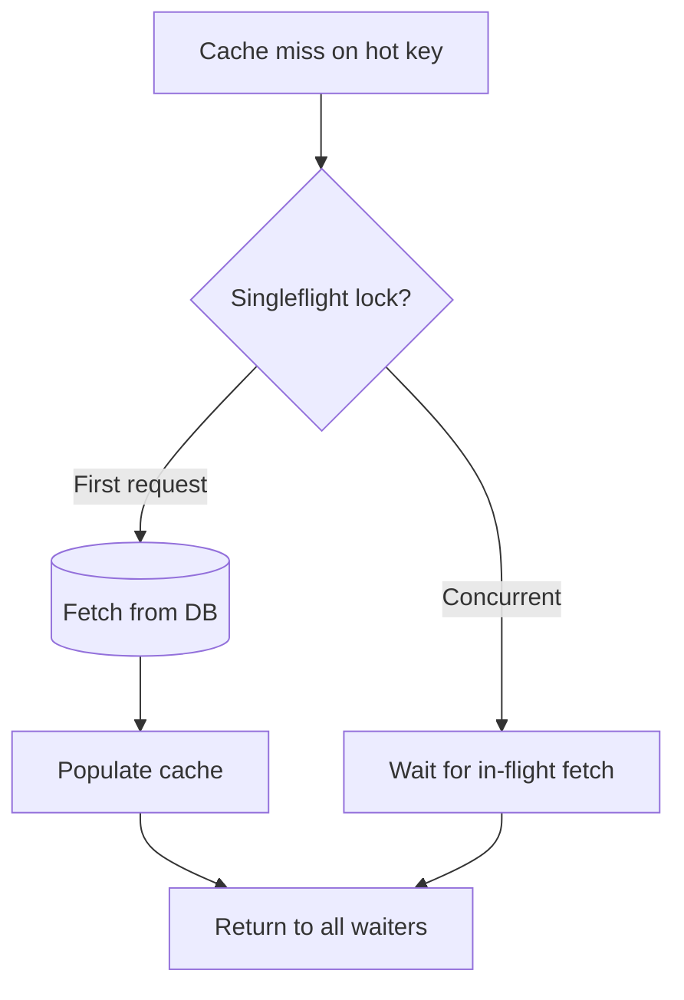

---

## TTL tiers by data class

| Data class | Typical TTL | Invalidation |
|------------|-------------|--------------|
| **Public catalog** | 1–5 min + CDN | Purge on publish event |
| **User profile** | 30s–2 min | Delete on write |
| **Session / cart** | No TTL or long + explicit delete | Write-through or delete on change |
| **Config / feature flags** | 10–30s | Poll or push invalidation |
| **Computed aggregates** | 5–15 min | Event-driven refresh |

Document TTL and invalidation in the API or data dictionary — clients infer staleness from behavior.

---

## Pros and cons

### Application cache (Redis)

**Pros:** Huge read throughput; sub-ms latency; shared across app instances.

**Cons:** Another system to operate; invalidation complexity; hot key risk.

### CDN

**Pros:** Absorbs global read spikes at edge; reduces origin load dramatically.

**Cons:** Invalidation lag; not for personalized or mutating APIs without careful design.

---

# Database Throughput

The database is usually the **throughput ceiling**. Fix measurement, queries, indexes, and pooling on the primary before replicas, caching, or sharding.

> **Scope:** **System throughput lens** — where DB fits in the HTS build order and DB-first moves under load. Full PostgreSQL tuning → [postgresql-performance](../postgresql-performance/README.md). Scenario tables → [PG §13](../postgresql-performance/includes/13-decision-guide-and-common-mistakes.md), [HTS §12](12-decision-guide-and-common-mistakes.md).
>
> **Related:** Full PostgreSQL guide → [postgresql-performance/README.md](../postgresql-performance/README.md) · LSM for extreme writes → [tree-and-index-structures §4](../tree-and-index-structures/includes/04-lsm-trees.md) · Caching → [04-caching-layers.md](04-caching-layers.md)

---

## Priority order

Follow this sequence — same as [postgresql-performance/includes/00-overview.md](../postgresql-performance/includes/00-overview.md):

| Step | Action | Include |
|------|--------|---------|
| 1 | **Measure** | `pg_stat_statements`, `EXPLAIN ANALYZE` → [01-measurement](../postgresql-performance/includes/01-measurement.md) |
| 2 | **Index + query** | Targeted indexes, N+1 fix → [02-indexing](../postgresql-performance/includes/02-indexing.md), [03-query-design](../postgresql-performance/includes/03-query-design.md) |
| 3 | **Pool connections** | PgBouncer before raising `max_connections` → [07-connection-management](../postgresql-performance/includes/07-connection-management.md) |
| 4 | **Tune memory** | `shared_buffers`, `work_mem` → [08-memory-and-config](../postgresql-performance/includes/08-memory-and-config.md) |
| 5 | **Maintenance** | Autovacuum, bloat → [06-vacuum-and-bloat](../postgresql-performance/includes/06-vacuum-and-bloat.md) |
| 6 | **Partition** | Large time-series tables → [10-partitioning](../postgresql-performance/includes/10-partitioning.md) |
| 7 | **Scale reads** | Replicas + cache → [11-read-scaling-and-caching](../postgresql-performance/includes/11-read-scaling-and-caching.md) |
| 8 | **Bulk writes** | `COPY`, job queues → [12-bulk-operations](../postgresql-performance/includes/12-bulk-operations-and-concurrency.md) |

**Rule of thumb:** Replicas **multiply** the cost of bad queries. Optimize on the primary first.

---

## Throughput decision flow

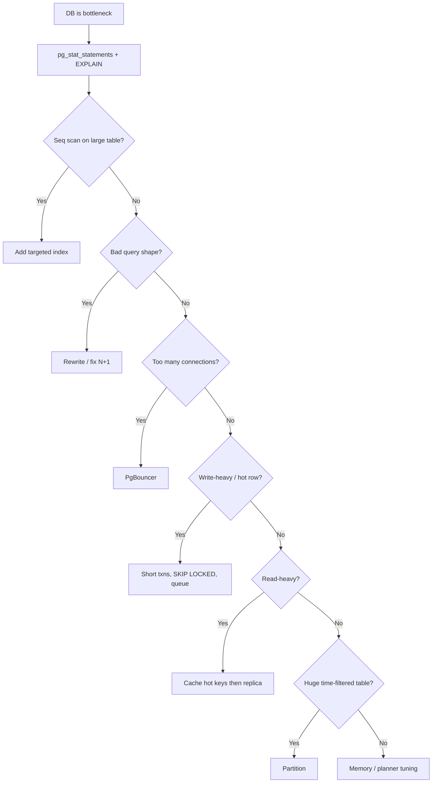

Adapted from [postgresql-performance/includes/13-decision-guide-and-common-mistakes.md](../postgresql-performance/includes/13-decision-guide-and-common-mistakes.md).

---

## Scenario → first move

Database-layer first moves below. System-wide scenarios (cache + scale + async + edge) → [§12 Decision guide](12-decision-guide-and-common-mistakes.md#scenario-recommendations). Full PG scenario table → [postgresql-performance §13](../postgresql-performance/includes/13-decision-guide-and-common-mistakes.md#scenario-recommendations).

| Scenario | First move |
|----------|------------|
| Read API at 10k RPS | Cache hot keys **before** adding replicas |
| Write spike | Short transactions → batch INSERT → queue side effects |
| Time-series ingest | Range partition + BRIN/B-tree |
| Hot row contention | `FOR UPDATE SKIP LOCKED` → partition → per-key queue |
| Nightly bulk import | Staging + `COPY` → [08-batch-and-etl.md](08-batch-and-etl.md) |
| Dashboard aggregations | Materialized view → Redis |
| PostgreSQL write ceiling | Evaluate LSM-backed store for that workload |

---

## When PostgreSQL is not enough

| Signal | Consider |
|--------|----------|
| Sustained write rate exceeds single-node WAL/IO | Partitioning, then dedicated write path |
| Append-only metrics at massive scale | Time-series DB or LSM KV |
| Full-text at billions of docs | OpenSearch/Elasticsearch + CDC |

LSM tradeoffs → [tree-and-index-structures/includes/04-lsm-trees.md](../tree-and-index-structures/includes/04-lsm-trees.md):

| | **B+ Tree (PostgreSQL)** | **LSM Tree** |
|--|--------------------------|--------------|
| **Writes** | Update pages in place | Append + async merge |
| **Reads** | Few page lookups | Memtable + possibly many files |
| **Sweet spot** | OLTP, relational | Write-heavy logs, KV at scale |

---

## Connection math

```
Total app connections = instances × pool_size_per_instance
Must fit within PostgreSQL capacity (often via PgBouncer)
```

| Mistake | Fix |
|---------|-----|
| Raise `max_connections` to 2000 | PgBouncer transaction pooling |
| Long transactions holding connections | Timeouts; fix ORM session leaks |
| Every worker opens own pool | Centralize pool config |

---

## Read vs write throughput

| Pattern | Guidance |
|---------|----------|
| **Read-heavy** | Cache → replica → materialized view |
| **Write-heavy** | Batch, partition, queue, shorten transactions |
| **Mixed** | Separate read models (CQRS) for heavy reads |

See [event-sourcing-and-cqrs](../event-sourcing-and-cqrs/README.md) for read model separation at scale.

---

## Common mistakes

| Mistake | Fix |
|---------|-----|
| Add replica before indexing | Fix primary queries first |
| `SELECT *` on list endpoints | Project needed columns |
| No pagination on large tables | Cursor pagination with max limit |
| One giant backfill transaction | Chunked batches |
| Ignore autovacuum on churny tables | Tune autovacuum per table |

Full database decision guide → [postgresql-performance/includes/13-decision-guide-and-common-mistakes.md](../postgresql-performance/includes/13-decision-guide-and-common-mistakes.md).

---

# Async, Queues, and Workers

Decouple **accept rate** from **process rate** — the API enqueues quickly; workers drain at sustainable throughput.

> **Scope:** **Throughput lens** — queue depth, worker scale, and accept-vs-process rates. HTTP job contracts (202, polling, webhooks) → [api-design §10 Async patterns](../api-design-and-protection/includes/10-async-patterns.md). Domain event publish → [ES §5 Async integration](../event-sourcing-and-cqrs/includes/05-async-integration.md).

> **Related:** Async API patterns → [api-design-and-protection/includes/10-async-patterns.md](../api-design-and-protection/includes/10-async-patterns.md) · Rate-limit escape hatch → [api-design-and-protection/includes/05-rate-limit-tiers.md](../api-design-and-protection/includes/05-rate-limit-tiers.md) · Outbox → [event-sourcing-and-cqrs/includes/05-async-integration.md](../event-sourcing-and-cqrs/includes/05-async-integration.md) · Multi-service sagas → [event-sourcing-and-cqrs/includes/07-sagas-and-distributed-workflows.md](../event-sourcing-and-cqrs/includes/07-sagas-and-distributed-workflows.md)

---

## At a glance

| | **Synchronous** | **Asynchronous** |
|--|-----------------|------------------|
| **Connection** | Held until work completes | Released after enqueue (~50ms) |
| **Rate limit slot** | Occupied for minutes | Only enqueue costs a slot |
| **Throughput** | Limited by slowest work | API accepts; workers scale separately |
| **Client pattern** | Wait for 200 | `202` + poll, webhook, or SSE |

**Rule of thumb:** If work might exceed **~10–30 seconds**, or is CPU/IO expensive (exports, ML, bulk search), design **async from day one**.

---

## When to go async

| Operation | Async? |
|-----------|--------|
| CRUD under 1s | Sync |
| Report / export | Yes |
| Bulk reindex | Yes |
| ML inference | Yes |
| Send email / webhook fan-out | Yes — queue |
| Payment capture | Sync with timeout + idempotency (or async with strong status API) |

Full patterns → [10-async-patterns.md](../api-design-and-protection/includes/10-async-patterns.md).

---

## Queue as shock absorber

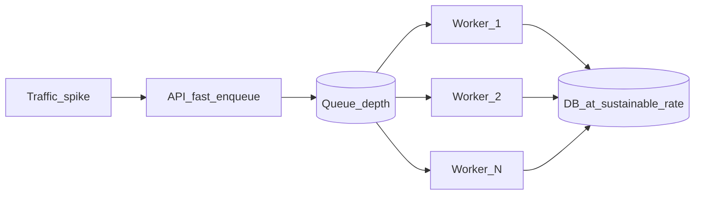

| Metric | Meaning |
|--------|---------|
| **Queue depth** | Backlog — alert if monotonic growth |
| **Drain rate** | Workers × jobs/sec |
| **Age of oldest message** | User-visible delay for async jobs |

**Scale workers on queue depth**, not CPU alone.

---

## Typical async flow

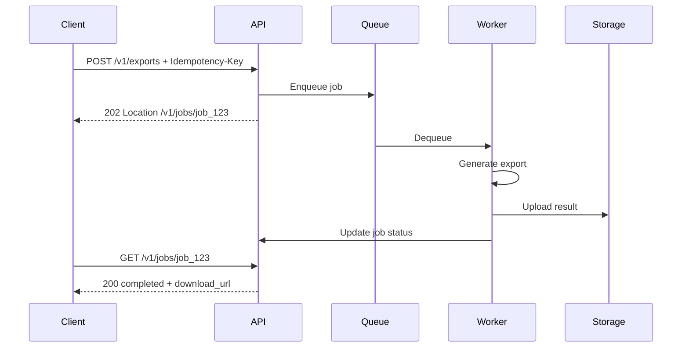

Job state machine and polling vs webhook → [10-async-patterns.md](../api-design-and-protection/includes/10-async-patterns.md).

---

## Idempotency at throughput

Retries are guaranteed at scale:

| Mechanism | Purpose |
|-----------|---------|
| **`Idempotency-Key` header** | Same POST → same result |
| **Job ID dedup** | Re-enqueue returns existing job |
| **At-least-once delivery** | Workers must handle duplicate processing |
| **Natural keys in writes** | UPSERT safe on retry |

---

## Worker scaling

| Trigger | Action |
|---------|--------|
| Queue depth > threshold for N minutes | Add worker instances |
| Depth near zero sustained | Scale down |
| DLQ growing | Fix poison messages — don't just add workers |
| DB pool exhausted | Reduce worker concurrency or optimize job |

Workers are **stateless** — any worker processes any job. Job state in DB + result in object storage.

---

## Queue technology pick

| Need | Options |
|------|---------|
| Simple task queue | SQS, RabbitMQ, Redis streams |
| Delay / visibility timeout | SQS |
| Priority queues | RabbitMQ, custom |
| High throughput fan-out | Kafka — see [07-streaming-pipelines.md](07-streaming-pipelines.md) |
| Reliable publish after DB write | Transactional outbox |

Outbox pattern → [event-sourcing-and-cqrs/includes/05-async-integration.md](../event-sourcing-and-cqrs/includes/05-async-integration.md). Cross-service workflows (order → payment → inventory) → [Sagas](../event-sourcing-and-cqrs/includes/07-sagas-and-distributed-workflows.md).

---

## Dead letter queue (DLQ)

Messages that fail after max retries must not block the queue forever.

| Step | Action |
|------|--------|
| **Retry with backoff** | Transient errors (network, 503) |
| **Max attempts** | e.g. 3–5 then route to DLQ |
| **DLQ inspection** | Alert on DLQ depth; manual or automated replay |
| **Poison message** | Fix bug; replay or discard with audit |

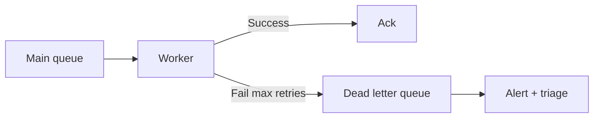

---

## Queue vs stream — when to pick which

| Need | Queue (SQS, RabbitMQ, Redis) | Stream (Kafka, Kinesis) |
|------|------------------------------|-------------------------|
| Task job (export, email) | **Yes** | Overkill |
| Fan-out to many consumers | Limited (multiple queues) | **Yes** |
| Replay from history | Usually no | **Yes** |
| Strict per-key ordering | Single consumer or partition | Partition key |
| Ops complexity | Lower | Higher |

Job queues → this section. High-volume fan-out → [07-streaming-pipelines.md](07-streaming-pipelines.md).

---

## Delivery semantics

| Guarantee | Behavior | Worker requirement |
|-----------|----------|------------------|
| **At-most-once** | May lose message | Simple; rare for critical work |
| **At-least-once** | May duplicate | **Idempotent** processing |
| **Exactly-once** | Hard end-to-end | Transactional outbox + idempotent consumer |

Most production systems: **at-least-once** + idempotency keys + dedup store.

---

## Rate limits and async

Expensive sync endpoints burn throughput slots. Pattern from [05-rate-limit-tiers.md](../api-design-and-protection/includes/05-rate-limit-tiers.md):

- Strict limit on **sync** expensive routes
- Separate quota on **job creation** (async escape hatch)
- Client gets `202` quickly; worker pool absorbs duration

---

## Common mistakes

| Mistake | Fix |
|---------|-----|
| Sync export holding connection 5 min | Async job + poll/webhook |
| No limit on enqueue rate | Rate limit job creation |
| Worker without idempotency | Safe retry with dedup keys |
| Scale workers without DB headroom | Cap worker concurrency vs pool |
| Lost message on crash before ack | Outbox or transactional enqueue |

---

## Pros and cons

### Async queue

**Pros:** API throughput decoupled from slow work; absorbs spikes; independent worker scaling.

**Cons:** Complexity; eventual completion; client must poll or webhook; operational monitoring needed.

---

# Streaming Pipelines

When request/response cannot keep up with event volume, fan-out, or audit requirements, move to **event streaming** — append-only logs with partitioned parallel consumption.

> **Related:** Event sourcing and outbox → [event-sourcing-and-cqrs/includes/05-async-integration.md](../event-sourcing-and-cqrs/includes/05-async-integration.md) · Async API patterns → [api-design-and-protection/includes/10-async-patterns.md](../api-design-and-protection/includes/10-async-patterns.md) · LSM write path → [tree-and-index-structures/includes/04-lsm-trees.md](../tree-and-index-structures/includes/04-lsm-trees.md)

---

## At a glance

| | **Sync API** | **Event stream** |
|--|--------------|------------------|
| **Model** | Request → response | Append event → consumers process |
| **Coupling** | Producer waits for consumer | Decoupled in time |
| **Scale** | Limited by handler capacity | Partitions × consumer groups |
| **Ordering** | Per request | Per partition key |
| **Best for** | CRUD, queries | Metrics, audit, fan-out, CDC |

**Rule of thumb:** Use streaming when **many consumers** need the same events, **volume exceeds** comfortable API throughput, or you need a **durable audit log** — not for simple CRUD that fits in PostgreSQL.

---

## When streaming beats request/response

| Use case | Why stream |
|----------|------------|
| **Audit / activity log** | Durable append-only; many readers |
| **Metrics and analytics** | High volume; batch aggregation |
| **Fan-out notifications** | One order event → email, warehouse, search |
| **CDC (change data capture)** | DB changes → search index, cache invalidation |
| **Cross-service integration** | Loose coupling; replay on failure |

---

## Core concepts

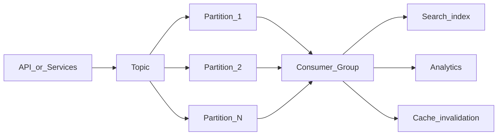

| Term | Meaning |
|------|---------|
| **Topic** | Named stream of events |
| **Partition** | Ordered sub-stream; unit of parallelism |
| **Offset** | Position in partition log |
| **Consumer group** | Cooperating consumers; each partition → one consumer in group |
| **Producer** | Appends events; chooses partition key |

Common implementations: Apache Kafka, Amazon Kinesis, Google Pub/Sub, Azure Event Hubs, Redpanda.

---

## Throughput levers

| Lever | Effect |
|-------|--------|
| **More partitions** | Higher parallel consume/produce (within broker limits) |
| **Batch produce/consume** | Amortize network and commit overhead |
| **Compression** | Snappy/LZ4/Zstd — CPU for bandwidth |
| **Idempotent producers** | Safe retries without duplicates |
| **Right message size** | Avoid huge payloads in stream — store blob in S3, reference in event |

**Partition count:** Plan for peak throughput; increasing partitions later may require key strategy review.

---

## Partition key and ordering

Events with the **same partition key** are strictly ordered within that partition.

| Key choice | Ordering | Risk |
|------------|----------|------|
| **`user_id`** | Per-user order preserved | Hot user → hot partition |
| **`tenant_id`** | Per-tenant order | Large tenant saturates one partition |
| **Random / round-robin** | No cross-event order | Maximum spread; use when order irrelevant |
| **`order_id`** | Per-order lifecycle | Good for order pipeline |

**Tradeoff:** Strong ordering for one key vs even load across partitions — rarely both for viral keys.

---

## Consumer groups and parallelism

| Rule | Detail |
|------|--------|
| **One consumer per partition per group** | Max parallel consumers in a group = partition count |
| **Multiple groups** | Same topic; independent lag per group (search vs analytics) |
| **Rebalance** | Adding consumer triggers partition reassignment — brief pause |
| **Static membership** | Pin consumers in high-stakes systems to reduce churn |

Scale consumers until lag stabilizes; adding consumers beyond partition count does not help that group.

---

## Kafka-oriented patterns

| Pattern | Use |
|---------|-----|
| **Compacted topic** | Latest value per key (config, registry) |
| **Idempotent producer** | `enable.idempotence=true` — safe retries |
| **Transactional produce** | Read-process-write exactly once within broker |
| **Manual commit** | Commit offset after DB write succeeds |
| **Seek / replay** | Reset offset for new projection or recovery |

Store payload references (S3 URL, row ID) when messages exceed ~1 MB.

---

## Stream DLQ and poison messages

| Approach | When |
|----------|------|
| **Retry topic** | Transient handler failures with backoff |
| **DLQ topic** | Permanent failure after N attempts |
| **Skip + log** | Bad schema — fix producer; don't infinite retry |
| **Pause partition** | Downstream DB outage — catch up later |

Alert on **consumer lag growth rate**, not only absolute lag.

---

## Backpressure

**Consumer lag** — difference between latest offset and consumer offset — is the key health metric.

| Signal | Action |
|--------|--------|
| Lag growing steadily | Scale consumers (up to partition count) or optimize handler |
| Lag spike after deploy | Slow consumer code; poison message |
| Producer rate >> consume rate | Add consumers, batch processing, or shed load |

| Pattern | Purpose |
|---------|---------|
| **Pause consumption** | Protect downstream DB during outage |
| **Dead letter queue (DLQ)** | Isolate poison messages |
| **Rate limit producers** | API tier rejects when lag exceeds threshold |

---

## Integration with API tier

Typical pattern:

1. API validates request and writes to DB (transaction)
2. **Outbox table** or transactional publish ensures event is not lost
3. Stream connector or app publishes to topic
4. Consumers update projections, search, cache, analytics

See [event-sourcing-and-cqrs/includes/05-async-integration.md](../event-sourcing-and-cqrs/includes/05-async-integration.md) for outbox pattern details.

```mermaid
sequenceDiagram
    participant API
    participant DB
    participant Outbox
    participant Stream
    participant Consumer

    API->>DB: BEGIN; INSERT order; INSERT outbox
    API->>DB: COMMIT
    Note over Outbox,Stream: Relay publishes outbox rows
    Outbox->>Stream: order.created event
    Stream->>Consumer: Consume
    Consumer->>DB: Update read model
```

---

## When to use what

| Scenario | Recommendation |
|----------|----------------|
| < 1k events/sec, few consumers | Queue (SQS, RabbitMQ) may suffice |
| Many consumers, replay needed | Kafka-style log |
| Global fan-out, managed ops | Cloud managed stream |
| Strict per-entity ordering | Partition by entity ID |
| Analytics only | Stream → warehouse (Snowflake, BigQuery) |

---

## Common mistakes

| Mistake | Fix |
|---------|-----|
| One partition for everything | Scale partitions with volume |
| Huge payloads in messages | Reference object storage |
| No DLQ | Poison message blocks partition |
| Consumer does sync DB call per message | Batch writes; idempotent upserts |
| Ignore lag alerts | Alert on lag growth rate, not just absolute |

---

## Pros and cons

### Event streaming

**Pros:** Massive throughput; decoupled consumers; replay for recovery and new projections.

**Cons:** Operational complexity; eventual consistency; partition key design mistakes are costly to fix.

---

# Batch and ETL

Bulk ingest and backfills belong **off the API hot path** — use staging tables, `COPY`, chunked commits, and idempotent merges for throughput without locking production traffic.

> **Related:** PostgreSQL bulk ops → [postgresql-performance/includes/12-bulk-operations-and-concurrency.md](../postgresql-performance/includes/12-bulk-operations-and-concurrency.md) · Async jobs → [06-async-queues-workers.md](06-async-queues-workers.md)

---

## At a glance

| Method | Speed | Use when |
|--------|-------|----------|
| **`COPY`** | Fastest | Large imports, ETL loads |
| **Multi-row `INSERT`** | Good | Moderate batches (100–1000 rows) |
| **Row-by-row `INSERT`** | Slowest | Avoid for bulk |
| **Chunked `UPDATE`** | Controlled | Backfills on 100M+ rows |

**Rule of thumb:** Never run a **single giant transaction** over millions of rows on a live primary — long locks, bloat, and replication lag follow.

---

## Staging table pattern

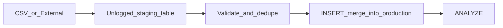

```sql
-- Example: load via staging
CREATE UNLOGGED TABLE staging_orders (LIKE orders INCLUDING DEFAULTS);

COPY staging_orders FROM '/path/orders.csv' WITH (FORMAT csv, HEADER true);

INSERT INTO orders
SELECT * FROM staging_orders s
WHERE NOT EXISTS (SELECT 1 FROM orders o WHERE o.id = s.id);

ANALYZE orders;
```

| Step | Purpose |
|------|---------|
| **Unlogged staging** | Faster load; not crash-safe (OK for temp staging) |
| **Validate in staging** | Reject bad rows before touching production |
| **Idempotent merge** | Safe to re-run job |
| **`ANALYZE`** | Fresh planner stats after large load |

---

## COPY vs row INSERT

From [postgresql-performance/includes/12-bulk-operations-and-concurrency.md](../postgresql-performance/includes/12-bulk-operations-and-concurrency.md):

| | **`COPY`** | **Multi-row INSERT** |
|--|------------|----------------------|
| **Throughput** | Highest | Good |
| **Flexibility** | File/stream oriented | App-generated batches |
| **Error handling** | Fails row or batch | Per-batch rollback |
| **Typical use** | Nightly ETL, migrations | App batch API |

### Large load tips

- Drop nonessential indexes before load, recreate **`CONCURRENTLY`** after (very large loads only)
- Increase **`maintenance_work_mem`** for index build session
- Run during **low-traffic window** or against replica promoted after load

---

## Chunked backfills

For updating or inserting millions of rows on a live system:

```sql
-- Batch by ID range; commit between batches
UPDATE orders SET status = 'archived'
WHERE id BETWEEN 1000000 AND 1009999
  AND status = 'active';
-- sleep or schedule next batch
```

| Parameter | Guidance |
|-----------|----------|
| **Batch size** | 1k–10k rows — tune to lock duration |
| **Sleep between batches** | Reduce pressure on replication and autovacuum |
| **Progress tracking** | Store last processed ID in job metadata |
| **Idempotency** | `WHERE` clause ensures re-run safety |

---

## Scheduled vs triggered batch

| Type | Trigger | Example |
|------|---------|---------|
| **Scheduled (cron)** | Time-based | Nightly warehouse sync at 2 AM |
| **Queue-triggered** | Event or threshold | Reindex when queue depth > 100 |
| **Manual / admin** | Operator | One-time migration backfill |

**Throughput tip:** Schedule heavy batch jobs **off peak**; use queue workers with **concurrency limits** so batch does not starve interactive API.

---

## Idempotent batch jobs

| Pattern | How |
|---------|-----|
| **Natural key UPSERT** | `ON CONFLICT DO UPDATE` |
| **Merge with NOT EXISTS** | Skip already-loaded rows |
| **Job run ID in audit table** | Skip if run_id completed |
| **Deterministic chunk keys** | Re-run same chunk safely |

```sql
INSERT INTO inventory (sku, qty)
VALUES ('ABC', 10)
ON CONFLICT (sku) DO UPDATE
SET qty = inventory.qty + EXCLUDED.qty;
```

---

## Batch vs streaming vs API

| Volume / pattern | Choose |
|------------------|--------|
| Real-time single events | API or stream |
| Continuous high volume | Stream |
| Nightly full or delta load | Batch ETL |
| User-triggered export | Async job → batch write to object storage |

---

## Common mistakes

| Mistake | Fix |
|---------|-----|
| One transaction for 100M rows | Chunk with commits |
| Load directly to indexed production table | Staging → merge |
| Skip `ANALYZE` after load | Always refresh stats |
| Batch job unlimited parallelism | Cap workers vs API pool |
| No idempotency on retry | UPSERT or merge keys |

---

## Pros and cons

### Batch ETL off hot path

**Pros:** Maximum write throughput; predictable load window; simpler error recovery per chunk.

**Cons:** Latency until data visible; orchestration needed; schema drift between staging and prod.

---

# Backpressure and Limits

High throughput systems must **reject, queue, or shed load** when at capacity — not queue unbounded work until they collapse.

> **Related:** Rate limit deployment layers → [api-rate-limiting/includes/07-deployment-layers.md](../api-rate-limiting/includes/07-deployment-layers.md) · Algorithm choice → [api-rate-limiting/includes/10-decision-guide.md](../api-rate-limiting/includes/10-decision-guide.md) · Rate tiers → [api-design-and-protection/includes/05-rate-limit-tiers.md](../api-design-and-protection/includes/05-rate-limit-tiers.md)

---

## At a glance

| Mechanism | What it limits | Typical layer |
|-----------|----------------|---------------|
| **Rate limit (RPS)** | Requests per time window | Edge, gateway, app |
| **Concurrency semaphore** | Simultaneous expensive ops | App, worker pool |
| **Queue depth cap** | Backlog size | Queue consumer |
| **Circuit breaker** | Calls to failing downstream | App outbound client |
| **Timeout** | Max wait per hop | Gateway, app, DB client |

**Rule of thumb:** Shed load **as early as possible** — edge and gateway — but enforce **business-aware limits** (plan tier, expensive endpoints) in the app.

---

## Layered limits

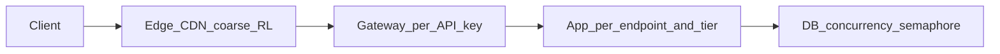

| Concern | Best layer |
|---------|------------|
| Block garbage / DDoS | Edge / CDN |
| Enforce API key validity + global quota | API Gateway |
| Per-plan business quotas | App middleware |
| Protect database writes | App semaphore or leaky bucket near DB |

Full layer comparison → [api-rate-limiting/includes/07-deployment-layers.md](../api-rate-limiting/includes/07-deployment-layers.md).

---

## HTTP 429 and Retry-After

When limiting, return proper semantics so clients backoff:

```http
HTTP/1.1 429 Too Many Requests
Retry-After: 60
X-RateLimit-Limit: 1000
X-RateLimit-Remaining: 0
X-RateLimit-Reset: 1718380800
```

| Header | Purpose |
|--------|---------|
| **`429`** | Client should retry later — not generic error |
| **`Retry-After`** | Seconds or HTTP-date until retry |
| **Rate limit headers** | Client-side throttling and UX |

---

## Concurrency semaphores

Rate limits cap **requests per second**; semaphores cap **in-flight expensive work**.

| Operation | Why semaphore |
|-----------|---------------|
| Full-text export | Long DB hold |
| Complex search | CPU + IO heavy |
| Bulk write endpoint | WAL and lock pressure |
| External API fan-out | Partner rate limits |

```text
max_concurrent_exports = 10   // global across app cluster via Redis or DB
acquire_slot() → process → release_slot()
else → 429 or 503 with Retry-After
```

---

## Circuit breakers

When downstream (payment API, search cluster) fails or slows:

| State | Behavior |
|-------|----------|
| **Closed** | Normal calls |
| **Open** | Fail fast — no call for cooldown period |
| **Half-open** | Trial request; close on success |

**Throughput benefit:** Failing fast frees threads and connection pool slots for healthy paths.

---

## Fail-open vs fail-closed

If the rate-limit store (Redis) is unavailable:

| Route type | Default |
|------------|---------|
| **Public read (low cost)** | Fail-open with alert — availability bias |
| **Expensive writes, exports** | Fail-closed — abuse risk |
| **Auth validation** | Fail-closed |
| **Login / password reset** | Fail-closed |

See [api-rate-limiting/includes/07-deployment-layers.md](../api-rate-limiting/includes/07-deployment-layers.md#fail-open-vs-fail-closed).

---

## Distributed rate limiting

| Type | Pros | Cons | When |
|------|------|------|------|
| **In-memory per instance** | Fastest | Wrong global count with N replicas | Dev, soft limits |
| **Centralized Redis** | Accurate global view | Dependency, latency | Production multi-instance |
| **Local + sync gossip** | No single bottleneck | Eventually consistent | Very large edge |

**Production pattern:** Redis with atomic `INCR` or Lua scripts; optional local shadow cache to cut round trips.

---

## Algorithm quick pick

| Scenario | Algorithm |
|----------|-----------|
| Strict fairness | Sliding window counter |
| Burst-friendly mobile | Token bucket |
| Protect slow downstream | Leaky bucket or concurrency limit |
| Simple monthly quota | Fixed window |

Full decision flow → [api-rate-limiting/includes/10-decision-guide.md](../api-rate-limiting/includes/10-decision-guide.md).

---

## Common mistakes

| Mistake | Fix |
|---------|-----|
| IP-only limits on public API | Identity-based: API key, user ID |
| Per-instance counters | Shared Redis store |
| 200 OK with "rate limited" body | Use `429` + headers |
| No limit on async enqueue | Limit job creation rate too |
| Fail-open on paid write APIs | Fail closed + alert |

---

## Pros and cons

### Aggressive backpressure

**Pros:** Stable p99 under spike; protects DB and workers; predictable capacity.

**Cons:** Some requests rejected; client retry storms if `Retry-After` omitted.

### No backpressure

**Pros:** Accepts all traffic until collapse.

**Cons:** Cascading failure; 5xx instead of 429; long recovery.

---

# Scale and Deploy

Throughput requires **adding capacity without downtime** — horizontal autoscaling, safe deploy strategies, and multi-region read paths.

> **Related:** Stateless prerequisites → [03-stateless-app-tier.md](03-stateless-app-tier.md) · Multi-region routing → [§13 Multi-region read routing](13-multi-region-read-routing.md) · Deployment strategies → [deployment-strategies/README.md](../deployment-strategies/README.md) · Blue/green → [deployment-strategies/includes/03-blue-green.md](../deployment-strategies/includes/03-blue-green.md)

---

## At a glance

| Concern | Throughput approach |
|---------|---------------------|
| **More RPS** | Horizontal scale of stateless app instances |
| **More async work** | Scale workers on queue depth |
| **Deploy during traffic** | Rolling, canary, or blue/green — not recreate |
| **Global users** | CDN + regional read replicas |
| **Spike handling** | Autoscale + backpressure — not unbounded queue |

**Rule of thumb:** You can only scale what is **stateless and not saturated downstream**. Scaling app pods into a full DB pool buys nothing.

---

## Horizontal autoscaling

| Signal | Scale what |
|--------|------------|
| **CPU / memory** | App instances (with caution — CPU alone misleads) |
| **RPS / request count** | App instances |
| **p99 latency** | App or workers if DB healthy |
| **Queue depth** | Worker instances |
| **Consumer lag** | Stream consumers (≤ partition count) |
| **Pool wait time** | Fix pool/DB first — not always "more app" |

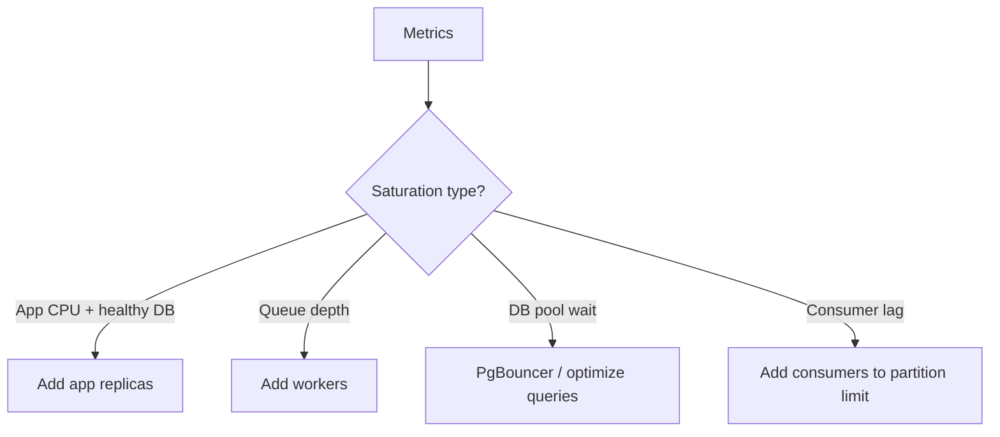

---

## Autoscaling cautions

| Pitfall | Mitigation |
|---------|------------|
| **Cold start** | Min instances > 0; warmup routes |
| **Scale on brief spike** | Cooldown period; require sustained signal |
| **Scale app into DB limit** | Cap max replicas from pool math |
| **Thundering herd on scale-up** | Pre-warm cache; gradual LB weight |

---

## Deploy without losing capacity

| Strategy | Throughput impact | Guide |
|----------|-------------------|-------|
| **Rolling** | Gradual replacement; brief mixed versions | [02-rolling](../deployment-strategies/includes/02-rolling.md) |
| **Blue/green** | Instant switch; double capacity during cutover | [03-blue-green](../deployment-strategies/includes/03-blue-green.md) |
| **Canary** | Small % on new version first | [04-canary](../deployment-strategies/includes/04-canary.md) |
| **Recreate** | **Downtime** — avoid on production API | [01-recreate](../deployment-strategies/includes/01-recreate.md) |

Stateless app tier enables rolling and blue/green without session migration → [11-stateless-architecture.md](../api-design-and-protection/includes/11-stateless-architecture.md).

---

## Multi-region throughput

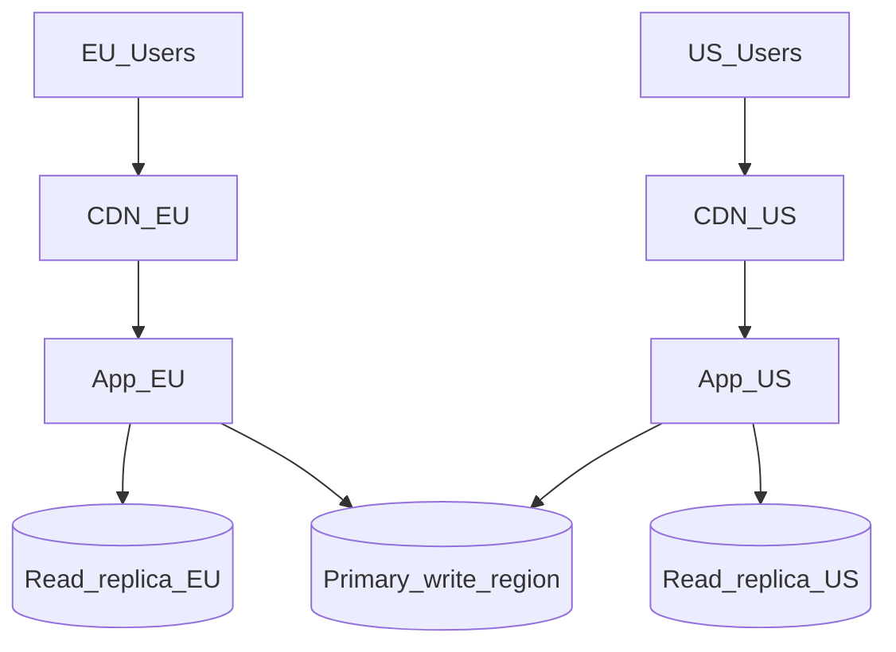

| Pattern | Use |
|---------|-----|
| **CDN** | Cacheable public GET globally |
| **Read replica per region** | Low-latency reads with lag SLO |
| **Write to primary region** | Single write leader for strong consistency |
| **Global load balancer** | Route to nearest healthy region |

Document **read-your-writes** endpoints — route to primary after mutation.

---

## Capacity planning loop

1. Load test to find **RPS ceiling** at SLO ([01-measurement-and-slo.md](01-measurement-and-slo.md))
2. Identify bottleneck layer
3. Optimize or scale that layer
4. Re-test — repeat
5. Set autoscale max from **DB and pool limits**

---

## Feature flags and progressive delivery

Reduce deploy risk without killing throughput:

- Canary % via [deployment-strategies/includes/10-progressive-delivery.md](../deployment-strategies/includes/10-progressive-delivery.md)
- Feature flags for risky paths → [deployment-strategies/includes/07-feature-flags.md](../deployment-strategies/includes/07-feature-flags.md)

Bad deploy detected → roll back canary before full fleet affected.

---

## Common mistakes

| Mistake | Fix |
|---------|-----|
| Recreate deploy on production API | Rolling or blue/green |
| Autoscale max unbounded | Cap from DB connection math |
| Multi-region writes everywhere | Write leader + replicas |
| Deploy during load test baseline | Automate post-deploy smoke load |
| Scale down workers while queue deep | Scale on depth trend |

---

## Pros and cons

### Horizontal scale (stateless)

**Pros:** Linear RPS gains until shared resource limits; fault isolation per instance.

**Cons:** Cost; complexity; requires stateless design and pool discipline.

### Multi-region

**Pros:** Lower latency; regional fault tolerance for reads.

**Cons:** Consistency complexity; replication cost; operational surface.

---

# Observability

Throughput work fails in production when you watch **CPU only**. Alert on **saturation** — pool wait, queue depth, replication lag, cache miss storms — before users notice.

> **Related:** API checklist observability → [api-design-and-protection/includes/09-checklist-and-practices.md](../api-design-and-protection/includes/09-checklist-and-practices.md) · Measurement → [01-measurement-and-slo.md](01-measurement-and-slo.md)

---

## At a glance

| Signal | Indicates | Alert when |
|--------|-----------|------------|
| **RPS + p99 latency** | Capacity headroom | p99 > SLO at normal RPS |
| **Error rate / 5xx** | Reliability | Spike above baseline |
| **429 rate** | Overload or abuse | Tier-specific spike |
| **DB pool wait** | Connection exhaustion | p99 wait > threshold |
| **Active DB connections** | Pool sizing | Near `max_connections` |
| **Replication lag** | Stale reads | Lag > SLO |
| **Queue depth / consumer lag** | Processing backlog | Monotonic growth |
| **Cache hit rate** | Cache effectiveness | Drop below expected |
| **GC pause / app CPU** | Runtime pressure | Sustained high CPU |

**Rule of thumb:** Every graph should answer: **"Are we about to run out of headroom?"** — not just **"Are we up?"**

---

## Golden signals for throughput

Adapted from the four golden signals with throughput focus:

| Signal | Throughput question |
|--------|---------------------|
| **Latency** | Is p99 creeping up at constant RPS? |
| **Traffic** | RPS, events/sec, bytes/sec |
| **Errors** | 5xx, timeout, failed enqueue |
| **Saturation** | Pool wait, queue depth, disk IO, CPU |

---

## Layer-by-layer metrics

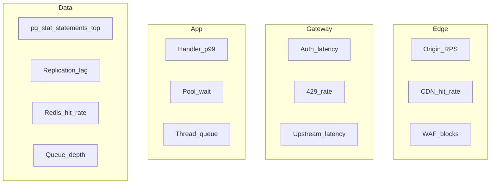

| Layer | Key metrics |
|-------|-------------|
| **Edge / CDN** | Cache hit ratio, origin offload, edge 429 |
| **Gateway** | Added latency, auth failures, throttle rate |
| **Load balancer** | Healthy host count, active connections |
| **Application** | RPS per route, p50/p99, error rate by route |
| **Database** | Top queries by `total_time`, locks, connections |
| **Cache** | Hit rate, evictions, command latency |
| **Queue / stream** | Depth, oldest message age, consumer lag |
| **Workers** | Process rate, failure rate, DLQ size |

---

## Structured logging

Log JSON with correlation across hops:

```json
{
  "request_id": "req_abc123",
  "trace_id": "trace_xyz",
  "client_id": "partner_42",
  "route": "GET /v1/orders",
  "status": 200,
  "latency_ms": 45,
  "cache": "hit",
  "db_ms": 12
}
```

| Field | Purpose |
|-------|---------|
| **`request_id`** | End-to-end request tracing |
| **`trace_id`** | Distributed trace span linking |
| **`client_id` / tier** | Throughput and 429 per customer |
| **`route`** | Hot path identification |
| **`latency_ms` / breakdown** | Regression detection |

Propagate `request_id` from gateway → app → DB comments or logs.

**Never log:** Authorization headers, API keys, passwords.

---

## Distributed tracing

Trace a single request across:

```
Client → Edge → Gateway → LB → App → Redis → PostgreSQL
```

| Use | Benefit |
|-----|---------|
| Compare p99 before/after deploy | Catch regressions early |
| Find slow span in chain | Target optimization layer |
| Debug 429 vs 5xx | Separate gateway vs app vs DB |

---

## Dashboards worth having

| Dashboard | Panels |
|-----------|--------|
| **API health** | RPS, p99, 5xx, 429 by route |
| **Capacity** | CPU, memory, instance count, autoscale events |
| **Database** | Connections, pool wait, top queries, replication lag |
| **Cache** | Hit rate, latency, memory |
| **Async** | Queue depth, worker throughput, job failure rate |
| **Stream** | Consumer lag by partition, produce rate |

---

## Alerting philosophy

| Alert on | Avoid alerting on |
|----------|-------------------|
| **SLO burn** — error budget consumption | Single blip without trend |
| **Saturation** — pool, queue, lag | CPU 70% without latency impact |
| **429 spike** on paid tiers | Expected 429 on free tier at quota |
| **Replication lag** above SLO | Sub-second lag on async replica |

**Page humans** when user-facing SLO is at risk. **Ticket** for capacity planning trends.

---

## Load test regression

After throughput changes:

1. Re-run baseline load test config from [01-measurement-and-slo.md](01-measurement-and-slo.md)
2. Compare p99, RPS ceiling, error rate
3. Check DB top queries shifted
4. Verify cache hit rate and replication lag under load

Store results in CI or runbook for comparison.

---

## RED and USE methods

Two frameworks for choosing what to monitor:

### RED (request-driven services)

| Letter | Metric | Throughput question |
|--------|--------|---------------------|
| **R**ate | Requests/sec | Traffic growing? |
| **E**rrors | Failed requests / 5xx | Reliability degrading? |
| **D**uration | p50/p99 latency | Hot path slowing? |

Apply **per route** and per tier — not only global aggregates.

### USE (resources)

| Letter | Metric | Throughput question |
|--------|--------|---------------------|
| **U**tilization | CPU, disk, connection pool % | How full is the resource? |
| **S**aturation | Queue depth, pool wait, thread backlog | Work waiting? |
| **E**rrors | Device/controller errors | Hardware or driver issues? |

**Rule of thumb:** RED for APIs and workers; USE for database, cache, and brokers.

---

## SLOs and error budget burn

| Concept | Definition |
|---------|------------|
| **SLO** | Target reliability (e.g. 99.9% monthly) |
| **SLI** | Measured indicator (e.g. successful requests / total) |
| **Error budget** | Allowed unreliability = 100% − SLO |

Alert on **burn rate** — how fast budget is consumed:

| Burn | Meaning | Response |
|------|---------|----------|
| **Fast burn** | Budget exhausted in hours | Page on-call; halt risky deploys |
| **Slow burn** | Trend over days | Ticket; capacity or quality work |

Example: 99.9% monthly ≈ 43 min downtime/month. Burning 10% in one hour triggers investigation.

Tie deploy rollback triggers → [deployment-strategies §13](../deployment-strategies/includes/13-slo-rollback-triggers.md).

---

## On-call triage order

When throughput degrades:

1. **User-facing SLO** — p99 and 5xx on top routes
2. **Saturation** — DB pool wait, queue depth, consumer lag
3. **Recent change** — deploy, flag, migration in last 2 h
4. **Dependency** — cache, broker, external API latency in trace
5. **Database** — `pg_stat_activity`, locks, replication lag

---

## Common mistakes

| Mistake | Fix |
|---------|-----|
| Monitor `/health` only | SLO on business routes |
| No correlation ID | Propagate from edge |
| Alert on CPU 80% | Alert on p99 + pool wait |
| Log every request at INFO | Sample or aggregate metrics |
| No consumer lag alert | Stream backlog grows silently |

---

## Pros and cons

### Saturation-first observability

**Pros:** Early warning; faster incident triage; data-driven capacity planning.

**Cons:** More metrics to maintain; alert tuning takes iteration.

---

# Decision Guide, Checklist, and Common Mistakes

A practical capstone for choosing throughput strategies and avoiding common mistakes.

> **Scope:** **System-wide scenarios** (cache, scale, async, overload, edge). Database-layer scenarios only → [postgresql-performance §13](../postgresql-performance/includes/13-decision-guide-and-common-mistakes.md).
>
> **Related:** Overview build order → [00-overview.md](00-overview.md) · PostgreSQL decisions → [postgresql-performance §13](../postgresql-performance/includes/13-decision-guide-and-common-mistakes.md) · Rate limit stack → [api-rate-limiting §10](../api-rate-limiting/includes/10-decision-guide.md)

---

## Master decision flow

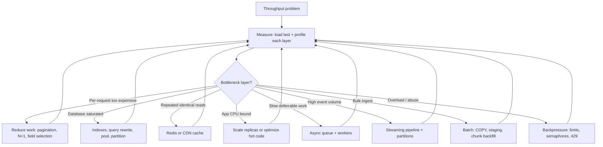

---

## Scenario recommendations

System-wide scenarios (cache, scale, async, overload). Database-only tuning → [postgresql-performance §13](../postgresql-performance/includes/13-decision-guide-and-common-mistakes.md).

| Layer | Scenario | Recommended approach |
|-------|----------|------------------------|
| **System** | Public read API at 10k RPS | Cache hot keys → horizontal app scale → read replica → [PG §13](../postgresql-performance/includes/13-decision-guide-and-common-mistakes.md) for query tuning |
| **App** | Slow list endpoint | Cap page size, field selection, cursor pagination → [PG §13](../postgresql-performance/includes/13-decision-guide-and-common-mistakes.md) for `EXPLAIN`/indexes |
| **App + queue** | Write spike on orders table | Short transactions → batch INSERT → queue non-critical side effects |
| **Database** | Hot row contention (inventory) | `FOR UPDATE SKIP LOCKED` → partition → [PG §12 bulk](../postgresql-performance/includes/12-bulk-operations-and-concurrency.md) |
| **Database** | Time-series ingest at millions/day | [PG §10 partitioning](../postgresql-performance/includes/10-partitioning.md) → BRIN/B-tree → LSM if PG exhausted |
| **App + async** | Export/report blocking API | Async job + polling/webhook → scale workers on queue depth |
| **Edge + app** | Login brute force | Gateway + IP limits → [PG §13](../postgresql-performance/includes/13-decision-guide-and-common-mistakes.md) for short transactions + partial index |
| **Edge** | Partner API burst traffic | Token bucket at gateway → identity tiers → Redis counters |
| **System** | Global low-latency reads | CDN for cacheable GET → regional read replica → [PG §11](../postgresql-performance/includes/11-read-scaling-and-caching.md) |
| **Stream** | Audit log at high volume | Event stream → partitioned topic → async projections |
| **Batch** | Nightly ETL | Staging + `COPY` → validate → merge → `ANALYZE` |
| **Async** | ML inference at scale | Job queue → GPU worker pool → result in object storage |
| **App** | GraphQL expensive queries | Cost-based limits + depth cap → cache persisted queries |
| **Cache** | Redis hot key saturation | Key sharding → local shadow cache → pre-warm on deploy |
| **Deploy** | Deploy during peak | Rolling or canary → never recreate on production API |

---

## Priority checklist

Use this order — skipping steps wastes effort and money:

- [ ] Define **SLOs** — target RPS, p99 latency, error rate, max replication lag
- [ ] **Load test** realistic paths (list, search, hot key, write burst) — not just `/health`
- [ ] Profile each layer — gateway, app, DB, cache, queue, external APIs
- [ ] **Reduce work per request** — pagination caps, field selection, eliminate N+1
- [ ] Fix **database hot path** — `pg_stat_statements`, indexes, query shape, PgBouncer
- [ ] Add **caching** for repeated hot reads — Redis, CDN, materialized views
- [ ] Confirm **stateless app tier** — no sticky sessions; shared rate-limit store
- [ ] **Scale app horizontally** — only after DB and cache are not the bottleneck
- [ ] Move **deferrable work async** — exports, emails, search indexing, webhooks
- [ ] **Scale reads** — replicas, partitioning — after primary optimization
- [ ] Add **streaming** for high-volume fan-out events
- [ ] **Protect under load** — layered rate limits, concurrency semaphores, circuit breakers
- [ ] **Operate** — autoscale on saturation signals; correlation IDs; deploy safely

---

## Common mistakes

| Mistake | Why it hurts | Fix |
|-------|--------------|-----|
| Scale replicas before fixing slow queries | Multiplies bad query cost | Measure and index on primary first |
| Load test health checks only | Misses real bottlenecks | Test list, search, write, hot-key paths |
| Unbounded concurrency | Memory exhaustion, DB connection storm | Thread pools, semaphores, pool limits |
| Sync call chains A→B→C→D | Latency stacks; one slow service blocks all | Parallelize, cache, or async |
| Per-instance rate limits | Inconsistent limits; 4× effective quota with 4 nodes | Shared Redis counters |
| No connection pooling | DB melts under connection storms | PgBouncer before raising `max_connections` |
| Giant transactions on backfill | Long locks, bloat, replication lag | Chunked batches with commits |
| Cache everything with no TTL plan | Stale data bugs, memory blowup | TTL + invalidation strategy per endpoint |
| Scale on CPU alone | Misses queue backlog and pool wait | Scale on queue depth, p99, pool saturation |
| Fail-open rate limits on writes | Abuse during Redis outage | Fail closed on expensive routes |
| Sticky sessions "just in case" | Blocks elastic scale and safe deploys | Token-based auth + external state |
| Logging at INFO on hot path | I/O becomes the bottleneck | Structured logs at WARN+; sample debug |
| One Redis key for global counter | Hot key saturation | Sharded counters or local aggregation |
| Adding gateway hop without need | Extra latency on every request | Move policy to edge or app when simple |

---

## Quick decision summary

| Question | Default answer |
|----------|----------------|
| Where to start? | Measure + load test realistic paths |
| First scale move? | Reduce per-request cost, then DB, then cache |
| When to add replicas? | After query optimization and caching on primary |
| When to go async? | Work may exceed ~10–30s or is CPU/IO expensive |
| When to use streaming? | High-volume events, fan-out, audit log, metrics |
| When to batch? | Nightly ETL, large backfills, bulk imports |
| Where to rate limit? | Edge (abuse) → gateway (API key) → app (plan tier) |
| What to alert on? | Pool wait, queue depth, replication lag — not just CPU |
| Stateless app tier? | Yes — state in DB, Redis, queue, object storage |

---

## See also

| Guide | Topics |
|-------|--------|
| [api-design-and-protection](../api-design-and-protection/README.md) | Gateway, stateless architecture, async patterns, checklist |
| [api-rate-limiting](../api-rate-limiting/README.md) | Algorithms, deployment layers, common mistakes |
| [postgresql-performance](../postgresql-performance/README.md) | Measurement, indexing, replicas, bulk ops |
| [tree-and-index-structures](../tree-and-index-structures/README.md) | B+ vs LSM storage engines |
| [deployment-strategies](../deployment-strategies/README.md) | Rolling, canary, blue/green |
| [event-sourcing-and-cqrs](../event-sourcing-and-cqrs/README.md) | Event log, outbox, projections |

---

# Multi-Region Read Routing

Multi-region adds throughput and availability — at the cost of **consistency complexity**. Design the write path first; reads follow.

> **Related:** Consistency → [postgresql-performance/includes/14-consistency-promises-and-costs.md](../postgresql-performance/includes/14-consistency-promises-and-costs.md) · Stateless API → [api-design-and-protection/includes/11-stateless-architecture.md](../api-design-and-protection/includes/11-stateless-architecture.md#consistency-and-read-routing) · DR → [database-connection-and-security/includes/12-credential-rotation-and-dr.md](../database-connection-and-security/includes/12-credential-rotation-and-dr.md)

---

## At a glance

| Pattern | Writes | Reads | Complexity |
|---------|--------|-------|------------|
| **Single region** | One primary | Local replica/cache | Low |
| **Active-passive DR** | One active region | Failover region standby | Medium |
| **Active-active reads** | One write region (or Cockroach/Spanner) | Local replica per region | Medium–high |
| **True multi-master** | Multiple write regions | Local | Very high |

**Rule of thumb:** Default to **one write region + read replicas per region**. Add multi-master only with a clear conflict model.

---

## Active-passive (DR)

```mermaid
flowchart LR
    Users[Global users] --> R1[Region A primary]
    R1 --> RepB[Region B replica async]
    RepB -.->|Failover| Promote[Promote B on disaster]
```

| Metric | Typical target |
|--------|----------------|
| **RPO** | Replication lag window (seconds–minutes) |
| **RTO** | DNS + promote + app config (minutes–hours) |

Run DR drill quarterly → [database-connection-and-security §12](../database-connection-and-security/includes/12-credential-rotation-and-dr.md).

---

## Read-local, write-global

| Request type | Route to |
|--------------|----------|
| **Session / read-your-writes** | Write region primary or sticky session |
| **Public catalog** | Regional replica + CDN |
| **Analytics** | Regional replica; stale OK |
| **All writes** | Single primary region |

API contract must document per-endpoint consistency → [api-design §1](../api-design-and-protection/includes/01-api-design.md).

---

## Latency and routing

| Mechanism | Use |
|-----------|-----|
| **GeoDNS / latency routing** | Send user to nearest healthy region |
| **Global load balancer** | Health checks per region |
| **CDN** | Cache static and semi-static GET |
| **`X-Read-Region` header (internal)** | Debug which replica served read |

Avoid cross-region DB round trips on hot paths — cache in region.

---

## Data plane options

| Stack | Multi-region story |
|-------|-------------------|
| **PostgreSQL + async replica** | Read replicas in region B; writes to region A |
| **RDS cross-region read replica** | Managed; watch lag |
| **CockroachDB / Spanner** | Built-in global consistency; different ops model |
| **DynamoDB global tables** | Active-active at item level |

PostgreSQL details → [postgresql-performance §11](../postgresql-performance/includes/11-read-scaling-and-caching.md).

---

## Common mistakes

| Mistake | Fix |
|---------|-----|
| Read replica in region B for write-after-read UX | Route writes and immediate reads to primary |
| No lag monitoring per region | Alert on `pg_stat_replication` / cloud metric |
| Failover untested | Scheduled DR drill |
| Multi-region before single-region optimized | Fix primary hot path first |

---

## Pros and cons

**Pros:** Lower read latency globally; regional failure isolation.

**Cons:** Staleness, failover runbooks, cost duplication, harder debugging.

---


---

## See also

| Guide | Topics |
|-------|--------|
| [api-design-and-protection](../api-design-and-protection/README.md) | Gateway, stateless architecture, async API patterns |
| [api-rate-limiting](../api-rate-limiting/README.md) | Limiter algorithms, deployment layers |
| [postgresql-performance](../postgresql-performance/README.md) | DB measurement, indexing, replicas, bulk writes |
| [tree-and-index-structures](../tree-and-index-structures/README.md) | B+ vs LSM storage engines |
| [deployment-strategies](../deployment-strategies/README.md) | Rolling, canary, blue/green deploys |
| [event-sourcing-and-cqrs](../event-sourcing-and-cqrs/README.md) | Event log, outbox, projections |
| [database-connection-and-security](../database-connection-and-security/README.md) | DB credentials, IAM, PgBouncer |
