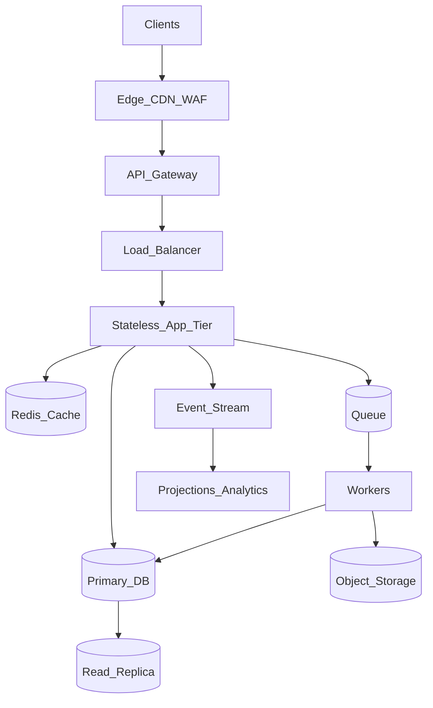
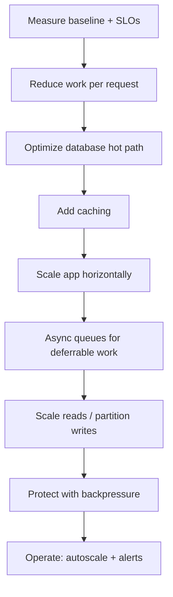

# Overview — High Throughput Systems

High throughput means handling **many useful operations per second** — HTTP(Hypertext Transfer Protocol) requests, events, or writes — without breaking SLOs on latency, error rate, or data consistency.

**Rule of thumb:** Optimize in order. Measure first, reduce work per operation, fix the database hot path, cache, scale horizontally, async deferrable work, then protect under overload. Skipping steps wastes money and complexity.

> **Related:**
> - Entry architecture → [api-design-and-protection/includes/03-api-gateway.md](../../api-design-and-protection/includes/03-api-gateway.md)
> - Stateless scaling → [api-design-and-protection/includes/11-stateless-architecture.md](../../api-design-and-protection/includes/11-stateless-architecture.md)
> - PostgreSQL performance → [postgresql-performance/README.md](../../postgresql-performance/README.md)
> - Rate limiting → [api-rate-limiting/README.md](../../api-rate-limiting/README.md)
> - Decision guide → [12-decision-guide-and-common-mistakes.md](12-decision-guide-and-common-mistakes.md)

---

## At a glance

| Concept | Definition | Example |
|---------|------------|---------|
| **Throughput** | Operations completed per unit time | 10,000 RPS, 500k events/sec |
| **Latency** | Time for one operation | p99 = 200ms |
| **Concurrency** | In-flight operations at once | 500 open requests |
| **Capacity** | Max sustained throughput within SLO(Service Level Objective) | 8k RPS at p99 < 250ms |

Throughput, latency, and concurrency are related — not interchangeable.

---

## Throughput vs latency vs concurrency

| | **Throughput** | **Latency** | **Concurrency** |
|--|----------------|---------------|-----------------|
| **Question** | How many per second? | How long per one? | How many at once? |
| **Improve by** | Cheaper ops, more parallelism | Faster hot path, fewer hops | More instances, async I/O |
| **Tradeoff** | Batch/async may add latency | Aggressive caching → staleness | High concurrency → queueing delay |

### Little's Law

**L = λ × W**

- **L** — average concurrency (in-flight work)
- **λ** — arrival rate (throughput)
- **W** — average time per operation (latency)

At fixed concurrency, **lower latency → higher throughput**. At fixed latency, **more concurrency → higher throughput** — until a shared resource saturates.

### The throughput equation

```
Sustainable throughput ≈ (instances × concurrency per instance) / average operation cost
```

Bounded by the **slowest shared resource** — usually the database, cache hot key, or external API(Application Programming Interface).

---

## Layers at a glance

| Layer | Throughput lever | Deep dive |
|-------|------------------|-----------|
| **Edge / CDN(Content Delivery Network)** | Cache static responses; block abuse early | [02-entry-and-edge.md](02-entry-and-edge.md) |
| **API gateway** | Auth, routing, coarse rate limits | [03-api-gateway.md](../../api-design-and-protection/includes/03-api-gateway.md) |
| **Load balancer** | Horizontal scale of app instances | [02-entry-and-edge.md](02-entry-and-edge.md) |
| **App tier** | Stateless replicas, bounded concurrency | [03-stateless-app-tier.md](03-stateless-app-tier.md) |
| **Cache** | Avoid repeated expensive work | [04-caching-layers.md](04-caching-layers.md) |
| **Database** | Indexes, pooling, partitioning | [05-database-throughput.md](05-database-throughput.md) |
| **Queue / workers** | Decouple accept from process | [06-async-queues-workers.md](06-async-queues-workers.md) |
| **Stream** | Fan-out events at scale | [07-streaming-pipelines.md](07-streaming-pipelines.md) |
| **Batch** | Bulk ingest off hot path | [08-batch-and-etl.md](08-batch-and-etl.md) |
| **Backpressure** | Reject or queue overload | [09-backpressure-and-limits.md](09-backpressure-and-limits.md) |

---

## Reference architecture



---

## Build order (non-negotiable sequence)



| Step | Why this order |
|------|----------------|
| 1. Measure | Avoid optimizing the wrong layer |
| 2. Reduce per-request cost | Cheapest throughput multiplier |
| 3. Database hot path | Usually the ceiling |
| 4. Cache | Multiplier for repeated reads |
| 5. Horizontal scale | Works only when app is stateless and DB isn't saturated |
| 6. Async | Moves slow work off the request path |
| 7. Scale reads / partition writes | After single-node fixes |
| 8. Backpressure | Protect when at capacity |
| 9. Operate | Autoscale and alert on saturation |

---

## Default recommendations by scenario

| Scenario | First 3 actions |
|----------|-----------------|
| Public read API hitting limits | Load test list/search paths → cache hot keys → index slow queries |
| Write spike on OLTP | Short transactions → batch INSERT → queue for non-critical writes |
| Long exports blocking API | Async job pattern → scale workers on queue depth |
| High event volume | Stream with partitioned topics → consumer groups → monitor lag |
| Nightly bulk import | Staging table + `COPY` → merge → `ANALYZE` |
| Traffic spike / abuse | Edge rate limit → gateway tier limits → app concurrency caps |

---

## Document map

| # | Topic | File |
|---|-------|------|
| 1 | Measurement and SLOs | [01-measurement-and-slo.md](01-measurement-and-slo.md) |
| 2 | Entry and edge | [02-entry-and-edge.md](02-entry-and-edge.md) |
| 3 | Stateless app tier | [03-stateless-app-tier.md](03-stateless-app-tier.md) |
| 4 | Caching layers | [04-caching-layers.md](04-caching-layers.md) |
| 5 | Database throughput | [05-database-throughput.md](05-database-throughput.md) |
| 6 | Async, queues, workers | [06-async-queues-workers.md](06-async-queues-workers.md) |
| 7 | Streaming pipelines | [07-streaming-pipelines.md](07-streaming-pipelines.md) |
| 8 | Batch and ETL(Extract, Transform, Load) | [08-batch-and-etl.md](08-batch-and-etl.md) |
| 9 | Backpressure and limits | [09-backpressure-and-limits.md](09-backpressure-and-limits.md) |
| 10 | Scale and deploy | [10-scale-and-deploy.md](10-scale-and-deploy.md) |
| 11 | Observability | [11-observability.md](11-observability.md) |
| 12 | Decision guide and common mistakes | [12-decision-guide-and-common-mistakes.md](12-decision-guide-and-common-mistakes.md) |

## Common mistakes

| Mistake | Fix |
|---------|-----|
| Scale replicas before fixing DB hot path | Measure → index → then horizontal scale |
| Cache before knowing what's hot | Profile top endpoints first |
| Async queue without DLQ(Dead Letter Queue) | Dead-letter queue + alert on depth |
| Optimize `/health` load tests only | Test auth + DB + business paths |
| No backpressure when at capacity | 429, queue limits, circuit breakers |
