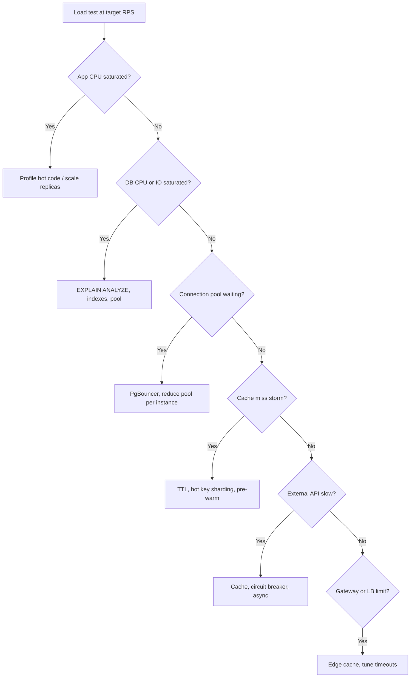

# Measurement and SLOs

You cannot optimize throughput blind. Define targets, load test realistic paths, profile each layer, and find the actual bottleneck before scaling.

> **Scope:** **System-wide lens** — SLOs, load testing, profiling each layer (edge, app, DB, cache, queue). Database tools (`EXPLAIN`, `pg_stat_statements`) → [postgresql-performance §1 Measurement](../../postgresql-performance/includes/01-measurement.md).
>
> **Related:** DB measurement → [postgresql-performance §1 Measurement](../../postgresql-performance/includes/01-measurement.md) · Observability signals → [11-observability.md](11-observability.md) · Build order → [00-overview.md](00-overview.md)

---

## At a glance

| Metric | What it tells you | Typical SLO(Service Level Objective) example |
|--------|-------------------|---------------------|
| **RPS / QPS** | Request or query rate | 10,000 RPS sustained |
| **p50 / p99 latency** | User experience under load | p99 < 200ms |
| **Error rate** | Reliability under stress | < 0.1% 5xx at peak |
| **Replication lag** | Read staleness ceiling | < 5s |
| **Queue depth / consumer lag** | Processing backlog | Depth < 1,000 messages |
| **Pool wait time** | Connection exhaustion | p99 wait < 10ms |

**Rule of thumb:** Set SLOs before load testing. Optimize until you meet them — not until hardware is maxed.

---

## Define SLOs first

| SLO type | Include |
|----------|---------|
| **Throughput** | Sustained RPS at peak; burst tolerance |
| **Latency** | p50 and p99 per endpoint class (read vs write) |
| **Availability** | Error rate, timeout rate |
| **Consistency** | Max replication lag for replica reads |
| **Processing** | Max queue depth or consumer lag before alert |

Document which endpoints require **strong consistency** (primary DB) vs **eventual consistency** (replica, cache).

---

## Capacity and cost planning

Throughput work has a **bill** — model before you scale.

| Cost driver | Scales with | Levers |
|-------------|-------------|--------|
| **App replicas** | RPS, CPU | Right-size; autoscale on saturation not CPU alone |
| **Read replicas** | SELECT volume | Fix queries first — replicas multiply bad query cost |
| **Redis / cache** | Memory, hot keys | TTL, eviction, separate clusters |
| **Message retention** | Kafka topic size | Retention days, compaction |
| **CDN(Content Delivery Network) egress** | Bytes out | Cache hit ratio, compress responses |
| **Cross-region replication** | Write volume, regions | Single write region default — [§13 multi-region](13-multi-region-read-routing.md) |
| **Search index** | Document count | CDC(Change Data Capture) vs sync write path — [§15 CDC and search](15-cdc-and-search-indexing.md) |

| Planning step | Action |
|---------------|--------|
| Baseline | RPS ceiling at SLO from load test |
| Growth | `peak_rps × 1.5` headroom for 6 months |
| Unit economics | Cost per 1M requests after cache + replica count |
| Error budget | Slow burn → capacity project before fast burn pages |

Pair with product **rate tiers** — [api-design §5](../../api-design-and-protection/includes/05-rate-limit-tiers.md).

---

## Load testing

### What to test

| Path | Why |
|------|-----|
| **List / search** | Often the heaviest read — pagination, joins, sort |
| **Hot key read** | Same resource fetched repeatedly — cache effectiveness |
| **Write burst** | INSERT/UPDATE spikes — lock contention, WAL(Write-Ahead Log) pressure |
| **Mixed realistic ratio** | Match production read/write mix |
| **Expensive async trigger** | Export, report, bulk search enqueue rate |

### How to test well

1. **Warm up** — JIT, connection pools, cache population
2. **Ramp gradually** — find knee of the curve, not instant cliff
3. **Realistic payloads** — size, headers, auth tokens
4. **Run long enough** — catch memory leaks, GC pauses, replication lag
5. **Test from near production** — same region, similar network path

### Tools and regression workflow

| Tool | Best for |
|------|----------|
| **k6** | Scriptable HTTP(Hypertext Transfer Protocol); CI-friendly; threshold assertions |
| **Locust** | Python scenarios; interactive ramp |
| **Gatling** | JVM shops; detailed reports |
| **Vegeta** | Quick constant-rate HTTP flood |

**Regression workflow:**

1. Commit `load/` scripts (scenarios + env config) in app repo
2. Baseline: store p99, RPS ceiling, error rate in CI artifact or doc
3. After each throughput change, re-run same script
4. Fail CI if p99 regresses &gt; X% vs baseline at same RPS

Example k6 threshold:

```javascript
export const options = {
  thresholds: {
    http_req_duration: ['p(99)<200'],
    http_req_failed: ['rate<0.001'],
  },
};
```

Pair with deploy rollback → [deployment-strategies §13](../../deployment-strategies/includes/13-slo-rollback-triggers.md).

### Anti-pattern

Load-testing **`/health` or `/ready` only** — these skip auth, DB, and business logic. They tell you nothing about real throughput capacity.

---

## Find the bottleneck



| Symptom | Likely bottleneck |
|---------|-------------------|
| App CPU 90%+, DB idle | App code, serialization, too many instances under-provisioned DB |
| DB CPU/IO 90%+, app idle | Missing index, bad query, write bloat |
| Pool wait time rising | Too many connections, slow queries holding connections |
| Redis latency spikes | Hot key, memory pressure, network |
| Queue depth growing | Workers too slow or under-provisioned |
| p99 up, CPU moderate | Lock contention, GC, sync external calls |

---

## Profile each layer

| Layer | What to measure | Tools |
|-------|-----------------|-------|
| **Edge / CDN** | Cache hit rate, origin requests | CDN analytics |
| **Gateway** | Added latency, 429 rate, auth time | Gateway metrics, access logs |
| **Load balancer** | Active connections, unhealthy targets | LB metrics |
| **App** | CPU, GC, thread pool queue, handler time | APM, profiling |
| **Database** | Top queries by total time, locks, connections | `pg_stat_statements`, `pg_stat_activity` |
| **Cache** | Hit rate, latency, evictions | Redis INFO, metrics |
| **Queue** | Depth, age of oldest message, consumer lag | Queue metrics |
| **External APIs** | Latency, timeout rate, circuit state | Client metrics |

Link → [postgresql-performance/includes/01-measurement.md](../../postgresql-performance/includes/01-measurement.md) for `EXPLAIN ANALYZE`, `pg_stat_statements`, and buffer analysis.

---

## Little's Law in practice

**L = λ × W**

If average request takes **W = 200ms** and you want **λ = 5,000 RPS**, you need roughly **L = 1,000** concurrent in-flight requests across all instances.

| Lever | Effect |
|-------|--------|
| Reduce **W** (latency) | Same concurrency serves more RPS |
| Increase **L** (concurrency) | More RPS until resource saturates |
| Reduce operation cost | Lowers **W** without adding hardware |

---

## Baseline checklist

Before any optimization:

- [ ] Document current **p50/p99** and **RPS** at normal and peak load
- [ ] Identify **top 5 endpoints** by total time and by call count
- [ ] Capture **DB top queries** via `pg_stat_statements`
- [ ] Record **cache hit rate** and **replication lag**
- [ ] Note **error rate** and **429 rate** under load
- [ ] Save load test config for regression after changes

---

## Pros and cons

### Measuring first

**Pros:** Avoid wasted scaling spend; find real ceiling; regression baseline for changes.

**Cons:** Takes time; load tests can miss production traffic patterns if payloads are wrong.

### Aggressive SLOs without measurement

**Pros:** None for throughput work.

**Cons:** Over-engineering or under-provisioning; optimizing wrong layer.

## Common mistakes

| Mistake | Fix |
|---------|-----|
| Load test `/health` only | Include auth, DB, and business endpoints |
| Scale app while DB is saturated | Fix database bottleneck first |
| No baseline before optimization | Save p99/RPS for regression comparison |
| SLOs without error budget policy | Define when to stop feature work for reliability |
| Ignore queue consumer lag | Alert on depth and oldest message age |