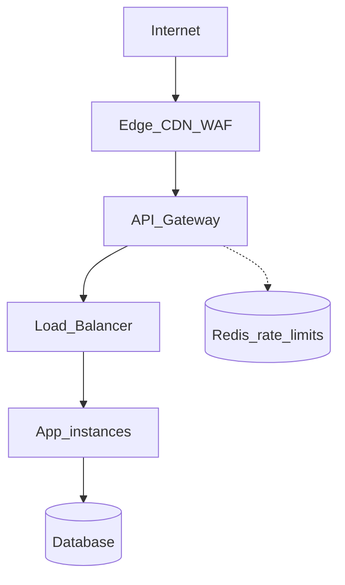

# Entry and Edge

Absorb traffic **before it hits origin** — CDN(Content Delivery Network) cache, WAF(Web Application Firewall), edge rate limits, then API(Application Programming Interface) gateway and load balancer for policy and distribution.

> **Scope:** **Throughput lens** — reduce origin RPS, shed abuse early, minimize hops and TLS(Transport Layer Security) CPU on the hot path. LB vs gateway definitions, request flows, and product selection → [api-design §3 Gateway](../../api-design-and-protection/includes/03-api-gateway.md).
>
> **Related:** Full gateway + LB guide → [api-design §3 Gateway](../../api-design-and-protection/includes/03-api-gateway.md) · Edge rate limits → [api-rate-limiting §7](../../api-rate-limiting/includes/07-deployment-layers.md)

---

## At a glance

| Layer | Throughput job |
|-------|----------------|
| **CDN / Edge** | Cache responses; block abuse; terminate TLS near users |
| **WAF / DDoS** | Drop malicious traffic before app CPU |
| **API Gateway** | Auth, routing, tier rate limits, request size caps |
| **Load Balancer** | Distribute to healthy app instances |

**Rule of thumb:** Every hop adds latency. Put **coarse protection** at the edge; put **API-aware policy** at the gateway; keep the **hot path** as short as policy allows.

---

## Traffic flow



This extends the diagram in [03-api-gateway.md](../../api-design-and-protection/includes/03-api-gateway.md).

---

## Absorb traffic early

| Technique | Throughput effect |
|-----------|-------------------|
| **CDN cache** | Origin RPS drops for cacheable GET |
| **Edge rate limiting** | Bad traffic never reaches origin |
| **WAF bot rules** | Frees app threads for legitimate users |
| **DDoS scrubbing** | Network-layer absorption |

Block garbage at the **edge** — cheapest place to say no.

---

## Gateway + load balancer together

| Component | Role |
|-----------|------|
| **Gateway** | Which API? Which client? How fast? |
| **Load balancer** | Which healthy instance? |

At scale, typical pattern:

```
Client → Gateway (auth, /v1/users → Users service)
       → Users LB → User pod 1 | 2 | 3
```

See [Flow 3 — Both together](../../api-design-and-protection/includes/03-api-gateway.md#flow-3--both-together-common-at-scale).

---

## Minimize hops on hot path

| Situation | Consider |
|-----------|----------|
| Internal service-to-service | mTLS(Mutual Transport Layer Security) mesh may replace gateway |
| Simple internal API | L7 LB with path routing may suffice |
| Public API with tiers | Gateway worth the ~1–5ms |
| Global users | CDN + edge gateway (Cloudflare-style) |

Do not duplicate the same rate limit at every layer without reason — **edge (coarse) + gateway (API key) + app (tier)** is enough.

---

## TLS termination placement

| Where | Pros | Cons |
|-------|------|------|
| **CDN / Edge** | Offload CPU; close to user | Cert management at edge |
| **Gateway** | Central policy | Extra hop if CDN also terminates |
| **Load balancer** | Simple L7 routing | Less API policy |
| **App** | End-to-end if needed | CPU cost per instance |

**Throughput tip:** Terminate TLS at edge or gateway so app CPU serves business logic.

---

## When to use what

| Scenario | Stack |
|----------|-------|
| Public SaaS API | Cloudflare → Kong/AWS API Gateway → ALB per service |
| Internal microservices | Istio/Linkerd east-west; ingress for north-south |
| Startup MVP | Cloudflare + single gateway; add LB per service at scale |

Full stack tables → [03-api-gateway.md — Tech stacks by scenario](../../api-design-and-protection/includes/03-api-gateway.md#tech-stacks-by-scenario).

---

## Common mistakes

| Mistake | Fix |
|---------|-----|
| No WAF on public API | Enable edge WAF + bot management |
| Gateway as policy junk drawer | Business AuthZ stays in app |
| Skip health checks on LB | Enable checks; drain unhealthy targets |
| Same hostname, no path routing | Gateway routes `/users`, `/orders` to correct pools |
