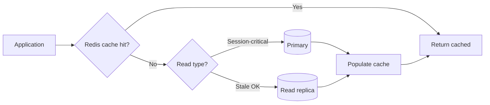
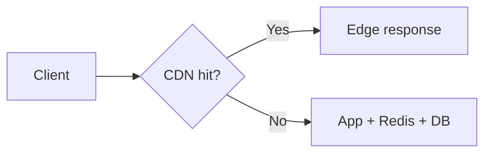
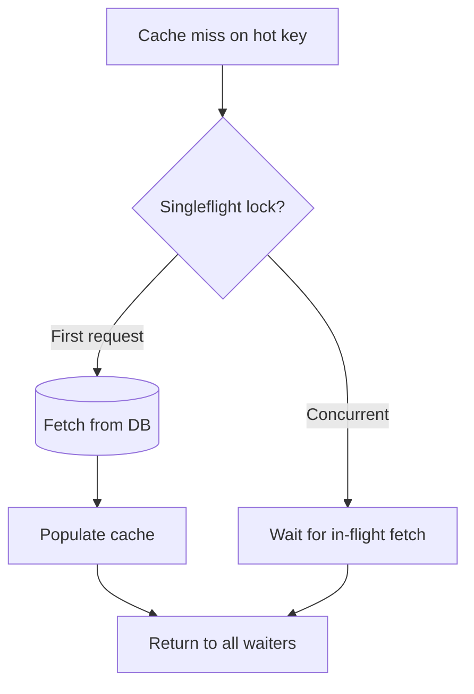

# Caching Layers

Caching is often the largest throughput multiplier for read-heavy systems — if you accept defined staleness and invalidate correctly.

> **Related:** PostgreSQL read scaling → [postgresql-performance/includes/11-read-scaling-and-caching.md](../../postgresql-performance/includes/11-read-scaling-and-caching.md) · Consistency in API(Application Programming Interface) design → [api-design-and-protection/includes/01-api-design.md](../../api-design-and-protection/includes/01-api-design.md)

---

## At a glance

| Layer | Latency | Throughput gain | Staleness |
|-------|---------|-----------------|-----------|
| **CDN(Content Delivery Network)** | Edge (~ms) | Very high for cacheable GET | TTL-based |
| **Application (Redis)** | Sub-ms to low ms | High for hot keys | TTL or event invalidation |
| **Materialized view** | Query time | High for heavy aggregations | Refresh interval |
| **Read replica** | DB round trip | Medium — offloads primary | Replication lag |

**Rule of thumb:** Cache **after** fixing slow queries on the primary. A cache in front of a bad query still pays full cost on miss — and miss storms hurt worse.

---

## Layered read path



For public cacheable GET responses, insert **CDN** before the app:



---

## Cache-aside vs write-through

| Pattern | Flow | When to use |
|---------|------|-------------|
| **Cache-aside** | App reads cache → miss → DB → populate cache | Default for most APIs |
| **Write-through** | App writes DB and cache together | Strong need for fresh cache after write |
| **Write-behind** | App writes cache; async flush to DB | Extreme write throughput; complexity high |

### Cache-aside (typical)

```
GET:  cache.get(key) → miss → db.query → cache.set(key, ttl)
POST: db.write → cache.delete(key)   // or update
```

### Invalidation strategies

| Strategy | Pros | Cons |
|----------|------|------|
| **TTL only** | Simplest | Stale until TTL expires |
| **Delete on write** | Fresher reads | Must know all affected keys |
| **Event-driven** | Accurate across services | Requires pub/sub or stream |
| **Version in key** | Instant logical invalidation | Key proliferation |

---

## Hot key problem

A single Redis key (global counter, viral product page) becomes a **throughput ceiling** — one shard, one CPU core.

| Mitigation | How |
|------------|-----|
| **Key sharding** | `product:123:shard-{0..N}` spread reads |
| **Local shadow cache** | Brief in-process cache; reduce Redis round trips |
| **Pre-warm on deploy** | Avoid cold miss storm after release |
| **CDN for public reads** | Edge absorbs viral traffic |

---

## CDN for public GET APIs

| Concern | Guidance |
|---------|----------|
| **Cache key** | URL path + relevant query params; exclude auth Vary unless designed |
| **`Cache-Control`** | `public, max-age=60` for semi-static; `private` for user-specific |
| **Invalidation** | Purge API on publish; version in URL (`/v1/assets/logo.png?v=2`) |
| **Do not cache** | POST/PUT/PATCH/DELETE; personalized authenticated responses unless keyed |

---

## Consistency matrix

| Endpoint type | Read from | After write |
|---------------|-----------|-------------|
| User profile (read-your-writes) | Primary or invalidate cache | Delete cache key |
| Public product catalog | CDN + Redis | Purge CDN + delete Redis |
| Dashboard (minutes stale OK) | Materialized view or replica | Scheduled refresh |
| Search index | Dedicated index + cache | Async reindex via queue |

Document per endpoint in your API contract which consistency tier applies.

---

## When to use what

| Scenario | Recommendation |
|----------|----------------|
| Same key read thousands/sec | Redis with TTL + consider CDN |
| Heavy SQL(Structured Query Language) aggregation | Materialized view + periodic refresh |
| 10× read vs write ratio | Replica + app routing + Redis |
| Global low-latency public reads | CDN + regional replica |
| Session or cart data | Redis keyed by `user_id` — not CDN |

---

## Common mistakes

| Mistake | Fix |
|---------|-----|
| Cache before fixing slow query | Index and rewrite query first |
| No TTL on any key | Set TTL per data class |
| Cache user-specific data at CDN | `Cache-Control: private` or skip CDN |
| Invalidate one key on bulk update | Batch delete or version bump |
| Read replica immediately after write | Route to primary or use read-your-writes pattern |
| Cache stampede on hot key expiry | Singleflight, stagger TTL, early refresh — see below |

---

## Cache stampede and thundering herd

When a popular key expires (or cold start after deploy), many requests miss at once and hammer the database.

| Mitigation | How |
|------------|-----|
| **Singleflight / request coalescing** | One backend fetch per key; others wait on same result |
| **Jitter on TTL** | `ttl + random(0..60s)` — keys don't expire simultaneously |
| **Early refresh** | Background refresh at 80% of TTL before expiry |
| **Probabilistic early expiration** | Recompute before expiry with small probability per request |
| **Circuit on miss storm** | Short-circuit DB after N concurrent misses on same key |



---

## TTL tiers by data class

| Data class | Typical TTL | Invalidation |
|------------|-------------|--------------|
| **Public catalog** | 1–5 min + CDN | Purge on publish event |
| **User profile** | 30s–2 min | Delete on write |
| **Session / cart** | No TTL or long + explicit delete | Write-through or delete on change |
| **Config / feature flags** | 10–30s | Poll or push invalidation |
| **Computed aggregates** | 5–15 min | Event-driven refresh |

Document TTL and invalidation in the API or data dictionary — clients infer staleness from behavior.

---

## Pros and cons

### Application cache (Redis)

**Pros:** Huge read throughput; sub-ms latency; shared across app instances.

**Cons:** Another system to operate; invalidation complexity; hot key risk.

### CDN

**Pros:** Absorbs global read spikes at edge; reduces origin load dramatically.

**Cons:** Invalidation lag; not for personalized or mutating APIs without careful design.
