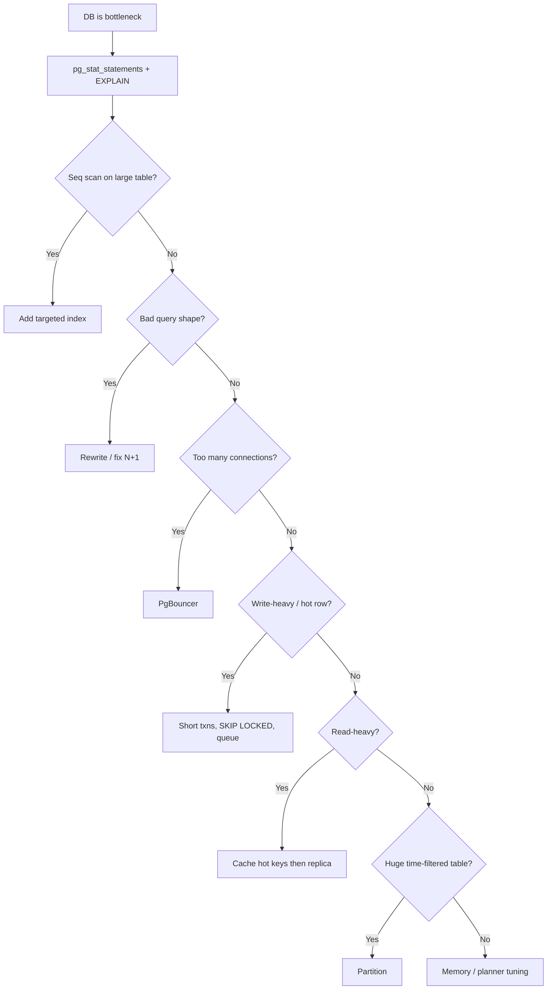

# Database Throughput

The database is usually the **throughput ceiling**. Fix measurement, queries, indexes, and pooling on the primary before replicas, caching, or sharding.

> **Scope:** **System throughput lens** — where DB fits in the HTS build order and DB-first moves under load. Full PostgreSQL tuning → [postgresql-performance](../../postgresql-performance/README.md). Scenario tables → [PG §13](../../postgresql-performance/includes/13-decision-guide-and-common-mistakes.md), [HTS §12](12-decision-guide-and-common-mistakes.md).
>
> **Related:** Full PostgreSQL guide → [postgresql-performance/README.md](../../postgresql-performance/README.md) · LSM for extreme writes → [tree-and-index-structures §4](../../tree-and-index-structures/includes/04-lsm-trees.md) · Caching → [04-caching-layers.md](04-caching-layers.md)

---

## Priority order

Follow this sequence — same as [postgresql-performance/includes/00-overview.md](../../postgresql-performance/includes/00-overview.md):

| Step | Action | Include |
|------|--------|---------|
| 1 | **Measure** | `pg_stat_statements`, `EXPLAIN ANALYZE` → [01-measurement](../../postgresql-performance/includes/01-measurement.md) |
| 2 | **Index + query** | Targeted indexes, N+1 fix → [02-indexing](../../postgresql-performance/includes/02-indexing.md), [03-query-design](../../postgresql-performance/includes/03-query-design.md) |
| 3 | **Pool connections** | PgBouncer before raising `max_connections` → [07-connection-management](../../postgresql-performance/includes/07-connection-management.md) |
| 4 | **Tune memory** | `shared_buffers`, `work_mem` → [08-memory-and-config](../../postgresql-performance/includes/08-memory-and-config.md) |
| 5 | **Maintenance** | Autovacuum, bloat → [06-vacuum-and-bloat](../../postgresql-performance/includes/06-vacuum-and-bloat.md) |
| 6 | **Partition** | Large time-series tables → [10-partitioning](../../postgresql-performance/includes/10-partitioning.md) |
| 7 | **Scale reads** | Replicas + cache → [11-read-scaling-and-caching](../../postgresql-performance/includes/11-read-scaling-and-caching.md) |
| 8 | **Bulk writes** | `COPY`, job queues → [12-bulk-operations](../../postgresql-performance/includes/12-bulk-operations-and-concurrency.md) |

**Rule of thumb:** Replicas **multiply** the cost of bad queries. Optimize on the primary first.

---

## Throughput decision flow



Adapted from [postgresql-performance/includes/13-decision-guide-and-common-mistakes.md](../../postgresql-performance/includes/13-decision-guide-and-common-mistakes.md).

---

## Scenario → first move

Database-layer first moves below. System-wide scenarios (cache + scale + async + edge) → [§12 Decision guide](12-decision-guide-and-common-mistakes.md#scenario-recommendations). Full PG scenario table → [postgresql-performance §13](../../postgresql-performance/includes/13-decision-guide-and-common-mistakes.md#scenario-recommendations).

| Scenario | First move |
|----------|------------|
| Read API at 10k RPS | Cache hot keys **before** adding replicas |
| Write spike | Short transactions → batch INSERT → queue side effects |
| Time-series ingest | Range partition + BRIN/B-tree |
| Hot row contention | `FOR UPDATE SKIP LOCKED` → partition → per-key queue |
| Nightly bulk import | Staging + `COPY` → [08-batch-and-etl.md](08-batch-and-etl.md) |
| Dashboard aggregations | Materialized view → Redis |
| PostgreSQL write ceiling | Evaluate LSM-backed store for that workload |

---

## When PostgreSQL is not enough

| Signal | Consider |
|--------|----------|
| Sustained write rate exceeds single-node WAL/IO | Partitioning, then dedicated write path |
| Append-only metrics at massive scale | Time-series DB or LSM KV |
| Full-text at billions of docs | OpenSearch/Elasticsearch + CDC |

LSM tradeoffs → [tree-and-index-structures/includes/04-lsm-trees.md](../../tree-and-index-structures/includes/04-lsm-trees.md):

| | **B+ Tree (PostgreSQL)** | **LSM Tree** |
|--|--------------------------|--------------|
| **Writes** | Update pages in place | Append + async merge |
| **Reads** | Few page lookups | Memtable + possibly many files |
| **Sweet spot** | OLTP, relational | Write-heavy logs, KV at scale |

---

## Connection math

```
Total app connections = instances × pool_size_per_instance
Must fit within PostgreSQL capacity (often via PgBouncer)
```

| Mistake | Fix |
|---------|-----|
| Raise `max_connections` to 2000 | PgBouncer transaction pooling |
| Long transactions holding connections | Timeouts; fix ORM session leaks |
| Every worker opens own pool | Centralize pool config |

---

## Read vs write throughput

| Pattern | Guidance |
|---------|----------|
| **Read-heavy** | Cache → replica → materialized view |
| **Write-heavy** | Batch, partition, queue, shorten transactions |
| **Mixed** | Separate read models (CQRS) for heavy reads |

See [event-sourcing-and-cqrs](../../event-sourcing-and-cqrs/README.md) for read model separation at scale.

---

## Common mistakes

| Mistake | Fix |
|---------|-----|
| Add replica before indexing | Fix primary queries first |
| `SELECT *` on list endpoints | Project needed columns |
| No pagination on large tables | Cursor pagination with max limit |
| One giant backfill transaction | Chunked batches |
| Ignore autovacuum on churny tables | Tune autovacuum per table |

Full database decision guide → [postgresql-performance/includes/13-decision-guide-and-common-mistakes.md](../../postgresql-performance/includes/13-decision-guide-and-common-mistakes.md).
