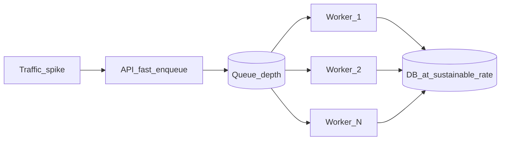
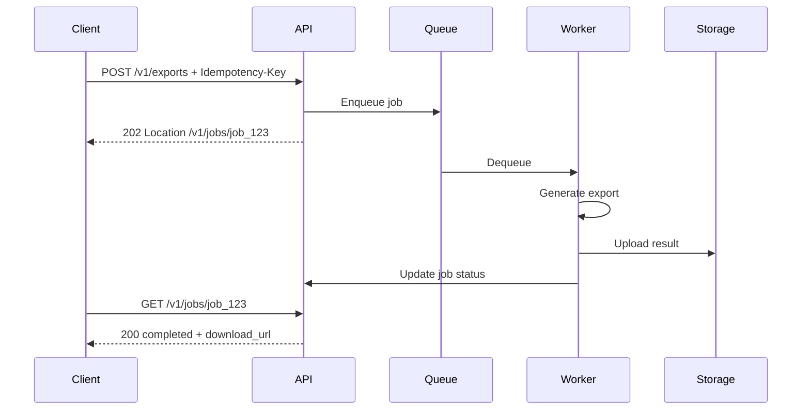
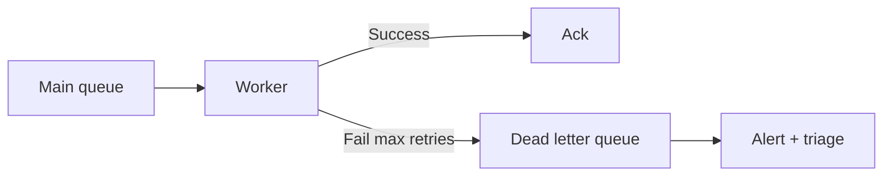

# Async, Queues, and Workers

Decouple **accept rate** from **process rate** — the API enqueues quickly; workers drain at sustainable throughput.

> **Related:** Async API patterns → [api-design-and-protection/includes/10-async-patterns.md](../../api-design-and-protection/includes/10-async-patterns.md) · Rate-limit escape hatch → [api-design-and-protection/includes/05-rate-limit-tiers.md](../../api-design-and-protection/includes/05-rate-limit-tiers.md) · Outbox → [event-sourcing-and-cqrs/includes/05-async-integration.md](../../event-sourcing-and-cqrs/includes/05-async-integration.md) · Multi-service sagas → [event-sourcing-and-cqrs/includes/07-sagas-and-distributed-workflows.md](../../event-sourcing-and-cqrs/includes/07-sagas-and-distributed-workflows.md)

---

## At a glance

| | **Synchronous** | **Asynchronous** |
|--|-----------------|------------------|
| **Connection** | Held until work completes | Released after enqueue (~50ms) |
| **Rate limit slot** | Occupied for minutes | Only enqueue costs a slot |
| **Throughput** | Limited by slowest work | API accepts; workers scale separately |
| **Client pattern** | Wait for 200 | `202` + poll, webhook, or SSE |

**Rule of thumb:** If work might exceed **~10–30 seconds**, or is CPU/IO expensive (exports, ML, bulk search), design **async from day one**.

---

## When to go async

| Operation | Async? |
|-----------|--------|
| CRUD under 1s | Sync |
| Report / export | Yes |
| Bulk reindex | Yes |
| ML inference | Yes |
| Send email / webhook fan-out | Yes — queue |
| Payment capture | Sync with timeout + idempotency (or async with strong status API) |

Full patterns → [10-async-patterns.md](../../api-design-and-protection/includes/10-async-patterns.md).

---

## Queue as shock absorber

| Metric | Meaning |
|--------|---------|
| **Queue depth** | Backlog — alert if monotonic growth |
| **Drain rate** | Workers × jobs/sec |
| **Age of oldest message** | User-visible delay for async jobs |

**Scale workers on queue depth**, not CPU alone.

---

## Typical async flow

Job state machine and polling vs webhook → [10-async-patterns.md](../../api-design-and-protection/includes/10-async-patterns.md).

---

## Idempotency at throughput

Retries are guaranteed at scale:

| Mechanism | Purpose |
|-----------|---------|
| **`Idempotency-Key` header** | Same POST → same result |
| **Job ID dedup** | Re-enqueue returns existing job |
| **At-least-once delivery** | Workers must handle duplicate processing |
| **Natural keys in writes** | UPSERT safe on retry |

---

## Worker scaling

| Trigger | Action |
|---------|--------|
| Queue depth > threshold for N minutes | Add worker instances |
| Depth near zero sustained | Scale down |
| DLQ growing | Fix poison messages — don't just add workers |
| DB pool exhausted | Reduce worker concurrency or optimize job |

Workers are **stateless** — any worker processes any job. Job state in DB + result in object storage.

---

## Queue technology pick

| Need | Options |
|------|---------|
| Simple task queue | SQS, RabbitMQ, Redis streams |
| Delay / visibility timeout | SQS |
| Priority queues | RabbitMQ, custom |
| High throughput fan-out | Kafka — see [07-streaming-pipelines.md](07-streaming-pipelines.md) |
| Reliable publish after DB write | Transactional outbox |

Outbox pattern → [event-sourcing-and-cqrs/includes/05-async-integration.md](../../event-sourcing-and-cqrs/includes/05-async-integration.md). Cross-service workflows (order → payment → inventory) → [Sagas](../../event-sourcing-and-cqrs/includes/07-sagas-and-distributed-workflows.md).

---

## Dead letter queue (DLQ)

Messages that fail after max retries must not block the queue forever.

| Step | Action |
|------|--------|
| **Retry with backoff** | Transient errors (network, 503) |
| **Max attempts** | e.g. 3–5 then route to DLQ |
| **DLQ inspection** | Alert on DLQ depth; manual or automated replay |
| **Poison message** | Fix bug; replay or discard with audit |

---

## Queue vs stream — when to pick which

| Need | Queue (SQS, RabbitMQ, Redis) | Stream (Kafka, Kinesis) |
|------|------------------------------|-------------------------|
| Task job (export, email) | **Yes** | Overkill |
| Fan-out to many consumers | Limited (multiple queues) | **Yes** |
| Replay from history | Usually no | **Yes** |
| Strict per-key ordering | Single consumer or partition | Partition key |
| Ops complexity | Lower | Higher |

Job queues → this section. High-volume fan-out → [07-streaming-pipelines.md](07-streaming-pipelines.md).

---

## Delivery semantics

| Guarantee | Behavior | Worker requirement |
|-----------|----------|------------------|
| **At-most-once** | May lose message | Simple; rare for critical work |
| **At-least-once** | May duplicate | **Idempotent** processing |
| **Exactly-once** | Hard end-to-end | Transactional outbox + idempotent consumer |

Most production systems: **at-least-once** + idempotency keys + dedup store.

---

## Rate limits and async

Expensive sync endpoints burn throughput slots. Pattern from [05-rate-limit-tiers.md](../../api-design-and-protection/includes/05-rate-limit-tiers.md):

- Strict limit on **sync** expensive routes
- Separate quota on **job creation** (async escape hatch)
- Client gets `202` quickly; worker pool absorbs duration

---

## Common mistakes

| Mistake | Fix |
|---------|-----|
| Sync export holding connection 5 min | Async job + poll/webhook |
| No limit on enqueue rate | Rate limit job creation |
| Worker without idempotency | Safe retry with dedup keys |
| Scale workers without DB headroom | Cap worker concurrency vs pool |
| Lost message on crash before ack | Outbox or transactional enqueue |

---

## Pros and cons

### Async queue

**Pros:** API throughput decoupled from slow work; absorbs spikes; independent worker scaling.

**Cons:** Complexity; eventual completion; client must poll or webhook; operational monitoring needed.
