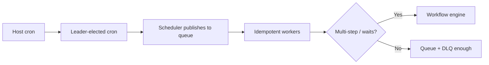

# Scheduled and Recurring Jobs

Cron at scale becomes **missed runs, duplicate runs, and silent backlog** — move recurring work to **durable queues**, then to a **workflow engine** when steps span services, humans, or days.

> **Scope:** Scheduling patterns from single-host cron → distributed queue schedulers → Temporal-style workflows. Worker throughput and DLQ(Dead Letter Queue) → [§6](06-async-queues-workers.md). Batch ingest off the hot path → [§8](08-batch-and-etl.md). Multi-step durability → [specialized §4](../../specialized-data-systems/includes/04-workflow-engines.md) · [ES §7](../../event-sourcing-and-cqrs/includes/07-sagas-and-distributed-workflows.md).
>
> **Related:** Queue broker choice → [§14](14-message-brokers-and-queues.md) · [§14A](14A-queue-broker-operations.md) · Outbox relay → [ES §5A](../../event-sourcing-and-cqrs/includes/05A-outbox-and-inbox.md) · Async API(Application Programming Interface) contracts → [api-design §10](../../api-design-and-protection/includes/10-async-patterns.md)

---

## At a glance

| Pattern | Best for | Failure mode |
|---------|----------|--------------|
| **Host cron** | One box, idempotent script, low blast radius | Host dies → missed run; scale-out → duplicate runs |
| **Leader-elected cron** | Small cluster, single scheduler | Leader flaps → gaps or doubles without fencing |
| **Queue + scheduler** | Fleet scale, retries, visibility timeout | Needs idempotent workers + DLQ |
| **Workflow engine** | Multi-step, waits, human tasks, compensation | Platform ops; worth it past ~3 durable steps |

**Rule of thumb:** If a job touches **money, inventory, or external APIs(Application Programming Interfaces)** and can run twice, it belongs on a **queue with idempotency keys** — not on cron alone.

---

## Evolution path

| Stage | Add when |
|-------|----------|
| **Queue scheduler** | More than one worker; need retries and lag metrics |
| **Per-tenant / shard queues** | Noisy neighbor on shared queue — [§14B](14B-queue-fairness-and-priority.md) |
| **Workflow engine** | Saga across services, timers, human approval — [specialized §4](../../specialized-data-systems/includes/04-workflow-engines.md) |

---

## Cron at scale (what breaks)

| Problem | Symptom | Fix |
|---------|---------|-----|
| **Duplicate fire** | Two hosts run the same window | Leader lock with fencing token, or external scheduler |
| **Missed fire** | Host restart during tick | Catch-up policy: skip vs run-once vs bounded backlog |
| **Long job overlap** | Second tick starts before first finishes | Mutex per job key; extend lease; or queue instead |
| **Clock skew** | Runs drift across AZ(Availability Zone)s | UTC everywhere; don't rely on local TZ |
| **Silent failure** | Cron email nobody reads | Metrics: `last_success_at`, lag, DLQ depth |

---

## Queue-based scheduling

| Practice | Why |
|----------|-----|
| Scheduler **enqueues**, workers **execute** | Decouple tick rate from process rate — [§6](06-async-queues-workers.md) |
| Message carries `job_id`, `run_id`, `scheduled_at` | Idempotency and audit |
| Visibility timeout > p99 job duration | Avoid duplicate processing mid-flight — [§14A](14A-queue-broker-operations.md) |
| DLQ + replay runbook | Poison rows don't block the schedule |
| `last_success_at` metric per job | Page on missed SLO(Service Level Objective), not on every retry |

For **high-volume fan-out** (e.g. bill every tenant at midnight), scheduler publishes **shard messages** — one per tenant or bucket — not one giant loop in the scheduler process.

---

## When to adopt a workflow engine

| Signal | Cron + queue | Temporal / Step Functions |
|--------|--------------|---------------------------|
| Steps across 2+ services | Hand-rolled saga + status table | Native durable execution — [ES §7](../../event-sourcing-and-cqrs/includes/07-sagas-and-distributed-workflows.md) |
| Wait hours/days (approval, settlement) | Fragile sleep + DB polling | Durable timers |
| Compensation on partial failure | Custom rollback code | Built-in retry/compensation model — [ES §7B](../../event-sourcing-and-cqrs/includes/07B-sagas-compensation-idempotency.md) |
| Visibility into stuck runs | SQL(Structured Query Language) queries on job table | Workflow history UI — [specialized §4](../../specialized-data-systems/includes/04-workflow-engines.md) |

---

## Operational checklist

- [ ] Every scheduled job has an owner, SLO, and `last_success_at` alert
- [ ] Workers idempotent on `(job_id, run_id)` or business key
- [ ] DLQ triage documented — [§14A](14A-queue-broker-operations.md)
- [ ] Catch-up policy written (skip vs bounded replay)
- [ ] Multi-step flows evaluated against workflow engine vs hand saga

---

## Common mistakes

| Mistake | Why it hurts | Fix |
|---------|--------------|-----|
| Cron on every app instance | Duplicate side effects | One scheduler or queue |
| No idempotency on retries | Double charges, double emails | Idempotency key per run |
| Infinite catch-up after outage | Thundering herd | Cap backlog; shed or defer |
| Status column as workflow engine | Lost state on crash | Queue or Temporal |
| Mixing schedule with heavy work | Scheduler blocks | Enqueue only; workers scale |

---

## Pros and cons

| Approach | Pros | Cons |
|----------|------|------|
| **Queue scheduler** | Simple, fits most nightly/ hourly jobs | Manual saga for multi-step |
| **Workflow engine** | Durable multi-day flows, visibility | New platform to operate |
| **Host cron forever** | Fast to start | Breaks on first scale-out |
