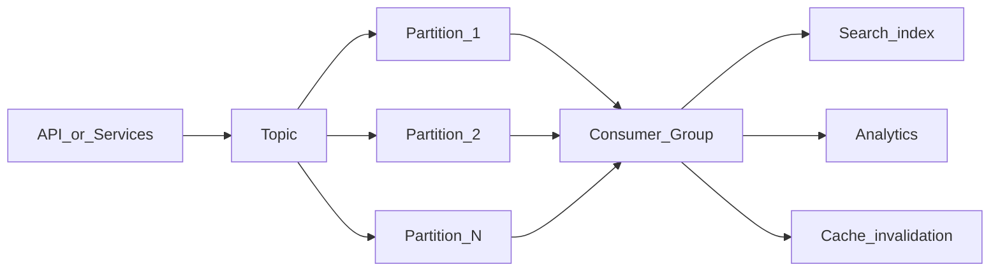

# Streaming Pipelines

When request/response cannot keep up with event volume, fan-out, or audit requirements, move to **event streaming** — append-only logs with partitioned parallel consumption.

> **Related:** Event sourcing and outbox → [event-sourcing-and-cqrs/includes/05-async-integration.md](../../event-sourcing-and-cqrs/includes/05-async-integration.md) · Async API patterns → [api-design-and-protection/includes/10-async-patterns.md](../../api-design-and-protection/includes/10-async-patterns.md) · LSM write path → [tree-and-index-structures/includes/04-lsm-trees.md](../../tree-and-index-structures/includes/04-lsm-trees.md)

---

## At a glance

| | **Sync API** | **Event stream** |
|--|--------------|------------------|
| **Model** | Request → response | Append event → consumers process |
| **Coupling** | Producer waits for consumer | Decoupled in time |
| **Scale** | Limited by handler capacity | Partitions × consumer groups |
| **Ordering** | Per request | Per partition key |
| **Best for** | CRUD, queries | Metrics, audit, fan-out, CDC |

**Rule of thumb:** Use streaming when **many consumers** need the same events, **volume exceeds** comfortable API throughput, or you need a **durable audit log** — not for simple CRUD that fits in PostgreSQL.

---

## When streaming beats request/response

| Use case | Why stream |
|----------|------------|
| **Audit / activity log** | Durable append-only; many readers |
| **Metrics and analytics** | High volume; batch aggregation |
| **Fan-out notifications** | One order event → email, warehouse, search |
| **CDC (change data capture)** | DB changes → search index, cache invalidation |
| **Cross-service integration** | Loose coupling; replay on failure |

---

## Core concepts



| Term | Meaning |
|------|---------|
| **Topic** | Named stream of events |
| **Partition** | Ordered sub-stream; unit of parallelism |
| **Offset** | Position in partition log |
| **Consumer group** | Cooperating consumers; each partition → one consumer in group |
| **Producer** | Appends events; chooses partition key |

Common implementations: Apache Kafka, Amazon Kinesis, Google Pub/Sub, Azure Event Hubs, Redpanda.

---

## Throughput levers

| Lever | Effect |
|-------|--------|
| **More partitions** | Higher parallel consume/produce (within broker limits) |
| **Batch produce/consume** | Amortize network and commit overhead |
| **Compression** | Snappy/LZ4/Zstd — CPU for bandwidth |
| **Idempotent producers** | Safe retries without duplicates |
| **Right message size** | Avoid huge payloads in stream — store blob in S3, reference in event |

**Partition count:** Plan for peak throughput; increasing partitions later may require key strategy review.

---

## Partition key and ordering

Events with the **same partition key** are strictly ordered within that partition.

| Key choice | Ordering | Risk |
|------------|----------|------|
| **`user_id`** | Per-user order preserved | Hot user → hot partition |
| **`tenant_id`** | Per-tenant order | Large tenant saturates one partition |
| **Random / round-robin** | No cross-event order | Maximum spread; use when order irrelevant |
| **`order_id`** | Per-order lifecycle | Good for order pipeline |

**Tradeoff:** Strong ordering for one key vs even load across partitions — rarely both for viral keys.

---

## Consumer groups and parallelism

| Rule | Detail |
|------|--------|
| **One consumer per partition per group** | Max parallel consumers in a group = partition count |
| **Multiple groups** | Same topic; independent lag per group (search vs analytics) |
| **Rebalance** | Adding consumer triggers partition reassignment — brief pause |
| **Static membership** | Pin consumers in high-stakes systems to reduce churn |

Scale consumers until lag stabilizes; adding consumers beyond partition count does not help that group.

---

## Kafka-oriented patterns

| Pattern | Use |
|---------|-----|
| **Compacted topic** | Latest value per key (config, registry) |
| **Idempotent producer** | `enable.idempotence=true` — safe retries |
| **Transactional produce** | Read-process-write exactly once within broker |
| **Manual commit** | Commit offset after DB write succeeds |
| **Seek / replay** | Reset offset for new projection or recovery |

Store payload references (S3 URL, row ID) when messages exceed ~1 MB.

---

## Stream DLQ and poison messages

| Approach | When |
|----------|------|
| **Retry topic** | Transient handler failures with backoff |
| **DLQ topic** | Permanent failure after N attempts |
| **Skip + log** | Bad schema — fix producer; don't infinite retry |
| **Pause partition** | Downstream DB outage — catch up later |

Alert on **consumer lag growth rate**, not only absolute lag.

---

## Backpressure

**Consumer lag** — difference between latest offset and consumer offset — is the key health metric.

| Signal | Action |
|--------|--------|
| Lag growing steadily | Scale consumers (up to partition count) or optimize handler |
| Lag spike after deploy | Slow consumer code; poison message |
| Producer rate >> consume rate | Add consumers, batch processing, or shed load |

| Pattern | Purpose |
|---------|---------|
| **Pause consumption** | Protect downstream DB during outage |
| **Dead letter queue (DLQ)** | Isolate poison messages |
| **Rate limit producers** | API tier rejects when lag exceeds threshold |

---

## Integration with API tier

Typical pattern:

1. API validates request and writes to DB (transaction)
2. **Outbox table** or transactional publish ensures event is not lost
3. Stream connector or app publishes to topic
4. Consumers update projections, search, cache, analytics

See [event-sourcing-and-cqrs/includes/05-async-integration.md](../../event-sourcing-and-cqrs/includes/05-async-integration.md) for outbox pattern details.

```mermaid
sequenceDiagram
    participant API
    participant DB
    participant Outbox
    participant Stream
    participant Consumer

    API->>DB: BEGIN; INSERT order; INSERT outbox
    API->>DB: COMMIT
    Note over Outbox,Stream: Relay publishes outbox rows
    Outbox->>Stream: order.created event
    Stream->>Consumer: Consume
    Consumer->>DB: Update read model
```

---

## When to use what

| Scenario | Recommendation |
|----------|----------------|
| < 1k events/sec, few consumers | Queue (SQS, RabbitMQ) may suffice |
| Many consumers, replay needed | Kafka-style log |
| Global fan-out, managed ops | Cloud managed stream |
| Strict per-entity ordering | Partition by entity ID |
| Analytics only | Stream → warehouse (Snowflake, BigQuery) |

---

## Common mistakes

| Mistake | Fix |
|---------|-----|
| One partition for everything | Scale partitions with volume |
| Huge payloads in messages | Reference object storage |
| No DLQ | Poison message blocks partition |
| Consumer does sync DB call per message | Batch writes; idempotent upserts |
| Ignore lag alerts | Alert on lag growth rate, not just absolute |

---

## Pros and cons

### Event streaming

**Pros:** Massive throughput; decoupled consumers; replay for recovery and new projections.

**Cons:** Operational complexity; eventual consistency; partition key design mistakes are costly to fix.
