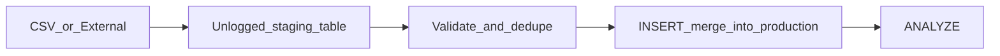

# Batch and ETL

Bulk ingest and backfills belong **off the API hot path** — use staging tables, `COPY`, chunked commits, and idempotent merges for throughput without locking production traffic.

> **Related:** PostgreSQL bulk ops → [postgresql-performance/includes/12-bulk-operations-and-concurrency.md](../../postgresql-performance/includes/12-bulk-operations-and-concurrency.md) · Async jobs → [06-async-queues-workers.md](06-async-queues-workers.md)

---

## At a glance

| Method | Speed | Use when |
|--------|-------|----------|
| **`COPY`** | Fastest | Large imports, ETL loads |
| **Multi-row `INSERT`** | Good | Moderate batches (100–1000 rows) |
| **Row-by-row `INSERT`** | Slowest | Avoid for bulk |
| **Chunked `UPDATE`** | Controlled | Backfills on 100M+ rows |

**Rule of thumb:** Never run a **single giant transaction** over millions of rows on a live primary — long locks, bloat, and replication lag follow.

---

## Staging table pattern



```sql
-- Example: load via staging
CREATE UNLOGGED TABLE staging_orders (LIKE orders INCLUDING DEFAULTS);

COPY staging_orders FROM '/path/orders.csv' WITH (FORMAT csv, HEADER true);

INSERT INTO orders
SELECT * FROM staging_orders s
WHERE NOT EXISTS (SELECT 1 FROM orders o WHERE o.id = s.id);

ANALYZE orders;
```

| Step | Purpose |
|------|---------|
| **Unlogged staging** | Faster load; not crash-safe (OK for temp staging) |
| **Validate in staging** | Reject bad rows before touching production |
| **Idempotent merge** | Safe to re-run job |
| **`ANALYZE`** | Fresh planner stats after large load |

---

## COPY vs row INSERT

From [postgresql-performance/includes/12-bulk-operations-and-concurrency.md](../../postgresql-performance/includes/12-bulk-operations-and-concurrency.md):

| | **`COPY`** | **Multi-row INSERT** |
|--|------------|----------------------|
| **Throughput** | Highest | Good |
| **Flexibility** | File/stream oriented | App-generated batches |
| **Error handling** | Fails row or batch | Per-batch rollback |
| **Typical use** | Nightly ETL, migrations | App batch API |

### Large load tips

- Drop nonessential indexes before load, recreate **`CONCURRENTLY`** after (very large loads only)
- Increase **`maintenance_work_mem`** for index build session
- Run during **low-traffic window** or against replica promoted after load

---

## Chunked backfills

For updating or inserting millions of rows on a live system:

```sql
-- Batch by ID range; commit between batches
UPDATE orders SET status = 'archived'
WHERE id BETWEEN 1000000 AND 1009999
  AND status = 'active';
-- sleep or schedule next batch
```

| Parameter | Guidance |
|-----------|----------|
| **Batch size** | 1k–10k rows — tune to lock duration |
| **Sleep between batches** | Reduce pressure on replication and autovacuum |
| **Progress tracking** | Store last processed ID in job metadata |
| **Idempotency** | `WHERE` clause ensures re-run safety |

---

## Scheduled vs triggered batch

| Type | Trigger | Example |
|------|---------|---------|
| **Scheduled (cron)** | Time-based | Nightly warehouse sync at 2 AM |
| **Queue-triggered** | Event or threshold | Reindex when queue depth > 100 |
| **Manual / admin** | Operator | One-time migration backfill |

**Throughput tip:** Schedule heavy batch jobs **off peak**; use queue workers with **concurrency limits** so batch does not starve interactive API.

---

## Idempotent batch jobs

| Pattern | How |
|---------|-----|
| **Natural key UPSERT** | `ON CONFLICT DO UPDATE` |
| **Merge with NOT EXISTS** | Skip already-loaded rows |
| **Job run ID in audit table** | Skip if run_id completed |
| **Deterministic chunk keys** | Re-run same chunk safely |

```sql
INSERT INTO inventory (sku, qty)
VALUES ('ABC', 10)
ON CONFLICT (sku) DO UPDATE
SET qty = inventory.qty + EXCLUDED.qty;
```

---

## Batch vs streaming vs API

| Volume / pattern | Choose |
|------------------|--------|
| Real-time single events | API or stream |
| Continuous high volume | Stream |
| Nightly full or delta load | Batch ETL |
| User-triggered export | Async job → batch write to object storage |

---

## Common mistakes

| Mistake | Fix |
|---------|-----|
| One transaction for 100M rows | Chunk with commits |
| Load directly to indexed production table | Staging → merge |
| Skip `ANALYZE` after load | Always refresh stats |
| Batch job unlimited parallelism | Cap workers vs API pool |
| No idempotency on retry | UPSERT or merge keys |

---

## Pros and cons

### Batch ETL off hot path

**Pros:** Maximum write throughput; predictable load window; simpler error recovery per chunk.

**Cons:** Latency until data visible; orchestration needed; schema drift between staging and prod.
