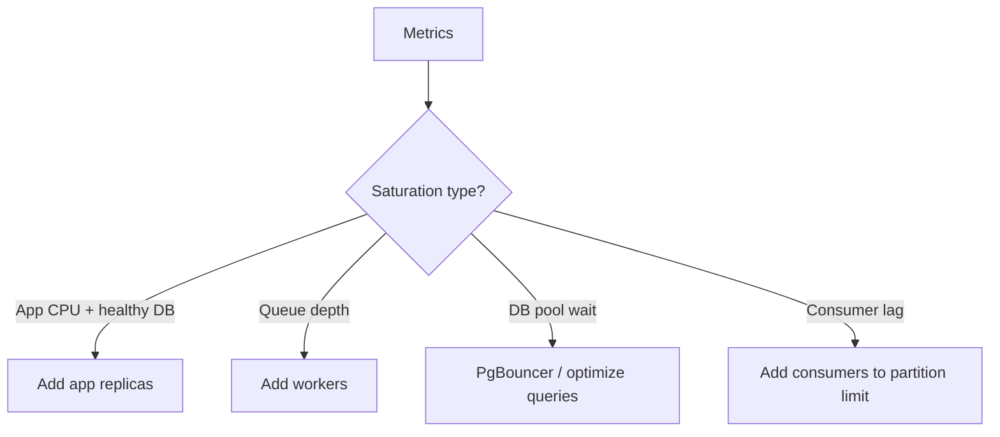
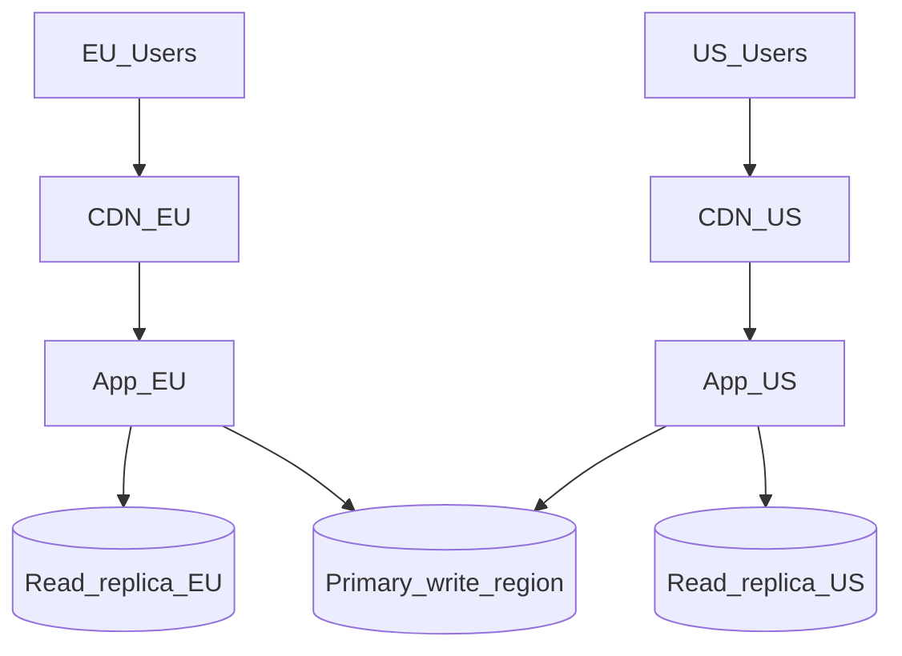

# Scale and Deploy

Throughput requires **adding capacity without downtime** — horizontal autoscaling, safe deploy strategies, and multi-region read paths.

> **Related:** Stateless prerequisites → [03-stateless-app-tier.md](03-stateless-app-tier.md) · Multi-region routing → [§13 Multi-region read routing](13-multi-region-read-routing.md) · Deployment strategies → [deployment-strategies/README.md](../../deployment-strategies/README.md) · Blue/green → [deployment-strategies/includes/03-blue-green.md](../../deployment-strategies/includes/03-blue-green.md)

---

## At a glance

| Concern | Throughput approach |
|---------|---------------------|
| **More RPS** | Horizontal scale of stateless app instances |
| **More async work** | Scale workers on queue depth |
| **Deploy during traffic** | Rolling, canary, or blue/green — not recreate |
| **Global users** | CDN + regional read replicas |
| **Spike handling** | Autoscale + backpressure — not unbounded queue |

**Rule of thumb:** You can only scale what is **stateless and not saturated downstream**. Scaling app pods into a full DB pool buys nothing.

---

## Horizontal autoscaling

| Signal | Scale what |
|--------|------------|
| **CPU / memory** | App instances (with caution — CPU alone misleads) |
| **RPS / request count** | App instances |
| **p99 latency** | App or workers if DB healthy |
| **Queue depth** | Worker instances |
| **Consumer lag** | Stream consumers (≤ partition count) |
| **Pool wait time** | Fix pool/DB first — not always "more app" |

---

## Autoscaling cautions

| Pitfall | Mitigation |
|---------|------------|
| **Cold start** | Min instances > 0; warmup routes |
| **Scale on brief spike** | Cooldown period; require sustained signal |
| **Scale app into DB limit** | Cap max replicas from pool math |
| **Thundering herd on scale-up** | Pre-warm cache; gradual LB weight |

---

## Deploy without losing capacity

| Strategy | Throughput impact | Guide |
|----------|-------------------|-------|
| **Rolling** | Gradual replacement; brief mixed versions | [02-rolling](../../deployment-strategies/includes/02-rolling.md) |
| **Blue/green** | Instant switch; double capacity during cutover | [03-blue-green](../../deployment-strategies/includes/03-blue-green.md) |
| **Canary** | Small % on new version first | [04-canary](../../deployment-strategies/includes/04-canary.md) |
| **Recreate** | **Downtime** — avoid on production API | [01-recreate](../../deployment-strategies/includes/01-recreate.md) |

Stateless app tier enables rolling and blue/green without session migration → [11-stateless-architecture.md](../../api-design-and-protection/includes/11-stateless-architecture.md).

---

## Multi-region throughput

| Pattern | Use |
|---------|-----|
| **CDN** | Cacheable public GET globally |
| **Read replica per region** | Low-latency reads with lag SLO |
| **Write to primary region** | Single write leader for strong consistency |
| **Global load balancer** | Route to nearest healthy region |

Document **read-your-writes** endpoints — route to primary after mutation.

---

## Capacity planning loop

1. Load test to find **RPS ceiling** at SLO ([01-measurement-and-slo.md](01-measurement-and-slo.md))
2. Identify bottleneck layer
3. Optimize or scale that layer
4. Re-test — repeat
5. Set autoscale max from **DB and pool limits**

---

## Feature flags and progressive delivery

Reduce deploy risk without killing throughput:

- Canary % via [deployment-strategies/includes/10-progressive-delivery.md](../../deployment-strategies/includes/10-progressive-delivery.md)
- Feature flags for risky paths → [deployment-strategies/includes/07-feature-flags.md](../../deployment-strategies/includes/07-feature-flags.md)

Bad deploy detected → roll back canary before full fleet affected.

---

## Common mistakes

| Mistake | Fix |
|---------|-----|
| Recreate deploy on production API | Rolling or blue/green |
| Autoscale max unbounded | Cap from DB connection math |
| Multi-region writes everywhere | Write leader + replicas |
| Deploy during load test baseline | Automate post-deploy smoke load |
| Scale down workers while queue deep | Scale on depth trend |

---

## Pros and cons

### Horizontal scale (stateless)

**Pros:** Linear RPS gains until shared resource limits; fault isolation per instance.

**Cons:** Cost; complexity; requires stateless design and pool discipline.

### Multi-region

**Pros:** Lower latency; regional fault tolerance for reads.

**Cons:** Consistency complexity; replication cost; operational surface.
