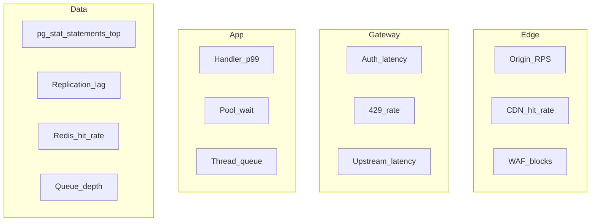

# Observability

Throughput work fails in production when you watch **CPU only**. Alert on **saturation** — pool wait, queue depth, replication lag, cache miss storms — before users notice.

> **Related:** API checklist observability → [api-design-and-protection/includes/09-checklist-and-practices.md](../../api-design-and-protection/includes/09-checklist-and-practices.md) · Measurement → [01-measurement-and-slo.md](01-measurement-and-slo.md)

---

## At a glance

| Signal | Indicates | Alert when |
|--------|-----------|------------|
| **RPS + p99 latency** | Capacity headroom | p99 > SLO at normal RPS |
| **Error rate / 5xx** | Reliability | Spike above baseline |
| **429 rate** | Overload or abuse | Tier-specific spike |
| **DB pool wait** | Connection exhaustion | p99 wait > threshold |
| **Active DB connections** | Pool sizing | Near `max_connections` |
| **Replication lag** | Stale reads | Lag > SLO |
| **Queue depth / consumer lag** | Processing backlog | Monotonic growth |
| **Cache hit rate** | Cache effectiveness | Drop below expected |
| **GC pause / app CPU** | Runtime pressure | Sustained high CPU |

**Rule of thumb:** Every graph should answer: **"Are we about to run out of headroom?"** — not just **"Are we up?"**

---

## Golden signals for throughput

Adapted from the four golden signals with throughput focus:

| Signal | Throughput question |
|--------|---------------------|
| **Latency** | Is p99 creeping up at constant RPS? |
| **Traffic** | RPS, events/sec, bytes/sec |
| **Errors** | 5xx, timeout, failed enqueue |
| **Saturation** | Pool wait, queue depth, disk IO, CPU |

---

## Layer-by-layer metrics



| Layer | Key metrics |
|-------|-------------|
| **Edge / CDN** | Cache hit ratio, origin offload, edge 429 |
| **Gateway** | Added latency, auth failures, throttle rate |
| **Load balancer** | Healthy host count, active connections |
| **Application** | RPS per route, p50/p99, error rate by route |
| **Database** | Top queries by `total_time`, locks, connections |
| **Cache** | Hit rate, evictions, command latency |
| **Queue / stream** | Depth, oldest message age, consumer lag |
| **Workers** | Process rate, failure rate, DLQ size |

---

## Structured logging

Log JSON with correlation across hops:

```json
{
  "request_id": "req_abc123",
  "trace_id": "trace_xyz",
  "client_id": "partner_42",
  "route": "GET /v1/orders",
  "status": 200,
  "latency_ms": 45,
  "cache": "hit",
  "db_ms": 12
}
```

| Field | Purpose |
|-------|---------|
| **`request_id`** | End-to-end request tracing |
| **`trace_id`** | Distributed trace span linking |
| **`client_id` / tier** | Throughput and 429 per customer |
| **`route`** | Hot path identification |
| **`latency_ms` / breakdown** | Regression detection |

Propagate `request_id` from gateway → app → DB comments or logs.

**Never log:** Authorization headers, API keys, passwords.

---

## Distributed tracing

Trace a single request across:

```
Client → Edge → Gateway → LB → App → Redis → PostgreSQL
```

| Use | Benefit |
|-----|---------|
| Compare p99 before/after deploy | Catch regressions early |
| Find slow span in chain | Target optimization layer |
| Debug 429 vs 5xx | Separate gateway vs app vs DB |

---

## Dashboards worth having

| Dashboard | Panels |
|-----------|--------|
| **API health** | RPS, p99, 5xx, 429 by route |
| **Capacity** | CPU, memory, instance count, autoscale events |
| **Database** | Connections, pool wait, top queries, replication lag |
| **Cache** | Hit rate, latency, memory |
| **Async** | Queue depth, worker throughput, job failure rate |
| **Stream** | Consumer lag by partition, produce rate |

---

## Alerting philosophy

| Alert on | Avoid alerting on |
|----------|-------------------|
| **SLO burn** — error budget consumption | Single blip without trend |
| **Saturation** — pool, queue, lag | CPU 70% without latency impact |
| **429 spike** on paid tiers | Expected 429 on free tier at quota |
| **Replication lag** above SLO | Sub-second lag on async replica |

**Page humans** when user-facing SLO is at risk. **Ticket** for capacity planning trends.

---

## Load test regression

After throughput changes:

1. Re-run baseline load test config from [01-measurement-and-slo.md](01-measurement-and-slo.md)
2. Compare p99, RPS ceiling, error rate
3. Check DB top queries shifted
4. Verify cache hit rate and replication lag under load

Store results in CI or runbook for comparison.

---

## RED and USE methods

Two frameworks for choosing what to monitor:

### RED (request-driven services)

| Letter | Metric | Throughput question |
|--------|--------|---------------------|
| **R**ate | Requests/sec | Traffic growing? |
| **E**rrors | Failed requests / 5xx | Reliability degrading? |
| **D**uration | p50/p99 latency | Hot path slowing? |

Apply **per route** and per tier — not only global aggregates.

### USE (resources)

| Letter | Metric | Throughput question |
|--------|--------|---------------------|
| **U**tilization | CPU, disk, connection pool % | How full is the resource? |
| **S**aturation | Queue depth, pool wait, thread backlog | Work waiting? |
| **E**rrors | Device/controller errors | Hardware or driver issues? |

**Rule of thumb:** RED for APIs and workers; USE for database, cache, and brokers.

---

## SLOs and error budget burn

| Concept | Definition |
|---------|------------|
| **SLO** | Target reliability (e.g. 99.9% monthly) |
| **SLI** | Measured indicator (e.g. successful requests / total) |
| **Error budget** | Allowed unreliability = 100% − SLO |

Alert on **burn rate** — how fast budget is consumed:

| Burn | Meaning | Response |
|------|---------|----------|
| **Fast burn** | Budget exhausted in hours | Page on-call; halt risky deploys |
| **Slow burn** | Trend over days | Ticket; capacity or quality work |

Example: 99.9% monthly ≈ 43 min downtime/month. Burning 10% in one hour triggers investigation.

Tie deploy rollback triggers → [deployment-strategies §13](../../deployment-strategies/includes/13-slo-rollback-triggers.md).

---

## On-call triage order

When throughput degrades:

1. **User-facing SLO** — p99 and 5xx on top routes
2. **Saturation** — DB pool wait, queue depth, consumer lag
3. **Recent change** — deploy, flag, migration in last 2 h
4. **Dependency** — cache, broker, external API latency in trace
5. **Database** — `pg_stat_activity`, locks, replication lag

---

## Common mistakes

| Mistake | Fix |
|---------|-----|
| Monitor `/health` only | SLO on business routes |
| No correlation ID | Propagate from edge |
| Alert on CPU 80% | Alert on p99 + pool wait |
| Log every request at INFO | Sample or aggregate metrics |
| No consumer lag alert | Stream backlog grows silently |

---

## Pros and cons

### Saturation-first observability

**Pros:** Early warning; faster incident triage; data-driven capacity planning.

**Cons:** More metrics to maintain; alert tuning takes iteration.
