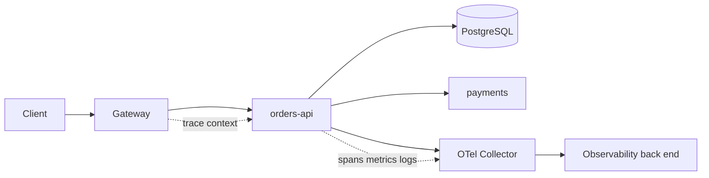
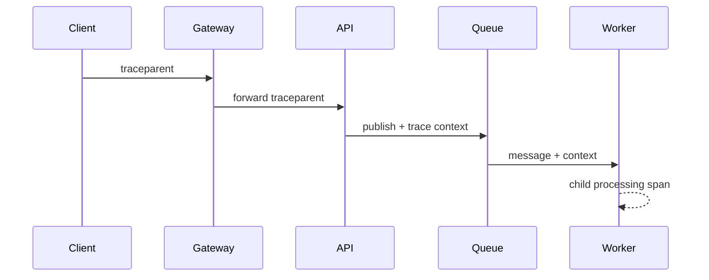

# OpenTelemetry and Cardinality

> **Scope:** This section owns practical OTel(OpenTelemetry) signal correlation, sampling, attribute budgets, and exporter operations. For service SLO(Service Level Objective) design and alert response, see [sre §4](../../sre-and-incidents/includes/04-observability-practice.md).

> **Related:** [§11 Observability](11-observability.md) · [§1 Measurement and SLOs](01-measurement-and-slo.md) · [resilience policy placement](../../resilience-patterns/includes/11-policy-placement.md)

---

## At a glance

| Decision | Default | Why |
|----------|---------|-----|
| Trace propagation | W3C `traceparent` at every ingress/egress | A trace survives gateways and language boundaries |
| Metric labels | Bounded dimensions only | A time series is created per label combination |
| Trace sampling | Baseline head sample plus error/slow tail retention | Cost stays predictable while incidents remain debuggable |
| Logs | Structured records with `trace_id` and `span_id` | One click connects a log line to its request |
| Export | Local collector/agent, then back end | Isolates applications from vendor credentials and outages |

**Rule of thumb:** Put identifiers useful for a single investigation on spans and logs; put only low-cardinality dimensions useful for fleet-wide aggregation on metrics.

---

## One request, three signals

Metrics tell operators that a class of work is failing, traces show the causal path of one request, and logs preserve the event details. All three need the same resource identity and request context.

| Signal | Attach | Do not attach |
|--------|--------|---------------|
| Metrics | `service.name`, route template, status class, region | user ID, order ID, raw URL, request ID |
| Traces | dependency name, selected tenant tier, error details | secrets, full request body, unbounded tags |
| Logs | trace/span IDs, stable entity IDs where authorized | tokens, passwords, card data, session cookies |

Set `service.name`, `service.version`, `deployment.environment`, and region as resource attributes once. Do not let each team invent variants such as `service`, `app`, and `application_name`; joins and dashboards become unreliable.

---

## Propagation and correlation

At ingress, continue an incoming trusted trace context or start a new trace. At every outbound HTTP(Hypertext Transfer Protocol), gRPC(Google Remote Procedure Call), queue publish, and worker consume boundary, inject or extract the context. Include `trace_id` and `span_id` in structured logs through the logging context rather than asking every call site to add them.

For async work, the producer span ends after durable publish; the consumer creates a new processing span linked to the producer context. A queue delay is not execution time, so record enqueue timestamp and measure age separately. Do not keep one trace open for hours across retries.

| Boundary | Required check |
|----------|----------------|
| Public ingress | Reject or restart untrusted trace context if it can influence quotas or security decisions |
| Gateway | Preserve headers while creating its own server/client spans |
| HTTP/gRPC client | Propagate deadline and trace context together |
| Broker | Carry context in headers/metadata; define an allowlist |
| Worker | Extract once, create attempt spans, log message and delivery IDs |

---

## Cardinality is a capacity budget

Metric cardinality is approximately the product of active values across labels. `route` (50) × `status` (6) × `region` (3) is manageable; adding `user_id` (1 million) creates an operational and financial incident.

| Attribute | Metrics | Traces/logs | Safer alternative |
|-----------|---------|-------------|-------------------|
| Route template | Yes | Yes | Normalize `/orders/{id}` |
| HTTP method/status class | Yes | Yes | Use `2xx`, not each error text |
| Tenant ID | Usually no | Conditional | Tenant tier or a sampled allowlist |
| User/order/request ID | No | Yes, with retention controls | Searchable log field |
| SQL(Structured Query Language) statement | Usually no | Sanitized trace only | Operation name or query fingerprint |
| Exception message | No | Log/trace event | Error type or stable code |

Define a per-service budget before instrumentation: maximum active metric series, maximum attribute length, allowed label keys, trace bytes per second, and log retention. Exporters should reject, truncate, or route violating telemetry with a visible counter; silently dropping it makes the next incident harder.

### Normalize before exporting

* Use route templates, not raw paths or query strings.
* Hash or bucket bounded values only when the bucket remains actionable.
* Map status codes to classes for common dashboards; retain exact code in trace/log data.
* Prefer an event such as `cache.miss` over a label containing a cache key.
* Review new dimensions alongside schema changes and load tests.

---

## Sampling that preserves investigations

Head sampling makes a decision at trace start and is cheap, but it cannot know that a downstream call will fail. Tail sampling at the collector can retain complete traces based on final duration, status, route, or error, at higher memory and buffering cost.

| Policy | Retain | Use for |
|--------|--------|---------|
| Baseline head sample | 1–10% of ordinary traffic | Trends and ordinary debugging |
| Error tail sample | All server errors and selected dependency failures | Incident evidence |
| Latency tail sample | Traces above a route-specific threshold | p99 regression analysis |
| Tenant/feature sample | Temporary bounded allowlist | Rollout or customer investigation |
| Rate-limited sample | Capped traces per service/route | Preventing noisy failures from flooding export |

Sampling must be consistent across services: a sampled parent should normally produce sampled children. Make the collector policy explicit, versioned, and tested with synthetic traces. Record sampling decisions and dropped-span counters as metrics.

Do not use a single global “slow” threshold. A 300 ms catalog read may be slow while a 20 s report is healthy. Derive thresholds from each route's latency objective and revisit them after release changes.

---

## Collector and exporter operations

Run an OTel Collector close to workloads as an agent/sidecar or a shared regional gateway. The local tier batches, retries, applies memory limits, removes forbidden attributes, and survives a back-end vendor change. The central tier performs tail sampling and sends data to one or more destinations.

| Component | Owns | Operational guardrail |
|-----------|------|-----------------------|
| SDK(Software Development Kit) | Context and semantic spans | Async, bounded batch processor; never block request completion |
| Local collector | Batching, basic filtering, retry | Memory limiter and bounded queue |
| Gateway collector | Tail sampling, enrichment, routing | Horizontal scale and drop accounting |
| Exporter | Back-end delivery | TLS(Transport Layer Security), retry cap, failure metric |

Treat telemetry as a lossy side channel. If an exporter is unavailable, drop under pressure rather than exhaust application memory, worker threads, or customer request budgets. Alert on sustained drop rate and queue saturation, but do not page simply because a low-priority debug exporter is temporarily unavailable.

---

## Instrument the useful boundaries

Automatic instrumentation gives a baseline, but it often misses domain semantics. Add spans around a small set of meaningful operations: idempotency lookup, cache get, authorization decision, durable enqueue, and external payment call. Name spans by operation, not by implementation detail that changes every release.

| Span or metric | Good name/attribute | Benefit |
|----------------|---------------------|---------|
| Server span | `GET /v1/orders/{id}` | Stable route latency |
| Database span | `orders.select_by_id` | Separates pool wait from query time |
| Queue metric | `messages_processed_total{queue="email"}` | Bounded worker throughput |
| Business event | `checkout.completed` | Connects technical latency to outcome |
| Dependency span | `payment.authorize` | Error budget by provider |

Run a pre-production trace through gateway, API(Application Programming Interface), broker, and worker. Verify parent-child relationships, resource attributes, no secrets, expected sampling, and that a log search by `trace_id` returns the relevant lines.

---

## Rollout checklist

1. Publish the required resource attributes and approved metric dimensions.
2. Instrument ingress, egress, database/cache clients, and asynchronous handoffs.
3. Set volume budgets and load-test collector queues under a back-end outage.
4. Create error, latency, and telemetry-drop sampling policies.
5. Build one dashboard and one trace-to-log drill-down before declaring the service observable.
6. Review dashboards after each major route, tenancy, or retry-policy change.

## Common mistakes

| Mistake | Fix |
|---------|-----|
| Put `user_id` or raw URL on a metric | Use a bounded tier/route label; keep the ID in trace/log data |
| Sample 1% then expect every failure trace | Tail-sample errors and slow traces |
| Let exporter retry without limits | Bound queues and drop telemetry before application work |
| Correlate only with a request ID | Propagate W3C context and inject trace/span IDs into logs |
| Treat queue delay as worker duration | Measure enqueue age and processing time separately |
| Add automatic instrumentation only | Add a few stable domain spans at critical decisions |