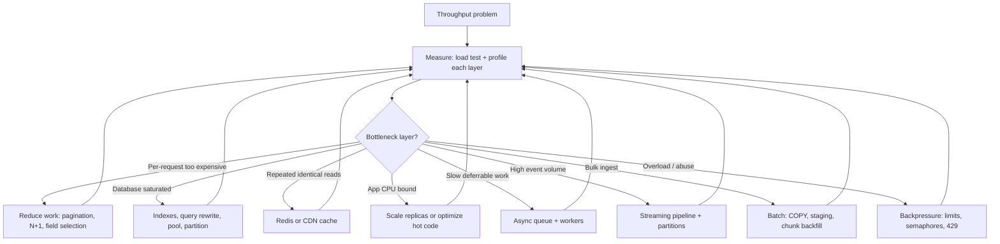

# Decision Guide, Checklist, and Common Mistakes

A practical capstone for choosing throughput strategies and avoiding common mistakes.

> **Scope:** **System-wide scenarios** (cache, scale, async, overload, edge). Database-layer scenarios only → [postgresql-performance §13](../../postgresql-performance/includes/13-decision-guide-and-common-mistakes.md).
>
> **Related:** Overview build order → [00-overview.md](00-overview.md) · PostgreSQL decisions → [postgresql-performance §13](../../postgresql-performance/includes/13-decision-guide-and-common-mistakes.md) · Rate limit stack → [api-rate-limiting §10](../../api-rate-limiting/includes/10-decision-guide.md)

---

## Master decision flow

---

## Scenario recommendations

System-wide scenarios (cache, scale, async, overload). Database-only tuning → [postgresql-performance §13](../../postgresql-performance/includes/13-decision-guide-and-common-mistakes.md).

| Layer | Scenario | Recommended approach |
|-------|----------|------------------------|
| **System** | Public read API(Application Programming Interface) at 10k RPS | Cache hot keys → horizontal app scale → read replica → [PG §13](../../postgresql-performance/includes/13-decision-guide-and-common-mistakes.md) for query tuning |
| **App** | Slow list endpoint | Cap page size, field selection, cursor pagination → [PG §13](../../postgresql-performance/includes/13-decision-guide-and-common-mistakes.md) for `EXPLAIN`/indexes |
| **App + queue** | Write spike on orders table | Short transactions → batch INSERT → queue non-critical side effects |
| **Database** | Hot row contention (inventory) | `FOR UPDATE SKIP LOCKED` → partition → [PG §12 bulk](../../postgresql-performance/includes/12-bulk-operations-and-concurrency.md) |
| **Database** | Time-series ingest at millions/day | [PG §10 partitioning](../../postgresql-performance/includes/10-partitioning.md) → BRIN(Block-Range Index)/B-tree → LSM(Log-Structured Merge) if PG exhausted |
| **App + async** | Export/report blocking API | Async job + polling/webhook → scale workers on queue depth |
| **Edge + app** | Login brute force | Gateway + IP limits → [PG §13](../../postgresql-performance/includes/13-decision-guide-and-common-mistakes.md) for short transactions + partial index |
| **Edge** | Partner API burst traffic | Token bucket at gateway → identity tiers → Redis counters |
| **System** | Global low-latency reads | CDN(Content Delivery Network) for cacheable GET → regional read replica → [PG §11](../../postgresql-performance/includes/11-read-scaling-and-caching.md) |
| **Stream** | Audit log at high volume | Event stream → partitioned topic → async projections |
| **Batch** | Nightly ETL(Extract, Transform, Load) | Staging + `COPY` → validate → merge → `ANALYZE` |
| **Async** | ML(Machine Learning) inference at scale | Job queue → GPU worker pool → result in object storage |
| **App** | GraphQL expensive queries | Cost-based limits + depth cap → cache persisted queries |
| **Cache** | Redis hot key saturation | Key sharding → local shadow cache → pre-warm on deploy |
| **Deploy** | Deploy during peak | Rolling or canary → never recreate on production API |

---

## Priority checklist

Use this order — skipping steps wastes effort and money:

- [ ] Define **SLOs** — target RPS, p99 latency, error rate, max replication lag
- [ ] **Load test** realistic paths (list, search, hot key, write burst) — not just `/health`
- [ ] Profile each layer — gateway, app, DB, cache, queue, external APIs
- [ ] **Reduce work per request** — pagination caps, field selection, eliminate N+1
- [ ] Fix **database hot path** — `pg_stat_statements`, indexes, query shape, PgBouncer
- [ ] Add **caching** for repeated hot reads — Redis, CDN, materialized views
- [ ] Confirm **stateless app tier** — no sticky sessions; shared rate-limit store
- [ ] **Scale app horizontally** — only after DB and cache are not the bottleneck
- [ ] Move **deferrable work async** — exports, emails, search indexing, webhooks
- [ ] **Scale reads** — replicas, partitioning — after primary optimization
- [ ] Add **streaming** for high-volume fan-out events
- [ ] **Protect under load** — layered rate limits, concurrency semaphores, circuit breakers
- [ ] **Operate** — autoscale on saturation signals; correlation IDs; deploy safely

---

## Common mistakes

| Mistake | Why it hurts | Fix |
|-------|--------------|-----|
| Scale replicas before fixing slow queries | Multiplies bad query cost | Measure and index on primary first |
| Load test health checks only | Misses real bottlenecks | Test list, search, write, hot-key paths |
| Unbounded concurrency | Memory exhaustion, DB connection storm | Thread pools, semaphores, pool limits |
| Sync call chains A→B→C→D | Latency stacks; one slow service blocks all | Parallelize, cache, or async |
| Per-instance rate limits | Inconsistent limits; 4× effective quota with 4 nodes | Shared Redis counters |
| No connection pooling | DB melts under connection storms | PgBouncer before raising `max_connections` |
| Giant transactions on backfill | Long locks, bloat, replication lag | Chunked batches with commits |
| Cache everything with no TTL(Time To Live) plan | Stale data bugs, memory blowup | TTL + invalidation strategy per endpoint |
| Scale on CPU alone | Misses queue backlog and pool wait | Scale on queue depth, p99, pool saturation |
| Fail-open rate limits on writes | Abuse during Redis outage | Fail closed on expensive routes |
| Sticky sessions "just in case" | Blocks elastic scale and safe deploys | Token-based auth + external state |
| Logging at INFO on hot path | I/O becomes the bottleneck | Structured logs at WARN+; sample debug |
| One Redis key for global counter | Hot key saturation | Sharded counters or local aggregation |
| Adding gateway hop without need | Extra latency on every request | Move policy to edge or app when simple |

---

## Quick decision summary

| Question | Default answer |
|----------|----------------|
| Where to start? | Measure + load test realistic paths |
| First scale move? | Reduce per-request cost, then DB, then cache |
| When to add replicas? | After query optimization and caching on primary |
| When to go async? | Work may exceed ~10–30s or is CPU/IO expensive |
| When to use streaming? | High-volume events, fan-out, audit log, metrics |
| When to batch? | Nightly ETL, large backfills, bulk imports |
| Where to rate limit? | Edge (abuse) → gateway (API key) → app (plan tier) |
| What to alert on? | Pool wait, queue depth, replication lag — not just CPU |
| Stateless app tier? | Yes — state in DB, Redis, queue, object storage |
| Broker vs queue? | [§14 Message brokers](14-message-brokers-and-queues.md) decision flow |
| Search at scale? | [§15 CDC and search](15-cdc-and-search-indexing.md) — not PG alone |

---

## See also

| Guide | Topics |
|-------|--------|
| [api-design-and-protection](../../api-design-and-protection/README.md) | Gateway, stateless architecture, async patterns, checklist |
| [api-rate-limiting](../../api-rate-limiting/README.md) | Algorithms, deployment layers, common mistakes |
| [postgresql-performance](../../postgresql-performance/README.md) | Measurement, indexing, replicas, bulk ops |
| [tree-and-index-structures](../../tree-and-index-structures/README.md) | B+ vs LSM storage engines |
| [deployment-strategies](../../deployment-strategies/README.md) | Rolling, canary, blue/green |
| [event-sourcing-and-cqrs](../../event-sourcing-and-cqrs/README.md) | Event log, outbox, projections |