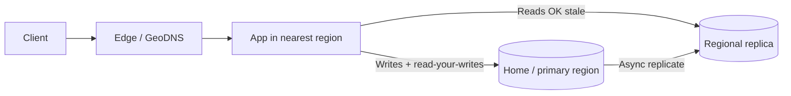
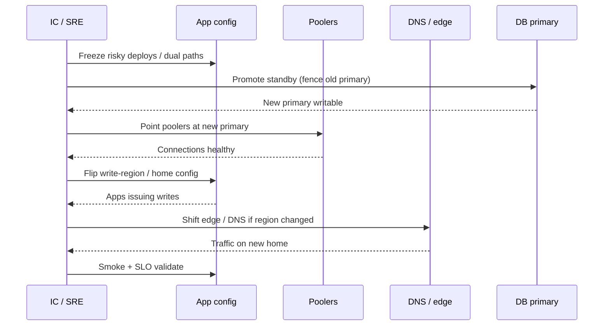

# Multi-Region Write and Failover

Write-path decisions when reads are already regional. Own sticky primary, cell-pinned writes, and the promote sequence — not read-routing algorithms.

> **Scope:** Where writes go, when cells beat multi-master, and how to fail over the write path (app config, poolers, DNS(Domain Name System)). Multi-region **reads** → [§13](13-multi-region-read-routing.md). Orchestrated DR swimlane / RACI → [sre §12A](../../sre-and-incidents/includes/12A-disaster-recovery-playbook.md). Consistency costs → [postgresql-performance §14](../../postgresql-performance/includes/14-consistency-promises-and-costs.md).
>
> **Related:** Read routing → [§13](13-multi-region-read-routing.md) · Cells / residency → [architecture §10A](../../architecture-decisions/includes/10A-regional-cells-and-residency.md) · Kafka active-active / MM2(MirrorMaker 2) → [apache-kafka §10](../../apache-kafka/includes/10-operations-dr-security-and-observability.md) · PG consistency → [postgresql-performance §14](../../postgresql-performance/includes/14-consistency-promises-and-costs.md) · DR playbook → [sre §12A](../../sre-and-incidents/includes/12A-disaster-recovery-playbook.md) · DR spine → [VISUAL-INDEX — DR / failover](../../VISUAL-INDEX.md#dr--failover)

---

## At a glance

| Pattern | Writes | Reads | When to use | When not to |
|---------|--------|-------|-------------|-------------|
| **One write region + regional reads** | Single primary region | Local replicas / CDN(Content Delivery Network) | Default for most products | Strict per-tenant residency across many geos without cells |
| **Cells with pinned primary** | Home cell / home region only | Local to cell | Residency, blast radius, huge tenants | You need a single global mutable row |
| **True active-active (multi-master)** | Multiple write regions | Local | Almost never for OLTP(Online Transaction Processing) without a conflict product | Conflict model unclear; money / identity paths |
| **Spanner / Cockroach-style** | Globally consistent DB product | Local or global | Strong consistency + multi-region is a hard requirement | Team not ready for that ops model / cost |

**Rule of thumb:** Default to **one write region** (or one home cell). Add multi-master only with an explicit conflict model you can operate under SEV1.

---

## Decision table

| Question | Prefer |
|----------|--------|
| Need lower read latency worldwide? | One write region + [§13](13-multi-region-read-routing.md) regional reads |
| Need data residency / sovereignty? | [Cells with pinned primary](../../architecture-decisions/includes/10A-regional-cells-and-residency.md) |
| Need multi-region writes without conflict product? | **Don't** — stay single-writer or buy Spanner/Cockroach-class |
| Kafka already active-active? | Still one **logical** write owner per aggregate; MM2 is not a free multi-master DB |
| Failover RTO(Recovery Time Objective) minutes? | Hot standby + drilled promote — [sre §12A](../../sre-and-incidents/includes/12A-disaster-recovery-playbook.md) |

---

## Sticky primary / home-region write path

| Request | Route |
|---------|-------|
| **Write / mutate** | Home region or home cell primary |
| **Read-your-writes** | Sticky to primary (or session affinity) until lag OK |
| **Stale-OK read** | Regional replica — [§13](13-multi-region-read-routing.md) |
| **Cross-cell request** | Reject or proxy to home cell — [architecture §10A](../../architecture-decisions/includes/10A-regional-cells-and-residency.md) |

Document per-endpoint consistency in the API(Application Programming Interface) contract — [api-design §1](../../api-design-and-protection/includes/01-api-design.md).

---

## Failover promote sequence

Full org swimlane (comms, Kafka catch-up, RACI) → [sre §12A](../../sre-and-incidents/includes/12A-disaster-recovery-playbook.md). Secrets and rotation during promote → [database-connection §12](../../database-connection-and-security/includes/12-credential-rotation-and-dr.md).

| Step | Owner | Gate |
|------|-------|------|
| Fence old primary | DBA | No split-brain |
| Promote / restore | DBA | Lag ≤ RPO(Recovery Point Objective) or PITR(Point-in-Time Recovery) target |
| Pooler reconnect | Platform / app | New connections succeed; old drained |
| App write config | App owners | Feature flags / config point at new home |
| DNS / edge | Platform | Health checks green |
| Validate | App + SRE(Site Reliability Engineering) | User-facing SLO(Service Level Objective) hold |

---

## Conflict and dual-write anti-patterns

| Anti-pattern | Why it hurts | Prefer |
|--------------|--------------|--------|
| **Dual-write two region primaries** | Lost updates; no single SoR | One primary; replicate out |
| **App dual-writes DB + Kafka** | Partial failure; diverge | Outbox / CDC(Change Data Capture) — [event-sourcing §5A](../../event-sourcing-and-cqrs/includes/05A-outbox-and-inbox.md) |
| **“Last write wins” without product rules** | Silent money / identity corruption | Explicit merge or reject conflicts |
| **Active-active Kafka + multi-master DB** | Two conflict domains | Active-active bus only if DB remains single-writer per key |
| **Fail over without fencing** | Split-brain writes | Fence → promote → heal |

---

## When cells beat multi-master

| Driver | Cell-pinned write wins |
|--------|------------------------|
| **Residency / sovereignty** | Data must not become writable in another geo |
| **Blast radius** | Outage limited to one cell — [architecture §10A](../../architecture-decisions/includes/10A-regional-cells-and-residency.md) |
| **Huge / noisy tenant** | Dedicated home cell without global lock contention |
| **Ops clarity** | One promote target per cell; no global conflict resolver |

True multi-master across regions is usually **incompatible** with strict residency and with simple RPO accounting. Prefer cells + regional reads ([§13](13-multi-region-read-routing.md)) over inventing CRDTs for checkout.

---

## Common mistakes

| Mistake | Fix |
|---------|-----|
| Designing multi-region reads before the write home is named | Name home region/cell first — then [§13](13-multi-region-read-routing.md) |
| Routing read-your-writes to a lagging replica | Sticky primary until lag acceptable |
| DNS flip before poolers/apps point at new primary | Order: promote → poolers → app config → DNS |
| Treating MM2 as database multi-master | Kafka topology ≠ OLTP conflict model — [apache-kafka §10](../../apache-kafka/includes/10-operations-dr-security-and-observability.md) |
| Choosing Spanner/Cockroach without ops buy-in | Global DB is a product commitment, not a checkbox |
| No drilled promote | Quarterly failover — [sre §9](../../sre-and-incidents/includes/09-game-days-and-drills.md) · [sre §12A](../../sre-and-incidents/includes/12A-disaster-recovery-playbook.md) |

---

## See also

| Guide / section | Use when |
|-----------------|----------|
| [§13 Multi-region read routing](13-multi-region-read-routing.md) | GeoDNS, replicas, stale-OK reads |
| [architecture §10A Regional cells](../../architecture-decisions/includes/10A-regional-cells-and-residency.md) | Home cell, residency pins |
| [postgresql-performance §14 Consistency](../../postgresql-performance/includes/14-consistency-promises-and-costs.md) | What lag and isolation cost |
| [sre §12A Disaster recovery playbook](../../sre-and-incidents/includes/12A-disaster-recovery-playbook.md) | Org swimlane, RACI, checklists |
| [apache-kafka §10 Ops / DR](../../apache-kafka/includes/10-operations-dr-security-and-observability.md) | Bus catch-up and MM2 topologies |
| [VISUAL-INDEX DR spine](../../VISUAL-INDEX.md#dr--failover) | Cross-guide failover picture |