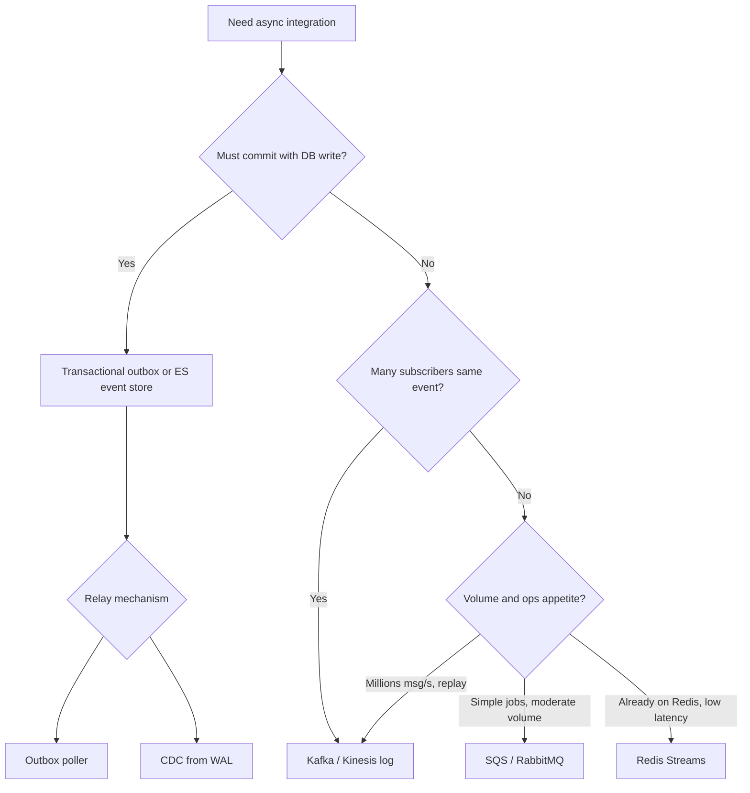

# Message Brokers and Queues

Pick the integration pattern before you pick the product — task queue, log, or outbox relay each solve different throughput problems.

> **Related:** Async workers → [06-async-queues-workers.md](06-async-queues-workers.md) · Streaming → [07-streaming-pipelines.md](07-streaming-pipelines.md) · Outbox → [ES §5 Async integration](../../event-sourcing-and-cqrs/includes/05-async-integration.md) · Async jobs → [api-design §10](../../api-design-and-protection/includes/10-async-patterns.md)

---

## At a glance

| Pattern | Best for | Ordering | Replay | Typical products |
|---------|----------|----------|--------|------------------|
| **Task queue** | Job dispatch, retries, DLQ(Dead Letter Queue) | Per queue (optional FIFO(First In, First Out)) | Limited | SQS, RabbitMQ |
| **Log / stream** | Fan-out, audit, high volume | Per partition key | Yes (retention window) | Kafka, Kinesis, Pulsar |
| **Redis Streams / lists** | Low-latency co-located work | Per stream | Trimmed history | Redis |
| **Transactional outbox** | Reliable publish after DB write | Relay preserves order per aggregate | From event store | App + any bus |
| **CDC(Change Data Capture)** | DB change capture without app dual-write | Table/partition | From retention | Debezium → Kafka |

**Rule of thumb:** **Queue** when work is a job with a consumer. **Stream** when many subscribers need the same history. **Outbox** when the write and the message must not diverge.

---

## Decision flow

Full outbox patterns → [ES §5](../../event-sourcing-and-cqrs/includes/05-async-integration.md). CDC to search → [15-cdc-and-search-indexing.md](15-cdc-and-search-indexing.md).

---

## Queue vs stream (when both seem to work)

| Need | Queue (SQS, RabbitMQ) | Stream (Kafka, Kinesis) |
|------|-------------------------|-------------------------|
| **Job with result** (`POST 202` + poll) | ✅ Natural fit | Awkward |
| **Fan-out to 5+ consumers** | Duplicate publishes or bridge | ✅ Native |
| **Replay last 7 days** | ❌ unless you store elsewhere | ✅ Retention |
| **Strict global ordering** | Single consumer or FIFO shard | Partition key design |
| **Ops complexity** | Lower | Higher (brokers, partitions, lag) |
| **Throughput ceiling** | High with sharding | Very high |

See [06-async-queues-workers.md — Queue vs stream](06-async-queues-workers.md#queue-vs-stream--when-to-pick-which) for worker scaling notes.

---

## Product signals

| Situation | Lean toward |
|-----------|-------------|
| AWS-native, few consumers, at-least-once OK | **SQS** (+ DLQ) |
| Complex routing, priority, delayed messages | **RabbitMQ** |
| Event bus, audit log, metrics pipeline | **Kafka** |
| AWS managed stream, fewer ops than Kafka | **Kinesis** |
| Cache + queue already on Redis | **Redis Streams** (know memory limits) |
| PostgreSQL write + bus without 2PC(Two-Phase Commit) | **Outbox** or **CDC** |

---

## Ordering and idempotency

| Broker | Ordering guarantee | Your responsibility |
|--------|------------------|-------------------|
| SQS standard | Best-effort | Idempotent consumers |
| SQS FIFO | Per message group | Design `message_group_id` |
| Kafka | Per partition | Key = `aggregate_id` or `saga_id` |
| RabbitMQ | Per queue if single consumer | Idempotency + DLQ |

Cross-service sagas → partition by `saga_id` — .

---

## Common mistakes

| Mistake | Fix |
|---------|-----|
| Kafka for simple background emails | SQS/RabbitMQ |
| Dual-write DB + publish without outbox | Outbox or CDC |
| No DLQ | Failed messages retry forever or vanish |
| Hot partition key | Shard keys (e.g. ) |
| Infinite retention on Kafka | Tiered retention + compaction policy |

---

## Pros and cons

### Managed queue (SQS)

**Pros:** Low ops, integrates with AWS, DLQ built-in.

**Cons:** No native fan-out replay; cross-cloud portability lower.

### Kafka

**Pros:** Replay, fan-out, ecosystem (Connect, Streams).

**Cons:** Operational surface; partition and consumer lag tuning.
