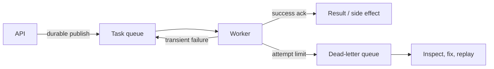
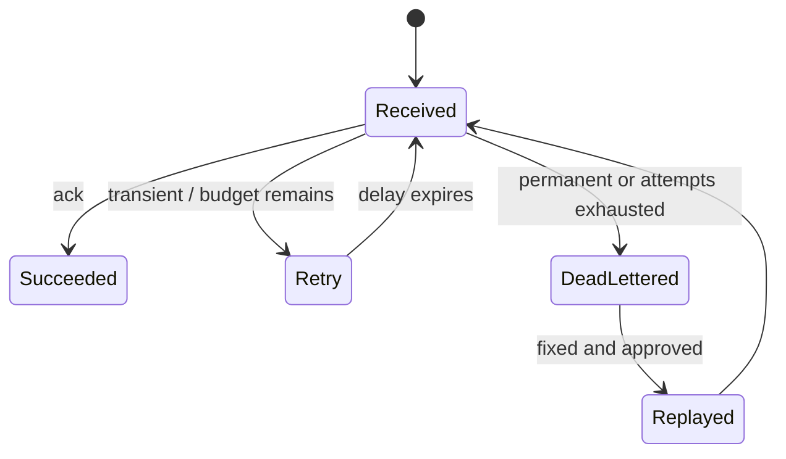

# Queue Broker Operations (SQS, RabbitMQ, NATS)

> **Scope:** This section covers task-queue operations, redelivery, poison messages, and dead-letter handling for SQS(Simple Queue Service), RabbitMQ, and NATS. For ordered replayable event streams, use [apache-kafka](../../apache-kafka/README.md).

> **Related:** [§14 Message brokers and queues](14-message-brokers-and-queues.md) · [API async patterns](../../api-design-and-protection/includes/10-async-patterns.md) · [Kafka consumers](../../apache-kafka/includes/04-consumers-and-consumer-groups.md) · [Kafka ops/DR](../../apache-kafka/includes/10-operations-dr-security-and-observability.md)

---

## At a glance

| Need | Best fit | Operational focus |
|------|----------|-------------------|
| Managed deferred task | SQS | Visibility timeout, DLQ(Dead Letter Queue), idempotent worker |
| Rich routing and per-queue controls | RabbitMQ | Acknowledgements, prefetch, disk/memory alarms |
| Low-latency request/reply or work queue | NATS / JetStream | Consumer state, retention, acknowledgements |
| Ordered durable event log | Kafka | Partition ownership and consumer lag |

**Rule of thumb:** A queue makes work durable and asynchronous; it does not make the worker idempotent or turn repeated delivery into exactly-once processing.

---

## The task lifecycle

The producer commits business state and the enqueue intent atomically through an outbox when loss matters. The worker claims a message, performs an idempotent operation, and acknowledges only after the required side effect is durable. Any crash between effect and acknowledgement produces a duplicate delivery.

| Phase | Required invariant |
|-------|--------------------|
| Publish | Message ID, schema version, and business id are durable |
| Receive | Lease/visibility exceeds normal work time but is not infinite |
| Process | Idempotency key protects the side effect |
| Ack | Only after durable success |
| Retry | Attempt metadata and next eligible time are observable |
| DLQ | Original payload, failure reason, and replay policy are retained |

---

## Delivery semantics in practice

At-least-once delivery is the normal model. A broker can redeliver after consumer crash, acknowledgement loss, lease expiration, or topology failover. “Exactly once” claims commonly mean deduplicated effects within a bounded subsystem, not one globally atomic action.

| Broker behavior | What operators must set |
|-----------------|-------------------------|
| SQS visibility timeout | Extend for legitimate long work; alert on lease expirations |
| RabbitMQ manual ack | Ack after effect; limit unacked messages with prefetch |
| NATS JetStream ack wait | Tune redelivery cadence and `max_deliver` |
| Any broker | Idempotency store keyed by message/business operation |

Do not make visibility timeouts huge to hide slow workers. It delays recovery after a crash and makes backlog diagnosis ambiguous. Break long work into checkpoints or move it to a job model with explicit progress.

---

## Retry taxonomy

| Failure class | Examples | Response |
|---------------|----------|----------|
| Transient | dependency timeout, 503, short lock conflict | Exponential delay with jitter |
| Capacity | local pool exhausted, downstream 429 | Slow consumers/admit less work; do not spin |
| Permanent | invalid schema, missing required entity | DLQ quickly with actionable reason |
| Poison | deterministic crash, malformed payload | Quarantine; stop replay loop |
| Unknown | timeout without outcome | Reconcile idempotency state before retry |

Use broker-native delayed delivery when available; otherwise use a delay queue/scheduler, not a worker sleeping while holding a message. Make retry attempt and failure class fields explicit—do not infer them only from broker receive count.

---

## DLQ operations

A DLQ is an operational queue, not archival storage or an automatic replay button. Grant it an owner, alert on age and growth, and define who may inspect payloads containing PII(Personally Identifiable Information).

| DLQ question | Good answer |
|--------------|-------------|
| When does a message enter? | Permanent validation error or bounded attempts |
| Who triages? | Named service/team rotation |
| What is retained? | Payload reference, headers, error code, first/last failure timestamps |
| How is replay done? | Validated tool that changes destination/attempt metadata |
| What proves a fix? | Reprocess a bounded sample in a non-production environment |

Never replay the entire DLQ directly into production after a code deploy. Filter by error cause and schema version, rate-limit reintroduction, and monitor duplicates and downstream saturation. Preserve the original message ID so idempotency remains effective.

---

## Broker-specific operational shape

| Topic | SQS | RabbitMQ | NATS JetStream |
|-------|-----|----------|----------------|
| Scaling | Managed pollers and queue metrics | Cluster nodes, connections, queue leaders | Servers, stream replicas, consumer state |
| Flow control | Long polling, in-flight limit | Prefetch, publisher confirms | Pull consumer batch/expiry limits |
| Durability | Queue retention and DLQ policy | Durable queues, disk alarms | Stream retention and replicas |
| Routing | Queue per purpose | Exchanges/bindings | Subjects and stream filters |
| Failure signal | Oldest age, receives, DLQ count | Ready/unacked, memory/disk alarms | Pending, redeliveries, ack pending |

RabbitMQ needs explicit disk and memory watermark runbooks; a broker under alarm may block publishers. NATS requires a retention policy that matches replay needs, not just available disk. SQS removes cluster operations but still requires API(Application Programming Interface) quota, policy, encryption, and cross-account ownership review.

---

## Backpressure and capacity

Track enqueue rate, completion rate, oldest message age, in-flight work, retries, and DLQ growth. Depth alone is misleading when message durations vary.

| Signal | Meaning | First action |
|--------|---------|--------------|
| Oldest age rising | Customer work is late | Check worker errors and completion rate |
| In-flight maxed | Concurrency limit reached | Find slow dependency; tune only after evidence |
| Redeliveries rising | Lease/ack or worker stability problem | Compare work duration to lease |
| DLQ spike | New deterministic failure | Pause deploy/replay; classify samples |
| Publish failures | Broker or producer path unavailable | Apply admission control and preserve outbox |

Autoscale on age plus observed throughput, with a cap that protects databases and downstream providers. Adding workers without a downstream concurrency budget commonly turns a queue backlog into a cascading outage.

---

## Message contract and security

Messages need a versioned envelope: stable message ID, event/task type, schema version, created time, correlation ID, attempt metadata, and payload or protected payload reference. Validate at producer and consumer boundaries; a trusted broker is not a substitute for input validation.

Encrypt in transit and at rest, constrain producer and consumer permissions per queue/subject, and keep secrets out of payloads. If payloads are large, store them in object storage and queue a checked, time-limited reference; define cleanup when a task expires.

## Common mistakes

| Mistake | Fix |
|---------|-----|
| Acknowledge before the side effect commits | Commit effect/idempotency record first |
| Retry every exception instantly | Classify errors; delay transient work with jitter |
| Treat DLQ as a backup queue | Triage, fix, filter, and controlled replay |
| Autoscale consumers without downstream limits | Couple worker concurrency to dependency budgets |
| Use queue depth as the only alert | Alert on oldest age, completion rate, retries, and DLQ growth |
| Put unbounded payloads and secrets in messages | Use protected references and schema validation |