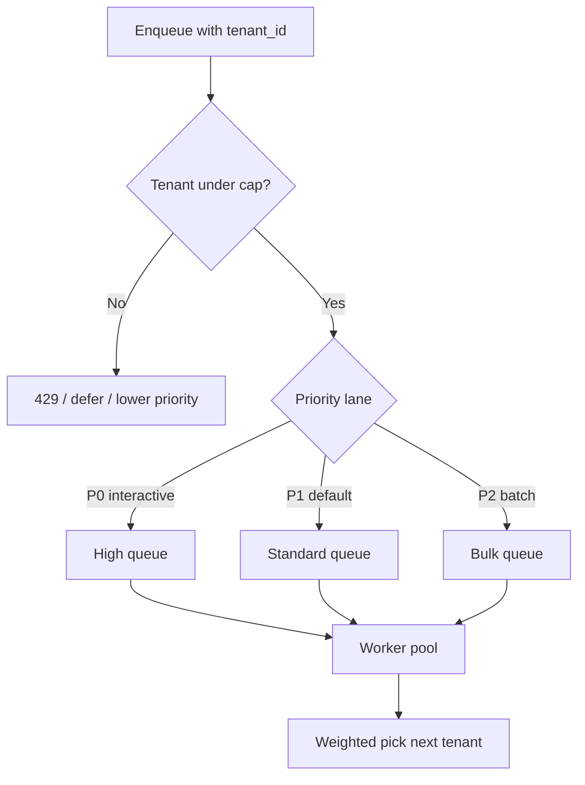

# Queue Fairness and Priority

Shared queues let one **noisy tenant** starve everyone else. Fairness is **per-tenant caps, weighted dispatch, and priority lanes** — aligned with API(Application Programming Interface) rate limits, not a separate policy.

> **Scope:** Task-queue fairness for multi-tenant SaaS(Software as a Service) — tenant-weighted dispatch, priority queues, and backpressure. Broker mechanics → [§14](14-message-brokers-and-queues.md) · [§14A](14A-queue-broker-operations.md). Rate-limit identity → [api-rate-limiting §6](../../api-rate-limiting/includes/06-scope-identity.md). Tenant isolation model → [api-design §16](../../api-design-and-protection/includes/16-multi-tenant-apis.md) · [architecture §10](../../architecture-decisions/includes/10-multi-tenant-system-models.md).
>
> **Related:** Backpressure → [§9](09-backpressure-and-limits.md) · Async workers → [§6](06-async-queues-workers.md) · Kafka partition fairness → [apache-kafka §2](../../apache-kafka/includes/02-topics-partitions-and-replication.md)

---

## At a glance

| Mechanism | Effect |
|-----------|--------|
| **Per-tenant queue** | Hard isolation; ops overhead scales with tenants |
| **Shared queue + tenant cap** | One tenant cannot exceed N in-flight / N per minute |
| **Weighted fair queue (WFQ)** | Large tenants get more share, not unbounded dominance |
| **Priority lanes** | Interactive vs batch; premium vs free tier |
| **Admission control at enqueue** | Reject early with 429/503 before DLQ(Dead Letter Queue) flood |

**Rule of thumb:** Derive `tenant_id` from the **auth token**, prefix queue keys and metrics — same rule as [api-design §16](../../api-design-and-protection/includes/16-multi-tenant-apis.md). Never trust tenant from the message body alone.

---

## Fair dispatch model

| Signal | Action |
|--------|--------|
| Tenant at enqueue cap | 429 to API; or spill to deferred queue |
| Tenant depth >> p95 | Throttle that tenant's dequeue weight |
| Global saturation | Shed P2 first — [§9](09-backpressure-and-limits.md) |

---

## Align with rate limiting

| Layer | Fairness lever | Link |
|-------|----------------|------|
| **Edge / gateway** | Per-tenant QPS — stops abuse before enqueue | [api-rate-limiting §6](../../api-rate-limiting/includes/06-scope-identity.md) |
| **Enqueue API** | Per-tenant pending cap | [api-design §5 tiers](../../api-design-and-protection/includes/05-rate-limit-tiers.md) |
| **Worker dispatch** | WFQ across tenants sharing a pool | This section |
| **Broker partition** | Hot partition key = hot tenant | [§14](14-message-brokers-and-queues.md) |

Display the **same tier limits** in the developer portal and enforce them at gateway + queue — mismatched caps erode trust.

---

## Priority without starvation

| Pattern | Use | Risk |
|---------|-----|------|
| **Strict priority queues** | Ops jobs beat batch | P2 never runs if P0 always full |
| **Weighted round-robin** | Enterprise vs starter share | Needs tuning |
| **Aging / priority boost** | Old P2 jobs eventually run | More scheduler logic |
| **Separate worker pools** | Bulk cannot steal interactive CPU | Higher cost |

**Rule of thumb:** Use **separate pools** for interactive vs batch when SLO(Service Level Objective)s differ by an order of magnitude; use **WFQ(Weighted Fair Queuing)** on one pool when tiers differ modestly.

---

## Metrics and alerts

| Metric | Why |
|--------|-----|
| `queue_depth{tenant}` | Noisy neighbor detection |
| `enqueue_rejected{tenant, reason}` | Fairness policy firing |
| `time_in_queue_p99{priority}` | SLA(Service Level Agreement) per lane |
| `dlq_rate{tenant}` | Poison or bad payloads per tenant |

Dashboard top-N tenants by depth — correlate with [api-rate-limiting](../../api-rate-limiting/README.md) 429 rates.

---

## Common mistakes

| Mistake | Why it hurts | Fix |
|---------|--------------|-----|
| One FIFO(First In, First Out) for all tenants | Whale tenant blocks everyone | WFQ or per-tenant caps |
| Priority without aging | Batch never drains | Boost age or separate pools |
| Fairness only at worker | Flood still hits broker | Admission at enqueue |
| Tenant ID from payload | Spoofing + wrong fairness | Token-derived tenant |
| Same cap for free and enterprise | Wrong economics | Tier-aligned limits — [§5 tiers](../../api-design-and-protection/includes/05-rate-limit-tiers.md) |

---

## Pros and cons

| Approach | Pros | Cons |
|----------|------|------|
| **Per-tenant queue** | Strong isolation | Many queues to operate |
| **WFQ on shared pool** | Efficient capacity use | Tuning complexity |
| **Priority only** | Simple | Starvation without aging |
