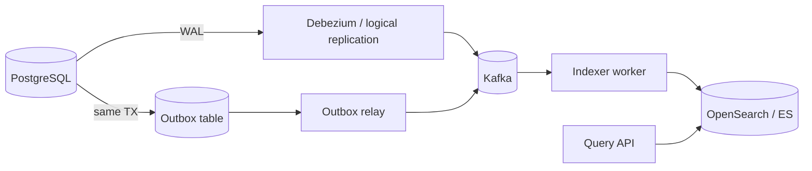

# CDC(Change Data Capture) and Search Indexing

Full-text and faceted search at scale usually lives outside PostgreSQL — sync via CDC or outbox, and plan for reindex and staleness.

> **Related:** DB throughput lens → [05-database-throughput.md](05-database-throughput.md) · Outbox → [ES §5](../../event-sourcing-and-cqrs/includes/05-async-integration.md) · Brokers → [14-message-brokers-and-queues.md](14-message-brokers-and-queues.md) · PG GIN(Generalized Inverted Index) limits → [postgresql-performance §2](../../postgresql-performance/includes/02-indexing.md)

---

## At a glance

| Approach | How it works | When to use |
|----------|--------------|-------------|
| **PostgreSQL GIN(Generalized Inverted Index) / tsvector** | Index inside PG | Moderate corpus, simple search |
| **Outbox → indexer** | App publishes change events | You control event shape |
| **CDC (Debezium)** | WAL(Write-Ahead Log) → Kafka → consumer | Near-real-time without app change |
| **Batch ETL(Extract, Transform, Load)** | Nightly  / snapshot | Analytics search, low freshness OK |

**Rule of thumb:** Billions of documents or heavy facets → **OpenSearch / Elasticsearch**. Sync with **CDC or outbox** — not synchronous double-write from the request path.

---

## Pipeline pattern

| Path | Pros | Cons |
|------|------|------|
| **CDC** | No app code for every table change | Schema migrations affect connectors |
| **Outbox** | Explicit domain events | App must write outbox row |

---

## Consistency and UX

| User expectation | Pattern |
|------------------|---------|
| Search lags writes by seconds | CDC/outbox + async index — document in API(Application Programming Interface) |
| Read-your-writes on search | Route recent user's queries to PG fallback or primary index refresh |
| Reindex after mapping change | Blue/green index alias swap —  |

See  for staleness promises.

---

## Reindex runbook

| Step | Action |
|------|--------|
| 1 | Create new index with updated mapping |
| 2 | Backfill from PG snapshot or replay Kafka topic |
| 3 | Verify document counts and sample queries |
| 4 | Alias swap ( → ) |
| 5 | Delete old index after retention window |

Pair with  when search fields depend on DB schema.

---

## Common mistakes

| Mistake | Fix |
|---------|-----|
| `SELECT` + index on every write in request path | Async pipeline |
| CDC without monitoring lag | Alert on consumer lag |
| Full reindex in place without alias | Blue/green index |
| Same index for analytics and user search | Separate read models |

---

## Pros and cons

### CDC + OpenSearch

**Pros:** Scales search independently; rich query features.

**Cons:** Dual system ops; eventual consistency; reindex discipline.
