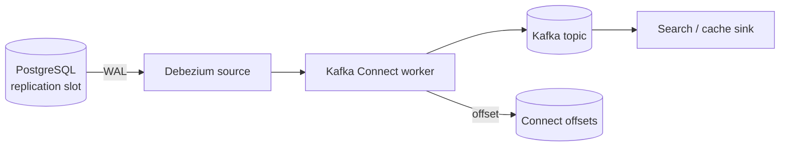

# CDC Connector Operations

Debezium and Kafka Connect turn PostgreSQL WAL(Write-Ahead Log) into streams — day-2 work is **slots, lag, snapshots, restarts, and schema drift**, not wiring the first connector.

> **Scope:** Operational runbook for CDC(Change Data Capture) connectors (Debezium on PostgreSQL). Pipeline design and sync patterns → [§15](15-cdc-and-search-indexing.md). Kafka Connect framework → [apache-kafka §7](../../apache-kafka/includes/07-connect-streams-and-ecosystem.md). Search index consumer ops → [data-platforms §2A](../../data-platforms/includes/02A-search-cluster-operations.md).
>
> **Related:** Connect failures → [apache-kafka §13](../../apache-kafka/includes/13-failure-modes-troubleshooting-and-recovery.md) · Integration patterns → [apache-kafka §8](../../apache-kafka/includes/08-integration-patterns.md) · DB throughput → [§5](05-database-throughput.md) · Outbox alternative → [ES §5](../../event-sourcing-and-cqrs/includes/05-async-integration.md)

---

## At a glance

| Metric | Healthy | Investigate |
|--------|---------|-------------|
| **Replication slot lag** | Stable bytes; near real-time | Monotonic growth > 15 min |
| **Connect task state** | RUNNING | FAILED / RESTARTING loop |
| **Consumer lag** | Low vs produce rate | Unbounded on sink topic |
| **Snapshot duration** | Bounded; documented | Blocks slot; bloat on PG |

**Rule of thumb:** **Monitor the slot on PostgreSQL**, not only Kafka lag. A stalled connector still holds WAL and can fill disk on the database.

---

## Architecture (ops view)

| Component | Ops owner |
|-----------|-----------|
| **Slot + publication** | DBA + platform |
| **Connect cluster** | Streaming platform |
| **SMT(Single Message Transform) / routing** | App team with review |
| **Downstream indexer** | Search / app consumer |

Design context → [§15](15-cdc-and-search-indexing.md).

---

## Replication slots

| Practice | Why |
|----------|-----|
| **One slot per connector** | Avoid duplicate consumption |
| **Name in runbook** | `debezium_{env}_{table_set}` |
| **Alert on lag bytes + age** | Early warning before disk pressure |
| **Never orphan slots** | Dropped connector without `pg_drop_replication_slot` kills PG |
| **`max_slot_wal_keep_size`** | Cap retained WAL with monitoring |

On failover, recreate slot or use managed HA(High Availability) procedure documented with [PG §16](../../postgresql-performance/includes/16-backup-restore-and-pitr.md).

---

## Snapshots and initial load

| Mode | Use |
|------|-----|
| **Initial snapshot** | New connector / new table |
| **Incremental snapshot** | Add table without full rebalance — Debezium signal table |
| **Never snapshot peak** | Schedule off-peak; throttle rows |

Snapshot holds slot; coordinate with [§5](05-database-throughput.md). For huge tables, prefer **outbox** or **batch backfill + CDC tail** — [§15](15-cdc-and-search-indexing.md).

---

## Fail, restart, and schema changes

| Event | Action |
|-------|--------|
| **Task FAILED** | Check stack trace; fix; restart task — [kafka §13](../../apache-kafka/includes/13-failure-modes-troubleshooting-and-recovery.md) |
| **Poison message** | DLQ(Dead Letter Queue) + skip with audit |
| **Column add (nullable)** | Usually safe; verify SMT |
| **Column rename / type change** | Plan expand-contract — [data-platforms §6](../../data-platforms/includes/06-migration-coordination.md) |
| **Connector upgrade** | Rolling worker upgrade; test in staging |

After long outage, expect **catch-up lag**; scale sink consumers — [data-platforms §2A](../../data-platforms/includes/02A-search-cluster-operations.md).

---

## Operational checklist

- [ ] Slot lag dashboard on PG + Connect offset lag
- [ ] Runbook: failed task, orphaned slot, disk full on PG
- [ ] Schema migration checklist includes connector team
- [ ] Staging connector mirrors prod table filter
- [ ] Reindex path if sink diverged — [data-platforms §2](../../data-platforms/includes/02-search-systems.md)

---

## Common mistakes

| Mistake | Fix |
|---------|-----|
| Dropping connector, keeping slot | Drop slot in same change |
| Snapshot during business peak | Schedule + throttle |
| No alert on PG disk | Slot lag → WAL retention |
| Schema change without consumer test | Contract tests — [data-platforms §5B](../../data-platforms/includes/05B-data-quality-and-pipeline-testing.md) |
| Multiple connectors one slot | One slot per pipeline |
| Restart without fixing root cause | FLapping tasks mask data loss |

---

## Pros and cons

| Ops model | Pros | Cons |
|-----------|------|------|
| **Managed Connect (MSK/etc.)** | Less worker patching | Still own slot hygiene |
| **Self-hosted Connect** | Full control | Worker + plugin lifecycle |
| **Outbox instead of CDC** | App-controlled events | App code per change — [ES §5](../../event-sourcing-and-cqrs/includes/05-async-integration.md) |
