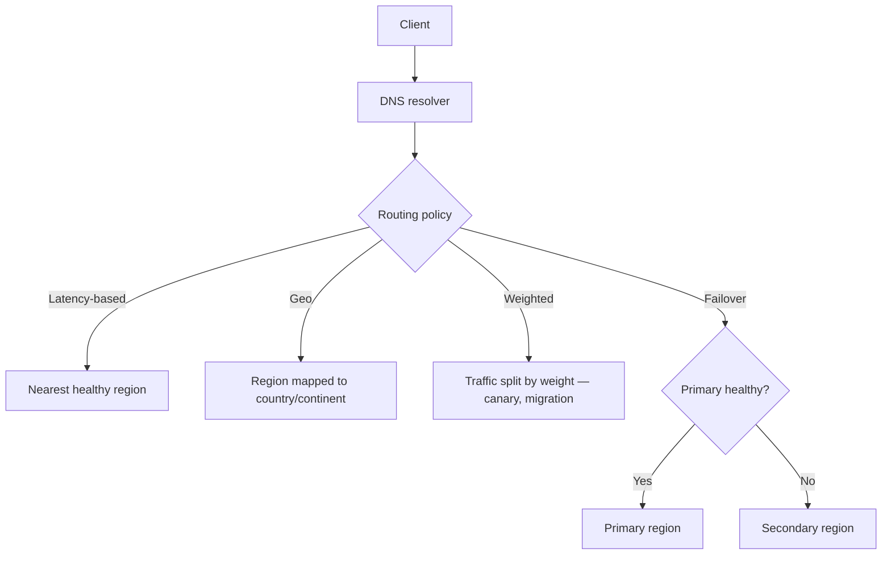
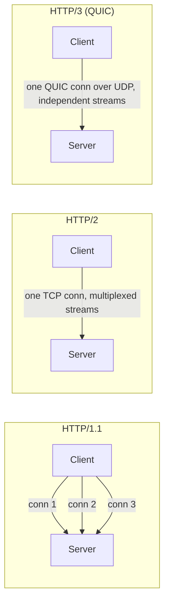
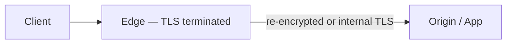
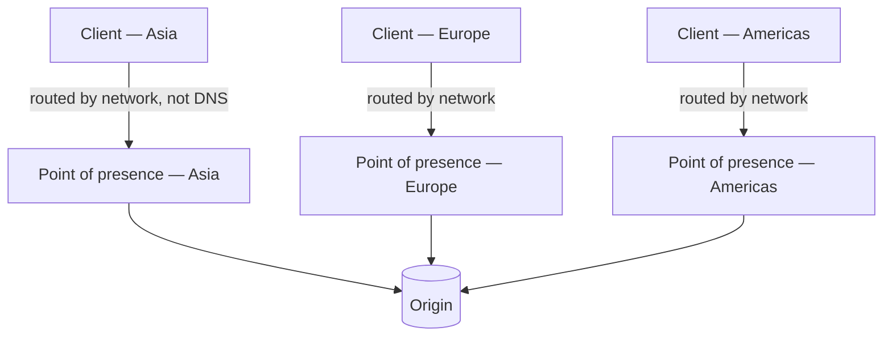
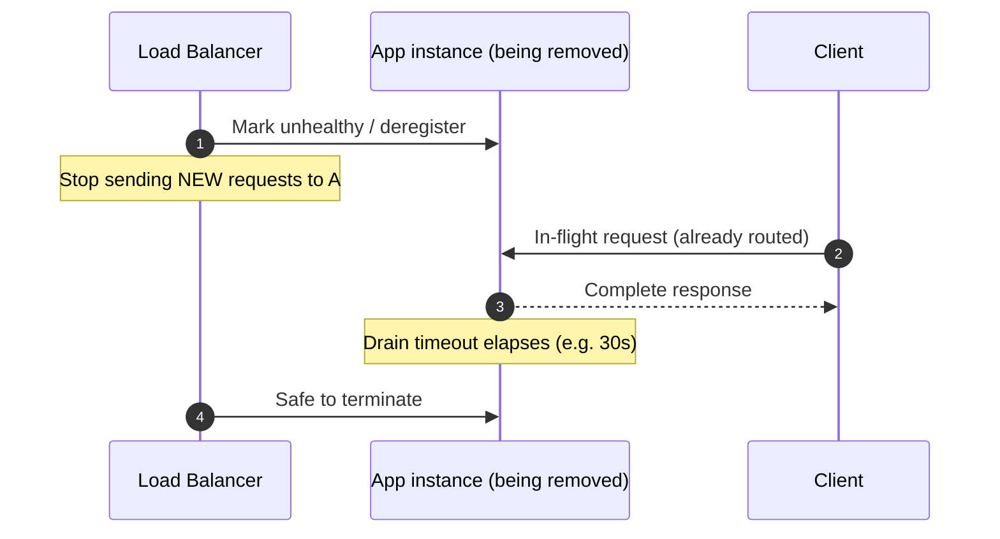

# Networking Fundamentals

Every request pays a networking tax before your application code runs: DNS(Domain Name System) resolution, TCP/TLS(Transport Layer Security) handshake, and however many hops sit between the client and the origin. This section is the **networking lens** on throughput and reliability — routing, protocol choice, and connection lifecycle.

> **Scope:** **Networking lens** — DNS, protocol version tradeoffs, TLS placement, anycast, and connection lifecycle for throughput/reliability. Load balancer vs API(Application Programming Interface) gateway product choice and responsibilities → [api-design §3 Gateway](../../api-design-and-protection/includes/03-api-gateway.md). Absorbing traffic at the edge (CDN(Content Delivery Network), WAF(Web Application Firewall)) → [§2 Entry and edge](02-entry-and-edge.md).
>
> **Related:** Entry and edge → [§2 Entry and edge](02-entry-and-edge.md) · LB vs gateway → [api-design §3 Gateway](../../api-design-and-protection/includes/03-api-gateway.md) · Multi-region routing → [§13 Multi-region read routing](13-multi-region-read-routing.md) · Deploy cutover → [deployment-strategies §3 Blue/green](../../deployment-strategies/includes/03-blue-green.md)

---

## At a glance

| Concern | Why it matters for throughput | Typical fix |
|---------|-------------------------------|--------------|
| **DNS routing** | Wrong record sends traffic to a dead or distant region | Health-checked, latency/geo-based records; short TTL for failover |
| **Protocol version** | HTTP(Hypertext Transfer Protocol)/1.1 head-of-line blocking vs HTTP/2 multiplexing vs HTTP/3 (QUIC(Quick UDP Internet Connections)) on lossy networks | Terminate HTTP/2 or HTTP/3 at the edge; keep origin on HTTP/1.1 or HTTP/2 if simpler |
| **TLS termination** | Handshake and cipher CPU cost per connection | Terminate near the user (edge); reuse sessions |
| **Anycast** | Users route to the nearest healthy point of presence automatically | Use a provider with anycast edge (CDN, DNS, DDoS scrubbing) |
| **Connection draining** | In-flight requests dropped mid-response during deploy/scale-in | Graceful shutdown with drain window before instance termination |
| **Keep-alive** | New TCP+TLS handshake per request wastes CPU and adds latency | Reuse connections; tune idle timeout vs churn |

**Rule of thumb:** Terminate the expensive parts of the connection (TLS handshake, protocol negotiation) as close to the user as you can, then reuse cheap, warm connections for everything behind that point.

---

## DNS for routing, failover, geo/latency-based

DNS(Domain Name System) is the first network hop of every request — and a routing control point, not just a name lookup.

| Routing policy | Use case |
|-----------------|----------|
| **Simple** | Single region, no failover logic needed |
| **Latency-based** | Route each user to the region with the lowest measured latency |
| **Geo** | Data residency or regulatory requirements pin users to a region |
| **Weighted** | Gradual migration or canary at the DNS level |
| **Failover** | Health-checked primary/secondary — automatic cutover on failure |

| Setting | Guidance |
|---------|----------|
| **TTL** | Short (30–60s) on failover-critical records so clients pick up the change quickly; longer for stable records to reduce resolver load |
| **Health checks** | DNS provider actively probes endpoints before routing traffic there |
| **Client-side caching** | Some clients and resolvers ignore TTL — do not rely on DNS alone for sub-minute failover |

DNS changes are not instant everywhere — combine with load balancer failover or anycast for tight recovery time objectives. See [§13 Multi-region read routing](13-multi-region-read-routing.md) for the full regional failover picture.

---

## HTTP/1.1 vs HTTP/2 vs HTTP/3 (QUIC) tradeoffs for APIs

| Version | Transport | Key property | Throughput implication |
|---------|-----------|---------------|--------------------------|
| **HTTP(Hypertext Transfer Protocol)/1.1** | TCP | One request in flight per connection (without pipelining) | Clients open many connections; more handshakes |
| **HTTP/2** | TCP | Multiplexed streams over one connection | Fewer connections, but one dropped/slow TCP packet blocks all streams (head-of-line blocking at the TCP layer) |
| **HTTP/3** | QUIC(Quick UDP Internet Connections) over UDP | Multiplexed streams, each independent at the transport layer; built-in TLS 1.3 | No cross-stream head-of-line blocking; faster handshake (0-RTT resumption); better on lossy/mobile networks |

| Decision | Recommendation |
|----------|-----------------|
| **Public edge** | Terminate HTTP/3 and HTTP/2 at the CDN(Content Delivery Network)/edge — modern browsers and mobile clients benefit most from QUIC on variable networks |
| **Origin / internal** | HTTP/2 (or HTTP/1.1 with keep-alive) is usually sufficient — the internal network is reliable and low-loss |
| **gRPC services** | Requires HTTP/2 — see [api-design §17 GraphQL and gRPC](../../api-design-and-protection/includes/17-graphql-and-grpc.md) |
| **Load testing** | Match the protocol version real clients use — HTTP/1.1-only load tests miss HTTP/2 multiplexing behavior |

**Throughput takeaway:** protocol upgrades mainly help on **lossy or high-latency networks** (mobile, satellite, cross-continent). On a healthy internal network, the gain from HTTP/2 → HTTP/3 is small — spend the effort at the public edge, not between internal services.

---

## TLS termination placement (edge vs origin) and CPU cost

TLS(Transport Layer Security) handshakes are CPU-expensive: asymmetric key exchange, cipher negotiation, and certificate validation happen before a single byte of the request is read.

| Termination point | CPU cost location | Pros | Cons |
|---------------------|--------------------|------|------|
| **Edge / CDN** | Provider's edge fleet | Offloads app CPU entirely; session reuse across many users at the same point of presence | Cert management at the edge; plaintext (or re-encrypted) from edge to origin needs its own trust boundary |
| **Load balancer** | LB fleet | Central place to manage certs; app stays simple | Still an extra hop; LB fleet must scale with handshake rate, not just byte throughput |
| **App instance** | Every app replica | End-to-end encryption if required by compliance | CPU spent on crypto instead of business logic; scales handshake cost with replica count |

| Practice | Why |
|----------|-----|
| **Session resumption** (TLS session tickets, 0-RTT on TLS 1.3) | Skips full handshake on repeat connections from the same client |
| **Terminate once, re-use internally** | Re-encrypting edge→origin is often simpler with mTLS(Mutual Transport Layer Security) between trusted infrastructure than doing a full public handshake at every layer |
| **Measure handshake rate, not just RPS** | New-connection-heavy traffic (many short-lived clients) costs more TLS CPU than the same RPS over reused connections |

**Throughput tip:** if app CPU profiling shows a meaningful chunk in TLS/crypto libraries, move termination up a layer rather than buying bigger app instances.

---

## Anycast basics for global edge

**Anycast** advertises the same IP address from many physical locations; network routing (BGP) sends each client to the topologically nearest advertising location — no client-side or DNS-side geo logic required.

| Property | Effect |
|----------|--------|
| Same IP everywhere | No DNS geo-routing config needed at the network layer |
| Automatic failover | If one point of presence goes down, BGP reroutes to the next nearest — faster than DNS TTL expiry |
| Provider-managed | Anycast is offered by CDN/DDoS/DNS providers — you configure it, you rarely operate the BGP yourself |

**Where you meet anycast in practice:** CDN edge IPs, public DNS resolvers (e.g. `1.1.1.1`), and DDoS scrubbing providers. You typically consume anycast as a feature of the edge provider in [§2 Entry and edge](02-entry-and-edge.md) rather than running your own.

---

## Connection draining / graceful shutdown for LBs

Killing an instance while it still has in-flight requests turns a routine deploy or scale-down event into visible errors.

| Step | Detail |
|------|--------|
| **Deregister before terminate** | LB stops routing new requests; existing connections are allowed to finish |
| **Drain timeout** | Long enough for the slowest realistic request (p99 + margin), short enough not to stall deploys |
| **App-level graceful shutdown** | On `SIGTERM`, stop accepting new work, finish in-flight requests, then exit — do not `SIGKILL` immediately |
| **Health check transition** | Readiness probe fails immediately on shutdown signal so orchestrators (Kubernetes, ECS) stop routing traffic before the drain window even starts |

This is the same mechanism that makes [deployment-strategies §3 Blue/green](../../deployment-strategies/includes/03-blue-green.md) and rolling deploys safe — connection draining is the networking half of a graceful deploy. App-side SIGTERM / worker drain checklist → [resilience-patterns §14](../../resilience-patterns/includes/14-graceful-shutdown-and-drain.md).

---

## Keep-alive, connection reuse

Opening a new TCP connection (plus TLS handshake if applicable) for every request is one of the most common avoidable latency and CPU costs in a request path.

| Layer | Reuse mechanism |
|-------|-------------------|
| **Client → edge/LB** | HTTP keep-alive; HTTP/2 and HTTP/3 multiplex many requests per connection by default |
| **Edge/gateway → origin** | Connection pooling to backend instances — reuse instead of dialing per request |
| **App → database** | Connection pool (PgBouncer, driver-level pool) — see [§5 Database throughput](05-database-throughput.md) |
| **App → external API** | HTTP client with a persistent connection pool, not a new client per call |

| Tuning knob | Tradeoff |
|-------------|----------|
| **Idle timeout** | Too short → connection churn (handshake cost); too long → idle connections hold resources (file descriptors, LB slots) |
| **Max connections per pool** | Too low → queueing/wait time; too high → overwhelms the downstream (DB, external API) |
| **Keep-alive probe interval** | Detects dead peers without waiting for a full request timeout |

**Rule of thumb:** connection setup cost is often larger than the cost of the request itself for small payloads — reuse aggressively on every hop, and monitor connection churn as a throughput signal, not just RPS.

---

## Common mistakes

| Mistake | Fix |
|---------|-----|
| Long DNS TTL on a record used for failover | Short TTL on failover-critical records; health-checked routing |
| Assuming HTTP/2 upgrade fixes a database-bound API | Protocol upgrades help the network hop, not app/DB bottlenecks — measure first ([§1](01-measurement-and-slo.md)) |
| TLS terminated at every layer redundantly | Terminate once near the user; reuse trust internally (mTLS or private network) |
| No connection draining before instance termination | Deregister from LB, drain in-flight requests, then terminate |
| New HTTP client (and connection) per outbound call | Persistent client with connection pooling |
| Treating anycast/CDN as a substitute for real health checks | Anycast routes to a point of presence, not automatically around an unhealthy origin — health checks still required |
| Load testing over HTTP/1.1 only when clients use HTTP/2 or HTTP/3 | Match test protocol to real client mix |
| Killing instances immediately on `SIGTERM` in Kubernetes | Handle `SIGTERM`, drain, then exit; use `preStop` hook if the runtime does not drain on its own |

---

## Pros and cons

### Terminating protocol/TLS complexity at the edge

**Pros:** Origin stays simple; app CPU spent on business logic; consistent handling of connection churn across all clients globally.

**Cons:** Trust boundary shifts to the edge provider; origin traffic pattern (fewer, reused connections) differs from raw client traffic, which can hide client-side issues from origin-only monitoring.

### Handling protocol/TLS termination at origin

**Pros:** End-to-end control and encryption; no dependency on an edge provider's feature set.

**Cons:** Every app replica pays handshake CPU; scaling for connection churn competes with scaling for business logic.