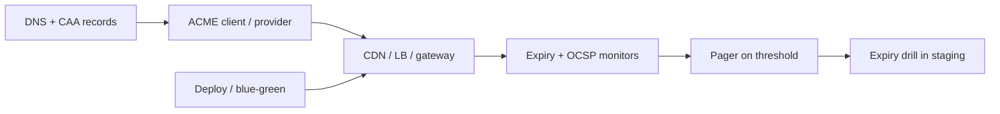

# Public TLS and Certificate Lifecycle

Public edge TLS(Transport Layer Security) is the first trust signal every client sees — and the first outage when a certificate expires unnoticed. Terminate TLS at the edge ([§16](16-networking-fundamentals.md)), automate issuance with ACME(Automatic Certificate Management Environment), and rehearse expiry before production learns the hard way.

> **Scope:** Public hostname certificates at CDN(Content Delivery Network)/load-balancer/API(Application Programming Interface) gateway — issuance, renewal, rotation, expiry drills, and cipher policy. Networking placement and handshake cost → [§16](16-networking-fundamentals.md). Key hierarchy and field encryption → [ESC §8](../../enterprise-security-compliance/includes/08-encryption-policy.md) · [ESC §8A](../../enterprise-security-compliance/includes/08A-application-encryption-and-kms.md). Deploy cutover without dropping in-flight TLS → [§10 Scale and deploy](10-scale-and-deploy.md) · [deployment-strategies §3 Blue/green](../../deployment-strategies/includes/03-blue-green.md).
>
> **Related:** Entry and edge → [§2 Entry and edge](02-entry-and-edge.md) · DNS(Domain Name System) routing → [§16](16-networking-fundamentals.md) · mTLS(Mutual Transport Layer Security) internal → [ESC §9A](../../enterprise-security-compliance/includes/09A-workload-identity-and-mtls.md) · DB TLS → [database-connection §2](../../database-connection-and-security/includes/02-prod-db-security.md)

---

## At a glance

| Concern | Default |
|---------|---------|
| **Issuance** | ACME against a public CA(Certificate Authority); no manual paste |
| **Coverage** | Every public hostname + SAN(Subject Alternative Name); wildcard only where DNS proves control |
| **Renewal** | Auto at ~30 days before expiry; alert at 14 / 7 / 1 day |
| **Rotation** | New cert loaded before old removed; dual-present during deploy |
| **Drills** | Quarterly forced-expiry game day in staging |
| **Policy** | TLS 1.2+; modern cipher suites — [ESC §8](../../enterprise-security-compliance/includes/08-encryption-policy.md) |

**Rule of thumb:** If a human pasted a `.pem` into a console for a production hostname, you do not yet have a lifecycle — you have a calendar reminder.

---

## Lifecycle flow

| Stage | Owner | Evidence |
|-------|-------|----------|
| **Inventory** | Platform | Hostname → cert ARN/id → expiry |
| **Issuance** | IaC(Infrastructure as Code) or managed edge | Git history, not tickets |
| **Deploy** | Release pipeline | Dual cert during rotation |
| **Incident** | On-call | Runbook + postmortem if expired |

---

## ACME and automation

| Practice | Why |
|----------|-----|
| ACME via provider (Let's Encrypt, ACM, Cloudflare) | Removes manual renewal |
| CAA(Certification Authority Authorization) DNS records | Blocks rogue issuance |
| Separate certs per env (`api.staging` ≠ `api`) | Blast radius |
| Staging uses same automation path as prod | Drills match reality |
| HTTP(Hypertext Transfer Protocol)-01 only on dedicated challenge paths | No app coupling |

Do not store private keys in git or chat. Keys live in the edge store or KMS(Key Management Service) — [ESC §8](../../enterprise-security-compliance/includes/08-encryption-policy.md).

---

## Rotation and deploy coordination

| Step | Detail |
|------|--------|
| **1. Issue early** | New cert valid before old expires |
| **2. Dual attach** | Edge accepts both during window |
| **3. Drain connections** | Graceful shutdown — [§16](16-networking-fundamentals.md) |
| **4. Cutover** | Rolling or blue/green — [§10](10-scale-and-deploy.md) |
| **5. Revoke old** | Only after error rate stable |

Rotation during deploy is normal; expiry during deploy is a SEV(Severity) event. Schedule renewals away from major releases when possible.

---

## Expiry drills

| Drill | Pass criteria |
|-------|---------------|
| Force short-lived cert in staging | Auto-renew succeeds without ticket |
| Block ACME endpoint | Alert fires; runbook executed |
| Simulate expired cert on canary | Traffic fails closed; rollback < RTO(Recovery Time Objective) |
| DNS mispoint | Issuance fails safely; no silent partial coverage |

Track **days-to-expiry** per hostname as an SLI(Service Level Indicator). Missing inventory is the usual root cause — shadow hostnames on old load balancers.

---

## Operational checklist

- [ ] Every public hostname in inventory with owner and expiry
- [ ] ACME automation with alerting on renewal failure
- [ ] CAA records on apex domains
- [ ] TLS policy documented and enforced at edge
- [ ] Quarterly expiry drill with evidence
- [ ] Rotation runbook tied to deploy playbook — [§10](10-scale-and-deploy.md)

---

## Common mistakes

| Mistake | Fix |
|---------|-----|
| Manual annual cert purchase | ACME + IaC |
| Wildcard cert hiding missing SANs | Per-service or explicit SAN list |
| Renew only in prod | Same path in staging |
| Expiry alert to email nobody reads | Pager + dashboard |
| Rotate by deleting old cert first | Dual-present, then remove |
| TLS terminated only on origin, not edge | Terminate near user — [§16](16-networking-fundamentals.md) |
