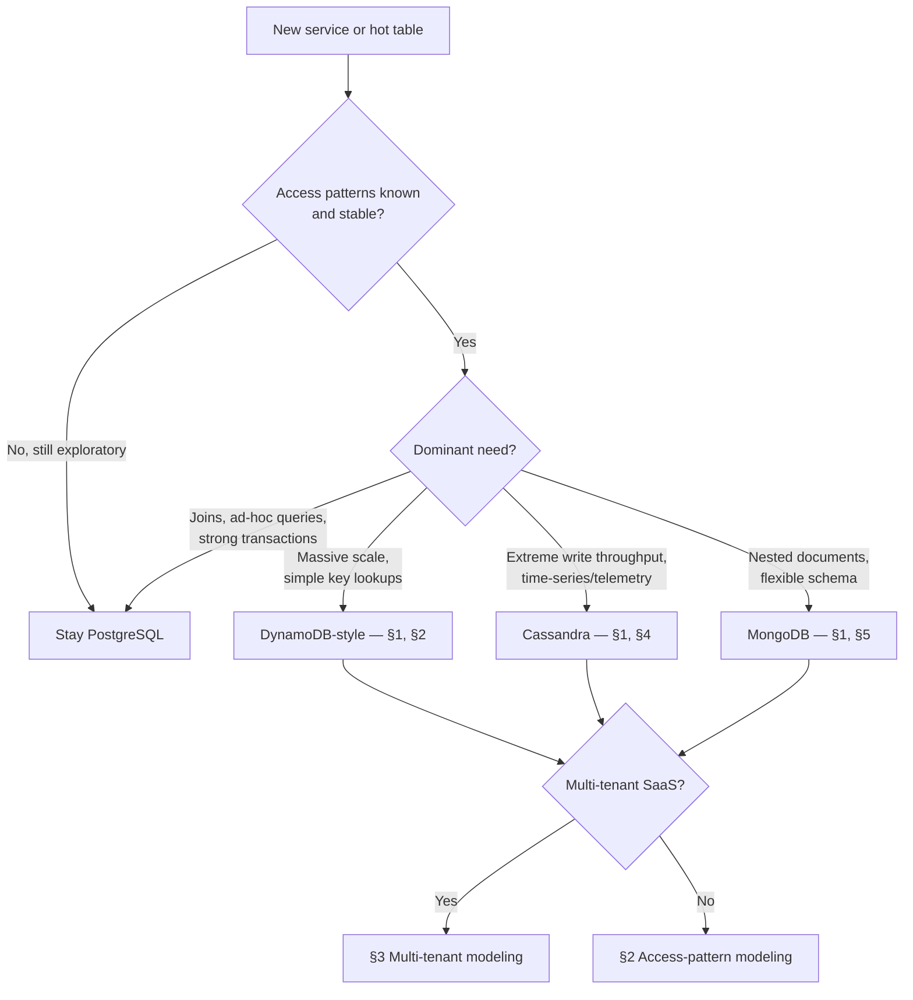

# Overview — NoSQL & Key-Value Stores

Most services should start on PostgreSQL. This guide covers the narrower set of cases where a non-relational store — DynamoDB, Cassandra, or MongoDB — is the better default, and how to model data once you pick one.

> **Related:**
> - The relational default → [postgresql-performance](../../postgresql-performance/README.md)
> - Where a key-value store fits in a wider platform → [data-platforms](../../data-platforms/README.md)
> - Data ownership and tenancy framing → [architecture-decisions](../../architecture-decisions/README.md)
> - Mechanisms underneath these stores (hashing, quorums, unique IDs) → [distributed-systems-primitives](../../distributed-systems-primitives/README.md)
> - Capstone → [06-decision-guide.md](06-decision-guide.md)

---

## When NoSQL vs PostgreSQL

**Rule of thumb:** Default to PostgreSQL. Reach for a NoSQL store only when you have a **specific, named pressure** — a query shape that does not fit rows and joins, a write rate that outpaces a single-writer relational primary, or a scale/ops profile a managed key-value service absorbs better than a self-hosted RDBMS(Relational Database Management System).

| Pressure | Symptom on PostgreSQL | NoSQL fit |
|----------|------------------------|-----------|
| **Known, narrow access patterns at huge scale** | Hot table, partitioning limits, connection ceiling | DynamoDB — single-digit ms at near-unbounded scale |
| **Very high write throughput, append-heavy** | WAL(Write-Ahead Log) and vacuum pressure, replica lag | Cassandra — LSM(Log-Structured Merge) write path, linear scale-out |
| **Deeply nested, schema-varying documents** | JSONB workable but joins/validation get awkward | MongoDB — native document model, driver-level validation |
| **Ad-hoc queries, joins, strong transactions** | This is the strength, not the weakness | Stay on PostgreSQL |

None of these pressures are permanent facts — they are measured, current-state symptoms. Revisit the choice as the product and scale change; see the [decision guide](06-decision-guide.md) before committing.

---

## Decision flow at a glance

---

## Document map

| # | Topic | File |
|---|-------|------|
| 1 | When to choose NoSQL vs PostgreSQL | [01-when-to-choose.md](01-when-to-choose.md) |
| 2 | Access-pattern modeling | [02-access-pattern-modeling.md](02-access-pattern-modeling.md) |
| 3 | Dynamo-style vs SQL(Structured Query Language) for multi-tenant SaaS(Software as a Service) | [03-dynamo-style-multi-tenant.md](03-dynamo-style-multi-tenant.md) |
| 4 | Cassandra wide-column | [04-cassandra-wide-column.md](04-cassandra-wide-column.md) |
| 5 | MongoDB document model | [05-mongodb-document.md](05-mongodb-document.md) |
| 6 | Decision guide | [06-decision-guide.md](06-decision-guide.md) |

---

## What changes vs relational thinking

| Relational habit | NoSQL replacement |
|-------------------|--------------------|
| Normalize, join at query time | Denormalize; pre-join at write time for known access patterns |
| Design schema, then queries | Design queries, then schema — [§2](02-access-pattern-modeling.md) |
| Ad-hoc `WHERE` on any column | Only indexed access patterns are cheap; everything else is a scan or a second index |
| One flexible transaction model | Transaction scope is narrower (single partition, bounded item count) or store-specific |
| Vertical + read-replica scale | Horizontal partitioning is the primary scale lever from day one |

---

## Common mistakes

| Mistake | Fix |
|---------|-----|
| Picking NoSQL for “web scale” without a measured pressure | Name the pressure; default PostgreSQL — [§1](01-when-to-choose.md) |
| Designing tables before listing access patterns | Access patterns first, schema second — [§2](02-access-pattern-modeling.md) |
| Treating DynamoDB/Cassandra like PostgreSQL with different SQL(Structured Query Language) | Model for the specific store's partitioning and query model |
| Skipping the multi-tenant isolation plan until launch | Decide tenant key placement early — [§3](03-dynamo-style-multi-tenant.md) |
| No exit plan if the pressure disappears | Record the decision and its triggers — [§6](06-decision-guide.md) |