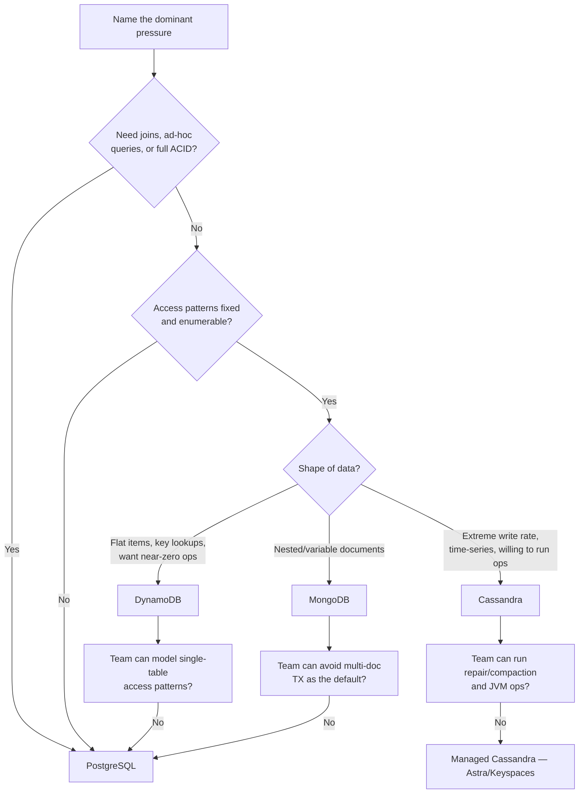

# When to Choose NoSQL vs PostgreSQL

A decision matrix across the four stores this guide and [postgresql-performance](../../postgresql-performance/README.md) cover — query shapes, transaction needs, operational load, TCO(Total Cost of Ownership), and team skills.

> **Related:** Access-pattern modeling once you pick a store → [§2](02-access-pattern-modeling.md) · Consistency mechanics behind the “ops” row → [distributed-systems-primitives §1](../../distributed-systems-primitives/includes/01-cap-and-pacelc.md) · Cost modeling → [finops-and-cost](../../finops-and-cost/README.md)

---

## At a glance

| Store | Best for | Avoid for |
|-------|----------|-----------|
| **PostgreSQL** | Joins, ad-hoc queries, strong ACID(Atomicity, Consistency, Isolation, Durability) transactions, moderate scale | Unbounded horizontal write scale on one table |
| **DynamoDB** | Known key-value/item access patterns at near-unbounded scale, low ops | Ad-hoc queries, multi-item ACID across partitions, complex joins |
| **Cassandra** | Extreme write throughput, time-series/telemetry, multi-region active-active | Ad-hoc queries, strong cross-row consistency, small teams without ops capacity |
| **MongoDB** | Nested/variable-shape documents, rapid schema iteration | Heavy cross-collection joins, multi-document transactions as the default pattern |

**Rule of thumb:** Pick the store that matches your **dominant, measured access pattern** — not the one with the best blog posts. If you cannot name three concrete queries the store must answer fast, you are not ready to leave PostgreSQL.

---

## Decision matrix

| Axis | PostgreSQL | DynamoDB | Cassandra | MongoDB |
|------|-----------|----------|-----------|---------|
| **Query shape** | Ad-hoc SQL(Structured Query Language), joins, aggregates | Key lookups + defined indexes only | Partition-key lookups, limited secondary query | Rich document queries, secondary indexes |
| **Transactions** | Full ACID, multi-table | Single-item atomic; multi-item TX limited to 100 items, one region | Lightweight transactions (Paxos-based) exist but are slow and narrow | Multi-document ACID within a replica set (v4.0+), still avoid as default pattern |
| **Consistency default** | Strong (single primary) | Eventually consistent reads by default; strongly consistent reads optional, same-region only | Tunable per query — `ONE`/`QUORUM`/`ALL` — [§4](04-cassandra-wide-column.md) | Strong within a replica set primary; tunable read/write concern |
| **Write scale** | Vertical + partitioning; single-writer ceiling | Near-unbounded, partition-key sharded | Near-unbounded, linear with nodes | Vertical + sharding (more ops to run well) |
| **Ops model** | Self-hosted or managed (RDS(Relational Database Service)/Cloud SQL(Structured Query Language)); well-understood | Fully managed, near-zero server ops | Self-hosted or managed (Astra, Keyspaces); real ops burden (compaction, repair) | Self-hosted or managed (Atlas); moderate ops |
| **TCO** | Low at small/medium scale; predictable | Pay-per-request or capacity; cheap at low/spiky volume, can surprise at huge steady scale | Infrastructure-heavy; cheaper than DynamoDB at sustained massive scale with in-house ops | Mid; Atlas pricing scales with storage + compute |
| **Team skills needed** | SQL, relational modeling — broadly available | Access-pattern modeling, item-size discipline — narrow but learnable | Data modeling per query, JVM(Java Virtual Machine) ops, repair/compaction tuning — scarce | Document modeling, driver ecosystem — broadly available |
| **Multi-region** | Read replicas; active-active is hard | Global Tables — near turnkey active-active | Native multi-DC, tunable consistency per DC | Global Clusters (Atlas) — geo-sharding, added complexity |

---

## Decision flow

---

## TCO considerations

| Factor | PostgreSQL | DynamoDB | Cassandra | MongoDB |
|--------|-----------|----------|-----------|---------|
| **Infra at low/spiky volume** | Low (small instance) | Very low (pay-per-request) | High (minimum cluster size) | Medium |
| **Infra at sustained huge volume** | High (vertical ceiling, sharding pain) | Can be high (per-request/capacity pricing at scale) | Lower per-unit at scale with owned ops | Medium-high |
| **Ops headcount** | Low–medium (mature tooling) | Near-zero | Medium–high (dedicated on-call skill) | Low–medium (managed) or medium (self-hosted) |
| **Migration-out cost** | Low (standard SQL) | Higher (access-pattern-shaped data needs remodeling) | Higher (denormalized per-query tables) | Medium (document shape often portable) |

Run these through [finops-and-cost §7 architecture cost tradeoffs](../../finops-and-cost/includes/07-architecture-cost-tradeoffs.md) before committing to a managed NoSQL bill at scale.

---

## Common mistakes

| Mistake | Fix |
|---------|-----|
| Choosing NoSQL because “it scales better” with no scale problem | Stay PostgreSQL until a named pressure appears |
| Assuming DynamoDB/Cassandra give ad-hoc query flexibility | Model access patterns up front — [§2](02-access-pattern-modeling.md) |
| Underestimating Cassandra ops (repair, compaction, tombstones) | Budget dedicated ops time or use a managed offering |
| Defaulting to MongoDB for “flexible schema” when the data is actually relational | Use PostgreSQL JSONB for the flexible slice, columns for the rest |
| Ignoring multi-item transaction limits until production | Design write paths around single-item/single-partition atomicity |

## Pros and cons

| Store | Pros | Cons |
|-------|------|------|
| **PostgreSQL** | Flexible queries, mature tooling, one mental model | Vertical scale ceiling on a single writer |
| **DynamoDB** | Near-zero ops, predictable latency at scale | Rigid access patterns; costly to redesign later |
| **Cassandra** | Extreme write throughput, multi-DC native | Real ops burden; weak ad-hoc query story |
| **MongoDB** | Natural fit for nested/variable documents | Easy to over-use multi-document transactions or deep unindexed queries |