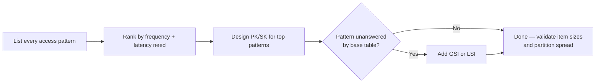
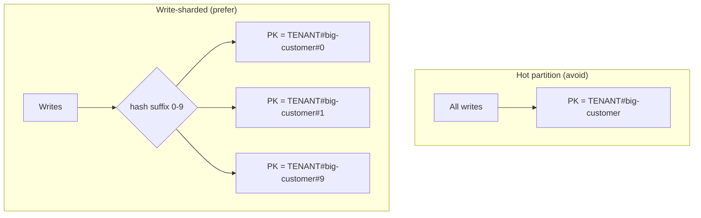

# Access-Pattern Modeling

DynamoDB-centric modeling: list every access pattern before drawing a single table, then shape partition key (**PK**) and sort key (**SK**) to answer each one with a single request. Notes call out where Cassandra and MongoDB modeling diverges.

> **Related:** Store choice → [§1](01-when-to-choose.md) · Multi-tenant key design → [§3](03-dynamo-style-multi-tenant.md) · Partition distribution mechanics → [distributed-systems-primitives §2 consistent hashing](../../distributed-systems-primitives/includes/02-consistent-hashing.md) · Sortable keys → [distributed-systems-primitives §3 unique IDs](../../distributed-systems-primitives/includes/03-unique-ids.md)

---

## At a glance

| Step | Action |
|------|--------|
| 1 | Write down every access pattern (“get order by ID”, “list orders for customer, newest first”) before any schema |
| 2 | Pick one table; design PK/SK to satisfy the highest-frequency patterns with a `GetItem`/`Query` |
| 3 | Add GSI(Global Secondary Index)/LSI(Local Secondary Index) only for patterns the base table cannot answer |
| 4 | Check every partition key for even distribution — no single key should dominate traffic |
| 5 | Model sparse indexes for optional/rare access patterns instead of a new table |

**Rule of thumb:** In DynamoDB and similar key-value stores, **the schema is the query, not the entity**. If you cannot phrase an access pattern as “get item(s) by key”, it needs an index, a different key design, or it does not belong in this store.

---

## Access patterns before schema



Skipping step 1 is the single most common cause of a NoSQL table that needs a rewrite six months after launch.

---

## Single-table design

A **single-table design** stores multiple entity types in one table, using generic attribute names (`PK`, `SK`) so one table can answer many access patterns without cross-table joins (which DynamoDB does not support).

```text
PK                SK                    Attributes
CUSTOMER#123      METADATA              name, email, plan
CUSTOMER#123      ORDER#2026-01-05#88   status, total
CUSTOMER#123      ORDER#2026-02-11#91   status, total
ORDER#88          METADATA              customer_id, items[]
```

| Concept | Role |
|---------|------|
| **Partition key (PK)** | Determines the physical partition; all items with the same PK live together |
| **Sort key (SK)** | Orders items within a partition; enables range `Query` (`begins_with`, `between`) |
| **Overloaded key** | Same attribute name (`PK`/`SK`) holds different entity prefixes (`CUSTOMER#`, `ORDER#`) so one table serves many entity types |
| **Item collection** | All items sharing a PK, retrievable in one `Query` |

**One entity's SK is often another entity's lookup value** — e.g. storing `CUSTOMER#123` as the SK on an order item lets a GSI answer “orders for this customer” without a second table.

---

## GSI and LSI

| Index type | Partition key | Sort key | Scope | Consistency |
|------------|---------------|----------|-------|-------------|
| **GSI(Global Secondary Index)** | Any attribute, independent of base table PK | Optional, independent | Whole table | Eventually consistent only |
| **LSI(Local Secondary Index)** | Must match base table PK | Different attribute | Same partition as base item | Can be strongly consistent |

| When to use | Index |
|-------------|-------|
| Query by an attribute unrelated to the base PK (e.g. “orders by status”) | GSI |
| Alternate sort order within the same partition (e.g. “items in this order by price” vs by SKU) | LSI |
| Need to add the index after the table already has data | GSI (LSI must be defined at table creation) |
| Tight latency + strong consistency for an alternate sort | LSI |

**LSI constraint:** up to 5 per table, must be created at table creation time, and count against the 10 GB item-collection size limit per partition key value. Prefer GSIs unless you specifically need LSI's strong-consistency option.

---

## Hot partitions and write sharding

A **hot partition** happens when one PK value receives disproportionate read/write traffic — throughput throttles even though the table's aggregate capacity is fine, because DynamoDB enforces per-partition limits.



| Cause | Fix |
|-------|-----|
| Single high-traffic tenant/entity as the whole PK | Append a calculated shard suffix (`#0`–`#9`) to spread across partitions |
| Time-bucketed PK where “today” is always hot | Add a random or hashed suffix; fan out reads across shards and merge |
| Sequential PK causing all new writes to land on one partition | Randomize or hash the leading key component |
| Read-heavy “popular item” | DAX(DynamoDB Accelerator) or application cache in front of the table |

Write sharding trades a simple key for extra read-side fan-out (query all shards, merge results) — only shard partitions that measurably need it.

---

## Sparse indexes

A **sparse index** is a GSI where only a subset of items have the indexed attribute populated — the index contains only those items, keeping it small and cheap.

```text
# Only items with `expires_at` set appear in the GSI
GSI-PK = status        GSI-SK = expires_at
"PENDING"               2026-08-01T00:00:00Z   ← indexed
"COMPLETE"              (attribute absent)      ← not indexed, not in GSI
```

Use sparse indexes for rare-but-important queries (“items pending expiry”, “orders flagged for review”) instead of scanning the whole table or maintaining a full secondary index on every item.

---

## Notes for Cassandra and MongoDB

| Concept | DynamoDB | Cassandra | MongoDB |
|---------|----------|-----------|---------|
| **Partition unit** | Partition key | Partition key (first part of primary key) | Shard key (sharded clusters) |
| **Within-partition order** | Sort key | Clustering columns — [§4](04-cassandra-wide-column.md) | `_id` or any indexed field |
| **Secondary access pattern** | GSI/LSI | Materialized view or duplicate table (denormalize per query — [§4](04-cassandra-wide-column.md)) | Secondary index (flexible, but write cost per index) |
| **Modeling philosophy** | Query-first, single table | Query-first, one table per query (“one query, one table”) | Entity-first is workable; still model heavy read paths explicitly |
| **Hot partition risk** | Yes — shard PK | Yes — same fix, shard the partition key | Less common (shard key chosen for spread), but hot shard chunks still occur |

The **query-first mindset** transfers directly to Cassandra ([§4](04-cassandra-wide-column.md)); MongoDB ([§5](05-mongodb-document.md)) tolerates more entity-first modeling because secondary indexes are cheaper to add later.

---

## Common mistakes

| Mistake | Problem | Fix |
|---------|---------|-----|
| Designing schema before listing access patterns | Rework or a second table later | List patterns first — this is the whole point of the guide |
| One table per entity type (relational habit) | Cross-table joins do not exist; N+1 requests | Single-table design with overloaded PK/SK |
| PK = sequential ID or single popular tenant | Hot partition, throttling | Write-shard the key — add calculated suffix |
| GSI on every attribute “just in case” | Write amplification, cost, unused indexes | Add GSIs only for validated access patterns |
| Treating LSI as a free extra index | Counts against 10 GB item-collection limit; fixed at table creation | Prefer GSI unless strong consistency is required |
| Full table scan for a rare query | Slow, expensive at scale | Sparse index on the qualifying attribute |