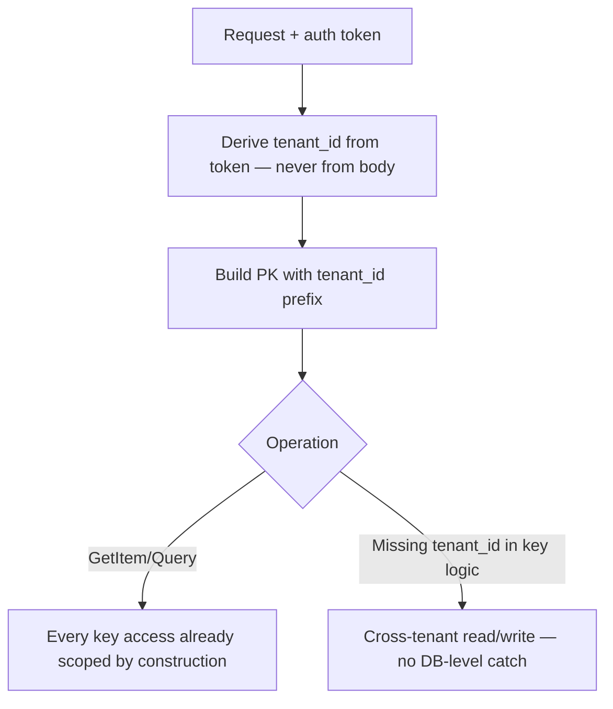

# Dynamo-Style vs SQL for Multi-Tenant SaaS

How tenant isolation differs when the table is DynamoDB-style instead of PostgreSQL — key design instead of a database-enforced predicate, and where the noisy-neighbor risk actually lives.

> **Scope:** **Key-level tenant isolation mechanics** in a key-value store. Product-level tenancy model choice (pool vs silo) → [architecture-decisions §10](../../architecture-decisions/includes/10-multi-tenant-system-models.md). PostgreSQL's database-enforced equivalent → [PG §17 row-level security](../../postgresql-performance/includes/17-row-level-security-multi-tenant.md). PostgreSQL schema/DB silos → [PG §18](../../postgresql-performance/includes/18-schema-and-database-per-tenant.md).
>
> **Related:** Access-pattern modeling → [§2](02-access-pattern-modeling.md) · Multi-tenant API(Application Programming Interface) patterns → [api-design §16](../../api-design-and-protection/includes/16-multi-tenant-apis.md)

---

## At a glance

| Layer | PostgreSQL (pooled + RLS) | DynamoDB-style |
|-------|----------------------------|-----------------|
| **Isolation enforcement** | Database-enforced — RLS(Row-Level Security) policy on every query | Application-enforced — `tenant_id` baked into PK/SK, checked by request shape |
| **Cross-tenant leak vector** | Missing/bypassed policy, `BYPASSRLS` role | `tenant_id` omitted from key, or trusted from request body instead of token |
| **Noisy neighbor** | Shared connections/CPU on one instance | Shared partition throughput if tenants collide on the same physical partition |
| **Cross-tenant analytics** | `SELECT` across tenants trivially (with the right role) | Requires a scan, a GSI(Global Secondary Index) with tenant as a queryable attribute, or export to a warehouse |

**Rule of thumb:** PostgreSQL RLS gives you a **database-enforced safety net** in addition to application checks. DynamoDB-style stores give you **no equivalent safety net** — `tenant_id` placement in the key *is* the isolation control, so a bug in key construction is a direct cross-tenant leak with no second line of defense.

---

## Tenant ID in the key

```text
PK = TENANT#<tenant_id>#CUSTOMER#<customer_id>
SK = ORDER#<created_at>#<order_id>
```

| Placement | Effect |
|-----------|--------|
| **Tenant ID as PK prefix** | All of one tenant's items share a physical partition footprint — simplest, but a large tenant can dominate that partition's throughput |
| **Tenant ID + entity ID combined into PK** | Spreads a tenant's data across partitions by entity; loses “list everything for this tenant” as a single `Query` |
| **Tenant ID as a GSI attribute only** | Base table partitions by something else; tenant-scoped queries go through the GSI — useful when per-tenant volume is small and even |



There is no `USING (tenant_id = ...)` policy running underneath you. **Every code path that builds a key must include `tenant_id`** — enforce this with a shared key-building helper, not ad-hoc string concatenation per call site.

---

## RLS contrast

| Question | PostgreSQL + RLS | DynamoDB-style |
|----------|-------------------|-----------------|
| What stops a forgotten `WHERE tenant_id = ?`? | The RLS policy still filters rows | Nothing — the key itself must scope the request |
| What stops a compromised app role from reading another tenant? | `FORCE ROW LEVEL SECURITY` on a non-`BYPASSRLS` role | IAM(Identity and Access Management) fine-grained access control (`dynamodb:LeadingKeys` condition) — must be configured explicitly |
| How is a mistake caught in testing? | Integration test: switch `app.tenant_id`, assert row invisible ([PG §17 testing](../../postgresql-performance/includes/17-row-level-security-multi-tenant.md#testing-rls)) | Integration test: attempt read/write with wrong tenant's derived key, assert `ConditionalCheckFailedException` or no item |

**IAM(Identity and Access Management) fine-grained access control** can restrict a role's DynamoDB access to items whose key begins with that caller's `tenant_id` (`dynamodb:LeadingKeys`), which is the closest DynamoDB equivalent to an RLS policy — but it requires a distinct IAM role or STS(Security Token Service) session per tenant, which is only practical for a small number of high-trust tenants (e.g. enterprise silos), not thousands of pooled SMB tenants.

---

## Noisy neighbor

| Risk | Cause | Mitigation |
|------|-------|-------------|
| One tenant throttles others sharing a partition | Tenant ID as sole PK with uneven load across tenants | Shard large tenants' keys — [§2 write sharding](02-access-pattern-modeling.md#hot-partitions-and-write-sharding) |
| One tenant's burst consumes provisioned capacity | Shared table, provisioned (not on-demand) capacity mode | On-demand capacity mode, or per-tier tables (large tenants get dedicated tables) |
| Large tenant needs different scaling profile | All tenants forced into one table's throughput ceiling | Tiered isolation: pool small tenants, dedicate a table (or a whole account) to large ones — same principle as [architecture-decisions §10](../../architecture-decisions/includes/10-multi-tenant-system-models.md) |

Noisy neighbor in a key-value store is a **partition-level physical concern**, not a connection-pool concern like PostgreSQL — the fix is almost always about key/partition distribution rather than connection limits.

---

## Cross-tenant analytics

Cross-tenant analytics (“total orders across all tenants this month”) is cheap in PostgreSQL (`SELECT` without a tenant filter, given the right role) and expensive by default in DynamoDB-style stores, which have no ad-hoc query engine.

| Approach | Fit |
|----------|-----|
| **`Scan` across the table** | Never for production paths — slow, expensive, throttles live traffic |
| **GSI with a constant or low-cardinality partition key** (e.g. `GSI-PK = "ALL"`) | Works for moderate volume; the GSI partition itself becomes a hot key at scale |
| **Export via CDC(Change Data Capture)/streams to a warehouse** | Correct long-term answer — [data-platforms §7](../../data-platforms/includes/07-analytics-without-harming-oltp.md) |
| **DynamoDB Streams → Kafka/CDC → warehouse** | Standard pattern; see [HTS §15 CDC and search indexing](../../high-throughput-systems/includes/15-cdc-and-search-indexing.md) for the pipeline shape |

Treat the operational table as **write-optimized and access-pattern-shaped**; treat analytics as a **derived, exported copy** — the same “one system of record, everything else derived” principle as [data-platforms §00](../../data-platforms/includes/00-overview.md).

---

## Common mistakes

| Mistake | Problem | Fix |
|---------|---------|-----|
| Trusting `tenant_id` from the request body | Client can forge another tenant's ID | Derive from the authenticated token, same as [PG §17](../../postgresql-performance/includes/17-row-level-security-multi-tenant.md) |
| Assuming DynamoDB has an RLS-equivalent safety net by default | It does not — key design is the only control | Shared key-building helper + integration tests per tenant |
| Large enterprise tenant sharing a pooled table's partitions | Throttling, noisy neighbor incidents | Dedicate a table or shard the tenant's key |
| `Scan` used for “admin view all tenants” dashboards | Slow, expensive, competes with live traffic | GSI for moderate scale, warehouse export for real analytics |
| No test asserting cross-tenant reads fail | Cross-tenant leak ships to production | Integration test with two tenants' derived keys, same pattern as RLS testing |