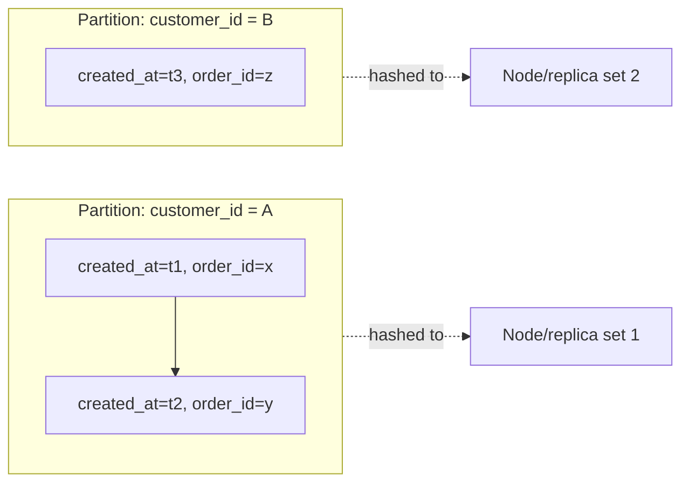
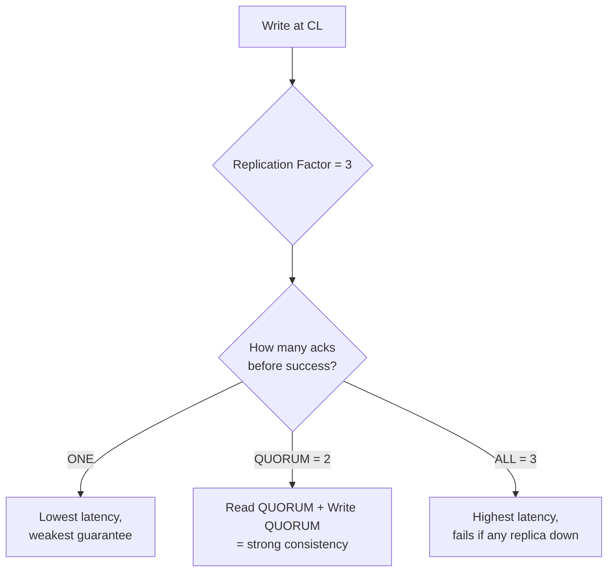

# Cassandra Wide-Column

Cassandra data modeling: partition keys, clustering columns, tunable consistency levels, and the compaction/repair operations that come with running it yourself.

> **Scope:** **Cassandra data modeling and operations.** LSM(Log-Structured Merge) storage-engine internals shared with RocksDB and other LSM stores → [tree-and-index-structures §4](../../tree-and-index-structures/includes/04-lsm-trees.md). Quorum/consistency-level mechanics in general → [distributed-systems-primitives §1](../../distributed-systems-primitives/includes/01-cap-and-pacelc.md).
>
> **Related:** Store choice → [§1](01-when-to-choose.md) · Query-first modeling → [§2](02-access-pattern-modeling.md)

---

## At a glance

| Concept | Role |
|---------|------|
| **Partition key** | Determines which node(s) own the row; all rows with the same partition key are colocated |
| **Clustering column(s)** | Sort order of rows within a partition; enables range queries within one partition |
| **Consistency level** | Per-query tunable — how many replicas must respond before a read/write succeeds |
| **Compaction** | Background SSTable merge — same mechanism as [tree-and-index-structures §4](../../tree-and-index-structures/includes/04-lsm-trees.md) |
| **Repair** | Manual/scheduled process reconciling replica divergence — Cassandra-specific operational burden |

**Rule of thumb:** Cassandra rewards **one table per query** and extreme write throughput; it punishes ad-hoc queries and teams unwilling to run `nodetool repair` on a schedule.

---

## Partition and clustering keys

```sql
CREATE TABLE orders_by_customer (
  customer_id  uuid,
  created_at   timestamp,
  order_id     uuid,
  status       text,
  total_cents  bigint,
  PRIMARY KEY (customer_id, created_at, order_id)
);
```

| Part of `PRIMARY KEY` | Role |
|------------------------|------|
| `customer_id` | **Partition key** — all this customer's orders live on the same replica set |
| `created_at, order_id` | **Clustering columns** — orders sorted by time, then ID, within the partition |



**One query, one table.** Unlike DynamoDB's single-table + GSI(Global Secondary Index) pattern ([§2](02-access-pattern-modeling.md)), idiomatic Cassandra denormalizes into a **separate table per access pattern** (`orders_by_customer`, `orders_by_status`, `orders_by_date`), each written to on the same logical write.

---

## Consistency levels

Cassandra lets you pick, **per query**, how many replicas must acknowledge before the operation returns:

| Level | Meaning | Latency | Consistency risk |
|-------|---------|---------|--------------------|
| **`ONE`** | One replica acknowledges | Lowest | Highest — may read stale or lose a write on that replica's failure |
| **`QUORUM`** | Majority of replicas (`⌊RF/2⌋ + 1`) acknowledge | Medium | Read + write `QUORUM` together gives strong consistency (`R + W > RF`) |
| **`ALL`** | Every replica acknowledges | Highest | Any single replica down blocks the operation |
| **`LOCAL_QUORUM`** | Quorum within the local datacenter only | Low (no cross-DC hop) | Common default for multi-region deployments |



The general **quorum mechanics** (`R + W > N`) that make `QUORUM`/`QUORUM` strongly consistent are the same Dynamo-style tunable-consistency idea covered in [distributed-systems-primitives §1](../../distributed-systems-primitives/includes/01-cap-and-pacelc.md) — Cassandra is one of the primary production implementations of it.

---

## Compaction (in Cassandra)

Cassandra is an LSM(Log-Structured Merge) store: writes go to a commit log + memtable, flush to immutable SSTables, and **compaction** merges SSTables in the background. Full mechanics (memtable, Bloom filters, compaction strategies, write/read amplification) are covered once, in depth, at [tree-and-index-structures §4](../../tree-and-index-structures/includes/04-lsm-trees.md) — this section only calls out the Cassandra-specific operational knobs:

| Cassandra knob | Effect |
|-----------------|--------|
| `compaction_strategy` (`STCS`, `LCS`, `TWCS`) | Size-tiered (write-heavy), leveled (read-heavy), time-window (time-series with TTL(Time To Live)) |
| `gc_grace_seconds` | How long tombstones survive before compaction can drop them — must exceed your repair interval |
| `nodetool compact` | Manual/forced compaction — use sparingly, causes disk and CPU spikes |

**Time-Window Compaction Strategy (TWCS)** is the default recommendation for time-series/telemetry tables with TTL, since it lets whole SSTables (aligned to time windows) be dropped instead of individually merged.

---

## Repair

Because writes can succeed at `ONE` or `QUORUM` without every replica, replicas can silently diverge. **Repair** reconciles them:

| Repair type | When |
|-------------|------|
| **Full repair** | Scheduled (e.g. weekly), before `gc_grace_seconds` expires — prevents deleted data from “resurrecting” |
| **Incremental repair** | Ongoing, lower overhead per run |
| **Read repair** | Automatic, opportunistic — happens inline on reads at `QUORUM`+ when replicas disagree |

Skipping scheduled repair past `gc_grace_seconds` is the classic Cassandra operational failure mode — a tombstoned row can reappear because an un-repaired replica never learned about the delete.

---

## When to pick Cassandra

| Signal | Lean toward Cassandra |
|--------|------------------------|
| Write throughput dominates and keeps growing | Yes |
| Time-series/telemetry with TTL-based expiry | Yes — TWCS is purpose-built for this |
| Multi-region active-active with tunable per-region consistency | Yes |
| Team has (or will build) dedicated ops capacity for repair/compaction | Required, not optional |
| Query needs are ad-hoc or joins-heavy | No — see [§1](01-when-to-choose.md) |
| Small team, no dedicated DB ops | Prefer managed Cassandra (Astra, Amazon Keyscape/Keyspaces) or DynamoDB instead |

---

## Common mistakes

| Mistake | Problem | Fix |
|---------|---------|-----|
| Modeling Cassandra like a relational schema (one table, many query types) | Slow, uneven partitions, `ALLOW FILTERING` scans | One table per access pattern |
| Skipping scheduled repair | Tombstoned data resurrects after `gc_grace_seconds` | Schedule full/incremental repair before grace period expires |
| Using `QUORUM` reads with `ONE` writes and expecting strong consistency | `R + W ≤ RF` — stale reads possible | Match consistency levels so `R + W > RF` when strong consistency matters |
| Unbounded partition growth (e.g. all events for one device, forever) | Huge partitions, slow reads, compaction pressure | Bucket by time window in the partition key |
| Running Cassandra without a JVM(Java Virtual Machine)/ops specialist | Compaction stalls, GC pauses, degraded latency in production | Budget dedicated ops time or use a managed offering |

## Pros and cons

| | Pros | Cons |
|---|------|------|
| **Cassandra** | Extreme write throughput, linear scale-out, native multi-DC | Real ops burden (repair, compaction, JVM tuning); weak ad-hoc query story |