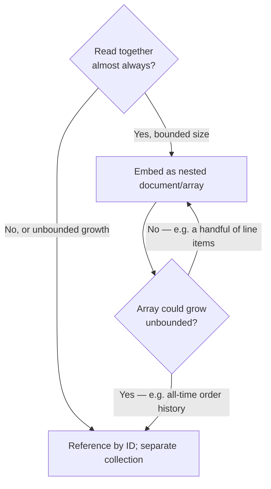

# MongoDB Document Model

MongoDB's document model, indexing, transaction limits, and when it beats PostgreSQL JSONB versus when it is just JSONB with extra operational surface area.

> **Related:** Store choice → [§1](01-when-to-choose.md) · Access-pattern modeling (entity-first is more forgiving here than DynamoDB/Cassandra) → [§2](02-access-pattern-modeling.md) · PostgreSQL's JSONB equivalent → [PG §4 schema design](../../postgresql-performance/includes/04-schema-design.md#jsonb)

---

## At a glance

| Concept | Role |
|---------|------|
| **Document** | BSON(Binary JSON) object — nested fields, arrays, mixed types across documents in the same collection |
| **Collection** | Analogous to a table, but with no enforced schema by default |
| **Secondary index** | Cheaper to add after the fact than a NoSQL GSI(Global Secondary Index); still costs write overhead |
| **Multi-document transaction** | ACID(Atomicity, Consistency, Isolation, Durability) across documents/collections within a replica set — available, should stay the exception |
| **Schema validation** | Optional, enforced at the driver or `$jsonSchema` collection-validator level |

**Rule of thumb:** MongoDB is the right default when your **data is naturally a tree of nested objects with varying shape** — user profiles with optional sections, product catalogs with category-specific attributes, event payloads. If your data is naturally rows with a few optional columns, PostgreSQL + JSONB gets you the same flexibility with fewer moving parts.

---

## Document model

```json
{
  "_id": "665f1c...",
  "customer_id": "cus_123",
  "status": "pending",
  "items": [
    { "sku": "A1", "qty": 2, "price_cents": 1999 },
    { "sku": "B7", "qty": 1, "price_cents": 4999 }
  ],
  "shipping": {
    "address": { "city": "Austin", "country": "US" },
    "method": "standard"
  },
  "metadata": { "source": "web", "promo_code": "SPRING10" }
}
```

| Trait | Detail |
|-------|--------|
| **Schema-flexible by default** | Documents in the same collection can have different fields; validate via `$jsonSchema` if you need guardrails |
| **Embedding vs referencing** | Embed data read together (order + line items); reference data with independent lifecycle or high cardinality growth (customer, product catalog) |
| **Array fields** | Native support for lists (`items[]`) without a join table |
| **`_id` field** | Default primary key; `ObjectId` is a 12-byte, roughly time-sortable identifier if you do not supply your own |

---

## Embedding vs referencing



| Pattern | Use for | Avoid for |
|---------|---------|-----------|
| **Embed** | Line items on an order, address on a profile — bounded, read together | Comments on a viral post — unbounded growth, 16 MB document limit |
| **Reference** | Customer on an order, product on a line item — independent lifecycle | Data that is always read together (adds a round trip for no benefit) |

MongoDB's **16 MB document size limit** is the hard ceiling that turns “just embed everything” into a real design constraint.

---

## Indexes

| Index type | Use for |
|------------|---------|
| **Single-field** | Direct equality/range filters on one field |
| **Compound** | Filters/sorts across multiple fields (order matters — leading field should be the most selective/equality field) |
| **Multikey** | Automatically created when indexing an array field |
| **Text** | Full-text search within a collection (limited compared to a dedicated search engine — see [data-platforms §2](../../data-platforms/includes/02-search-systems.md)) |
| **TTL** | Auto-expire documents after a timestamp field passes a threshold — sessions, temporary tokens |
| **Partial** | Index only documents matching a filter — the MongoDB equivalent of DynamoDB's [sparse index](02-access-pattern-modeling.md#sparse-indexes) |

```js
// Compound index supporting "status = ? ORDER BY created_at DESC"
db.orders.createIndex({ status: 1, created_at: -1 });
```

Every write touches every index on the collection — the same "don't index everything" discipline from [PG §2 indexing](../../postgresql-performance/includes/02-indexing.md) applies.

---

## Transactions and their limits

| Capability | Detail |
|------------|--------|
| **Single-document atomicity** | Always guaranteed, no transaction needed — updates to one document (including nested arrays) are atomic |
| **Multi-document transactions** | Available since v4.0 (replica sets) / v4.2 (sharded clusters); ACID across documents/collections |
| **Cost** | Multi-document transactions hold locks longer, add latency, and cap runtime (default 60s) — heavier than a single-document update |
| **Cross-shard transactions** | Work, but add coordination latency across shards — avoid as a default write path |

**Rule of thumb:** design documents so the **common write is single-document**. Reach for a multi-document transaction only for genuinely cross-entity invariants (e.g. transferring an item between two orders) — not as the default way to save related data.

---

## MongoDB vs PostgreSQL JSONB

| Question | Lean MongoDB | Lean PostgreSQL + JSONB |
|----------|--------------|---------------------------|
| Is most of the data naturally nested/document-shaped? | Yes | No — mostly relational with a flexible sidecar field |
| Do you need joins across the flexible data and strict relational data? | Harder (referencing + app-side joins) | Native `JOIN` |
| Do you need full ACID transactions across many entities routinely? | Workable but not the sweet spot | Native, unbounded |
| Is the team already running/skilled in PostgreSQL? | Extra operational surface | No new store |
| Does schema shape vary a lot per-document (catalog with wildly different product types)? | Yes | GIN(Generalized Inverted Index)-indexed JSONB works but gets awkward past a few varying shapes |

See [PG §4 schema design — JSONB](../../postgresql-performance/includes/04-schema-design.md#jsonb) for the PostgreSQL-side pattern (`GIN` index, `@>` containment queries). If your JSONB column is becoming "most of the table" with its own indexing and query needs, that is the signal to evaluate MongoDB — not before.

---

## When to pick MongoDB

| Signal | Lean toward MongoDB |
|--------|------------------------|
| Data is naturally nested, variable-shape documents | Yes |
| Rapid schema iteration during early product development | Yes |
| Need array/nested-object queries beyond what JSONB + GIN comfortably does | Yes |
| Data is mostly relational with a small flexible slice | No — PostgreSQL + JSONB |
| Multi-document transactions would be the default write pattern | No — reconsider modeling or PostgreSQL |

---

## Common mistakes

| Mistake | Problem | Fix |
|---------|---------|-----|
| Unbounded array embedding (comments, event log inside a parent document) | Hits 16 MB document limit, slow updates | Reference into a separate collection past a bounded size |
| No schema validation at all in a multi-team codebase | Silent shape drift, hard-to-debug bugs | `$jsonSchema` validator or strict driver-level models |
| Multi-document transactions as the default save pattern | Latency, lock contention | Model for single-document atomicity; reserve transactions for real cross-entity invariants |
| Treating MongoDB as “PostgreSQL without a schema” for relational data | Joins done in application code, N+1 queries | Use PostgreSQL; keep MongoDB for genuinely document-shaped data |
| Indexing every queryable field | Write amplification on every insert/update | Index only validated access patterns, same discipline as [§2](02-access-pattern-modeling.md) |

## Pros and cons

| | Pros | Cons |
|---|------|------|
| **MongoDB** | Natural fit for nested/variable documents; flexible secondary indexing; mature driver ecosystem | Easy to over-embed past size limits or over-use multi-document transactions |