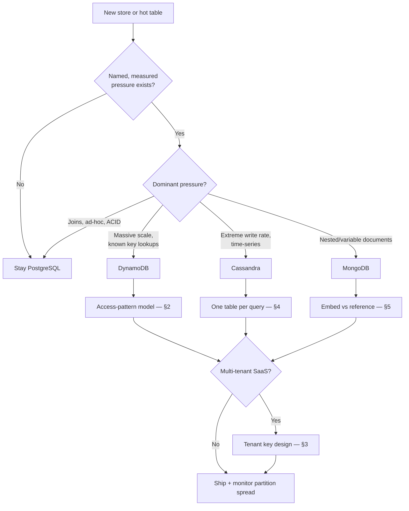

# Decision Guide — NoSQL & Key-Value Stores

Store selection, modeling checklist, and the anti-patterns that account for most NoSQL production incidents in this guide.

> **Related:** Overview → [00-overview.md](00-overview.md) · Decision matrix → [01-when-to-choose.md](01-when-to-choose.md) · Architecture-level tradeoffs → [architecture-decisions §12](../../architecture-decisions/includes/12-decision-guide.md)

---

## Master decision flow

---

## Scenario recommendations

| Scenario | Recommended approach |
|----------|----------------------|
| New CRUD service, unclear query needs | PostgreSQL — [§1](01-when-to-choose.md) |
| Session store / feature flags / ephemeral cache | Redis, not this guide — [data-platforms §3](../../data-platforms/includes/03-redis-and-in-memory.md) |
| High-scale key-value lookups, known access patterns, low ops appetite | DynamoDB single-table design — [§2](02-access-pattern-modeling.md) |
| IoT/telemetry ingest, extreme write rate, in-house ops | Cassandra with TWCS compaction — [§4](04-cassandra-wide-column.md) |
| Product catalog with per-category varying attributes | MongoDB, or PostgreSQL JSONB if the rest of the data is relational — [§5](05-mongodb-document.md) |
| Multi-tenant SaaS on a key-value store | `tenant_id` in the key from day one — [§3](03-dynamo-style-multi-tenant.md) |
| Existing NoSQL table throttling under load | Diagnose hot partition first — [§2](02-access-pattern-modeling.md#hot-partitions-and-write-sharding) |
| Need cross-tenant/cross-entity analytics on a NoSQL primary | Export via CDC(Change Data Capture)/streams to a warehouse — [§3](03-dynamo-style-multi-tenant.md#cross-tenant-analytics), [data-platforms §7](../../data-platforms/includes/07-analytics-without-harming-oltp.md) |
| Regulatory requirement for ad-hoc audit queries | PostgreSQL, or export to a queryable store — do not build this on DynamoDB/Cassandra |

---

## Priority checklist

- [ ] Named, measured pressure justifies leaving PostgreSQL — [§1](01-when-to-choose.md)
- [ ] Every access pattern listed before schema design — [§2](02-access-pattern-modeling.md)
- [ ] Partition/shard key checked for even distribution — no dominant key
- [ ] Secondary indexes (GSI(Global Secondary Index)/LSI(Local Secondary Index)/materialized view/secondary index) added only for validated patterns
- [ ] Item/document size limits checked against growth (16 MB Mongo document, item-collection limits)
- [ ] Multi-tenant key design decided before first tenant onboards, if applicable — [§3](03-dynamo-style-multi-tenant.md)
- [ ] Consistency level/read-your-writes behavior documented per access path
- [ ] Ops plan exists for the chosen store (repair/compaction for Cassandra; backup/restore for all)
- [ ] Analytics path is a derived export, not a scan against the live table
- [ ] Exit/migration trigger recorded — what would make you reconsider PostgreSQL

---

## Common mistakes (anti-patterns)

| Mistake | Why it hurts | Fix |
|---------|---------------|-----|
| "NoSQL because scale" with no measured pressure | Unnecessary complexity, weaker query flexibility | Default PostgreSQL; name the pressure — [§1](01-when-to-choose.md) |
| Schema designed before access patterns | Rework, added tables/indexes later | Access-pattern-first modeling — [§2](02-access-pattern-modeling.md) |
| Sequential or single-tenant partition key | Hot partition, throttling | Write-shard the key — [§2](02-access-pattern-modeling.md#hot-partitions-and-write-sharding) |
| Trusting client-supplied `tenant_id` | Cross-tenant data leak with no DB-level safety net | Derive from auth token; key-building helper + tests — [§3](03-dynamo-style-multi-tenant.md) |
| Cassandra modeled like a relational schema | `ALLOW FILTERING` scans, uneven partitions | One table per query — [§4](04-cassandra-wide-column.md) |
| Skipping Cassandra repair past `gc_grace_seconds` | Deleted data resurrects | Scheduled repair — [§4](04-cassandra-wide-column.md#repair) |
| Unbounded array embedding in MongoDB | Hits 16 MB document limit | Reference past a bounded size — [§5](05-mongodb-document.md) |
| Multi-document transactions as the default write | Latency, lock contention | Model for single-document atomicity |
| `Scan`/full-collection scan for analytics | Competes with live traffic, slow | Export to a warehouse — [data-platforms §7](../../data-platforms/includes/07-analytics-without-harming-oltp.md) |
| No exit plan if the original pressure disappears | Locked into unnecessary operational cost | Record the decision and its triggers in an ADR(Architecture Decision Record) |

---

## Quick decision summary

| Question | Default answer |
|----------|------------------|
| Starting store for a new service? | PostgreSQL |
| First sign you might need NoSQL? | A named, measured pressure — scale, write rate, or document shape |
| Schema or queries first? | Queries — always |
| One table or many? | DynamoDB: one table. Cassandra: one table per query. MongoDB: entity-first is fine |
| Multi-tenant default? | `tenant_id` in the key, derived from the auth token, tested explicitly |
| Analytics on the primary store? | No — export, do not scan |

---

## See also

| Guide | Topics |
|-------|--------|
| [postgresql-performance](../../postgresql-performance/README.md) | The relational default; RLS(Row-Level Security), JSONB, consistency costs |
| [data-platforms](../../data-platforms/README.md) | Where a key-value store fits alongside warehouse, search, and cache |
| [architecture-decisions](../../architecture-decisions/README.md) | Data ownership, multi-tenant system models, ADRs |
| [distributed-systems-primitives](../../distributed-systems-primitives/README.md) | Consistent hashing, quorum mechanics, unique IDs behind these stores |
| [tree-and-index-structures](../../tree-and-index-structures/README.md) | LSM(Log-Structured Merge) internals behind Cassandra |
| [finops-and-cost](../../finops-and-cost/README.md) | TCO(Total Cost of Ownership) comparisons at scale |