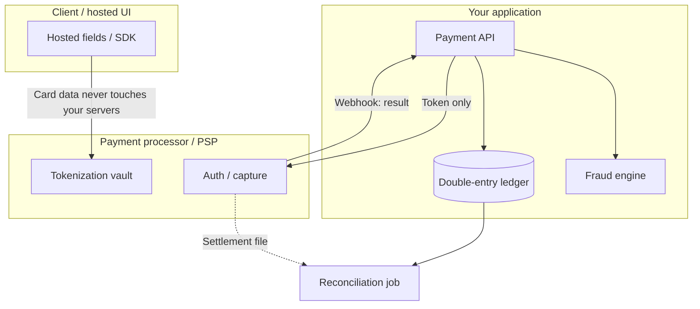

# Overview — Payments and Fintech

Payment systems inherit every API(Application Programming Interface) and resilience problem in this corpus, then add four that are unique to moving money: **cardholder data liability, the cost of a duplicate charge, the need for a provably correct ledger, and adversaries actively trying to exploit all of the above.**

**Rule of thumb:** In most systems, a duplicate write is an annoyance. In a payment system, a duplicate write is a regulatory incident, a chargeback, and a support ticket — treat every write path here as if it will be retried, replayed, and attacked.

> **Related:**
> - Generic idempotency baseline → [resilience-patterns §6](../../resilience-patterns/includes/06-idempotency-systemwide.md), [api-design-and-protection §13](../../api-design-and-protection/includes/13-idempotency.md)
> - Multi-step money movement as a saga → [event-sourcing-and-cqrs §7](../../event-sourcing-and-cqrs/includes/07-sagas-and-distributed-workflows.md)
> - Encryption and compliance evidence → [enterprise-security-compliance](../../enterprise-security-compliance/README.md)
> - Capstone → [05-decision-guide.md](05-decision-guide.md)

---

## At a glance

| Concern | What's different from a generic API | Section |
|---------|----------------------------------------|---------|
| **Cardholder data** | Touching a PAN(Primary Account Number) at all pulls your whole environment into PCI DSS(Payment Card Industry Data Security Standard) audit scope | [§1](01-pci-scope-reduction.md) |
| **Double charges** | Generic `Idempotency-Key` doesn't cover network timeouts, processor retries, or client bugs that generate a *new* key | [§2](02-idempotency-and-double-charge.md) |
| **Ledger correctness** | Balances must be provably derivable and auditable, not just "whatever the last update set them to" | [§3](03-ledger-and-double-entry.md) |
| **Fraud and disputes** | Adversarial actors, plus a contractual dispute window that outlives your normal data retention | [§4](04-fraud-and-reconciliation.md) |

---

## Where this sits in the stack

Notice what never enters your infrastructure: raw card data. Everything your application handles is a **token** and a **result** — that boundary is the entire point of [§1](01-pci-scope-reduction.md).

---

## Document map

| # | Topic | File |
|---|-------|------|
| 1 | PCI scope reduction | [01-pci-scope-reduction.md](01-pci-scope-reduction.md) |
| 2 | Idempotency and double-charge prevention | [02-idempotency-and-double-charge.md](02-idempotency-and-double-charge.md) |
| 3 | Ledger and double-entry accounting | [03-ledger-and-double-entry.md](03-ledger-and-double-entry.md) |
| 4 | Fraud and reconciliation | [04-fraud-and-reconciliation.md](04-fraud-and-reconciliation.md) |
| 5 | Decision guide | [05-decision-guide.md](05-decision-guide.md) |

---

## Default stack (accepting card payments)

1. Hosted fields or a client SDK so raw card data never reaches your servers — [§1](01-pci-scope-reduction.md)
2. `Idempotency-Key` on every charge request, plus a client-generated correlation ID surviving retries — [§2](02-idempotency-and-double-charge.md)
3. Double-entry ledger as the source of truth for balances, written in the same transaction as the business event — [§3](03-ledger-and-double-entry.md)
4. Async reconciliation against processor settlement files, with alerting on unmatched entries — [§4](04-fraud-and-reconciliation.md)
5. Fraud signals evaluated pre-authorization, not just post-hoc — [§4](04-fraud-and-reconciliation.md)

---

## Common mistakes

| Mistake | Fix |
|---------|-----|
| Storing raw PAN "just in logs" or "just for support" | Never store PANs — tokenize; redact at every log boundary — [§1](01-pci-scope-reduction.md) |
| Trusting a single `Idempotency-Key` header to prevent all duplicate charges | Layer natural keys, processor idempotency, and reconciliation — [§2](02-idempotency-and-double-charge.md) |
| Deriving balances from the latest row update instead of summing an immutable journal | Double-entry ledger with balance derivation — [§3](03-ledger-and-double-entry.md) |
| Treating chargebacks as a support-only problem with no engineering ownership | Reconciliation and dispute tooling as a first-class system — [§4](04-fraud-and-reconciliation.md) |
| Building PCI compliance and fraud detection as afterthoughts post-launch | Design scope reduction and reconciliation before processing real cards |