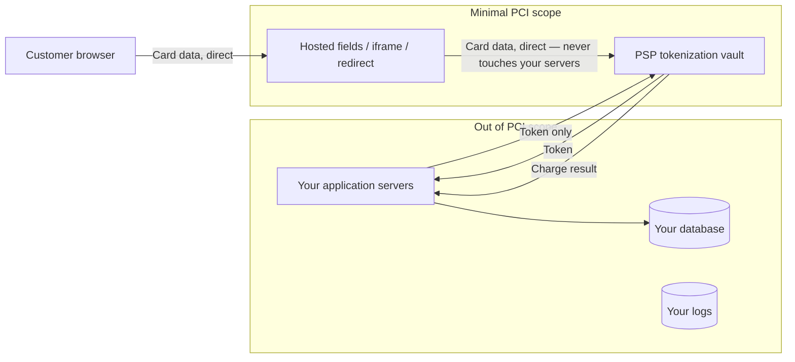
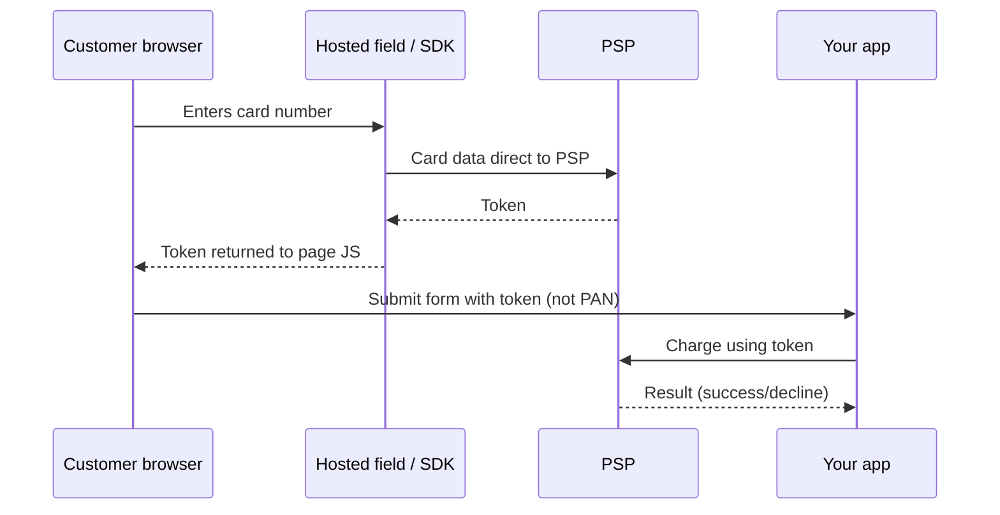

# PCI Scope Reduction

PCI DSS(Payment Card Industry Data Security Standard) applies to every system that stores, processes, or transmits cardholder data. The single highest-leverage architecture decision in a payments system is designing so that as little of your infrastructure as possible falls inside that boundary — because everything inside it inherits the full audit and control burden.

> **Related:** Encryption policy for what remains in scope → [enterprise-security-compliance §8](../../enterprise-security-compliance/includes/08-encryption-policy.md) · Secrets/key management → [enterprise-security-compliance §5](../../enterprise-security-compliance/includes/05-secrets-beyond-database.md) · Audit logging redaction rules → [enterprise-security-compliance §6](../../enterprise-security-compliance/includes/06-audit-logging-and-retention.md)

---

## At a glance

| Term | Meaning |
|------|---------|
| **CDE(Cardholder Data Environment)** | The systems, people, and network segments that store/process/transmit card data — everything here is in PCI audit scope |
| **PAN(Primary Account Number)** | The card number itself — the single most sensitive field; never store it in your own systems if you can avoid it |
| **CVV(Card Verification Value)** | The security code — **never store this at all**, even encrypted, even for one request past authorization |
| **SAQ(Self-Assessment Questionnaire)** | The compliance questionnaire tier your business must complete — tokenization/hosted-field architectures drop you to the simplest tiers (SAQ A / A-EP) |
| **Tokenization** | Replacing the PAN with a non-sensitive reference (token) that is useless outside the tokenizing system |

**Rule of thumb:** If your servers never receive, process, or store a raw PAN or CVV, most of your infrastructure falls **out of PCI scope entirely**. Every design choice in this section exists to make that true.

---

## Scope reduction architecture

The card number travels **browser → PSP(Payment Service Provider) directly**, never through your backend. Your servers only ever see a token — a value that is meaningless if stolen from your systems, because it can only be redeemed by the PSP that issued it.

| Approach | How it works | Scope impact |
|----------|----------------|-----------------|
| **Hosted fields (iframe)** | PSP-hosted `<iframe>` form fields embedded in your checkout page; you control the surrounding page, PSP controls the sensitive inputs | Lowest scope (SAQ A) — your page never touches raw card data in the DOM(Document Object Model) you control |
| **Redirect / hosted checkout page** | Customer is sent to a PSP-hosted page entirely | Lowest scope, at the cost of UX control |
| **Client-side SDK tokenization** | PSP JavaScript SDK tokenizes in the browser before your form submits | Low scope (SAQ A-EP); still no raw PAN reaching your servers |
| **Server-side raw PAN handling** | Your backend receives and forwards raw card data | Highest scope (SAQ D) — avoid unless you are a payment processor yourself |

---

## Tokenization patterns

| Token type | Scope |
|------------|-------|
| **PSP vault token** | Opaque reference redeemable only through that PSP's API(Application Programming Interface); safe to store in your database |
| **Network token** | Issued by the card network (Visa/Mastercard token service); portable across merchants that support network tokenization, and survives card reissuance better than a PSP-only token |
| **Merchant-generated token (self-hosted vault)** | Only viable if you operate your own PCI-certified tokenization vault — high compliance cost; almost never the right build-vs-buy answer for a non-payments company |

**Rule of thumb:** Use your PSP's tokenization, not a self-built vault. Building your own token vault means running a PCI Level 1 service provider environment — a cost center most companies should not take on.

---

## What still needs protecting even out of scope

Reducing scope does not mean payments become a non-security concern — it means the **remaining** in-scope surface is small enough to actually secure well.

| Still your responsibility | Practice |
|------------------------------|----------|
| **Token storage** | Tokens aren't cardholder data, but they're still sensitive credentials — encrypt at rest, restrict access — [enterprise-security-compliance §8](../../enterprise-security-compliance/includes/08-encryption-policy.md) |
| **Webhook/callback authenticity** | Verify PSP webhook signatures (HMAC(Hash-based Message Authentication Code)); replay/idempotency protection — see [§2](02-idempotency-and-double-charge.md) |
| **Logging discipline** | Redact PAN, CVV, and full token values from application and access logs — [enterprise-security-compliance §6](../../enterprise-security-compliance/includes/06-audit-logging-and-retention.md) |
| **Network segmentation** | Even a minimal CDE (the hosted-field integration surface) should be segmented from unrelated internal systems |
| **Key management for anything in-house** | HSM(Hardware Security Module)-backed keys if you handle any encryption of payment-adjacent data yourself |

---

## SAQ tiers (informational)

| SAQ type | Applies when | Burden |
|----------|--------------|--------|
| **SAQ A** | Fully outsourced via redirect/hosted iframe; no card data touches your systems | Lowest — short self-assessment |
| **SAQ A-EP** | Client-side JavaScript SDK tokenization on a page you serve, but no card data hits your servers | Low-moderate — page integrity and JavaScript supply-chain controls matter |
| **SAQ D** | You store, process, or transmit raw card data yourself | Highest — full control assessment, often requiring a Qualified Security Assessor |

This guide's default recommendation — hosted fields or redirect checkout — targets **SAQ A / A-EP**. Confirm your actual tier with your acquirer/PSP; this is architecture guidance, not a compliance determination.

---

## Common mistakes

| Mistake | Fix |
|---------|-----|
| Storing raw PAN "temporarily" for retries or support lookups | Never store it — use the PSP token as the retry/lookup key instead |
| Storing CVV at all, even encrypted | Never store CVV past the initial authorization call — it's forbidden by PCI DSS regardless of encryption |
| Logging full card numbers or tokens in application/access logs | Redact at the logging boundary; log only last-4 and token ID |
| Building a self-hosted tokenization vault without a clear compliance mandate | Use your PSP's or the card network's tokenization |
| Treating "we use hosted fields" as meaning security work is done | Still protect tokens, webhooks, and logs — see the table above |
| Letting unrelated internal services live in the same network segment as the hosted-field integration | Segment the minimal CDE from the rest of the network |