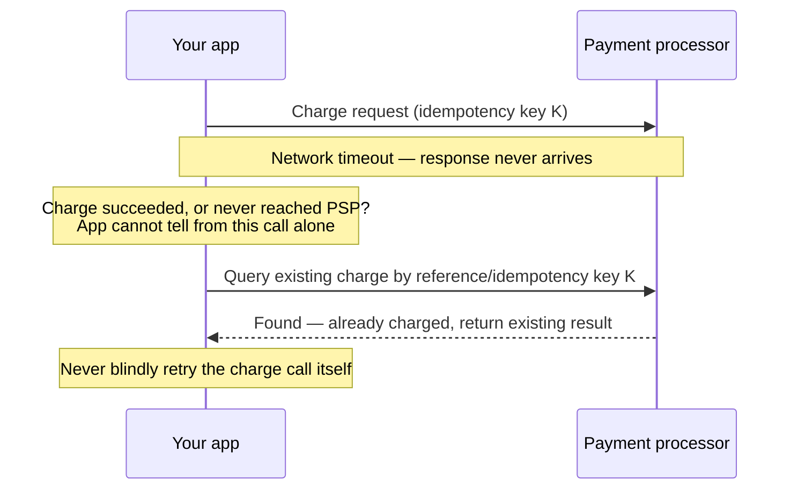
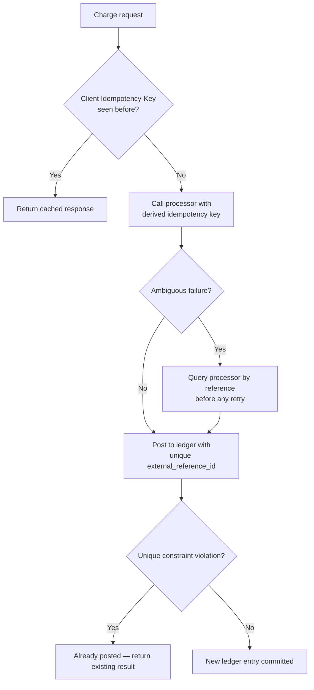

# Idempotency and Double-Charge Prevention

An `Idempotency-Key` header is necessary but **not sufficient** to prevent double charges. Payments have failure modes a generic idempotency layer doesn't cover: ambiguous timeouts against a third-party processor, clients that regenerate keys on retry, and webhook redelivery landing on a different code path than the original request.

> **Scope:** **Money-specific double-charge classes and the defenses layered on top of generic idempotency.** Generic `Idempotency-Key` mechanics, storage, and HTTP(Hypertext Transfer Protocol) contract → [api-design-and-protection §13](../../api-design-and-protection/includes/13-idempotency.md). Systemwide idempotency rule (consumers, webhooks, cron) → [resilience-patterns §6](../../resilience-patterns/includes/06-idempotency-systemwide.md).
>
> **Related:** Ledger posting as the final dedup boundary → [§3](03-ledger-and-double-entry.md) · Reconciliation as the safety net → [§4](04-fraud-and-reconciliation.md)

---

## At a glance

| Failure mode | Why generic idempotency alone misses it |
|---------------|--------------------------------------------|
| **Client regenerates key on retry** | A buggy or naive client creates a *new* `Idempotency-Key` for what is semantically the same charge attempt |
| **Ambiguous timeout** | Your request to the processor times out — you don't know if the charge succeeded before the timeout |
| **Double submission** | User double-clicks, or the same form is open in two tabs/devices, generating two independent requests with two independent keys |
| **Webhook redelivery** | The processor's async confirmation arrives more than once, or arrives after you already confirmed synchronously |
| **Retry after partial success** | Charge succeeded at the processor, but your process crashed before recording it locally, so a retry looks like a fresh attempt from your side |

**Rule of thumb:** Never let "was this actually charged?" have only one source of truth. Layer a **natural key** (your order/invoice ID) underneath the synthetic `Idempotency-Key`, and always **verify before retrying** an ambiguous request against the processor.

---

## The ambiguous timeout problem

- **Never retry a charge call on ambiguous failure** (timeout, connection reset). Instead, **query the processor** for an existing charge matching your idempotency key or reference ID first.
- Most processors (Stripe, Adyen, Braintree, etc.) honor an `Idempotency-Key` on the charge call itself *and* expose a lookup-by-reference API(Application Programming Interface) — use both: the key protects the retry, the lookup resolves true ambiguity.
- Set a processor-side idempotency key **derived from your own order ID**, not a fresh random value per attempt — so even if your client-side retry logic regenerates something, the *processor* call stays deduplicated against the order.

---

## Defense in depth: three independent keys

| Layer | Key | Purpose |
|-------|-----|---------|
| **Client → your API** | `Idempotency-Key` header, generated once per user action and cached client-side | Protects against client-side retry/double-submit — see [api-design §13A](../../api-design-and-protection/includes/13A-idempotency-client-and-server-flow.md) |
| **Your API → processor** | Processor idempotency key derived deterministically from your order/invoice ID | Protects against your own retries, and survives even if the client-supplied key is inconsistent |
| **Ledger posting** | Unique constraint on `(source_system, external_reference_id)` | The final, database-enforced backstop — see [§3](03-ledger-and-double-entry.md) |

None of these three keys is sufficient alone. The client key can be bypassed by a buggy client; the processor key can be bypassed if you call a different processor endpoint by mistake; the ledger constraint is what actually makes a double-post **impossible**, not just unlikely.

---

## Webhooks and async confirmation

Payment processors typically confirm results two ways: a synchronous API response to your charge call, and an asynchronous webhook. Both can arrive, in either order, and the webhook can be redelivered.

- Verify webhook signatures (HMAC(Hash-based Message Authentication Code)) and timestamps before processing — see [enterprise-security-compliance](../../enterprise-security-compliance/README.md) for signature verification patterns shared with other inbound webhooks.
- Dedup webhooks by the processor's event ID, not just the charge ID — a single charge can generate multiple distinct events (authorized, captured, disputed).
- Design the handler so that **whichever confirmation arrives first wins**, and the second is a no-op — this is the same idempotent-consumer pattern as [resilience-patterns §6](../../resilience-patterns/includes/06-idempotency-systemwide.md), applied specifically to a charge that might already be confirmed synchronously.

---

## Authorize-then-capture as risk reduction

Where the processor supports it, splitting **authorization** (hold funds, no settlement) from **capture** (actual charge) shrinks the ambiguity window and gives you a natural retry point:

- Authorize immediately on checkout; capture only after your side confirms the order is finalized (inventory reserved, fraud check passed).
- A failed or ambiguous *capture* call can be safely retried against the same authorization using the processor's own idempotency support, without risking a second authorization.
- Authorizations expire automatically (typically 5–7 days) if never captured — a useful safety net against orphaned holds, but not a substitute for explicit voids on cancelled orders.

---

## Common mistakes

| Mistake | Fix |
|---------|-----|
| Blindly retrying a charge call after a timeout | Query the processor by reference before retrying — never retry the charge call itself on ambiguous failure |
| Relying on the client-supplied `Idempotency-Key` alone | Layer a processor-side key derived from your order ID, plus a ledger unique constraint |
| Deduping webhooks by charge ID only | Dedup by the processor's event ID; a charge can emit multiple distinct events |
| Treating synchronous response and webhook as mutually exclusive | Design both paths to be idempotent no-ops on the second arrival, whichever comes first |
| No reconciliation safety net | Even with all of the above, reconcile against processor settlement files — [§4](04-fraud-and-reconciliation.md) |
| Skipping authorize/capture split when the processor supports it | Use it to shrink the ambiguity window on higher-risk or delayed-fulfillment orders |