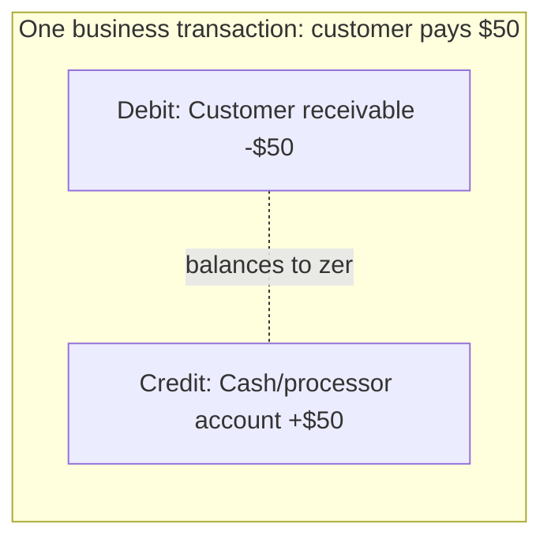

# Ledger and Double-Entry Accounting

A payments system's source of truth for money is not a `balance` column — it's an **immutable, append-only journal** of entries, with every balance a derived, recomputable value. This is double-entry accounting, and it exists because it makes entire classes of bugs structurally impossible rather than merely unlikely.

> **Related:** ACID(Atomicity, Consistency, Isolation, Durability) transactions and consistency behind the journal → [postgresql-performance §14](../../postgresql-performance/includes/14-consistency-promises-and-costs.md) · Append-only event log parallels → [event-sourcing-and-cqrs §1](../../event-sourcing-and-cqrs/includes/01-core-concepts.md) · Reconciliation against this ledger → [§4](04-fraud-and-reconciliation.md)

---

## At a glance

| Principle | What it means |
|-----------|-----------------|
| **Double-entry** | Every transaction posts at least two balanced entries (a debit and a credit) that net to zero |
| **Immutable journal** | Entries are never updated or deleted — corrections are new, reversing entries |
| **Derived balances** | A balance is `SUM(entries)` for an account, not a mutable field you increment/decrement in place |
| **Idempotent posting** | A unique constraint on the journal prevents the same external event from posting twice — see [§2](02-idempotency-and-double-charge.md) |

**Rule of thumb:** If you can't answer "show me every entry that makes up this balance, in order, and prove it sums correctly" from your database alone, you don't have a ledger — you have a number that can silently drift.

---

## Why "just a balance column" fails

| Bug class | With a mutable `balance` column | With a double-entry ledger |
|-----------|----------------------------------|-------------------------------|
| **Concurrent updates racing** | Lost update unless every write is a careful `UPDATE ... SET balance = balance + x` under the right isolation level | Each entry is an independent insert; balance is derived by summation, so there's no in-place race to lose |
| **"Where did this money go"** | No record — only the current number | Full, ordered, immutable history of every entry |
| **Correcting a mistake** | `UPDATE` the balance and hope nothing else read the wrong value in between | Post a reversing entry; both the mistake and the correction remain visible forever |
| **Reconciling against an external statement** | Nothing to compare against except point-in-time snapshots | Line-by-line comparison against the journal |
| **Proving correctness to an auditor** | "Trust the current number" | "Here is every entry; they balance to zero; here is the derivation" |

---

## Double-entry mechanics



Every entry has a **debit** side and a **credit** side, and every complete transaction's entries sum to zero across all accounts touched. A schema sketch:

```sql
CREATE TABLE journal_entries (
    id              BIGSERIAL PRIMARY KEY,
    transaction_id  UUID NOT NULL,          -- groups entries that must balance together
    account_id      BIGINT NOT NULL,
    amount_cents    BIGINT NOT NULL,        -- signed: positive = debit, negative = credit (pick one convention)
    currency        TEXT NOT NULL,
    external_ref    TEXT,                   -- e.g. processor charge ID, for idempotent posting
    created_at      TIMESTAMPTZ NOT NULL DEFAULT now(),
    UNIQUE (external_ref, account_id)        -- enforces idempotent posting per §2
);
```

- Use **integer minor units** (cents), never floating point, for `amount_cents` — floating-point rounding errors are unacceptable in a ledger.
- Group entries by `transaction_id`; a background check (or a database constraint via trigger/materialized check) verifies every transaction's entries sum to zero per currency.
- Derive an account's balance as `SUM(amount_cents) WHERE account_id = X` — optionally cached/materialized for read performance, but always **recomputable** from the journal as the source of truth.

---

## Balance derivation at scale

Summing the full journal on every balance read doesn't scale past a small number of entries per account. Standard mitigations:

| Technique | How |
|-----------|-----|
| **Running balance snapshot** | Periodically materialize `balance_as_of(entry_id)` so reads sum only entries since the last snapshot |
| **Materialized view / summary table** | Recompute on write (in the same transaction as the journal insert) via a trigger or application-level dual write within one `COMMIT` |
| **Read replica for reporting** | Offload balance-read-heavy dashboards to a replica — see [postgresql-performance](../../postgresql-performance/README.md) — while writes stay on the primary |

Whichever caching strategy you pick, treat the cached balance as **derived and rebuildable**, and periodically verify it against a full recomputation — drift between the cache and the journal is a bug to alert on, not a source of truth to trust.

---

## Corrections, not deletions

The journal is **never mutated**. A mistaken entry is corrected with a new, reversing entry that references the original:

```mermaid
sequenceDiagram
    participant Orig as Original entry (mistake)
    participant Rev as Reversing entry
    participant New as Corrected entry
    Note over Orig: Posted at T1 — later found wrong
    Rev->>Orig: References original; exact inverse amount, same accounts
    New->>Rev: New correct entry posted
    Note over Orig,New: All three remain visible forever — WORM(Write Once Read Many) journal
```

This mirrors the [enterprise-security-compliance §6](../../enterprise-security-compliance/includes/06-audit-logging-and-retention.md) principle of append-only, tamper-resistant audit streams — a financial journal has the same WORM(Write Once Read Many) requirement, for the same non-repudiation reason, and often the same or stricter retention window.

---

## Multi-step transactions as sagas

A single business action (e.g. "process a refund") often touches the ledger, the payment processor, and a notification — multiple services, not one local transaction. Treat this as a saga, not a distributed transaction:

- Post the ledger entries **first**, inside your own database transaction, as the durable record of intent.
- Drive the processor call and notification as saga steps with compensation (reverse the ledger entries) if a later step fails permanently — see [event-sourcing-and-cqrs §7](../../event-sourcing-and-cqrs/includes/07-sagas-and-distributed-workflows.md) and [§7B compensation and idempotency](../../event-sourcing-and-cqrs/includes/07B-sagas-compensation-idempotency.md).
- Never leave a ledger entry posted with no corresponding external action and no compensation path — reconciliation ([§4](04-fraud-and-reconciliation.md)) is what catches this class of drift in practice, but the saga design should minimize how often it happens.

---

## Common mistakes

| Mistake | Fix |
|---------|-----|
| Mutable `balance` column as the only record | Immutable double-entry journal; balance is derived |
| Floating-point amounts | Integer minor units (cents) |
| Deleting or updating a mistaken entry | Reversing entry; original stays visible |
| No idempotent-posting constraint on the journal | Unique constraint on `(external_ref, account_id)` — see [§2](02-idempotency-and-double-charge.md) |
| Summing the entire journal on every balance read at scale | Running balance snapshot or materialized summary, recomputed periodically for drift |
| Treating multi-service money movement as a single distributed transaction | Saga with ledger-first posting and compensation |