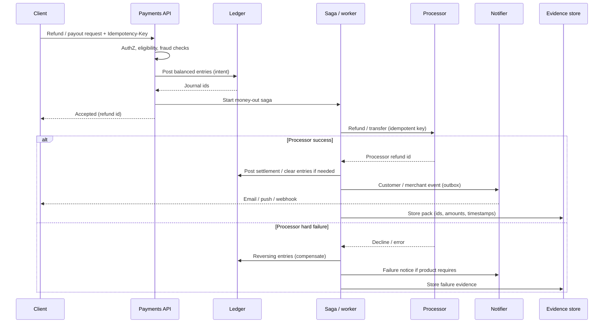

# Refunds, Payouts, and Settlement

Refunds and payouts are **money-out** paths: they must post to the ledger, call the processor, notify stakeholders, and leave dispute-ready evidence. The ledger remains the source of truth ([§3](03-ledger-and-double-entry.md)); the processor is an external effect driven as a saga.

> **Scope:** **Operational money-out flows** — refund → ledger → processor → notify → dispute evidence. Ledger mechanics → [§3](03-ledger-and-double-entry.md). Double-charge / idempotency → [§2](02-idempotency-and-double-charge.md). Multi-step orchestration → [ES §7](../../event-sourcing-and-cqrs/includes/07-sagas-and-distributed-workflows.md). Fraud / reconciliation → [§4](04-fraud-and-reconciliation.md).
>
> **Related:** [§3 Ledger](03-ledger-and-double-entry.md) · [§2 Idempotency](02-idempotency-and-double-charge.md) · Sagas → [ES §7](../../event-sourcing-and-cqrs/includes/07-sagas-and-distributed-workflows.md) · Compensation → [ES §7B](../../event-sourcing-and-cqrs/includes/07B-sagas-compensation-idempotency.md) · Outbox → [ES §5A](../../event-sourcing-and-cqrs/includes/05A-outbox-and-inbox.md) · Notifications → [api §10D](../../api-design-and-protection/includes/10D-notification-delivery.md)

---

## At a glance

| Step | Owns |
|------|------|
| **Authorize refund / payout** | Product + risk policy; eligibility checks |
| **Post ledger** | Immutable double-entry intent — [§3](03-ledger-and-double-entry.md) |
| **Call processor** | Idempotent external refund/transfer |
| **Notify** | Customer / merchant via outbox — [api §10D](../../api-design-and-protection/includes/10D-notification-delivery.md) |
| **Evidence pack** | Timestamps, amounts, processor ids, for disputes — [§4](04-fraud-and-reconciliation.md) |

**Rule of thumb:** **Ledger first**, then external money movement. If the processor call fails permanently, compensate with reversing ledger entries — never “fix the balance quietly.”

---

## End-to-end sequence

| Failure | Safe behavior |
|---------|---------------|
| Duplicate client retry | Same `Idempotency-Key` → same refund id — [§2](02-idempotency-and-double-charge.md) |
| Crash after ledger, before processor | Saga resume; processor call idempotent |
| Processor success, notify fail | Retry notify; do not re-refund |
| Partial capture / partial refund rules | Explicit state machine; never guess remaining amount |

---

## Ledger posting for money-out

| Movement | Typical posting shape |
|----------|----------------------|
| **Full refund** | Reverse original revenue / payable path; restore customer balance or cash-at-processor as designed in [§3](03-ledger-and-double-entry.md) |
| **Partial refund** | New balanced entries for partial amount; link to original payment id |
| **Payout / disbursement** | Debit payable / credit cash-at-processor (or bank); track fee lines separately |
| **Fee clawback** | Separate fee accounts; do not bury fees inside the principal line |

Always store `external_ref` (payment id, refund id, payout id) with a uniqueness constraint so retries cannot double-post — [§2](02-idempotency-and-double-charge.md).

---

## Processor interaction

| Practice | Why |
|----------|-----|
| Idempotency key = your refund/payout id | Processor retries safe |
| Record processor ids on success | Reconciliation and disputes |
| Distinguish soft vs hard failures | Retry vs compensate |
| Respect processor refund windows | Eligibility before ledger when window is absolute |
| Separate payout rails (ACH, card refund, wallet) | Different settlement times and failure modes |

Drive multi-step flows as sagas — [ES §7](../../event-sourcing-and-cqrs/includes/07-sagas-and-distributed-workflows.md) · [ES §7B](../../event-sourcing-and-cqrs/includes/07B-sagas-compensation-idempotency.md). Emit processor calls after commit via outbox — [ES §5A](../../event-sourcing-and-cqrs/includes/05A-outbox-and-inbox.md).

---

## Notify and customer communication

| Event | Channel notes |
|-------|---------------|
| Refund accepted | Transactional email / push; include amount and timing expectations |
| Refund settled | Optional; useful when settlement is delayed |
| Payout sent | Merchant notifications; avoid leaking full account numbers |
| Failure | Clear next step; support deep link |

Prefer domain events → notifier — [api §10D](../../api-design-and-protection/includes/10D-notification-delivery.md). Do not dual-write “update DB + send email” in the request thread.

---

## Dispute evidence pack

When a chargeback or payout dispute arrives, ops needs a coherent pack — not a scavenger hunt across Slack.

| Evidence item | Source |
|---------------|--------|
| Original payment + refund/payout ids | Your journal + API(Application Programming Interface) |
| Amounts, currency, timestamps | Ledger entries |
| Processor references | Processor response / webhooks |
| Customer notification timestamps | Delivery log |
| Risk / eligibility decision | Decision log (who/what/why) |
| Shipping / usage proof (if relevant) | Order / product systems |

Reconciliation and chargeback ops → [§4](04-fraud-and-reconciliation.md). Retain evidence under compliance policy — [ESC §10](../../enterprise-security-compliance/includes/10-compliance-evidence.md).

---

## Settlement awareness

| Concept | Why it matters |
|---------|----------------|
| **Auth vs capture vs settle** | Refundable amount depends on state |
| **Batch settlement** | Payouts may clear T+N; ledger should show pending vs settled |
| **FX(Foreign Exchange) and fees** | Post fee and FX lines explicitly |
| **Merchant net** | Marketplace payouts need platform fee accounts |

Do not show “refunded” in the product UI until the ledger (and, if required, processor) state matches your published meaning of refunded.

---

## Operational checklist

- [ ] Idempotent refund/payout API with stable ids
- [ ] Ledger-first posting + uniqueness on external refs
- [ ] Saga with compensation for hard processor failure
- [ ] Outbox for notify-after-commit
- [ ] Evidence pack assembled automatically
- [ ] Dashboards: pending refunds, processor lag, compensate rate
- [ ] Runbook for processor outage (queue vs pause)

---

## Common mistakes

| Mistake | Fix |
|---------|-----|
| Call processor then update balance column | Ledger-first double-entry — [§3](03-ledger-and-double-entry.md) |
| No idempotency on refund API | [§2](02-idempotency-and-double-charge.md) keys |
| Re-refund on notify retry | Separate notify retries from money movement |
| “Refunded” UI before ledger post | Drive UI from ledger/saga state |
| Evidence assembled only during dispute week | Capture at saga completion |
| Distributed 2PC(Two-Phase Commit) across processor | Saga + compensate — [ES §7](../../event-sourcing-and-cqrs/includes/07-sagas-and-distributed-workflows.md) |

---

## Pros and cons

### Ledger-first refund saga

**Pros:** Auditable, compensatable, dispute-ready; aligns with reconciliation.

**Cons:** More moving parts than a single processor SDK call; requires saga ops skill.

### Processor-first, balance later

**Pros:** Appears simple.

**Cons:** Drift, double payouts on retry, weak dispute evidence.