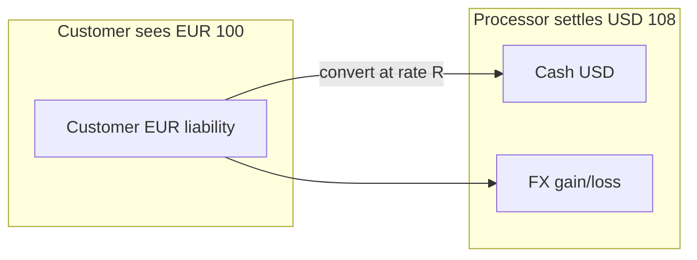

# Multi-Currency and FX

Multi-currency payments need **one ledger truth in a functional currency**, **FX(Foreign Exchange) rates with provenance**, and **presentment amounts** that match what the customer saw at checkout.

> **Scope:** Ledger accounts per currency, FX conversion rules, rounding, and settlement reconciliation. Double-entry basics → [§3](03-ledger-and-double-entry.md). Money-out / settlement → [§3A](03A-refunds-payouts-settlement.md). Idempotency → [§2](02-idempotency-and-double-charge.md).
>
> **Related:** Reconciliation → [§4](04-fraud-and-reconciliation.md) · Disputes → [§4A](04A-disputes-and-chargebacks.md) · Sagas → [ES §7](../../event-sourcing-and-cqrs/includes/07-sagas-and-distributed-workflows.md)

---

## At a glance

| Concept | Rule |
|---------|------|
| **Functional currency** | Company reporting currency (e.g. USD) |
| **Presentment** | Amount shown/charged to cardholder (e.g. EUR) |
| **Settlement** | Currency processor settles to you |
| **FX rate** | Source + timestamp on every conversion entry |
| **Immutable journal** | FX revaluation = new entries, not edits — [§3](03-ledger-and-double-entry.md) |

**Rule of thumb:** Store **both** presentment and functional amounts on every journal transaction — auditors and disputes ask “what did the user pay” and “what hit our books.”

---

## Ledger layout

| Account type | Examples |
|--------------|----------|
| **Per-currency cash** | `cash_usd`, `cash_eur` |
| **Customer liability** | Per presentment currency |
| **FX translation** | Realized on settlement; unrealized on reval (policy-specific) |
| **Processor clearing** | In-flight per currency |

---

## FX rate policy

| Source | Use |
|--------|-----|
| **Processor rate** | Match settlement file — best for reconciliation |
| **Daily ECB / market mid** | Internal reporting |
| **Locked at checkout** | Customer quote stability |

| Field on entry | Required |
|----------------|----------|
| `rate`, `rate_source`, `rate_at` | Prove conversion |
| `presentment_amount`, `presentment_currency` | Dispute evidence |
| `functional_amount`, `functional_currency` | P&L(Profit and Loss) |

Rounding: define **per-line vs per-invoice** rule once; document in API(Application Programming Interface) docs — mismatches drive [§4](04-fraud-and-reconciliation.md) breaks.

---

## Checkout and refunds

| Flow | Ledger behavior |
|------|-----------------|
| **Charge EUR, settle USD** | Post presentment + functional at checkout rate |
| **Refund in presentment** | Reverse original entry pair; same rate policy as charge — [§3A](03A-refunds-payouts-settlement.md) |
| **Partial refund** | Proportional functional split |
| **DCC(Dynamic Currency Conversion)** | Cardholder chose foreign presentment — store choice |

Refunds must be **idempotent** on processor + journal — [§2](02-idempotency-and-double-charge.md).

---

## Reconciliation

| Check | Frequency |
|-------|-----------|
| Presentment total vs processor file | Daily |
| Functional translation vs treasury rate | Daily / month-end |
| FX gain/loss bucket drift | Month-end |

Mismatch playbook → [§4](04-fraud-and-reconciliation.md). Multi-currency disputes → [§4A](04A-disputes-and-chargebacks.md).

---

## Common mistakes

| Mistake | Why it hurts | Fix |
|---------|--------------|-----|
| Single `balance` column | FX drift invisible | Double-entry per currency |
| Rate without timestamp | Cannot reproduce | Store source + time |
| Rounding ad hoc | Penny breaks recon | One policy |
| Edit journal on rate change | Audit failure | Reversing entries |
| Functional-only receipts | Dispute loses evidence | Store presentment |

---

## Pros and cons

| Approach | Pros | Cons |
|----------|------|------|
| **Processor FX** | Matches settlement | Less control of quote |
| **Locked checkout rate** | Predictable UX | Exposure if settlement differs |
| **Single currency only** | Simple | Limits market |
