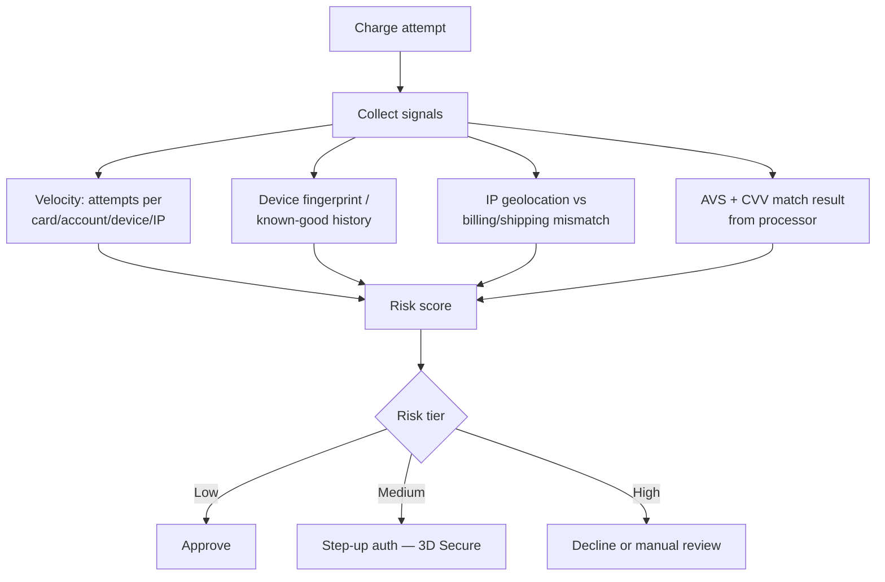
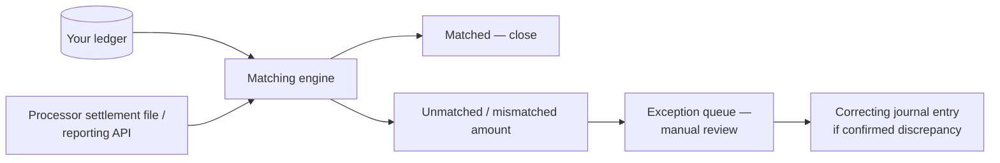

# Fraud and Reconciliation

Two operational systems keep a payments platform honest after the charge succeeds: **fraud detection** stops bad transactions before or during authorization, and **reconciliation** proves after the fact that your ledger, your processor, and the money that actually moved all agree.

> **Related:** Ledger as the record reconciliation checks against → [§3](03-ledger-and-double-entry.md) · KYC(Know Your Customer)/AML(Anti-Money Laundering) as compliance evidence → [enterprise-security-compliance §10](../../enterprise-security-compliance/includes/10-compliance-evidence.md) · Streaming fraud signals → [apache-kafka](../../apache-kafka/README.md)

---

## At a glance

| System | Question it answers | When |
|--------|------------------------|------|
| **Pre-auth fraud scoring** | Should this charge attempt even be allowed? | Before/during authorization |
| **Velocity and device signals** | Is this behavior consistent with the account's history? | Real-time, per request |
| **Reconciliation** | Does our ledger match what actually settled? | Daily/batch, against processor files |
| **Dispute/chargeback handling** | Is this a legitimate reversal, and can we contest it? | Within the network's dispute window (often 60–120+ days) |

**Rule of thumb:** Fraud prevention and reconciliation are not "nice to have" ops tooling bolted on later — they are the mechanisms that make the ledger in [§3](03-ledger-and-double-entry.md) trustworthy in the real world, where processors, networks, and customers don't always agree with you.

---

## Fraud signals

| Signal | What it catches |
|--------|--------------------|
| **Velocity checks** | Many attempts in a short window across a card, account, device, or IP — classic card-testing / stolen-card behavior |
| **Device fingerprinting** | New/unrecognized device on an established account; known-fraud device reputation |
| **AVS(Address Verification System) / CVV(Card Verification Value) match** | Billing address and CVV mismatch with what the issuer has on file |
| **Geolocation mismatch** | IP geolocation inconsistent with billing/shipping address or account history |
| **Step-up authentication (3D Secure)** | Shifts liability to the issuer for card-present-equivalent fraud and adds a challenge for risky transactions |
| **KYC / AML checks** | Identity verification and watchlist screening, typically required above regulatory transaction thresholds or for account opening |

**Rule of thumb:** Layer signals into a **risk score**, not a single hard rule — a single strict rule (e.g. "always decline mismatched AVS") produces false declines that cost more in lost revenue than the fraud it prevents; a scored, tiered response (approve / challenge / decline / review) balances both.

---

## Reconciliation

Reconciliation compares your internal ledger against the processor's settlement records — the two systems can disagree due to timing, fees, currency conversion, or genuine errors, and the job of reconciliation is to find and resolve every disagreement.

| Discrepancy class | Typical cause | Resolution |
|--------------------|-----------------|-------------|
| **Timing mismatch** | Settlement lags authorization by T+1/T+2 days | Match by reference ID regardless of date; don't expect same-day parity |
| **Fee/FX(Foreign Exchange) differences** | Processor fees or currency conversion not modeled in your ledger | Post fee/FX entries as their own ledger lines, matched against the settlement breakdown |
| **Missing settlement** | Charge succeeded at authorization but never settled (voided, expired auth) | Investigate; may require reversing the ledger entry |
| **Missing ledger entry** | Webhook lost, consumer crash before posting — see [§2](02-idempotency-and-double-charge.md) | Backfill from the settlement file; investigate the gap in delivery |

- Run reconciliation **daily at minimum**, automated, with an exception queue for anything unmatched past a defined age (e.g. 2 business days).
- Alert on the **rate** of unmatched entries, not just raw count — a sudden jump signals a systemic issue (webhook outage, processor API(Application Programming Interface) change), not isolated noise.
- Treat reconciliation as the ultimate backstop for every double-charge and drift scenario in [§2](02-idempotency-and-double-charge.md) — it is what catches what the real-time defenses missed.

---

## Dispute windows and chargebacks

| Concept | Practice |
|---------|----------|
| **Dispute window** | Card networks typically allow chargebacks 60–120 days post-transaction (longer for some reason codes) — plan data retention accordingly, longer than most other operational data |
| **Reserve holds** | Consider holding a reserve against high-risk merchants/transactions to cover anticipated chargeback liability |
| **Representment** | The process of contesting a chargeback with evidence (delivery confirmation, signed terms, communication logs) — retain this evidence proactively, not reactively after a dispute arrives |
| **Evidence retention** | Keep order details, fraud-signal snapshots, and communication records for at least the full dispute window, coordinated with [enterprise-security-compliance retention policy](../../enterprise-security-compliance/includes/06-audit-logging-and-retention.md) |
| **Dispute rate monitoring** | Sustained high dispute rates risk processor account review or network monitoring programs — treat dispute rate as an SLO(Service Level Objective)-worthy metric, not just a support queue size |

---

## Common mistakes

| Mistake | Fix |
|---------|-----|
| One hard fraud rule instead of a tiered risk score | Layered signals into approve/challenge/decline/review tiers |
| Reconciliation run manually or infrequently | Automated daily job with an exception queue and age-based alerting |
| Treating a timing mismatch as a real discrepancy | Match by reference ID; expect T+1/T+2 settlement lag |
| No evidence retained for representment until a dispute arrives | Retain order/fraud-signal evidence proactively for the full dispute window |
| Data retention shorter than the dispute window | Align retention policy with the network's chargeback window, not generic app data retention |
| Ignoring rising dispute rate until a processor flags the account | Monitor dispute rate as an ongoing operational metric |