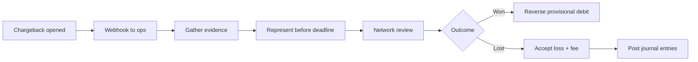

# Disputes and Chargebacks

A chargeback is a **forced reversal** initiated by the cardholder's bank — not a normal refund. Ops needs a **timeline, evidence pack, and ledger compensation** aligned with network rules.

> **Scope:** Chargeback lifecycle, representment, and ledger treatment. Fraud prevention upstream → [§4](04-fraud-and-reconciliation.md). Refund path → [§3A](03A-refunds-payouts-settlement.md). Multi-currency evidence → [§3B](03B-multi-currency-and-fx.md). Ledger → [§3](03-ledger-and-double-entry.md).
>
> **Related:** PCI DSS(Payment Card Industry Data Security Standard) scope → [§1](01-pci-scope-reduction.md) · Notifications → [api §10D](../../api-design-and-protection/includes/10D-notification-delivery.md)

---

## At a glance

| Stage | Who acts | Your job |
|-------|----------|----------|
| **Charge filed** | Issuer | Log dispute id; freeze payout if needed |
| **Notification** | Processor webhook | SLA(Service Level Agreement) to ack (often 24–72 h) |
| **Evidence window** | Merchant | Submit AVS(Address Verification System), CVV(Card Verification Value), delivery proof |
| **Representment** | Acquirer | Package submitted to network |
| **Outcome** | Network | Won / lost / accepted |
| **Ledger** | Finance | Post chargeback + fee entries — [§3](03-ledger-and-double-entry.md) |

**Rule of thumb:** Treat chargebacks as **dispute cases** with owners and deadlines — not as support tickets that can wait until Friday.

---

## Timeline (typical)

Windows vary by network (often **7–21 days** to respond; total case **60–120+ days**). Automate deadline alerts.

---

## Evidence pack

| Artifact | Proves |
|----------|--------|
| **Authorization record** | Amount, time, approval code |
| **AVS / CVV result** | Card-not-present diligence — [§4](04-fraud-and-reconciliation.md) |
| **3DS(3D Secure) cryptogram** | Liability shift |
| **Delivery / service proof** | Fulfillment |
| **Customer comms** | Refund policy acknowledgment |
| **Presentment currency** | What cardholder agreed — [§3B](03B-multi-currency-and-fx.md) |

Store at capture time — reconstructing months later fails representment.

---

## Ledger entries

| Event | Posting (sketch) |
|-------|------------------|
| **Chargeback received** | Debit revenue / credit dispute liability |
| **Chargeback fee** | Debit fee expense |
| **Won dispute** | Reverse provisional entries |
| **Lost dispute** | Move from dispute liability to final loss |

Never mutate original charge rows — reversing entries only — [§3](03-ledger-and-double-entry.md). Tie to `processor_dispute_id` for [§4](04-fraud-and-reconciliation.md).

---

## Ops runbook

| Step | Action |
|------|--------|
| 1 | Ingest webhook; idempotent on dispute id |
| 2 | Link order, customer, shipment |
| 3 | Assign owner; calendar deadline |
| 4 | Auto-compile evidence template |
| 5 | Submit via processor portal/API(Application Programming Interface) |
| 6 | Post ledger on provisional and final outcomes |
| 7 | Feed win/loss reasons to fraud rules — [§4](04-fraud-and-reconciliation.md) |

Notify merchant/customer per policy — [api §10D](../../api-design-and-protection/includes/10D-notification-delivery.md).

---

## Common mistakes

| Mistake | Why it hurts | Fix |
|---------|--------------|-----|
| Miss representment deadline | Auto-loss | Deadline automation |
| No evidence at capture | Weak representment | Evidence pack at pay |
| Refund + chargeback | Double loss | Link cases; idempotent ledger |
| Ignore reason codes | Repeat fraud pattern | Feed ML(Machine Learning)/rules |
| Manual spreadsheet only | Scale breaks | Case system + webhooks |

---

## Pros and cons

| Strategy | Pros | Cons |
|----------|------|------|
| **Fight with evidence** | Recover revenue | Ops cost |
| **Accept fast** | Cheap for low value | Trains abuse |
| **3DS by default** | Liability shift | Conversion friction |
