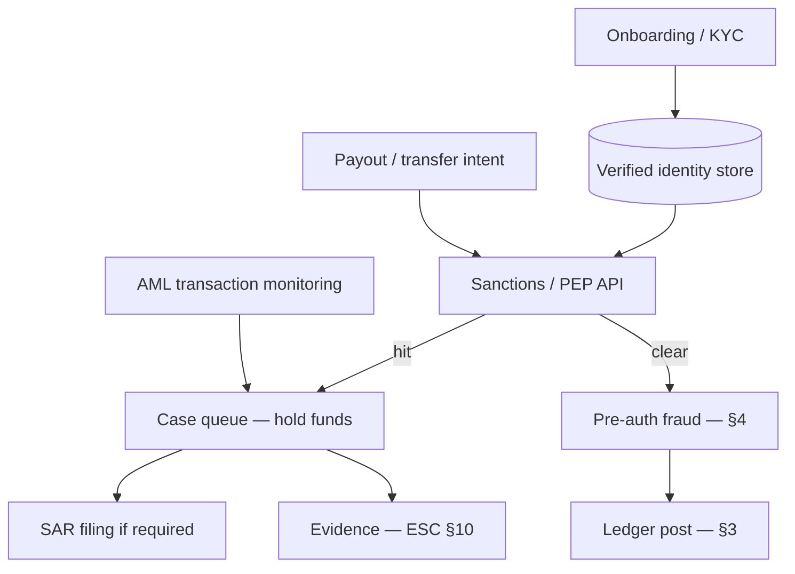

# KYC, AML, and Sanctions Screening

Before money moves, the platform must know **who** is involved and whether they appear on sanctions or high-risk lists. KYC(Know Your Customer), AML(Anti-Money Laundering), and sanctions screening are operational systems — not one-time onboarding forms — tied to every account, beneficiary, and payout corridor.

> **Scope:** Identity verification, ongoing monitoring, sanctions/PEP(Politically Exposed Person) screening, and case management for money movement. Real-time fraud scoring at charge time → [§4](04-fraud-and-reconciliation.md). Compliance evidence packs → [ESC §10](../../enterprise-security-compliance/includes/10-compliance-evidence.md). PII(Personally Identifiable Information) handling → [ESC §7](../../enterprise-security-compliance/includes/07-pii-and-data-classification.md).
>
> **Related:** Ledger and settlement → [§3](03-ledger-and-double-entry.md) · Payouts/refunds → [§3A](03A-refunds-payouts-settlement.md) · PCI(Payment Card Industry Data Security Standard) scope → [§1](01-pci-scope-reduction.md) · Audit retention → [ESC §6](../../enterprise-security-compliance/includes/06-audit-logging-and-retention.md)

---

## At a glance

| Control | When it runs |
|---------|--------------|
| **KYC(Know Your Customer) / CDD(Customer Due Diligence)** | Account or merchant onboarding |
| **EDD(Enhanced Due Diligence)** | High-risk segment, corridor, or volume |
| **Sanctions screening** | Onboarding + every payout/payee change |
| **PEP(Politically Exposed Person) / adverse media** | Onboarding + periodic refresh |
| **Transaction monitoring** | Post-settlement patterns — complements [§4](04-fraud-and-reconciliation.md) |
| **Case management** | Analyst review, SAR(Suspicious Activity Report) workflow |

**Rule of thumb:** A cleared onboarding five years ago does not clear today's payout to a new beneficiary in a new country — re-screen on **material change**.

---

## Screening in the money path

| Event | Re-screen? |
|-------|------------|
| New linked bank account | Yes |
| Beneficiary name change | Yes |
| Jurisdiction / product change | Yes + possible EDD |
| Routine micro-payout same payee | Policy-based (often cached hit with TTL(Time To Live)) |

---

## KYC tiers

| Tier | Typical requirement |
|------|---------------------|
| **Light** | Email/phone; low limits |
| **Standard CDD** | Government ID + liveness; address |
| **Business KYB** | Beneficial owners ≥ threshold; registry docs |
| **EDD** | Source of funds, enhanced monitoring |

Store verification **artifacts and decision** (not raw ID images in app logs). Retention aligns with regulatory period — [ESC §6](../../enterprise-security-compliance/includes/06-audit-logging-and-retention.md).

---

## Sanctions and lists

| Practice | Why |
|----------|-----|
| Vendor or consolidated list (OFAC(Office of Foreign Assets Control), EU, UN) | Coverage and update cadence |
| Fuzzy name matching + manual review queue | False positives are operational cost |
| Block vs freeze policy documented | Legal defines funds handling |
| Re-screen on list updates | New hits on existing customers |
| Audit every override | Regulators ask "who approved?" — [ESC §10](../../enterprise-security-compliance/includes/10-compliance-evidence.md) |

Never silently drop a hit. Funds stay held until a named analyst disposition.

---

## AML monitoring and fraud boundary

| System | Focus |
|--------|-------|
| **Fraud — [§4](04-fraud-and-reconciliation.md)** | Real-time authorization, device, velocity |
| **AML monitoring** | Structuring, round-trips, corridor anomalies |
| **Reconciliation — [§4](04-fraud-and-reconciliation.md)** | Ledger vs processor truth |

Share signals via events, not duplicate rules in two silos. AML cases may still block payouts after fraud cleared.

---

## Operational checklist

- [ ] KYC tier maps to product limits and corridors
- [ ] Sanctions on onboarding and payee changes
- [ ] Case queue with SLA(Service Level Agreement) and escalation
- [ ] Override and SAR workflow with evidence — [ESC §10](../../enterprise-security-compliance/includes/10-compliance-evidence.md)
- [ ] Periodic refresh for high-risk / PEP cohorts
- [ ] PII minimization in ops tools — [ESC §7](../../enterprise-security-compliance/includes/07-pii-and-data-classification.md)

---

## Common mistakes

| Mistake | Fix |
|---------|-----|
| KYC only at signup | Re-screen on material change |
| Sanctions checked manually in spreadsheets | Automated API(Application Programming Interface) + audit trail |
| Fraud score substitutes for sanctions | Separate mandatory gate |
| Storing ID scans in ticket attachments | Controlled vault + retention |
| No hold on ambiguous match | Default deny for movement |
| Evidence in analyst email | System of record — [ESC §10](../../enterprise-security-compliance/includes/10-compliance-evidence.md) |
