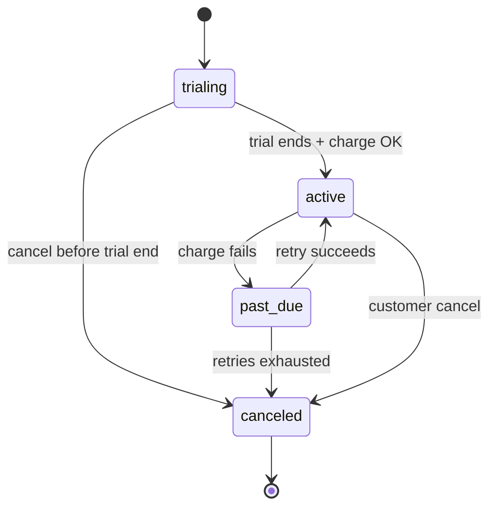

# Subscription Billing and Dunning

Recurring revenue products run on a **subscription state machine** — trial, active, past due, canceled — backed by invoice generation, payment retries, and entitlement gates. Billing is not a cron job; it is a **money + access** contract with your customer and your PSP(Payment Service Provider).

> **Scope:** Subscription lifecycle, invoice/charge retries, dunning communications, and when to suspend entitlements. Metering and billable events → [api-design §5A](../../api-design-and-protection/includes/05A-metering-entitlements-and-billable-events.md). Idempotency and double-charge → [§2](02-idempotency-and-double-charge.md). Ledger posting → [§3](03-ledger-and-double-entry.md). Disputes after failed recovery → [§4A](04A-disputes-and-chargebacks.md).
>
> **Related:** Reconciliation → [§4](04-fraud-and-reconciliation.md) · Refunds / payouts → [§3A](03A-refunds-payouts-settlement.md) · Developer portal plan display → [api-design §7A](../../api-design-and-protection/includes/07A-developer-portal.md) · Org/pricing fit → [architecture §14](../../architecture-decisions/includes/14-org-stage-and-pricing-fit.md)

---

## At a glance

| State | Customer experience | Platform action |
|-------|---------------------|-----------------|
| **trialing** | Full or limited access | No charge until trial end; card on file optional |
| **active** | Paid access | Invoice paid; entitlements on |
| **past_due** | Grace access or degraded | Retry charges; dunning emails |
| **canceled** | Access until period end or immediate | Stop renewal; honor prepaid window |

**Rule of thumb:** **Entitlements follow subscription state**, not the last successful HTTP(Hypertext Transfer Protocol) call. A past-due tenant with API(Application Programming Interface) access is a revenue leak and a support trap.

---

## Lifecycle flow

| Transition | Persist before side effects |
|------------|----------------------------|
| **Charge attempt** | Invoice row + idempotency key — [§2](02-idempotency-and-double-charge.md) |
| **past_due** | Timestamp + retry schedule; notify billing contacts |
| **Entitlement suspend** | Subscription state + audit; cache invalidation |
| **cancel** | End-of-period vs immediate; proration policy documented |

Meter aggregates feed invoice lines — [api-design §5A](../../api-design-and-protection/includes/05A-metering-entitlements-and-billable-events.md). Post recognized revenue only through the ledger — [§3](03-ledger-and-double-entry.md).

---

## Invoices and charge retries

| Element | Default |
|---------|---------|
| **Billing anchor** | Signup date or calendar month; document in contract |
| **Invoice idempotency** | One open invoice per period per subscription |
| **Retry schedule** | 3–5 attempts over 7–14 days; backoff aligned to PSP webhooks |
| **Payment method update** | Self-serve portal link in every dunning email |
| **Webhook handling** | Same idempotency as API — [§2](02-idempotency-and-double-charge.md) |

Verify ambiguous PSP responses before retrying. Ledger is the dedup boundary for "was this period paid?" — not the invoice UI alone.

---

## Dunning and communications

| Stage | Channel | Content |
|-------|---------|---------|
| **Soft decline (day 0)** | Email + in-app banner | Amount, date, update payment link |
| **Retry 2–3** | Email escalation | Consequence date for access reduction |
| **Final notice** | Email + account owner | Exact suspend date; support contact |
| **Post-recovery** | Receipt + status page | Confirm access restored |

Tone: factual, not punitive. Enterprise accounts may need AM(Account Manager) outreach parallel to automated dunning.

---

## Entitlement suspension

| Policy knob | Typical B2B(Business-to-Business) default |
|-------------|------------------------------------------|
| **Grace period** | 7–14 days read-only or full access |
| **Hard suspend** | Block writes + premium features; allow export |
| **Reinstate** | Immediate on successful charge; propagate to AuthZ(Authorization) cache |
| **Metering during past_due** | Still emit events; gate premium SKUs(Stock Keeping Units) only |

Coordinate with [api-design §5A](../../api-design-and-protection/includes/05A-metering-entitlements-and-billable-events.md) so rate limits and entitlements read the same subscription snapshot.

---

## Operational checklist

- [ ] Subscription states documented and exposed in admin API(Application Programming Interface)
- [ ] Invoice + charge idempotency keys tested against PSP sandbox
- [ ] Retry schedule matches PSP capabilities and timezone
- [ ] Dunning templates reviewed by legal/comms
- [ ] Entitlement suspend/reinstate under 60 s globally
- [ ] Ledger reconciles invoices to cash — [§4](04-fraud-and-reconciliation.md)

---

## Common mistakes

| Mistake | Fix |
|---------|-----|
| Canceling access instantly on first decline | Grace + dunning; contract-aligned |
| Double invoice on cron overlap | Idempotent period keys |
| Entitlements lag subscription by hours | Event-driven cache bust |
| Retries without webhook idempotency | Same keys as API path — [§2](02-idempotency-and-double-charge.md) |
| Usage billed after silent suspend | Finalize meter window at state change — [api §5A](../../api-design-and-protection/includes/05A-metering-entitlements-and-billable-events.md) |
| No self-serve payment update | Link in every dunning touch |

---

## Pros and cons

| Approach | Pros | Cons |
|----------|------|------|
| **PSP-managed subscriptions** | PCI(Payment Card Industry Data Security Standard) scope reduction; battle-tested dunning | Less control over state machine UX |
| **Own billing engine + PSP charges** | Full lifecycle control | You own retries, dunning, ledger sync |
| **Hard suspend on day 1** | Faster collections | Churn + enterprise backlash |
