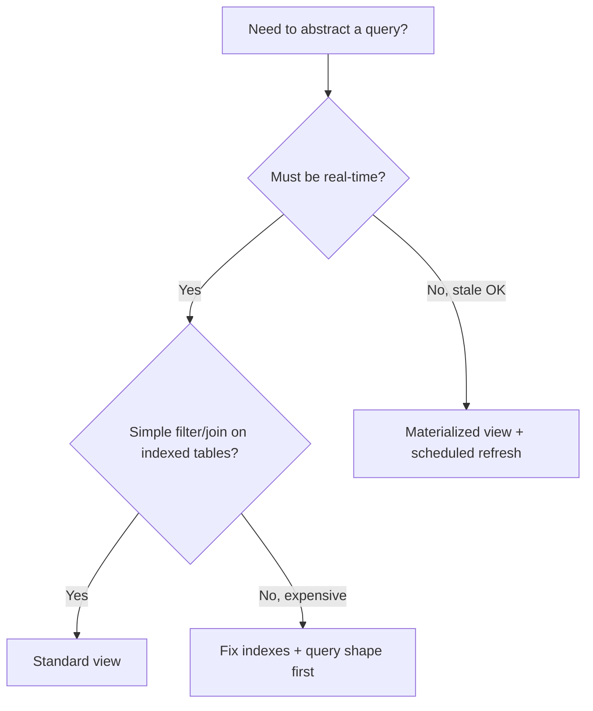
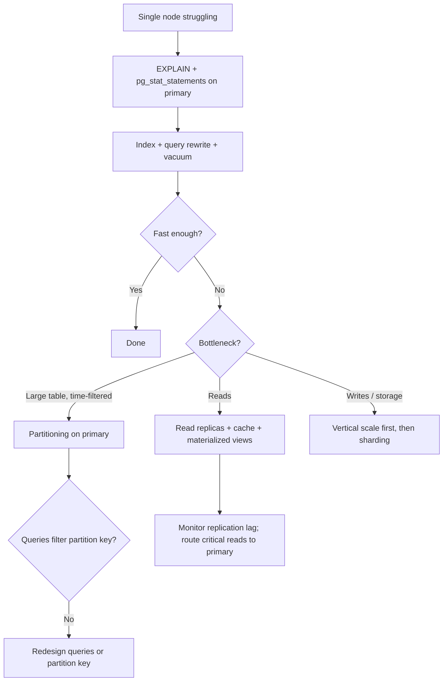
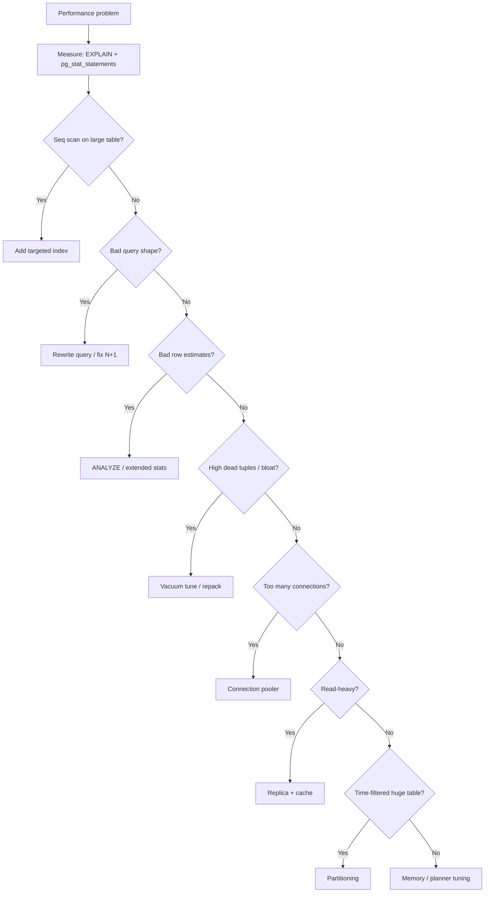
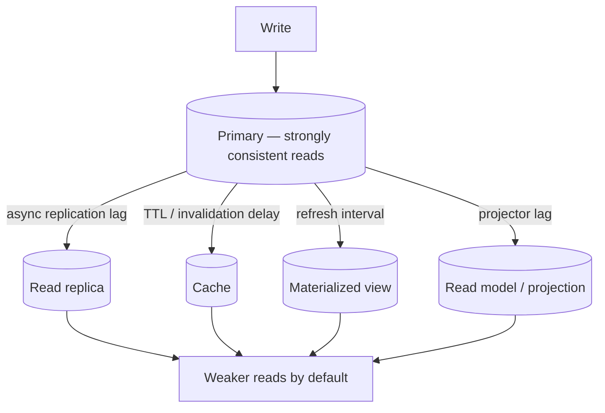
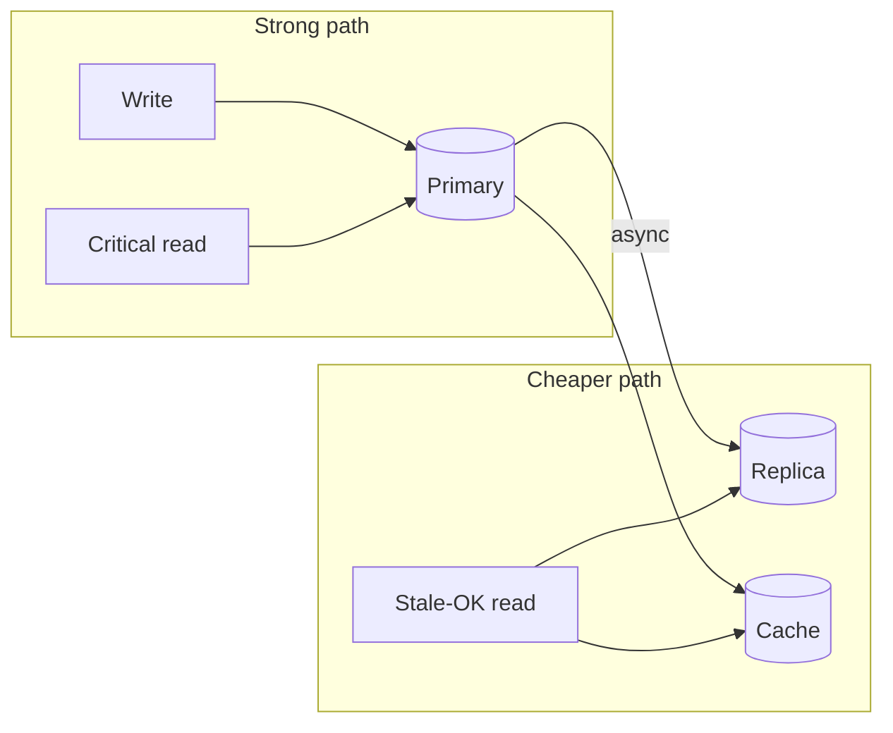
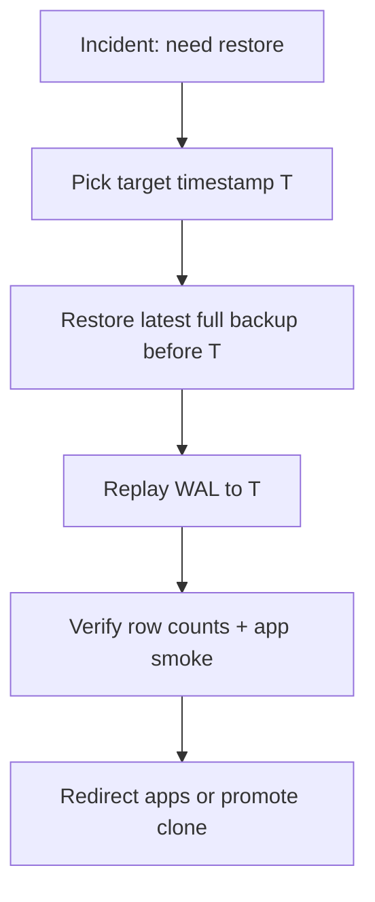

# PostgreSQL Performance Guide (Full)

> Combined view of all sections. Modular sources live in `includes/`.
> On GitHub, use the guide **README** table of contents for direct section links.

---

## Overview — PostgreSQL Performance

PostgreSQL performance work follows a predictable order: **measure first**, then fix queries and schema, tune the server, and scale out only when a single node is truly exhausted.

> **Related:** System-wide throughput order → [HTS README](../high-throughput-systems/README.md) · B+ vs LSM(Log-Structured Merge) storage → [tree-and-index-structures](../tree-and-index-structures/README.md) · Production credentials → [database-connection-and-security](../database-connection-and-security/README.md)

### Layers at a glance

| Layer | Focus | Typical tools |
|-------|-------|---------------|
| **Measurement** | Find slow queries and bad plans | `EXPLAIN ANALYZE`, `pg_stat_statements` |
| **Query & schema** | Indexes, query shape, data types | B-tree, partial, composite indexes |
| **Maintenance** | Bloat, dead tuples, statistics | Autovacuum, `ANALYZE`, `pg_repack` |
| **Connections** | Too many clients | PgBouncer, RDS Proxy |
| **Configuration** | Memory, planner costs, parallelism | `shared_buffers`, `work_mem` |
| **Scale-out** | Read load, large tables, retention | Replicas, partitioning, caching |
| **Backup / PITR(Point-in-Time Recovery)** | Recovery drills, WAL(Write-Ahead Log) restore | Managed backups, [§16](16-backup-restore-and-pitr.md) |

### Strategy quick comparison

| Strategy | Effort | Impact | When to use first |
|----------|--------|--------|-------------------|
| `EXPLAIN ANALYZE` | Low | High | Always — before any other change |
| Targeted indexes | Low–Medium | High | Seq scans on large tables |
| Query rewrite | Medium | High | Expensive joins, N+1, `SELECT *` |
| Autovacuum tuning | Medium | Medium | High-churn tables, bloat |
| Connection pooling | Low | High | Many app servers / connections |
| Memory tuning | Medium | Medium | Sort/hash-heavy workloads |
| Partitioning | High | High | Time-series at millions+ rows |
| Read replicas | Medium | Medium | Read-heavy after query optimization |
| App caching | Medium | High | Repeated identical hot reads |

### Default recommendation

For most OLTP workloads:

1. Enable **`pg_stat_statements`** and find the top queries by total time
2. Run **`EXPLAIN (ANALYZE, BUFFERS)`** on each slow query
3. Add **targeted indexes** (partial or composite where appropriate)
4. Put **PgBouncer** in front of the database before raising `max_connections`
5. Tune **`shared_buffers`** and **`effective_cache_size`** at deploy time
6. Read **[§9 scale-out terminology](09-views-functions-and-scale-out-terminology.md)** before choosing partitioning, replicas, or sharding
7. Only then consider **partitioning**, **replicas**, or **caching**

### Common mistakes

| Mistake | Fix |
|---------|-----|
| Skip measurement and buy bigger hardware | `pg_stat_statements` + EXPLAIN first |
| Replicas before query tuning | Optimize primary, then scale reads |
| Partition without pruning-friendly queries | Match partition key to filters |
| Raise `max_connections` instead of pooling | PgBouncer or RDS Proxy |
| Tune many config knobs at once | One change; re-measure each time |

### Performance decision flow

Full decision flowchart, scenario table, and common mistakes → **[§13 Decision guide and common mistakes](13-decision-guide-and-common-mistakes.md)**.

### Priority order

1. **Measure** — never optimize blind
2. **Index correctly** — partial, composite, covering where needed
3. **Fix queries and schema** — fewer round trips, right types
4. **Vacuum/analyze health** — especially on churny tables
5. **Connection pooling** — before raising `max_connections`
6. **Config tuning** — memory and SSD-aware planner costs
7. **Understand scale-out terms** — [§9](09-views-functions-and-scale-out-terminology.md): partitioning vs replication vs sharding
8. **Partitioning / replicas / caching** — when single-node fixes aren't enough
9. **Backup and PITR drills** — [§16 Backup, restore, and PITR](16-backup-restore-and-pitr.md) with [database-connection §12](../database-connection-and-security/includes/12-credential-rotation-and-dr.md)

---

## Measurement — Start Here

Always measure before adding indexes, changing config, or scaling hardware. Most performance problems are visible in query plans and statistics.

> **Scope:** **Database lens** — `EXPLAIN`, `pg_stat_statements`, query plans, and PostgreSQL statistics. System SLOs and load testing → [HTS §1 Measurement and SLO](../high-throughput-systems/includes/01-measurement-and-slo.md).
>
> **Related:** Load testing under concurrency → [HTS §1 Measurement and SLO](../high-throughput-systems/includes/01-measurement-and-slo.md) · Full decision flow → [§13 Decision guide](13-decision-guide-and-common-mistakes.md)

### EXPLAIN ANALYZE

Run on any slow or suspicious query:

```sql
EXPLAIN (ANALYZE, BUFFERS, VERBOSE)
SELECT ...
```

#### What to look for

| Signal | Likely cause | Next step |
|--------|--------------|-----------|
| **Seq Scan** on a large table | Missing or unused index | Add or fix index; check selectivity |
| **Nested Loop** with huge row counts | Bad join order or missing index | Index join columns; rewrite query |
| **Sort / HashAggregate** on millions of rows | No supporting index or pre-aggregation | Index for `ORDER BY`/`GROUP BY`; limit rows |
| **Actual vs estimated rows** wildly off | Stale or insufficient statistics | Run `ANALYZE`; consider extended statistics |
| High **shared/local hit ratio** in BUFFERS | Cache working well | — |
| High **read=** (disk reads) in BUFFERS | Data not in cache | Index, reduce scanned rows, more RAM |

### pg_stat_statements

The most important extension for production tuning. Tracks cumulative time per normalized query.

```sql
CREATE EXTENSION IF NOT EXISTS pg_stat_statements;

SELECT
  calls,
  round(total_exec_time::numeric, 2) AS total_ms,
  round(mean_exec_time::numeric, 2) AS mean_ms,
  rows,
  left(query, 120) AS query
FROM pg_stat_statements
ORDER BY total_exec_time DESC
LIMIT 20;
```

**Focus on:** queries with high **total time** (not just high mean time with few calls).

### Other useful views

| View | Use for |
|------|---------|
| `pg_stat_user_tables` | Seq scans vs index scans, dead tuples, last vacuum |
| `pg_stat_user_indexes` | Unused indexes (`idx_scan = 0`) |
| `pg_stat_activity` | Long-running queries, lock waits, idle in transaction |
| `pg_locks` | Blocking and blocked sessions |
| `pg_stat_database` | Cache hit ratio, commits, conflicts |

### Cache hit ratio

```sql
SELECT
  datname,
  round(100.0 * blks_hit / nullif(blks_hit + blks_read, 0), 2) AS cache_hit_pct
FROM pg_stat_database
WHERE datname = current_database();
```

Aim for **> 99%** on OLTP workloads. Lower values may indicate working set larger than RAM or missing indexes causing excess reads.

### When to use

| Situation | Tool |
|-----------|------|
| One query is slow | `EXPLAIN ANALYZE` on that query |
| General slowness under load | `pg_stat_statements` top by total time |
| Disk IO high | BUFFERS in EXPLAIN + cache hit ratio |
| Throughput collapsed | `pg_stat_activity` + `pg_locks` |
| After schema or data changes | Re-run EXPLAIN; compare plans |

### Best practices

- Capture plans on **production-like data volumes** — plans differ on empty tables
- Compare **before and after** when making changes
- Reset `pg_stat_statements` only when you need a clean window — not routinely
- Log slow queries (`log_min_duration_statement`) as a safety net, not a substitute for `pg_stat_statements`

### Common mistakes

| Mistake | Problem | Fix |
|---------|---------|-----|
| Optimize on empty dev tables | Plans don't match production | Test on realistic row counts |
| Focus only on mean time, ignore total time | Miss high-volume cheap queries | Sort `pg_stat_statements` by `total_exec_time` |
| Change index + config + query at once | Can't tell what helped | One change; re-measure |
| Skip BUFFERS in EXPLAIN | Can't tell cache vs disk IO | `EXPLAIN (ANALYZE, BUFFERS)` |
| Ignore idle-in-transaction in `pg_stat_activity` | Blocks vacuum; skews measurements | Fix app sessions; then re-measure |

---

## Indexing

Indexing is usually the **highest-ROI** optimization for read-heavy workloads. A well-chosen index turns a sequential scan of millions of rows into a few index lookups.

> **Related:** General tree and index structures (B+, LSM(Log-Structured Merge), when to use each) → [tree-and-index-structures/GUIDE.md](../tree-and-index-structures/GUIDE.md) · Query shape → [§3 Query design](03-query-design.md) · Online index builds → [§15 Schema migration checklist](15-schema-migration-checklist.md)

### Index types

| Type | When to use | Example |
|------|-------------|---------|
| **B-tree** (default) | Equality, ranges, sorting, most FK lookups | `WHERE status = 'active' AND created_at > ...` |
| **Partial index** | Queries always filter on a subset | `WHERE deleted_at IS NULL` |
| **Composite index** | Multi-column filters; order matters | `(tenant_id, created_at DESC)` |
| **Covering index** (`INCLUDE`) | Avoid heap lookups for extra columns | `CREATE INDEX ... INCLUDE (name, email)` |
| **GIN(Generalized Inverted Index)** | Full-text search, JSONB containment, arrays | `WHERE data @> '{"key": "val"}'` |
| **GiST / SP-GiST** | Geospatial, range types, nearest-neighbor | PostGIS, `tsrange` |
| **BRIN(Block-Range Index)** | Very large, naturally ordered data | Time-series timestamps, monotonic IDs |

### Column order in composite indexes

Put columns in this order:

1. **Equality filters** first (`=`, `IN`)
2. **Most selective** columns early
3. **Range / sort** columns last (supports `ORDER BY` on trailing columns)

```sql
-- Good for: WHERE tenant_id = ? AND status = 'active' ORDER BY created_at DESC
CREATE INDEX idx_orders_tenant_status_created
  ON orders (tenant_id, status, created_at DESC);
```

### Partial indexes

Index only the rows your query needs — smaller, faster, cheaper to maintain.

```sql
CREATE INDEX idx_users_active_email
  ON users (email)
  WHERE deleted_at IS NULL;
```

**When to use:** Soft deletes, status filters, "active only" queries that dominate traffic.

### Covering indexes (index-only scans)

When the index contains all columns the query needs, PostgreSQL can skip the heap:

```sql
CREATE INDEX idx_orders_covering
  ON orders (user_id, created_at DESC)
  INCLUDE (total, status);
```

Requires an up-to-date visibility map (healthy autovacuum).

### Pros and cons

| Pros | Cons |
|------|------|
| Dramatically faster reads | Slows INSERT/UPDATE/DELETE |
| Enables index-only scans | Uses disk space |
| Supports unique constraints | Wrong indexes waste resources |
| Partial indexes reduce write cost | Too many indexes confuse the planner |

### When to use

- `EXPLAIN` shows **Seq Scan** on a large table with a selective `WHERE`
- Foreign key columns used in **JOINs**
- Columns in **ORDER BY** or **GROUP BY** on large result sets
- JSONB fields queried with `@>`, `?`, `?&` → **GIN**
- Tables with **100M+** time-ordered rows and range queries → consider **BRIN**

### When NOT to use

- **Small tables** — sequential scan is often faster
- **Low-selectivity columns alone** — e.g. boolean `is_active` on its own
- **Write-heavy tables** where the indexed query is rare
- **Duplicating indexes** — `(a)` and `(a, b)` may make `(a)` redundant

### Best practices

- Index columns in `WHERE`, `JOIN`, and often `ORDER BY`
- Drop unused indexes: `pg_stat_user_indexes` where `idx_scan = 0`
- Use **`CREATE INDEX CONCURRENTLY`** in production (no write lock)
- Validate with `EXPLAIN ANALYZE` after creation
- Don't index every column "just in case"

### Common mistakes

| Mistake | Problem | Fix |
|---------|---------|-----|
| Index every column | Write slowdown; planner confusion | Index from EXPLAIN evidence only |
| Wrong composite column order | Index unused for common filters | Equality columns first; range/sort last |
| Duplicate indexes `(a)` and `(a,b)` | Redundant maintenance | Drop redundant single-column index |
| Partial index without matching query filter | Planner skips index | Align `WHERE` in index with query |
| `CREATE INDEX` (not CONCURRENTLY) in prod | Blocks writes | `CREATE INDEX CONCURRENTLY` |
| Never drop unused indexes | Wasted write cost | `pg_stat_user_indexes` where `idx_scan = 0` |

### Production example

```sql
-- Before: Seq Scan on 5M rows
EXPLAIN ANALYZE SELECT * FROM events WHERE org_id = 42 AND created_at > now() - interval '7 days';

-- Fix
CREATE INDEX CONCURRENTLY idx_events_org_created
  ON events (org_id, created_at DESC);

-- After: Index Scan or Bitmap Index Scan, ms instead of seconds
```

---

## Query Design

Even perfect indexes cannot fix a fundamentally expensive query shape. Query design reduces work before it hits the storage layer.

> **Related:** Index support for filters and sorts → [§2 Indexing](02-indexing.md) · Measurement first → [§1 Measurement](01-measurement.md) · System-wide latency → [HTS §5 Database throughput](../high-throughput-systems/includes/05-database-throughput.md)

### Core strategies

| Strategy | Why it helps | Example |
|----------|--------------|---------|
| **Select only needed columns** | Less IO, smaller rows | `SELECT id, name` not `SELECT *` |
| **Limit early** | Stop after enough rows | `LIMIT 20` with index supporting sort |
| **Avoid functions on indexed columns** | Index cannot be used | `created_at >= '2024-01-01'` not `date(created_at) = ...` |
| **Use EXISTS over IN** | Better for correlated large sets | `WHERE EXISTS (SELECT 1 FROM ...)` |
| **Batch writes** | Fewer round trips | Multi-row `INSERT`, `COPY` |
| **Eliminate N+1** | One round trip vs hundreds | JOIN or `WHERE id = ANY($1)` |

### N+1 problem

**Bad — one query per row:**

```text
SELECT * FROM orders WHERE user_id = 1;
SELECT * FROM orders WHERE user_id = 2;
... (N times)
```

**Good — single query:**

```sql
SELECT * FROM orders WHERE user_id = ANY($1::int[]);
-- or
SELECT o.* FROM orders o JOIN users u ON u.id = o.user_id WHERE u.org_id = $1;
```

### Pagination

**Offset pagination** (`LIMIT 20 OFFSET 100000`) gets slower as offset grows — PostgreSQL must scan and discard rows.

**Keyset pagination** (cursor-based) scales:

```sql
SELECT id, created_at, title
FROM posts
WHERE (created_at, id) < ($last_created_at, $last_id)
ORDER BY created_at DESC, id DESC
LIMIT 20;
```

Requires an index on `(created_at DESC, id DESC)`.

### Aggregations

- Pre-filter with `WHERE` before `GROUP BY`
- Use **`HAVING`** only when filtering aggregates — not as a substitute for `WHERE`
- For repeated expensive aggregates, consider **materialized views**

### JOINs

- Join on **indexed columns** (usually PK/FK)
- Avoid joining wide tables when only a few columns are needed — select early or use covering indexes
- `LEFT JOIN` where you filter the right table in `WHERE` often behaves like an inner join — put filters in `ON` when appropriate

### Common mistakes

| Mistake | Problem | Fix |
|---------|---------|-----|
| `SELECT *` on wide rows | Excess IO | Select needed columns |
| `OR` across different columns | Often prevents index use | `UNION ALL` of two indexed queries |
| Implicit cast mismatch | Index not used | Match column and parameter types |
| `NOT IN (subquery)` with NULLs | Surprising empty results | `NOT EXISTS` |
| Unbounded queries in APIs | Memory and timeout risk | Always paginate |
| Offset pagination on large tables | Linear slowdown as offset grows | Keyset / cursor pagination |
| ORM N+1 on hot paths | Hundreds of round trips | JOIN, batch `ANY()`, or eager load |

### When to use

- After `EXPLAIN` shows the plan is structurally expensive (large sorts, hash joins on huge sets)
- When ORMs generate inefficient SQL(Structured Query Language)
- When API(Application Programming Interface) latency scales with row count linearly
- When write amplification is high from many small statements

### Best practices

- Review ORM-generated SQL for hot paths
- Use **prepared statements** for repeated queries (plan caching)
- Set **`statement_timeout`** as a safety net
- Use **`EXPLAIN`** on production-shaped data, not empty dev databases

---

## Schema Design

Good schema design prevents expensive fixes later. Normalize first; denormalize only when measurement shows a real bottleneck.

> **Related:** Index choices for schema shape → [§2 Indexing](02-indexing.md) · Query patterns → [§3 Query design](03-query-design.md) · Online migrations → [§15 Schema migration checklist](15-schema-migration-checklist.md)

### Core principles

| Principle | Guidance |
|-----------|----------|
| **Normalize first** | Reduce redundancy; use FKs for integrity |
| **Denormalize deliberately** | Only when joins/aggregations are proven slow |
| **Right-size types** | `int` vs `bigint`, `text` vs `varchar(n)`, `timestamptz` over `timestamp` |
| **Use constraints** | PK, FK, `NOT NULL`, `CHECK` — help planner and data quality |
| **Avoid hot wide rows** | Split rarely accessed columns into separate tables |

### Data type choices

| Use | Instead of | Why |
|-----|------------|-----|
| `timestamptz` | `timestamp` | Timezone-aware; fewer bugs |
| `text` | `varchar(255)` | Same performance in PostgreSQL; no arbitrary limit |
| `bigint` for IDs | `int` | Avoid overflow on high-volume tables |
| `numeric` | `float` for money | Exact decimal arithmetic |
| `uuid` / `bigint` | Random string PKs | Smaller indexes; better locality with sequential IDs |

### JSONB

Good for semi-structured or evolving attributes. **Not** a replacement for columns you filter and join on constantly.

```sql
-- Queryable JSONB with GIN index
CREATE INDEX idx_events_payload ON events USING GIN (payload jsonb_path_ops);

SELECT * FROM events WHERE payload @> '{"type": "purchase"}';
```

| Use JSONB for | Use columns for |
|---------------|-----------------|
| Optional metadata | Primary filters and joins |
| Schema that changes often | Foreign keys |
| Nested documents | Sorting and range queries at scale |

### Primary keys and indexing

- Every table should have a **primary key**
- **Sequential IDs** (`bigint` identity) give better index locality than random UUIDs
- If using UUIDs, consider **`uuidv7`** or **`gen_random_uuid()`** with awareness of index bloat vs sequential inserts

### Foreign keys

Always index the **referencing column** (child side):

```sql
CREATE TABLE order_items (
  id bigint GENERATED ALWAYS AS IDENTITY PRIMARY KEY,
  order_id bigint NOT NULL REFERENCES orders(id),
  ...
);
CREATE INDEX idx_order_items_order_id ON order_items (order_id);
```

Without this index, deletes/updates on the parent table lock and scan the child.

### Soft deletes

If most queries filter `WHERE deleted_at IS NULL`, use a **partial index**:

```sql
CREATE INDEX idx_users_email_active ON users (email) WHERE deleted_at IS NULL;
```

### When to denormalize

- Read-heavy dashboards that aggregate across many joins
- Counters updated frequently (consider careful concurrency handling)
- Event logs where immutability makes duplication safe

Always measure join cost before denormalizing.

### Common mistakes

| Mistake | Problem | Fix |
|---------|---------|-----|
| JSONB for every filter column | Slow scans, huge GIN(Generalized Inverted Index) indexes | Relational columns for hot paths |
| Random UUID primary keys | Index bloat, poor insert locality | Sequential IDs or `uuidv7` |
| Missing FK index on child table | Parent DELETE/UPDATE scans child | Index referencing columns |
| Denormalize before measuring | Extra write complexity for no gain | `EXPLAIN` join cost first |
| `varchar(255)` everywhere | Arbitrary limits, no benefit in PG | Use `text` unless length constraint needed |
| Soft delete without partial index | Index includes deleted rows | `WHERE deleted_at IS NULL` partial index |

### Best practices

- Design for **query patterns**, not just entity diagrams
- Add constraints in migrations — not only in application code
- Plan **partition keys** early for time-series tables
- Keep migration scripts **online-friendly** (`CONCURRENTLY` for indexes)

---

## Statistics and the Query Planner

PostgreSQL's planner chooses join order, scan types, and parallel workers based on **table statistics**. Bad statistics lead to bad plans.

> **Related:** When plans go wrong after bulk load → [§6 Vacuum and bloat](06-vacuum-and-bloat.md) · SSD planner costs → [§8 Memory and configuration](08-memory-and-config.md) · Measurement workflow → [§1 Measurement](01-measurement.md)

### How statistics work

- **`ANALYZE`** samples rows and stores histograms, null fractions, and distinct counts in `pg_stats`
- **Autovacuum** runs `ANALYZE` automatically when enough rows change
- The planner compares **estimated rows** vs what you see as **actual rows** in `EXPLAIN ANALYZE`

### When estimates are wrong

| Symptom | Likely cause | Fix |
|---------|--------------|-----|
| Nested loop on huge set | Underestimated rows | `ANALYZE`; increase statistics target |
| Seq scan when index exists | Overestimated index cost | `ANALYZE`; lower `random_page_cost` on SSD |
| Bad join order | Correlated columns not captured | Extended statistics |
| Plan changed after bulk load | Stale stats | `ANALYZE` after load |

### default_statistics_target

Default is **100**. Increase for columns where the planner makes poor choices:

```sql
ALTER TABLE orders ALTER COLUMN status SET STATISTICS 500;
ANALYZE orders;
```

Higher values = better estimates but slower `ANALYZE` and slightly more planner time.

### Extended statistics

For correlated columns the planner treats as independent:

```sql
CREATE STATISTICS orders_status_created (dependencies)
  ON status, created_at FROM orders;

ANALYZE orders;
```

Types: `dependencies`, `ndistinct`, `mcv` (most common values).

### When to use

| Situation | Action |
|-----------|--------|
| After bulk INSERT/UPDATE/DELETE | `ANALYZE table_name` |
| Plan flip-flops between deploys | Check autovacuum; increase statistics target |
| Multi-column filters with skew | Extended statistics or partial indexes |
| New index not being used | `ANALYZE`; verify selectivity with `EXPLAIN` |

### Common mistakes

| Mistake | Problem | Fix |
|---------|---------|-----|
| Skip `ANALYZE` after bulk load | Stale row estimates, bad plans | `ANALYZE` table after large INSERT/UPDATE/DELETE |
| Raise `default_statistics_target` globally | Slower ANALYZE and planning everywhere | Per-column statistics target only |
| Ignore estimated vs actual rows in EXPLAIN | Miss planner regression | Compare in every `EXPLAIN ANALYZE` |
| Assume correlated columns are independent | Wrong join order | Extended statistics or partial indexes |
| Disable autovacuum on busy tables | Stats never refresh | Tune per-table autovacuum, don't disable |

### Best practices

- Trust autovacuum for steady-state OLTP — manual `ANALYZE` mainly after bulk changes
- Compare estimated vs actual rows in every `EXPLAIN ANALYZE`
- Don't raise statistics target globally — per-column is enough
- On PostgreSQL 14+, consider **`pg_stat_statements`** + auto-explain for plan regression detection

### Check current stats

```sql
SELECT schemaname, tablename, last_analyze, last_autoanalyze, n_live_tup, n_dead_tup
FROM pg_stat_user_tables
ORDER BY n_dead_tup DESC;
```

---

## Vacuum, Bloat, and Maintenance

PostgreSQL uses MVCC(Multi-Version Concurrency Control) — updated and deleted rows leave **dead tuples** until vacuum reclaims space. Neglected maintenance causes bloat, slower scans, and blocked index-only scans.

> **Related:** Statistics refresh after vacuum → [§5 Statistics and the planner](05-statistics-and-planner.md) · Retention without mass DELETE → [§10 Partitioning](10-partitioning.md) · Online maintenance → [§15 Schema migration checklist](15-schema-migration-checklist.md)

### What autovacuum does

| Task | Purpose |
|------|---------|
| **Dead tuple cleanup** | Reclaim space; keep tables lean |
| **Freeze** | Prevent transaction ID wraparound |
| **Visibility map update** | Enable index-only scans |
| **Statistics update** | Runs `ANALYZE` when enough rows change |

### Signs you need attention

| Signal | Where to look |
|--------|---------------|
| Growing table size despite deletes | `pg_total_relation_size`; bloat estimates |
| Queries slowing over time | Dead tuple accumulation |
| Index-only scans not happening | Stale visibility map |
| `autovacuum` constantly behind | High-churn tables; long transactions |
| `xid_wraparound` warnings | Critical — vacuum not keeping up |

### Monitoring

```sql
SELECT
  relname,
  n_live_tup,
  n_dead_tup,
  round(100.0 * n_dead_tup / nullif(n_live_tup + n_dead_tup, 0), 2) AS dead_pct,
  last_autovacuum,
  last_autoanalyze
FROM pg_stat_user_tables
ORDER BY n_dead_tup DESC
LIMIT 20;
```

### Tuning autovacuum (per table)

For high-churn tables:

```sql
ALTER TABLE events SET (
  autovacuum_vacuum_scale_factor = 0.02,
  autovacuum_analyze_scale_factor = 0.01
);
```

Lower scale factor = vacuum triggers sooner (more aggressive).

### Long-running transactions

Idle or long transactions **block vacuum** from reclaiming tuples they can still "see."

```sql
SELECT pid, state, xact_start, query
FROM pg_stat_activity
WHERE state != 'idle'
  AND xact_start < now() - interval '5 minutes';
```

Fix at the application layer: short transactions, connection pool timeouts, kill idle-in-transaction sessions.

### Manual maintenance

```sql
VACUUM (ANALYZE) orders;          -- routine after large deletes
VACUUM FULL orders;               -- rewrites table — locks exclusively; avoid in prod peak
REINDEX INDEX CONCURRENTLY idx_orders_user_id;
```

### pg_repack

For large tables with heavy bloat without long `VACUUM FULL` locks — rewrites the table online (extension).

### When to use

| Situation | Action |
|-----------|--------|
| High UPDATE/DELETE rate | Per-table autovacuum tuning |
| Bulk delete of old data | `VACUUM ANALYZE` or drop partitions instead |
| Table 2× expected size | Investigate bloat; consider `pg_repack` |
| Index-only scans never appear | Ensure autovacuum is running; check visibility map |

### Common mistakes

| Mistake | Problem | Fix |
|---------|---------|-----|
| Long idle-in-transaction sessions | Block vacuum, dead tuples accumulate | Pool timeouts; short transactions |
| `VACUUM FULL` during peak hours | Exclusive lock on table | `pg_repack` or maintenance window |
| Disable autovacuum globally | Wraparound risk, unbounded bloat | Tune per-table; never disable cluster-wide |
| Mass `DELETE` for retention | Bloat and long vacuum cycles | Drop partitions instead |
| Ignore dead tuple ratio alerts | Queries degrade gradually | Monitor `n_dead_tup` on churny tables |

### Best practices

- Never disable autovacuum globally
- Prefer **partition drops** over mass `DELETE` for retention
- Schedule heavy `REINDEX`/`VACUUM FULL` in maintenance windows
- Monitor dead tuple ratio on your busiest tables

---

## Connection Management

> **Related:** Production credentials and PgBouncer patterns → [database-connection-and-security](../database-connection-and-security/README.md) · [§9 PgBouncer + secret](../database-connection-and-security/includes/09-pgbouncer-proxy-password.md)

PostgreSQL creates **one process per connection**. Beyond a few hundred active connections, context switching and memory overhead hurt performance even when queries are idle.

### The problem

| Factor | Impact |
|--------|--------|
| `max_connections = 500` | 500 backend processes — each uses memory |
| Microservices × replicas | Connection count multiplies quickly |
| Idle connections | Still consume RAM and file descriptors |
| Connection storms | New connections are expensive to establish |

### Solution: connection pooling

Use a pooler between apps and PostgreSQL:

| Tool | Notes |
|------|-------|
| **PgBouncer** | Most common; transaction or session pooling |
| **RDS Proxy** | AWS managed; IAM(Identity and Access Management) auth support |
| **Supabase pooler** | Built on PgBouncer |
| **Pgpool-II** | Pooling + load balancing + replication |

### PgBouncer pooling modes

| Mode | Behavior | Best for |
|------|----------|----------|
| **Transaction** | Connection returned after each transaction | Most web apps, stateless APIs |
| **Session** | Connection held for entire client session | Prepared statements, temp tables, `SET` |
| **Statement** | Connection returned after each statement | Rare; breaks multi-statement transactions |

### Recommended settings

```text
PostgreSQL:  max_connections = 100–300 (not 1000+)
PgBouncer:   default_pool_size = 20–50 per database/user
App servers: pool size = (expected concurrent queries) not (thread count)
```

Rule of thumb: **total app pool connections < PostgreSQL max_connections**, with headroom for admin and migrations.

### Prepared statements and transaction pooling

With **transaction pooling**, prepared statements don't persist across transactions. Options:

- Disable prepared statements in the ORM for pooled connections
- Use **session pooling** if you need persistent prepared statements
- PgBouncer 1.21+ has improved prepared statement support — verify your stack

### When to use

| Situation | Action |
|-----------|--------|
| > 100 connections from apps | Add PgBouncer |
| "Too many connections" errors | Pool, don't raise `max_connections` blindly |
| Server RAM high with idle clients | Transaction pooling |
| Lambda / serverless | External pooler (RDS Proxy, PgBouncer sidecar) |

### Best practices

- Set **`idle_in_transaction_session_timeout`** to kill stuck transactions
- Set **`statement_timeout`** on application roles
- One pool per service — not one giant shared pool with no limits
- Monitor: `pg_stat_activity` connection count by `application_name`

### Common mistakes

| Mistake | Problem | Fix |
|---------|---------|-----|
| Raise `max_connections` instead of pooling | Memory exhaustion; thrashing | PgBouncer or RDS Proxy |
| App pool size = thread count per instance | `replicas × pool` exceeds DB limit | Size pool to concurrent queries |
| Transaction pooling + ORM prepared statements | Broken or degraded queries | Disable prepared statements or use session pooling |
| No `idle_in_transaction_session_timeout` | Idle sessions block vacuum | Set timeout on app roles |
| One shared DB user for all services | Blast radius on credential leak | One role per service |

---

## Memory and Configuration Tuning

PostgreSQL performance depends heavily on memory settings and planner cost constants. Tune once at deploy, then adjust based on workload evidence.

> **Related:** Measure before tuning → [§1 Measurement](01-measurement.md) · Wrong plans on SSD → [§5 Statistics and the planner](05-statistics-and-planner.md) · Connection limits vs memory → [§7 Connection management](07-connection-management.md)

### Key parameters

| Parameter | Rule of thumb | Purpose |
|-----------|---------------|---------|
| **`shared_buffers`** | ~25% of RAM (cap ~8–16 GB) | PostgreSQL page cache |
| **`effective_cache_size`** | ~50–75% of total RAM | Tells planner how much OS cache exists |
| **`work_mem`** | 4–64 MB per operation | Sorts, hashes, merge joins |
| **`maintenance_work_mem`** | 256 MB – 2 GB | Index builds, vacuum, `CREATE INDEX` |
| **`random_page_cost`** | 1.1–1.5 on SSD/NVMe | Planner index vs seq scan preference |
| **`effective_io_concurrency`** | 200+ on NVMe | Concurrent read prefetch |
| **`max_parallel_workers_per_gather`** | 2–4 | Parallel sequential scans/aggregates |

### work_mem warning

`work_mem` is **per sort/hash operation per connection**, not global.

```text
100 connections × 4 hash operations × 64 MB work_mem = up to 25 GB
```

Set conservatively globally; raise per-session for reporting:

```sql
SET work_mem = '256MB';  -- reporting session only
```

### Example production baseline (16 GB RAM, SSD)

```text
shared_buffers = 4GB
effective_cache_size = 12GB
work_mem = 16MB
maintenance_work_mem = 1GB
random_page_cost = 1.1
effective_io_concurrency = 200
max_parallel_workers_per_gather = 2
max_connections = 200
```

Adjust for your RAM and workload — these are starting points, not gospel.

### WAL and checkpoint (write-heavy)

| Parameter | Notes |
|-----------|-------|
| **`wal_buffers`** | Often 16–64 MB on busy systems |
| **`checkpoint_completion_target`** | 0.9 — spread checkpoint IO |
| **`max_wal_size`** | Higher = fewer checkpoints, more WAL disk |

Spiky write latency during checkpoints? Increase `max_wal_size` and tune checkpoint settings.

### When to tune

| Workload signal | Parameter to adjust |
|-----------------|---------------------|
| Planner chooses seq scan on SSD | Lower `random_page_cost` |
| Sorts spill to disk (`external merge`) | Raise `work_mem` (carefully) |
| Slow index builds | Raise `maintenance_work_mem` |
| Large table scans on analytics | Raise `max_parallel_workers_per_gather` |
| OOM under load | Lower `work_mem`; add pooling |

### Common mistakes

| Mistake | Problem | Fix |
|---------|---------|-----|
| High global `work_mem` | OOM under concurrent sorts/hashes | Conservative global; raise per-session for reports |
| `shared_buffers` at 80% of RAM | Starves OS page cache | ~25% of RAM, cap 8–16 GB |
| Copy tuning from blog without workload match | Wrong trade-offs | Change one parameter; measure with `EXPLAIN` and metrics |
| Max parallelism on OLTP | Contention on short queries | Low `max_parallel_workers_per_gather` for OLTP |
| Ignore temp file spikes | Sorts spilling to disk unnoticed | Monitor temp files; tune `work_mem` for heavy queries |

### When NOT to tune blindly

- Don't set `shared_buffers` to 80% of RAM — OS cache matters
- Don't max out parallelism on OLTP — hurts concurrent short queries
- Don't change many parameters at once — measure one change at a time

### Managed databases

RDS, Cloud SQL(Structured Query Language), Supabase, and Azure expose these via parameter groups. Some require reboot; others are dynamic. Check provider docs for limits.

### Best practices

- Document your baseline and why each value was chosen
- Use **`pg_tune`** or similar calculators as a starting point only
- Revisit after major workload changes (10× data growth, new reporting)
- Monitor temp file usage — sign that `work_mem` is too low

---

## Views, Functions, and Scale-Out Terminology

PostgreSQL offers several ways to abstract queries (views), encapsulate logic (functions and procedures), and scale beyond one node (partitioning, replication, sharding). These tools overlap in name but solve different problems — mixing them up leads to wrong architecture choices.

> **Read this first** before [Partitioning](10-partitioning.md), [Read scaling and caching](11-read-scaling-and-caching.md), or [Strong consistency](14-consistency-promises-and-costs.md) if terms like sharding vs replication are unclear.

> **Related:**
> - Index types and patterns → [02-indexing.md](02-indexing.md)
> - Query shape and common mistakes → [03-query-design.md](03-query-design.md)
> - Single-node table splits → [10-partitioning.md](10-partitioning.md)
> - Read replicas and materialized views → [11-read-scaling-and-caching.md](11-read-scaling-and-caching.md)
> - Consistency when scaling reads → [14-consistency-promises-and-costs.md](14-consistency-promises-and-costs.md)

---

### At a glance

| Tool | Stored data? | Performance role | Primary use |
|------|--------------|------------------|-------------|
| **Standard view** | No — saved query | Abstraction only; no speedup by itself | Simplify SQL(Structured Query Language), hide columns, security |
| **Materialized view** | Yes — snapshot | Pre-compute expensive reads | Dashboards, heavy aggregations |
| **Function** | No — compiled logic | Can help or hurt index use | Reusable logic, triggers, expressions |
| **Procedure** | No — batch logic | Batch work in fewer round trips | Maintenance jobs, multi-step ETL(Extract, Transform, Load) |
| **Partitioning** | Yes — split on one server | Pruning, retention, smaller indexes | Time-series, large tables on one node |
| **Replication** | Yes — full copy per node | Read scaling, HA | Same data on multiple servers |
| **Sharding** | Yes — subset per node | Write scaling across servers | Single-node writes exhausted |

---

### Views

#### View types

| Type | Definition stored? | Data stored? | Always fresh? |
|------|-------------------|--------------|---------------|
| **Standard (regular) view** | Yes | No | Yes |
| **Materialized view** | Yes | Yes | No — until `REFRESH` |
| **Recursive view** | Yes (CTE) | No | Yes |
| **Updatable view** | Yes | No (uses base tables) | Yes |

#### Standard views

A standard view is a named query. PostgreSQL rewrites queries against the view into the underlying SQL each time.

```sql
CREATE VIEW active_users AS
SELECT id, email, created_at
FROM users
WHERE deleted_at IS NULL;
```

| Pros | Cons |
|------|------|
| No extra storage | No performance gain unless it simplifies access patterns |
| Always up to date | Complex views can produce expensive plans |
| Can restrict visible rows/columns | Updatable only under specific rules |

**When to use:** Hide internal schema details, enforce row-level filters, give applications a stable interface during schema refactors.

**When NOT to use:** As a substitute for an index or materialized view on expensive aggregations.

##### Security barrier views

For views that enforce security predicates, use `security_barrier` so the planner cannot push untrusted user filters below the barrier and leak rows:

```sql
CREATE VIEW tenant_orders
WITH (security_barrier) AS
SELECT * FROM orders WHERE tenant_id = current_setting('app.tenant_id')::int;
```

#### Materialized views

Materialized views store query results physically. Reads are fast; freshness depends on refresh schedule.

```sql
CREATE MATERIALIZED VIEW daily_revenue AS
SELECT date_trunc('day', created_at) AS day, sum(amount) AS total
FROM orders
GROUP BY 1;

CREATE UNIQUE INDEX ON daily_revenue (day);

REFRESH MATERIALIZED VIEW CONCURRENTLY daily_revenue;
```

| Pros | Cons |
|------|------|
| Dramatically faster reads for heavy aggregations | Stale until refreshed |
| Native PostgreSQL — no extra infrastructure | Storage and maintenance cost |
| `REFRESH CONCURRENTLY` avoids read locks (needs unique index) | Not suitable for real-time data |

**When to use:** Dashboards tolerating minutes of lag; reports that scan millions of rows repeatedly.

**When NOT to use:** Session-critical reads after a write — use base tables or route to primary.

See also [Read scaling and caching](11-read-scaling-and-caching.md) for refresh patterns and consistency trade-offs.

#### Recursive views

Use recursive views (or recursive CTEs) for hierarchies — org charts, category trees, bill-of-materials:

```sql
CREATE RECURSIVE VIEW org_tree AS
  SELECT id, name, manager_id, 1 AS depth
  FROM employees
  WHERE manager_id IS NULL
  UNION ALL
  SELECT e.id, e.name, e.manager_id, t.depth + 1
  FROM employees e
  JOIN org_tree t ON e.manager_id = t.id;
```

**Performance note:** Deep or wide trees can be expensive. Index `(manager_id)` and consider materializing if the hierarchy is read-heavy and changes infrequently.

#### Updatable views

Simple views on a single table with no aggregates can be updatable via `INSERT`/`UPDATE`/`DELETE`. Complex views need `INSTEAD OF` triggers.

**Rule of thumb:** Prefer updating base tables in hot OLTP paths. Views are fine for admin tools and controlled APIs.

#### Choosing a view type



---

### Functions and procedures

#### Functions vs procedures

| | **Function** | **Procedure** (PostgreSQL 11+) |
|--|--------------|----------------------------------|
| **Returns** | Scalar, row, set, or void | Nothing (`CALL` only) |
| **Use in SQL** | Yes — `SELECT fn()` | No — `CALL proc()` only |
| **Transaction control** | Runs in caller's transaction | Can `COMMIT` / `ROLLBACK` inside |
| **Typical role** | Expressions, triggers, reusable logic | Batch jobs, maintenance, ETL |

```sql
-- Function: reusable, index-friendly when marked correctly
CREATE FUNCTION user_display_name(u users) RETURNS text
LANGUAGE sql STABLE AS $$
  SELECT coalesce(u.display_name, split_part(u.email, '@', 1));
$$;

-- Procedure: batch work with explicit commits
CREATE PROCEDURE archive_old_orders()
LANGUAGE plpgsql AS $$
BEGIN
  INSERT INTO orders_archive
  SELECT * FROM orders
  WHERE created_at < now() - interval '2 years';

  DELETE FROM orders
  WHERE created_at < now() - interval '2 years';

  COMMIT;
END;
$$;
```

#### Volatility and the planner

Function volatility tells PostgreSQL whether the planner can optimize through the function:

| Marker | Meaning | Index on expression? | Planner can inline? |
|--------|---------|----------------------|---------------------|
| `IMMUTABLE` | Same inputs → same output; no DB reads | Yes | Often |
| `STABLE` | Same result within one statement; may read DB | Sometimes | Limited |
| `VOLATILE` (default) | Can change anything, including side effects | No | No |

```sql
-- Good: expression index works
CREATE INDEX idx_users_email_lower ON users (lower(email));

-- Bad: function on indexed column prevents index use
WHERE date(created_at) = '2024-01-01'   -- likely Seq Scan
WHERE created_at >= '2024-01-01'
  AND created_at < '2024-01-02'         -- Index Scan
```

Mark functions accurately. Incorrect `IMMUTABLE` on a function that reads the database can produce wrong results.

#### Language choice

| Language | Best for | Performance note |
|----------|----------|------------------|
| **SQL** | Simple expressions, set-returning logic | Often inlinable; fastest when it stays inline |
| **plpgsql** | Control flow, exception handling, batch loops | Overhead per call; avoid row-by-row loops |
| **plpython / others** | Specialized integrations | Higher call overhead; use for batch, not per-row |

#### When functions and procedures help performance

| Do | Don't |
|----|-------|
| Batch updates in one procedure call | Call a function once per row from the application |
| Use `SQL` functions for simple transforms | Put business logic in DB when the team can't maintain it |
| Mark pure helpers `IMMUTABLE` or `STABLE` correctly | Default everything to `VOLATILE` and wonder why indexes aren't used |
| Use procedures for scheduled maintenance with commits | Use long-running functions inside OLTP transactions |

See [Query design](03-query-design.md) — **avoid functions on indexed columns** in `WHERE` clauses.

---

### Partitioning vs replication vs sharding vs clustering

These terms are often used interchangeably. In PostgreSQL they mean different things.

#### Side-by-side comparison

| Concept | Where data lives | Write path | Read path | Built into PostgreSQL? |
|---------|------------------|------------|-----------|------------------------|
| **Partitioning** | One server; table split into child tables | Single primary | Single node (with pruning) | Yes — declarative partitioning |
| **Replication** | Full database copy on each standby | Primary only (usually) | Any replica; same data everywhere | Yes — streaming and logical |
| **Sharding** | Subset of rows per server | Distributed across shards | Route to correct shard(s) | No native — Citus, app routing, FDW |
| **Clustering** | Ambiguous — see below | Varies | Varies | Partially |

#### Partitioning (single-node split)

Partitioning divides one logical table into physical child tables on **one PostgreSQL instance**. Queries that filter on the **partition key** skip irrelevant partitions (**partition pruning**).

```sql
CREATE TABLE events (
  id bigint GENERATED ALWAYS AS IDENTITY,
  org_id int NOT NULL,
  created_at timestamptz NOT NULL,
  payload jsonb
) PARTITION BY RANGE (created_at);

CREATE TABLE events_2026_06 PARTITION OF events
  FOR VALUES FROM ('2026-06-01') TO ('2026-07-01');
```

| Strategy | Partition key example | Typical use |
|----------|----------------------|-------------|
| **Range** | `created_at` by month | Time-series, retention |
| **List** | `region IN ('us', 'eu')` | Discrete categories |
| **Hash** | `hash(user_id)` | Even spread on one node — not cross-server sharding |

**Not sharding:** Hash partitioning on one server still shares one write path and one disk. It helps pruning and maintenance, not write throughput across machines.

Full details → [Partitioning](10-partitioning.md).

#### Replication (full copy per node)

Streaming replication ships WAL(Write-Ahead Log) from primary to one or more standbys. Each standby holds a **complete copy** of the database.

| Mode | Consistency | Write throughput | Typical use |
|------|-------------|------------------|-------------|
| Async streaming | Eventual on replicas | Highest | Read scaling, HA |
| Sync replication | Standby ack before commit | Lower | Stronger durability / RPO(Recovery Point Objective) |
| Logical replication | Table-level, selective | Flexible | Upgrades, selective sync |

**Use for:** High availability, failover, offloading read-heavy traffic.

**Not for:** Write scaling — every replica replays all writes from the primary.

Full details → [Read scaling and caching](11-read-scaling-and-caching.md) and [Strong consistency](14-consistency-promises-and-costs.md).

#### Sharding (horizontal split across servers)

Sharding splits data **across multiple independent database servers**. Each shard holds a subset of rows; no single node has all data.

```text
              ┌──────────────┐
user_id % 3 = 0 ──►│   Shard A    │
user_id % 3 = 1 ──►│   Shard B    │
user_id % 3 = 2 ──►│   Shard C    │
              └──────────────┘
         (coordinator or app routes queries)
```

| Approach | How routing works | Trade-offs |
|----------|-------------------|------------|
| **Application-level** | App picks shard by key | Full control; cross-shard queries in app |
| **Citus** | PostgreSQL extension; distributed tables | Native SQL; coordinator overhead |
| **Foreign Data Wrappers (FDW)** | Foreign tables on a coordinator | Flexible; often slower cross-node joins |
| **Managed services** | Cloud-native sharding layers | Less ops; vendor lock-in |

**Use when:** Single-node write throughput or storage is exhausted **after** query optimization, indexing, and vertical scaling.

**Costs:** Cross-shard joins, transactions, and aggregations become hard. Resharding is a major project.

#### "Clustering" — three different meanings

| Meaning | What it is | PostgreSQL example |
|---------|------------|-------------------|
| **HA cluster** | Multiple nodes with one primary and automatic failover | Patroni, repmgr, cloud managed HA |
| **`CLUSTER` command** | One-time rewrite of table rows in index order | `CLUSTER orders USING idx_orders_user_id` |
| **Distributed cluster** | Sharded or multi-node coordinated setup | Citus, logical replication topologies |

When someone says "PostgreSQL cluster," clarify which they mean before designing.

#### Scale-out decision flow



#### Cheat sheet — pick the right scale-out tool

| Problem | Tool |
|---------|------|
| Table too large; queries always filter by date | **Partitioning** (range) |
| Need to drop old data fast | **Partitioning** + `DROP TABLE` |
| 10× more reads than writes | **Read replicas** + app routing |
| Expensive aggregation query | **Materialized view** |
| Single-node writes maxed out | **Sharding** (Citus or app-level) — last resort |
| Failover and HA | **Streaming replication** + HA manager |
| Rewrite table in index order (maintenance) | **`CLUSTER`** or `pg_repack` — not scale-out |

---

### Common mistakes

| Mistake | Why it fails | Do instead |
|---------|--------------|------------|
| Materialized view for real-time UI | Stale reads after writes | Base table + index, or refresh on write |
| Standard view expecting speedup | View re-runs full query each time | Index underlying tables; consider materialized view |
| `VOLATILE` function in `WHERE` on indexed column | Index not used | Rewrite predicate; mark function correctly |
| Hash partition thinking it shards writes | Still one server, one WAL | Sharding only when multi-node writes needed |
| Read replica before fixing slow queries | Replicas multiply bad-query cost | Optimize on primary first |
| Sharding for read-heavy workload | Replicas are simpler | Replicas + cache until writes force sharding |
| Confusing HA cluster with sharding | HA replicates all data; sharding splits it | Match tool to read vs write bottleneck |

---

### See also

- [Indexing](02-indexing.md) — B-tree, partial, GIN(Generalized Inverted Index), BRIN(Block-Range Index), and covering indexes
- [Query design](03-query-design.md) — pagination, N+1, functions on indexed columns
- [Partitioning](10-partitioning.md) — range, list, hash, pruning, retention
- [Read scaling and caching](11-read-scaling-and-caching.md) — replicas, Redis, materialized view refresh
- [Decision guide and common mistakes](13-decision-guide-and-common-mistakes.md) — scenario recommendations and priority checklist
- [Strong consistency — promises and costs](14-consistency-promises-and-costs.md) — replication lag and read-your-writes

---

## Partitioning

Partitioning splits one logical table into smaller physical pieces. Queries that filter on the **partition key** can skip irrelevant partitions (**partition pruning**).

> **Related:** Partitioning vs sharding vs replication vs clustering → [09-views-functions-and-scale-out-terminology.md](09-views-functions-and-scale-out-terminology.md)

### Partition strategies

| Strategy | Key type | Example |
|----------|----------|---------|
| **Range** | Ordered values | `created_at` by month |
| **List** | Discrete values | `region IN ('us', 'eu')` |
| **Hash** | Even distribution | `user_id` hash for sharding-like split |

Use **declarative partitioning** (PostgreSQL 10+):

```sql
CREATE TABLE events (
  id bigint GENERATED ALWAYS AS IDENTITY,
  org_id int NOT NULL,
  created_at timestamptz NOT NULL,
  payload jsonb
) PARTITION BY RANGE (created_at);

CREATE TABLE events_2026_06 PARTITION OF events
  FOR VALUES FROM ('2026-06-01') TO ('2026-07-01');
```

### Pros and cons

| Pros | Cons |
|------|------|
| Faster queries with partition pruning | Queries without partition key scan all partitions |
| Drop old data by dropping partition | More complex migrations and monitoring |
| Smaller indexes per partition | Unique constraints must include partition key |
| Targeted vacuum/maintenance | Wrong key choice is hard to fix |

### When to use

- Tables with **millions+ rows** where queries **always filter** on the partition key
- **Time-series** data with retention policies
- Need to **drop** old data regularly (compliance, cost)
- Maintenance windows — vacuum/reindex one partition at a time

### When NOT to use

- Small or medium tables
- Queries that don't filter on the partition key
- "Might need it someday" without a pruning-friendly access pattern

### Retention pattern

```sql
-- Drop June 2025 data instantly (vs DELETE millions of rows)
DROP TABLE events_2025_06;
```

Schedule partition creation ahead of time (cron, pg_partman extension).

### Verify pruning

```sql
EXPLAIN SELECT * FROM events
WHERE created_at >= '2026-06-01' AND created_at < '2026-06-15';
```

Look for **`Partition Prune`** or scans on a single child table only — not all partitions.

### Index strategy

Index each partition the same way, or use partitioned indexes:

```sql
CREATE INDEX ON events (org_id, created_at DESC);
-- Creates matching indexes on all partitions
```

### Best practices

- Choose partition granularity so each partition is **manageable** (often monthly or weekly for events)
- Automate partition creation and old partition drops
- Include partition key in unique constraints and PKs
- Combine with **BRIN(Block-Range Index)** on time column inside very large partitions if appropriate

### Common mistakes

| Mistake | Problem | Fix |
|---------|---------|-----|
| Partition without partition key in queries | Scans all partitions | Match schema to query patterns |
| Monthly partitions for 10k-row table | Unnecessary complexity | Wait until millions+ rows |
| Unique constraint without partition key | Invalid or awkward constraints | Include partition key in PK/unique |
| Mass DELETE for retention | Bloat and long vacuum | `DROP TABLE` old partition |
| Skip verifying prune in EXPLAIN | Silent full scan across children | Confirm `Partition Prune` in plan |

---

## Read Scaling, Replication, and Caching

When query optimization and indexing aren't enough for read load, scale reads horizontally — but only **after** fixing slow queries on the primary.

> **Related:** Replication vs sharding vs partitioning → [09-views-functions-and-scale-out-terminology.md](09-views-functions-and-scale-out-terminology.md) · What strong consistency promises, what it costs, and when to require it → [Strong consistency — promises and costs](14-consistency-promises-and-costs.md)

### Read replicas

Streaming replication sends WAL(Write-Ahead Log) changes to one or more standby servers.

| Pros | Cons |
|------|------|
| Offload SELECT traffic from primary | Replication lag |
| Simple mental model | Replicas don't fix bad queries |
| Managed on all major clouds | No automatic query routing |

#### When to use

- Read-heavy workloads: dashboards, search, reporting
- Primary CPU or IO saturated by **SELECT** after optimization
- Geographic read locality (read replica in another region)

#### Caveats

- **Read-your-writes:** after an INSERT, a read from replica may be stale — route session-critical reads to primary
- Replicas replay writes too — very write-heavy primaries can lag replicas
- Run the same `EXPLAIN ANALYZE` on replica — bad plans are bad everywhere

### Caching layers

| Layer | Tool | When to use |
|-------|------|-------------|
| **Application cache** | Redis, Memcached | Hot keys, session data, idempotent reads |
| **Materialized view** | PostgreSQL native | Expensive SQL(Structured Query Language) aggregations refreshed periodically |
| **Query result cache** | ORM / CDN(Content Delivery Network) | Identical repeated API(Application Programming Interface) responses |
| **Unlogged tables** | PostgreSQL | Staging/bulk temp data (not crash-safe) |

#### Materialized views

```sql
CREATE MATERIALIZED VIEW daily_revenue AS
SELECT date_trunc('day', created_at) AS day, sum(amount) AS total
FROM orders
GROUP BY 1;

CREATE UNIQUE INDEX ON daily_revenue (day);

REFRESH MATERIALIZED VIEW CONCURRENTLY daily_revenue;
```

**When to use:** Dashboards tolerating minutes of staleness; heavy aggregations over millions of rows.

#### Application cache (Redis)

**When to use:**

- Same key read thousands of times per second
- Computed values expensive to derive
- Rate limit counters, feature flags

**Cache invalidation patterns:** TTL, delete-on-write, and event-driven invalidation — full patterns, CDN layer, cache-aside vs write-through, and stampede mitigation → [high-throughput-systems §4 Caching layers](../high-throughput-systems/includes/04-caching-layers.md).

### Layered read path

End-to-end flow (Redis → primary vs replica routing, plus CDN for public GETs) lives in [high-throughput-systems §4 — Layered read path](../high-throughput-systems/includes/04-caching-layers.md#layered-read-path). This section focuses on **PostgreSQL-specific** pieces: replicas, materialized views, and `pg_stat_replication`.

### When to use what

| Scenario | Recommendation |
|----------|----------------|
| Single slow report query | Materialized view or pre-aggregation table |
| Hot product page | Redis cache with TTL |
| 10× read vs write ratio | Read replica + app routing |
| Search autocomplete | Dedicated index (GIN(Generalized Inverted Index)) + cache; not replica alone |
| Global low-latency reads | Replicas per region + CDN for static API responses |

### Best practices

- Optimize on primary first — replicas multiply cost of bad queries
- Monitor **replication lag** (`pg_stat_replication` on primary)
- Document which endpoints require strong consistency
- Set cache TTLs based on business tolerance for staleness

### Common mistakes

| Mistake | Problem | Fix |
|---------|---------|-----|
| Add replicas before tuning primary | 10× the same bad query | Optimize on primary first |
| Read-after-write from replica | User sees stale data | Route session writes to primary |
| Cache without invalidation strategy | Stale reads until TTL | Delete-on-write or event-driven invalidation |
| Ignore replication lag alerts | Growing stale read window | Monitor `pg_stat_replication` |
| Materialized view without CONCURRENT refresh | Blocks readers during refresh | Unique index + `REFRESH CONCURRENTLY` |

---

## Bulk Operations, Locking, and Concurrency

Write-heavy workloads and concurrent access need different strategies than tuning individual SELECT statements.

> **Related:** Stats after bulk load → [§5 Statistics and the planner](05-statistics-and-planner.md) · Online index builds → [§15 Schema migration checklist](15-schema-migration-checklist.md) · Job queues at scale → [HTS §6 Async queues](../high-throughput-systems/includes/06-async-queues-workers.md)

### Bulk load and backfill

| Method | Speed | Notes |
|--------|-------|-------|
| **`COPY`** | Fastest | Preferred for large imports |
| Multi-row `INSERT` | Good | Batches of 100–1000 rows |
| Row-by-row `INSERT` | Slowest | Avoid for bulk |

```sql
COPY staging_orders FROM '/path/orders.csv' WITH (FORMAT csv, HEADER true);
INSERT INTO orders SELECT ... FROM staging_orders;
ANALYZE orders;
```

#### Large load tips

- Load into **unlogged staging table** first
- Drop nonessential indexes before load, recreate **`CONCURRENTLY`** after (only for very large loads)
- Run **`ANALYZE`** after load completes
- Increase **`maintenance_work_mem`** for index creation session

### Upserts at scale

```sql
INSERT INTO inventory (sku, qty)
VALUES ('ABC', 10)
ON CONFLICT (sku) DO UPDATE SET qty = inventory.qty + EXCLUDED.qty;
```

Requires a **unique index** on the conflict target (`sku`).

### Locking

PostgreSQL row-level locks are fine-grained, but long transactions and table-level locks still hurt.

| Lock type | Cause | Mitigation |
|-----------|-------|------------|
| Row exclusive | Normal UPDATE/DELETE | Keep transactions short |
| Waiting on row | Hot row contention | Queue pattern, advisory locks, partition |
| Access exclusive | `ALTER TABLE`, `VACUUM FULL` | Use `CONCURRENTLY` variants |
| Idle in transaction | App bug | Timeouts; fix ORM session handling |

#### Job queue pattern

```sql
SELECT * FROM jobs
WHERE status = 'pending'
ORDER BY created_at
FOR UPDATE SKIP LOCKED
LIMIT 1;
```

Workers skip rows already locked — no thundering herd.

### Transaction isolation

Default **`READ COMMITTED`** is right for most OLTP.

Use **`REPEATABLE READ`** or **`SERIALIZABLE`** only when you have proven race conditions that application logic can't handle.

### Hardware and storage

| Factor | OLTP guidance |
|--------|---------------|
| **Storage** | NVMe SSD — random IO matters |
| **RAM** | Working set should fit in cache for hot data |
| **CPU** | More cores help parallel queries; OLTP needs fast single-core too |
| **Separate WAL(Write-Ahead Log) disk** | High-write bare metal; rarely needed on cloud managed |

### When to use

| Situation | Strategy |
|-----------|----------|
| Nightly ETL(Extract, Transform, Load) | `COPY` + staging table |
| Backfill column on 100M rows | Batch UPDATE in chunks; avoid one giant transaction |
| Job workers competing | `FOR UPDATE SKIP LOCKED` |
| Migration in production | `CREATE INDEX CONCURRENTLY`; online schema tools |
| Hot row updates (counters) | Advisory lock, atomic UPDATE, or async aggregation |

### Common mistakes

| Mistake | Problem | Fix |
|---------|---------|-----|
| One giant transaction for backfill | Long locks, WAL bloat, replay lag | Batch UPDATE in chunks with commits |
| Row-by-row INSERT for imports | Slow; high round-trip cost | `COPY` or multi-row INSERT |
| Skip `ANALYZE` after bulk load | Bad plans until autovacuum catches up | `ANALYZE` immediately after load |
| Hot row counter updates | Row lock contention | Queue pattern, advisory lock, or async aggregate |
| `SELECT … FOR UPDATE` without SKIP LOCKED | Workers block each other | `FOR UPDATE SKIP LOCKED` for job queues |
| `SERIALIZABLE` by default | Avoidable aborts and retries | `READ COMMITTED` unless proven race |

### Best practices

- Keep transactions **short** — especially those holding locks
- Batch writes; don't send 1000 single-row INSERTs from the app
- Use **`statement_timeout`** and **`lock_timeout`** on app roles
- For retention, **drop partitions** instead of massive DELETE
- Load test concurrency patterns before production deploy

---

## Decision Guide, Checklist, and Common Mistakes

A practical reference for choosing strategies and avoiding common mistakes.

> **Scope:** Database-layer scenarios only (queries, indexes, vacuum, pooling, partitioning, replicas). System-wide throughput scenarios → [HTS §12](../high-throughput-systems/includes/12-decision-guide-and-common-mistakes.md).
>
> **Related:** Start here → [§1 Measurement](01-measurement.md) · Scale-out terms → [§9](09-views-functions-and-scale-out-terminology.md) · Consistency trade-offs → [§14](14-consistency-promises-and-costs.md)

### Scenario recommendations

| Scenario | Recommended approach |
|----------|---------------------|
| One slow API(Application Programming Interface) endpoint | `EXPLAIN ANALYZE` → index or query rewrite |
| App feels slow generally | `pg_stat_statements` top 10 by total time |
| "Too many connections" | PgBouncer before raising `max_connections` |
| Table growing, queries slowing | Check dead tuples; tune autovacuum |
| Time-series, 50M+ rows | Range partition on `created_at` + BRIN(Block-Range Index) or B-tree |
| Dashboard aggregations | Materialized view + periodic refresh |
| Read-heavy SaaS | Optimize primary → read replica → Redis cache |
| Nightly bulk import | `COPY` → `ANALYZE` → verify indexes |
| Login brute force (many writes) | Short transactions; partial index on active sessions |
| JSONB attribute search | GIN(Generalized Inverted Index) index; don't replace relational filters |

### Full decision flow



### Priority checklist

Use this order — skipping steps wastes effort:

- [ ] Enable and review **`pg_stat_statements`**
- [ ] **`EXPLAIN (ANALYZE, BUFFERS)`** on top slow queries
- [ ] Add **targeted indexes** (verify with plan, drop unused ones)
- [ ] Fix **query shape** (N+1, `SELECT *`, pagination)
- [ ] Confirm **autovacuum** is healthy on churny tables
- [ ] Add **connection pooling**
- [ ] Tune **`shared_buffers`**, **`work_mem`**, **`random_page_cost`**
- [ ] Read **[§9 scale-out terminology](09-views-functions-and-scale-out-terminology.md)** before partitioning or replicas
- [ ] Consider **partitioning** for time-series at scale
- [ ] Add **read replicas** and **caching** last

### Common mistakes

| Mistake | Why it fails | Do instead |
|-------|--------------|------------|
| Index every column | Write slowdown, planner confusion | Index based on EXPLAIN evidence |
| Raise `max_connections` to 2000 | Memory exhaustion, thrashing | PgBouncer |
| Global `work_mem = 256MB` | OOM under concurrent load | Conservative global; per-session for reports |
| Replicas before query tuning | 10× the same bad query | Optimize on primary first |
| Partition without pruning key in queries | Scans all partitions | Match schema to query patterns |
| Everything in JSONB | Slow filters, huge GIN indexes | Relational columns for hot paths |
| Long idle transactions | Blocks vacuum, holds locks | Pool timeouts; short transactions |
| `VACUUM FULL` in peak hours | Exclusive lock | `pg_repack` or maintenance window |
| Optimize on empty dev DB | Plans don't match production | Test on realistic data volume |
| Buy bigger hardware first | Masks root cause | Measure and fix queries |

### Before/after validation

For every change:

1. Capture baseline: query time, plan, `pg_stat_statements` entry
2. Apply one change
3. Re-measure under similar load
4. Document what worked

### See also

- [Database Connection & Security](../database-connection-and-security/README.md) — credentials, PgBouncer, production connection patterns
- [Database Security](../database-connection-and-security/includes/02-prod-db-security.md) — production hardening
- [Strong consistency — promises and costs](14-consistency-promises-and-costs.md) — when replicas and caches break strong reads
- [High throughput systems](../high-throughput-systems/README.md) — system-wide optimization order and scaling layers
- [tree-and-index-structures](../tree-and-index-structures/README.md) — B+ vs LSM(Log-Structured Merge) for write-heavy workloads
- [api-rate-limiting](../api-rate-limiting/README.md) — protect DB from connection storms via app-layer limits
- [deployment-strategies](../deployment-strategies/README.md) — safe rollout during pool and schema changes

---

## Strong Consistency — Promises and Costs

What strong consistency guarantees, what it costs in latency and scale, and how to apply it when you add replicas, caches, and multi-region deployments.

> **Related:** Operational routing → [Read scaling and caching](11-read-scaling-and-caching.md) · API(Application Programming Interface) implications → [Stateless architecture](../api-design-and-protection/includes/11-stateless-architecture.md#consistency-and-read-routing) · CQRS(Command Query Responsibility Segregation) lag → [Eventual consistency in read models](../event-sourcing-and-cqrs/includes/02-cqrs-and-read-models.md#eventual-consistency)

---

### At a glance

| Term | Promise | Typical context |
|------|---------|-----------------|
| **ACID (single primary)** | Committed writes are durable; reads see committed data in transaction order | PostgreSQL primary |
| **Linearizability** | Every operation appears instantaneous; no stale reads after a completed write | Distributed consensus (Raft, Paxos) |
| **Serializability** | Concurrent transactions behave as if run one at a time | Heavy OLTP under contention |
| **Read-your-writes** | A client always sees its own recent writes | Post-login, post-checkout flows |
| **Eventual consistency** | Replicas converge given enough time; reads may lag | Async replicas, caches, projections |

**Rule of thumb:** Strong consistency is the default on a **single PostgreSQL primary**. Every layer that serves reads without going through that primary — replica, Redis, materialized view, projector — is a place where consistency can break unless you design for it.

---

### What strong consistency promises

After a write succeeds, a subsequent read (by the same or another client, depending on the model) will **not** return pre-write data unless you explicitly choose a weaker read path.

That enables safe reasoning:

- "If the API returned `200`, the balance really changed."
- "Inventory count is trustworthy — we won't oversell."
- "Permission revocation takes effect on the next read."

Without it, applications must handle stale state: retries, version checks, compensating actions, and UX that tolerates lag.

---

### Where consistency breaks



| Layer | Why reads can be stale |
|-------|------------------------|
| **Async read replica** | WAL(Write-Ahead Log) replay lags behind primary |
| **Application cache** | TTL, missed invalidation, race on write-through |
| **Materialized view** | Refreshed on schedule, not on every write |
| **Multi-region replica** | Cross-region replication + routing |
| **Separate read DB (CQRS)** | Projector processes events after append |
| **Microservices** | No single shared transaction across services |

Strong consistency is an **end-to-end** property — not a checkbox on one database.

---

### The costs

#### Latency

Strong writes often require waiting for:

- **Synchronous replication** — standby acknowledges before client gets OK
- **Quorum consensus** — majority of nodes (distributed databases)
- **Cross-region coordination** — speed-of-light round trips

| Setup | Typical write impact |
|-------|---------------------|
| Single AZ primary | Baseline (lowest) |
| Sync replica same region | +1–5 ms |
| Sync multi-AZ | +5–20 ms |
| Cross-region sync | +50–200+ ms |

#### Availability (CAP)

Under network partition, a strongly consistent system often **refuses** reads or writes rather than serve stale data.

**Cost:** Errors during partial outages instead of degraded-but-available service. Correctness over liveness.

#### Write throughput

Consensus and synchronous replication limit how fast the system accepts writes. A single leader (or small quorum group) becomes a bottleneck.

**Cost:** Scale writes vertically or shard — not by adding async read replicas alone.

#### Read scaling friction

Read replicas and caches improve throughput but weaken consistency by default. Keeping strong reads means:

- Routing critical reads to the **primary** (loses replica benefit), or
- **Synchronous replicas** (adds write latency), or
- Accepting **documented staleness** on non-critical endpoints

See [Read scaling and caching](11-read-scaling-and-caching.md) for routing patterns.

#### Operational complexity

- Classify endpoints by consistency requirement
- Read routing in app, ORM, or connection pooler
- Idempotency keys and optimistic concurrency (`ETag`, version columns)
- Failover testing — what happens to in-flight writes and lagging replicas
- Monitoring replication lag and cache hit/miss invalidation

#### Infrastructure cost

Sync multi-AZ setups, larger primaries, bypassing cache on critical paths, and fewer cheap async replicas on hot read paths all increase spend.

---

### Promises vs costs

| You get | You pay |
|---------|---------|
| Correct balances, inventory, permissions | Higher write latency |
| Predictable application logic | Reduced availability under partition |
| Safe failover with sync replication | Lower peak write throughput |
| Audit and regulatory fit | Harder global low-latency reads |
| Fewer "ghost state" bugs | Explicit routing and documentation |

---

### When strong consistency is required

| Domain | Why |
|--------|-----|
| **Payments / ledger** | Double-spend, incorrect balances |
| **Inventory reservation** | Overselling stock |
| **AuthZ changes** | Revoked access must not still work |
| **Unique constraints at scale** | Duplicate rows if reads are stale |
| **Idempotency enforcement** | Retry must see prior write |

### When eventual consistency is acceptable

| Domain | Typical staleness tolerance |
|--------|----------------------------|
| Analytics dashboards | Seconds to minutes |
| Search / autocomplete | Seconds |
| Social feeds, view counts | Seconds |
| Product catalog (non-inventory) | Short TTL cache OK |
| Config that propagates gradually | Seconds |

If a user could **lose money, access, or trust** from stale data for even a few seconds, treat that path as strongly consistent.

---

### PostgreSQL-specific patterns

#### Single primary (default)

Reads and writes against the primary are **strongly consistent** within PostgreSQL's isolation level (default `READ COMMITTED`).

Use **`SERIALIZABLE`** or **`REPEATABLE READ`** only when proven race conditions require it — see [Bulk operations and concurrency](12-bulk-operations-and-concurrency.md).

#### Async streaming replication

Default on managed PostgreSQL (RDS, Cloud SQL(Structured Query Language), Azure). Replicas lag by milliseconds to seconds under load.

```sql
-- On primary: monitor lag
SELECT application_name, state, sync_state,
       pg_wal_lsn_diff(pg_current_wal_lsn(), replay_lsn) AS lag_bytes
FROM pg_stat_replication;
```

**Mitigation:** Route session-critical reads to primary; use replicas for reports and list views.

#### Synchronous replication

```sql
-- Example: wait for at least one standby (use with care)
ALTER SYSTEM SET synchronous_standby_names = 'ANY 1 (standby1)';
SELECT pg_reload_conf();
```

**When to use:** Failover RPO(Recovery Point Objective) = 0 for committed transactions; financial writes that must survive primary loss immediately.

**Cost:** Write latency tied to slowest sync standby; availability hit if standby is down (writes block or fail).

#### Read-your-writes without sync replicas

After a write, pin that user's reads to primary for a short window, or pass a **consistency token** (LSN or timestamp) and retry on replica until caught up.

| Pattern | How |
|---------|-----|
| **Primary pin** | Route to primary for N seconds after user's write |
| **Sticky session + primary** | Same connection pool target post-write |
| **LSN catch-up check** | App compares replica `pg_last_wal_replay_lsn()` to write LSN; retry or fall back to primary |

#### Materialized views and caches

Strong consistency and periodic refresh **conflict by design**. Use materialized views only where staleness is documented and acceptable.

---

### Practical architecture



#### Tiered reads checklist

- [ ] List which API endpoints require **strong** vs **eventual** reads
- [ ] Default new endpoints to **primary** until classified
- [ ] Monitor **replication lag** with alerts (e.g. p99 lag > 1s)
- [ ] Set cache TTLs from business tolerance, not arbitrary defaults
- [ ] Test **read-after-write** flows (create → immediate GET) against replica routing
- [ ] Document consistency in OpenAPI where clients depend on it

---

### Common mistakes

| Mistake | Result | Do instead |
|---------|--------|------------|
| All reads to replica after adding one | Users see stale data after writes | Tier reads; primary for session-critical |
| Cache without invalidation on write | Long-lived wrong values | Write-through or event-driven invalidation |
| Assuming multi-AZ = strong reads globally | Regional replica still lags | Classify per region and endpoint |
| Strong consistency everywhere | High latency, low availability | Strong only where business requires |
| No lag monitoring | Silent stale reads in production | `pg_stat_replication`, app metrics |

---

### See also

- [Read scaling and caching](11-read-scaling-and-caching.md) — replicas, Redis, materialized views, layered read path
- [Stateless architecture — consistency and read routing](../api-design-and-protection/includes/11-stateless-architecture.md#consistency-and-read-routing) — API-level implications
- [CQRS read models — eventual consistency](../event-sourcing-and-cqrs/includes/02-cqrs-and-read-models.md#eventual-consistency) — projector lag and UX patterns
- [Async patterns](../api-design-and-protection/includes/10-async-patterns.md) — job results vs immediate read consistency

---

## Schema Migration Checklist

Production PostgreSQL migrations should be **online**, **backward compatible**, and **measurable** — especially when the app rolls out with old and new code running together.

> **Related:** Deploy coupling → [deployment-strategies/includes/12-schema-migrations-and-deploy.md](../deployment-strategies/includes/12-schema-migrations-and-deploy.md) · Bulk backfills → [12-bulk-operations-and-concurrency.md](12-bulk-operations-and-concurrency.md) · Locking → [12-bulk-operations-and-concurrency.md](12-bulk-operations-and-concurrency.md)

---

### At a glance

| Migration type | Production approach |
|----------------|---------------------|
| **Add column** | Nullable first; backfill; then `NOT NULL` in contract phase |
| **Add index** | `CREATE INDEX CONCURRENTLY` |
| **Drop column** | Contract phase only — after all app instances upgraded |
| **Rename** | Add new column → copy → switch app → drop old |
| **Change type** | New column + backfill; avoid in-place cast on huge tables |
| **Add FK** | `NOT VALID` then `VALIDATE CONSTRAINT` |

**Rule of thumb:** If rolling deploy is in use, assume **two app versions** hit the database simultaneously.

---

### Expand / contract examples

#### Add required column safely

```sql
-- Expand (release N)
ALTER TABLE orders ADD COLUMN priority text;

-- Backfill in batches (job, not one transaction)
UPDATE orders SET priority = 'normal' WHERE priority IS NULL AND id BETWEEN $1 AND $2;

-- Contract (release N+1 or N+2, after all apps write priority)
ALTER TABLE orders ALTER COLUMN priority SET NOT NULL;
```

#### Add index without blocking writes

```sql
CREATE INDEX CONCURRENTLY idx_orders_tenant_created
  ON orders (tenant_id, created_at DESC);
```

Monitor: `pg_stat_progress_create_index` for progress; failed concurrent index leaves invalid index — drop and retry.

---

### Lock and duration risks

| DDL | Lock level | Mitigation |
|-----|------------|------------|
| `ADD COLUMN` (nullable) | Brief | Usually safe |
| `CREATE INDEX` (default) | **Blocks writes** | Use `CONCURRENTLY` |
| `ALTER COLUMN TYPE` | Exclusive | New column + backfill |
| `DROP COLUMN` | Exclusive | Contract phase; low traffic window |
| `ADD CONSTRAINT` (immediate) | Validates all rows | `NOT VALID` + validate later |

Check active queries before long DDL: `pg_stat_activity`, cancel or wait for idle window.

---

### Backfill patterns

| Pattern | When |
|---------|------|
| **Batched UPDATE** | Medium tables; `id` ranges + `sleep` between batches |
| **INSERT … SELECT** | New table from old |
| **Trigger dual-write** | Zero-downtime cutover (complex) |
| **`COPY` + swap** | Very large tables — see [§12 bulk operations](12-bulk-operations-and-concurrency.md) |

Backfills must be **idempotent** and **resumable** (track watermark in a table or job state).

---

### Verification before and after

```sql
-- Row count sanity
SELECT count(*) FROM orders;

-- Index valid and used
SELECT indexrelid::regclass, indisvalid
FROM pg_index JOIN pg_class ON pg_class.oid = indexrelid
WHERE relname = 'idx_orders_tenant_created';

-- Planner uses new index
EXPLAIN (ANALYZE, BUFFERS)
SELECT * FROM orders WHERE tenant_id = $1 ORDER BY created_at DESC LIMIT 20;
```

---

### Migration checklist

- [ ] Backward compatible with **previous** application version
- [ ] Expand and contract split across releases if needed
- [ ] Indexes use `CONCURRENTLY` on production-sized tables
- [ ] Backfill batched; no single long transaction on millions of rows
- [ ] Rollback plan: revert app without contract migration
- [ ] Tested on staging with production-like volume
- [ ] `statement_timeout` and lock timeout set for migration session
- [ ] Event projectors / read models updated in correct order

---

### Common mistakes

| Mistake | Fix |
|---------|-----|
| `CREATE INDEX` without `CONCURRENTLY` on prod | Blocks writes for full build |
| `NOT NULL` + default in one step on huge table | Rewrite table — plan expand/contract |
| Drop column while old pods run | `SELECT *` or ORM breaks |
| Backfill in one transaction | WAL(Write-Ahead Log) bloat; long locks |
| No `ANALYZE` after large change | Bad plans post-migration |

---

### See also

- [deployment-strategies §12](../deployment-strategies/includes/12-schema-migrations-and-deploy.md) — release order with rolling/canary
- [04-schema-design.md](04-schema-design.md) — upfront schema choices that ease migrations

---

## Backup, Restore, and PITR

Operational PostgreSQL recovery — backups, WAL(Write-Ahead Log), point-in-time restore, and verification drills. Pair with org DR policy in [database-connection §12](../database-connection-and-security/includes/12-credential-rotation-and-dr.md).

> **Related:** DR policy and RPO(Recovery Point Objective)/RTO(Recovery Time Objective) → [database-connection §12](../database-connection-and-security/includes/12-credential-rotation-and-dr.md) · Migrations during restore → [§15 Schema migration checklist](15-schema-migration-checklist.md) · Runbook template → [RUNBOOK-TEMPLATE.md](../../RUNBOOK-TEMPLATE.md)

---

### At a glance

| Concept | Meaning |
|---------|---------|
| **Full backup** | Snapshot of data files at a point in time |
| **WAL / continuous archiving** | Log of changes since backup |
| **PITR** | Restore to any second within retention window |
| **RPO** | Max acceptable data loss (backup + WAL gap) |
| **RTO** | Max time to restore service |

**Rule of thumb:** Managed RDS / Cloud SQL(Structured Query Language) / Azure DB: enable automated backups + PITR; **still run quarterly restore drills** — [database-connection §12](../database-connection-and-security/includes/12-credential-rotation-and-dr.md).

---

### What to enable (managed PostgreSQL)

| Setting | Typical value | Notes |
|---------|---------------|-------|
| Automated backups | Daily | Provider-managed snapshot |
| PITR retention | 7–35 days | Compliance-driven |
| WAL archiving | On (managed) | Required for PITR |
| Cross-region backup copy | Regulated workloads | DR region |

Self-hosted: `archive_mode = on`, `archive_command` to S3/GCS, base backups via `pg_basebackup` or volume snapshots.

---

### Restore flow (PITR)



| Step | Action |
|------|--------|
| 1 | Stop writes to affected DB (or fail over to standby) |
| 2 | Restore snapshot to staging clone |
| 3 | PITR to timestamp **before** bad migration or data event |
| 4 | Run verification queries (counts, checksums, sample orders) |
| 5 | Either promote clone or export repaired subset |

Document provider-specific CLI in your runbook — RDS `restore-db-instance-to-point-in-time`, Cloud SQL clone, etc.

---

### Logical vs physical backup

| Type | Tool | Use when |
|------|------|----------|
| **Physical** | Snapshot, `pg_basebackup` | Full instance PITR, DR |
| **Logical** | `pg_dump`, `pg_dumpall` | Single schema, cross-version migrate, dev seeds |

| | Physical | Logical |
|--|----------|---------|
| **PITR** | ✅ | ❌ (point snapshot only) |
| **Selective table** | Hard | `pg_dump -t` |
| **Restore speed** | Fast at scale | Slow for large DBs |

Bulk export patterns → [§12 Bulk operations](12-bulk-operations-and-concurrency.md).

---

### Verification checklist

- [ ] Automated backup job success alert (not only email on failure)
- [ ] Monthly restore to **staging** with app smoke test
- [ ] Quarterly PITR drill to specific timestamp
- [ ] Documented RPO/RTO vs actual restore time from last drill
- [ ] Runbook: who approves production cutover after restore
- [ ] After restore: `ANALYZE`; check replication if re-attaching replica

---

### Common mistakes

| Mistake | Fix |
|---------|-----|
| Backups enabled, never restored | Scheduled drill |
| PITR window shorter than deploy rollback need | Extend retention |
| Restore without `ANALYZE` | Planner stats stale → slow queries |
| Logical dump as sole DR strategy | Physical + WAL for production |

---

### Pros and cons

#### Managed PITR

**Pros:** One-click restore; WAL handled by provider.

**Cons:** Cost scales with retention; cross-account restore needs planning.

---


---

## See also

| Guide | Topics |
|-------|--------|
| [high-throughput-systems](../high-throughput-systems/README.md) | System-wide throughput order: cache, scale, async, backpressure |
| [tree-and-index-structures](../tree-and-index-structures/README.md) | B+ vs LSM(Log-Structured Merge) storage engines for write-heavy workloads |
| [database-connection-and-security](../database-connection-and-security/README.md) | Production credentials, IAM(Identity and Access Management), PgBouncer |
| [api-rate-limiting](../api-rate-limiting/README.md) | Limiter algorithms and deployment layers |
| [deployment-strategies](../deployment-strategies/README.md) | Safe rollout during schema and API(Application Programming Interface) changes |
| [deployment-strategies §12](../deployment-strategies/includes/12-schema-migrations-and-deploy.md) | Expand/contract with rolling deploy |
