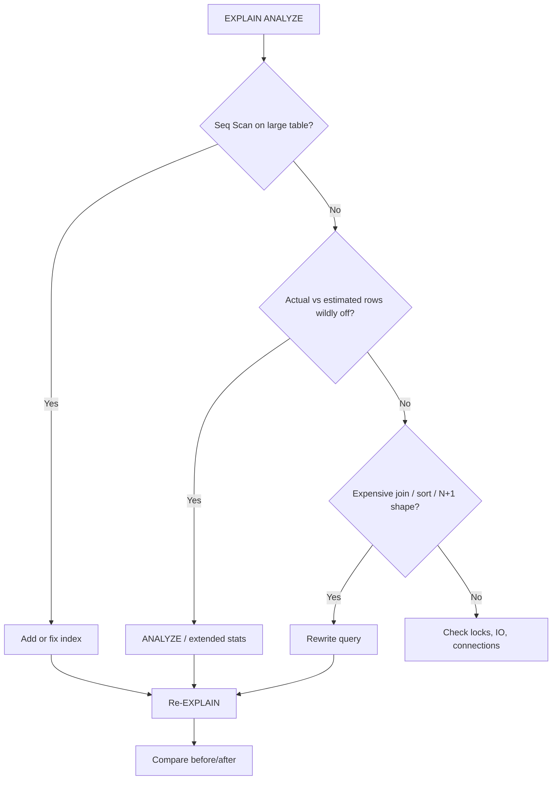

# Measurement — Start Here

Always measure before adding indexes, changing config, or scaling hardware. Most performance problems are visible in query plans and statistics.

> **Scope:** **Database lens** — `EXPLAIN`, `pg_stat_statements`, query plans, and PostgreSQL statistics. System SLOs and load testing → [HTS §1 Measurement and SLO](../../high-throughput-systems/includes/01-measurement-and-slo.md).
>
> **Related:** Load testing under concurrency → [HTS §1 Measurement and SLO](../../high-throughput-systems/includes/01-measurement-and-slo.md) · Full decision flow → [§13 Decision guide](13-decision-guide-and-common-mistakes.md)

## EXPLAIN ANALYZE

Run on any slow or suspicious query:

```sql
EXPLAIN (ANALYZE, BUFFERS, VERBOSE)
SELECT ...
```

### What to look for



| Signal | Likely cause | Next step |
|--------|--------------|-----------|
| **Seq Scan** on a large table | Missing or unused index | Add or fix index; check selectivity |
| **Nested Loop** with huge row counts | Bad join order or missing index | Index join columns; rewrite query |
| **Sort / HashAggregate** on millions of rows | No supporting index or pre-aggregation | Index for `ORDER BY`/`GROUP BY`; limit rows |
| **Actual vs estimated rows** wildly off | Stale or insufficient statistics | Run `ANALYZE`; consider extended statistics |
| High **shared/local hit ratio** in BUFFERS | Cache working well | — |
| High **read=** (disk reads) in BUFFERS | Data not in cache | Index, reduce scanned rows, more RAM |

## pg_stat_statements

The most important extension for production tuning. Tracks cumulative time per normalized query.

```sql
CREATE EXTENSION IF NOT EXISTS pg_stat_statements;

SELECT
  calls,
  round(total_exec_time::numeric, 2) AS total_ms,
  round(mean_exec_time::numeric, 2) AS mean_ms,
  rows,
  left(query, 120) AS query
FROM pg_stat_statements
ORDER BY total_exec_time DESC
LIMIT 20;
```

**Focus on:** queries with high **total time** (not just high mean time with few calls).

## Other useful views

| View | Use for |
|------|---------|
| `pg_stat_user_tables` | Seq scans vs index scans, dead tuples, last vacuum |
| `pg_stat_user_indexes` | Unused indexes (`idx_scan = 0`) |
| `pg_stat_activity` | Long-running queries, lock waits, idle in transaction |
| `pg_locks` | Blocking and blocked sessions |
| `pg_stat_database` | Cache hit ratio, commits, conflicts |

## Cache hit ratio

```sql
SELECT
  datname,
  round(100.0 * blks_hit / nullif(blks_hit + blks_read, 0), 2) AS cache_hit_pct
FROM pg_stat_database
WHERE datname = current_database();
```

Aim for **> 99%** on OLTP workloads. Lower values may indicate working set larger than RAM or missing indexes causing excess reads.

## When to use

| Situation | Tool |
|-----------|------|
| One query is slow | `EXPLAIN ANALYZE` on that query |
| General slowness under load | `pg_stat_statements` top by total time |
| Disk IO high | BUFFERS in EXPLAIN + cache hit ratio |
| Throughput collapsed | `pg_stat_activity` + `pg_locks` |
| After schema or data changes | Re-run EXPLAIN; compare plans |

## Best practices

- Capture plans on **production-like data volumes** — plans differ on empty tables
- Compare **before and after** when making changes
- Reset `pg_stat_statements` only when you need a clean window — not routinely
- Log slow queries (`log_min_duration_statement`) as a safety net, not a substitute for `pg_stat_statements`

## Common mistakes

| Mistake | Problem | Fix |
|---------|---------|-----|
| Optimize on empty dev tables | Plans don't match production | Test on realistic row counts |
| Focus only on mean time, ignore total time | Miss high-volume cheap queries | Sort `pg_stat_statements` by `total_exec_time` |
| Change index + config + query at once | Can't tell what helped | One change; re-measure |
| Skip BUFFERS in EXPLAIN | Can't tell cache vs disk IO | `EXPLAIN (ANALYZE, BUFFERS)` |
| Ignore idle-in-transaction in `pg_stat_activity` | Blocks vacuum; skews measurements | Fix app sessions; then re-measure |