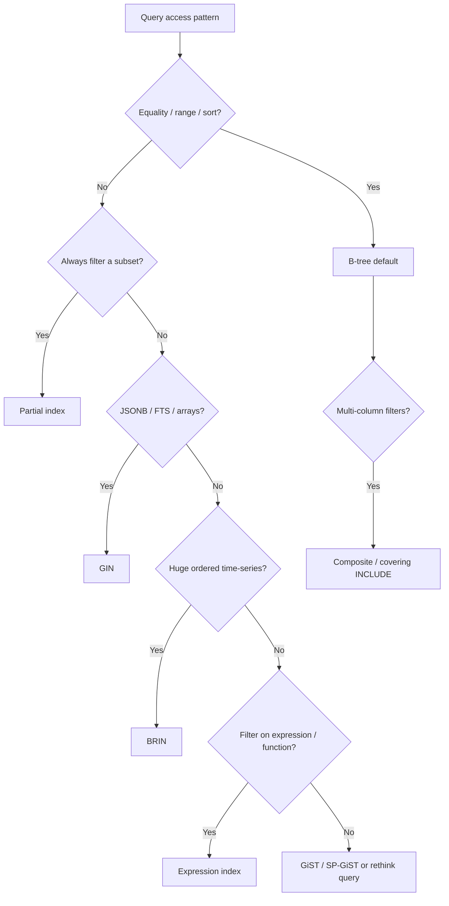

# Indexing

Indexing is usually the **highest-ROI** optimization for read-heavy workloads. A well-chosen index turns a sequential scan of millions of rows into a few index lookups.

> **Related:** General tree and index structures (B+, LSM(Log-Structured Merge), when to use each) → [tree-and-index-structures/README.md](../../tree-and-index-structures/README.md) · Query shape → [§3 Query design](03-query-design.md) · Online index builds → [§15 Schema migration checklist](15-schema-migration-checklist.md)

## Index types



| Type | When to use | Example |
|------|-------------|---------|
| **B-tree** (default) | Equality, ranges, sorting, most FK lookups | `WHERE status = 'active' AND created_at > ...` |
| **Partial index** | Queries always filter on a subset | `WHERE deleted_at IS NULL` |
| **Composite index** | Multi-column filters; order matters | `(tenant_id, created_at DESC)` |
| **Covering index** (`INCLUDE`) | Avoid heap lookups for extra columns | `CREATE INDEX ... INCLUDE (name, email)` |
| **GIN(Generalized Inverted Index)** | Full-text search, JSONB containment, arrays | `WHERE data @> '{"key": "val"}'` |
| **GiST / SP-GiST** | Geospatial, range types, nearest-neighbor | PostGIS, `tsrange` |
| **BRIN(Block-Range Index)** | Very large, naturally ordered data | Time-series timestamps, monotonic IDs |

## Column order in composite indexes

Put columns in this order:

1. **Equality filters** first (`=`, `IN`)
2. **Most selective** columns early
3. **Range / sort** columns last (supports `ORDER BY` on trailing columns)

```sql
-- Good for: WHERE tenant_id = ? AND status = 'active' ORDER BY created_at DESC
CREATE INDEX idx_orders_tenant_status_created
  ON orders (tenant_id, status, created_at DESC);
```

## Partial indexes

Index only the rows your query needs — smaller, faster, cheaper to maintain.

```sql
CREATE INDEX idx_users_active_email
  ON users (email)
  WHERE deleted_at IS NULL;
```

**When to use:** Soft deletes, status filters, "active only" queries that dominate traffic.

## Covering indexes (index-only scans)

When the index contains all columns the query needs, PostgreSQL can skip the heap:

```sql
CREATE INDEX idx_orders_covering
  ON orders (user_id, created_at DESC)
  INCLUDE (total, status);
```

Requires an up-to-date visibility map (healthy autovacuum).

## Pros and cons

| Pros | Cons |
|------|------|
| Dramatically faster reads | Slows INSERT/UPDATE/DELETE |
| Enables index-only scans | Uses disk space |
| Supports unique constraints | Wrong indexes waste resources |
| Partial indexes reduce write cost | Too many indexes confuse the planner |

## When to use

- `EXPLAIN` shows **Seq Scan** on a large table with a selective `WHERE`
- Foreign key columns used in **JOINs**
- Columns in **ORDER BY** or **GROUP BY** on large result sets
- JSONB fields queried with `@>`, `?`, `?&` → **GIN**
- Tables with **100M+** time-ordered rows and range queries → consider **BRIN**

## When NOT to use

- **Small tables** — sequential scan is often faster
- **Low-selectivity columns alone** — e.g. boolean `is_active` on its own
- **Write-heavy tables** where the indexed query is rare
- **Duplicating indexes** — `(a)` and `(a, b)` may make `(a)` redundant

## Best practices

- Index columns in `WHERE`, `JOIN`, and often `ORDER BY`
- Drop unused indexes: `pg_stat_user_indexes` where `idx_scan = 0`
- Use **`CREATE INDEX CONCURRENTLY`** in production (no write lock)
- Validate with `EXPLAIN ANALYZE` after creation
- Don't index every column "just in case"

## Common mistakes

| Mistake | Problem | Fix |
|---------|---------|-----|
| Index every column | Write slowdown; planner confusion | Index from EXPLAIN evidence only |
| Wrong composite column order | Index unused for common filters | Equality columns first; range/sort last |
| Duplicate indexes `(a)` and `(a,b)` | Redundant maintenance | Drop redundant single-column index |
| Partial index without matching query filter | Planner skips index | Align `WHERE` in index with query |
| `CREATE INDEX` (not CONCURRENTLY) in prod | Blocks writes | `CREATE INDEX CONCURRENTLY` |
| Never drop unused indexes | Wasted write cost | `pg_stat_user_indexes` where `idx_scan = 0` |

## Production example

```sql
-- Before: Seq Scan on 5M rows
EXPLAIN ANALYZE SELECT * FROM events WHERE org_id = 42 AND created_at > now() - interval '7 days';

-- Fix
CREATE INDEX CONCURRENTLY idx_events_org_created
  ON events (org_id, created_at DESC);

-- After: Index Scan or Bitmap Index Scan, ms instead of seconds
```