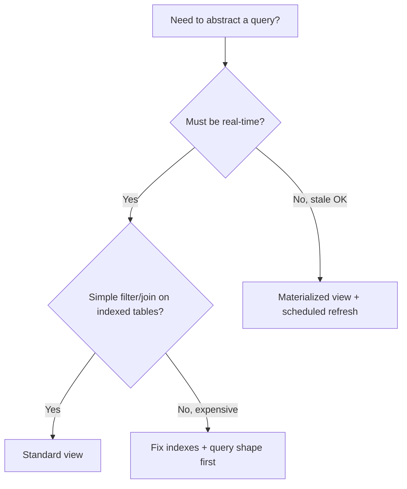
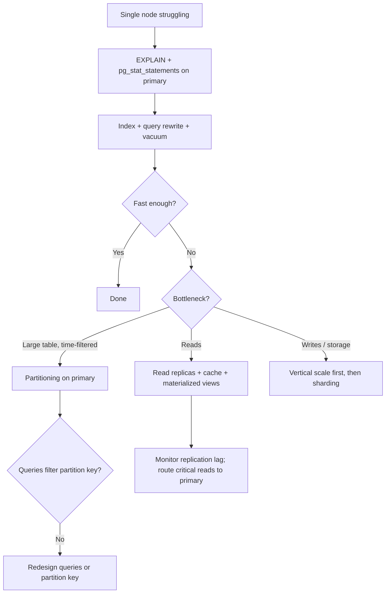

# Views, Functions, and Scale-Out Terminology

PostgreSQL offers several ways to abstract queries (views), encapsulate logic (functions and procedures), and scale beyond one node (partitioning, replication, sharding). These tools overlap in name but solve different problems — mixing them up leads to wrong architecture choices.

> **Read this first** before [Partitioning](10-partitioning.md), [Read scaling and caching](11-read-scaling-and-caching.md), or [Strong consistency](14-consistency-promises-and-costs.md) if terms like sharding vs replication are unclear.

> **Related:**
> - Index types and patterns → [02-indexing.md](02-indexing.md)
> - Query shape and common mistakes → [03-query-design.md](03-query-design.md)
> - Single-node table splits → [10-partitioning.md](10-partitioning.md)
> - Read replicas and materialized views → [11-read-scaling-and-caching.md](11-read-scaling-and-caching.md)
> - Consistency when scaling reads → [14-consistency-promises-and-costs.md](14-consistency-promises-and-costs.md)

---

## At a glance

| Tool | Stored data? | Performance role | Primary use |
|------|--------------|------------------|-------------|
| **Standard view** | No — saved query | Abstraction only; no speedup by itself | Simplify SQL, hide columns, security |
| **Materialized view** | Yes — snapshot | Pre-compute expensive reads | Dashboards, heavy aggregations |
| **Function** | No — compiled logic | Can help or hurt index use | Reusable logic, triggers, expressions |
| **Procedure** | No — batch logic | Batch work in fewer round trips | Maintenance jobs, multi-step ETL |
| **Partitioning** | Yes — split on one server | Pruning, retention, smaller indexes | Time-series, large tables on one node |
| **Replication** | Yes — full copy per node | Read scaling, HA | Same data on multiple servers |
| **Sharding** | Yes — subset per node | Write scaling across servers | Single-node writes exhausted |

---

## Views

### View types

| Type | Definition stored? | Data stored? | Always fresh? |
|------|-------------------|--------------|---------------|
| **Standard (regular) view** | Yes | No | Yes |
| **Materialized view** | Yes | Yes | No — until `REFRESH` |
| **Recursive view** | Yes (CTE) | No | Yes |
| **Updatable view** | Yes | No (uses base tables) | Yes |

### Standard views

A standard view is a named query. PostgreSQL rewrites queries against the view into the underlying SQL each time.

```sql
CREATE VIEW active_users AS
SELECT id, email, created_at
FROM users
WHERE deleted_at IS NULL;
```

| Pros | Cons |
|------|------|
| No extra storage | No performance gain unless it simplifies access patterns |
| Always up to date | Complex views can produce expensive plans |
| Can restrict visible rows/columns | Updatable only under specific rules |

**When to use:** Hide internal schema details, enforce row-level filters, give applications a stable interface during schema refactors.

**When NOT to use:** As a substitute for an index or materialized view on expensive aggregations.

#### Security barrier views

For views that enforce security predicates, use `security_barrier` so the planner cannot push untrusted user filters below the barrier and leak rows:

```sql
CREATE VIEW tenant_orders
WITH (security_barrier) AS
SELECT * FROM orders WHERE tenant_id = current_setting('app.tenant_id')::int;
```

### Materialized views

Materialized views store query results physically. Reads are fast; freshness depends on refresh schedule.

```sql
CREATE MATERIALIZED VIEW daily_revenue AS
SELECT date_trunc('day', created_at) AS day, sum(amount) AS total
FROM orders
GROUP BY 1;

CREATE UNIQUE INDEX ON daily_revenue (day);

REFRESH MATERIALIZED VIEW CONCURRENTLY daily_revenue;
```

| Pros | Cons |
|------|------|
| Dramatically faster reads for heavy aggregations | Stale until refreshed |
| Native PostgreSQL — no extra infrastructure | Storage and maintenance cost |
| `REFRESH CONCURRENTLY` avoids read locks (needs unique index) | Not suitable for real-time data |

**When to use:** Dashboards tolerating minutes of lag; reports that scan millions of rows repeatedly.

**When NOT to use:** Session-critical reads after a write — use base tables or route to primary.

See also [Read scaling and caching](11-read-scaling-and-caching.md) for refresh patterns and consistency trade-offs.

### Recursive views

Use recursive views (or recursive CTEs) for hierarchies — org charts, category trees, bill-of-materials:

```sql
CREATE RECURSIVE VIEW org_tree AS
  SELECT id, name, manager_id, 1 AS depth
  FROM employees
  WHERE manager_id IS NULL
  UNION ALL
  SELECT e.id, e.name, e.manager_id, t.depth + 1
  FROM employees e
  JOIN org_tree t ON e.manager_id = t.id;
```

**Performance note:** Deep or wide trees can be expensive. Index `(manager_id)` and consider materializing if the hierarchy is read-heavy and changes infrequently.

### Updatable views

Simple views on a single table with no aggregates can be updatable via `INSERT`/`UPDATE`/`DELETE`. Complex views need `INSTEAD OF` triggers.

**Rule of thumb:** Prefer updating base tables in hot OLTP paths. Views are fine for admin tools and controlled APIs.

### Choosing a view type



---

## Functions and procedures

### Functions vs procedures

| | **Function** | **Procedure** (PostgreSQL 11+) |
|--|--------------|----------------------------------|
| **Returns** | Scalar, row, set, or void | Nothing (`CALL` only) |
| **Use in SQL** | Yes — `SELECT fn()` | No — `CALL proc()` only |
| **Transaction control** | Runs in caller's transaction | Can `COMMIT` / `ROLLBACK` inside |
| **Typical role** | Expressions, triggers, reusable logic | Batch jobs, maintenance, ETL |

```sql
-- Function: reusable, index-friendly when marked correctly
CREATE FUNCTION user_display_name(u users) RETURNS text
LANGUAGE sql STABLE AS $$
  SELECT coalesce(u.display_name, split_part(u.email, '@', 1));
$$;

-- Procedure: batch work with explicit commits
CREATE PROCEDURE archive_old_orders()
LANGUAGE plpgsql AS $$
BEGIN
  INSERT INTO orders_archive
  SELECT * FROM orders
  WHERE created_at < now() - interval '2 years';

  DELETE FROM orders
  WHERE created_at < now() - interval '2 years';

  COMMIT;
END;
$$;
```

### Volatility and the planner

Function volatility tells PostgreSQL whether the planner can optimize through the function:

| Marker | Meaning | Index on expression? | Planner can inline? |
|--------|---------|----------------------|---------------------|
| `IMMUTABLE` | Same inputs → same output; no DB reads | Yes | Often |
| `STABLE` | Same result within one statement; may read DB | Sometimes | Limited |
| `VOLATILE` (default) | Can change anything, including side effects | No | No |

```sql
-- Good: expression index works
CREATE INDEX idx_users_email_lower ON users (lower(email));

-- Bad: function on indexed column prevents index use
WHERE date(created_at) = '2024-01-01'   -- likely Seq Scan
WHERE created_at >= '2024-01-01'
  AND created_at < '2024-01-02'         -- Index Scan
```

Mark functions accurately. Incorrect `IMMUTABLE` on a function that reads the database can produce wrong results.

### Language choice

| Language | Best for | Performance note |
|----------|----------|------------------|
| **SQL** | Simple expressions, set-returning logic | Often inlinable; fastest when it stays inline |
| **plpgsql** | Control flow, exception handling, batch loops | Overhead per call; avoid row-by-row loops |
| **plpython / others** | Specialized integrations | Higher call overhead; use for batch, not per-row |

### When functions and procedures help performance

| Do | Don't |
|----|-------|
| Batch updates in one procedure call | Call a function once per row from the application |
| Use `SQL` functions for simple transforms | Put business logic in DB when the team can't maintain it |
| Mark pure helpers `IMMUTABLE` or `STABLE` correctly | Default everything to `VOLATILE` and wonder why indexes aren't used |
| Use procedures for scheduled maintenance with commits | Use long-running functions inside OLTP transactions |

See [Query design](03-query-design.md) — **avoid functions on indexed columns** in `WHERE` clauses.

---

## Partitioning vs replication vs sharding vs clustering

These terms are often used interchangeably. In PostgreSQL they mean different things.

### Side-by-side comparison

| Concept | Where data lives | Write path | Read path | Built into PostgreSQL? |
|---------|------------------|------------|-----------|------------------------|
| **Partitioning** | One server; table split into child tables | Single primary | Single node (with pruning) | Yes — declarative partitioning |
| **Replication** | Full database copy on each standby | Primary only (usually) | Any replica; same data everywhere | Yes — streaming and logical |
| **Sharding** | Subset of rows per server | Distributed across shards | Route to correct shard(s) | No native — Citus, app routing, FDW |
| **Clustering** | Ambiguous — see below | Varies | Varies | Partially |

### Partitioning (single-node split)

Partitioning divides one logical table into physical child tables on **one PostgreSQL instance**. Queries that filter on the **partition key** skip irrelevant partitions (**partition pruning**).

```sql
CREATE TABLE events (
  id bigint GENERATED ALWAYS AS IDENTITY,
  org_id int NOT NULL,
  created_at timestamptz NOT NULL,
  payload jsonb
) PARTITION BY RANGE (created_at);

CREATE TABLE events_2026_06 PARTITION OF events
  FOR VALUES FROM ('2026-06-01') TO ('2026-07-01');
```

| Strategy | Partition key example | Typical use |
|----------|----------------------|-------------|
| **Range** | `created_at` by month | Time-series, retention |
| **List** | `region IN ('us', 'eu')` | Discrete categories |
| **Hash** | `hash(user_id)` | Even spread on one node — not cross-server sharding |

**Not sharding:** Hash partitioning on one server still shares one write path and one disk. It helps pruning and maintenance, not write throughput across machines.

Full details → [Partitioning](10-partitioning.md).

### Replication (full copy per node)

Streaming replication ships WAL from primary to one or more standbys. Each standby holds a **complete copy** of the database.

| Mode | Consistency | Write throughput | Typical use |
|------|-------------|------------------|-------------|
| Async streaming | Eventual on replicas | Highest | Read scaling, HA |
| Sync replication | Standby ack before commit | Lower | Stronger durability / RPO |
| Logical replication | Table-level, selective | Flexible | Upgrades, selective sync |

**Use for:** High availability, failover, offloading read-heavy traffic.

**Not for:** Write scaling — every replica replays all writes from the primary.

Full details → [Read scaling and caching](11-read-scaling-and-caching.md) and [Strong consistency](14-consistency-promises-and-costs.md).

### Sharding (horizontal split across servers)

Sharding splits data **across multiple independent database servers**. Each shard holds a subset of rows; no single node has all data.

```text
              ┌──────────────┐
user_id % 3 = 0 ──►│   Shard A    │
user_id % 3 = 1 ──►│   Shard B    │
user_id % 3 = 2 ──►│   Shard C    │
              └──────────────┘
         (coordinator or app routes queries)
```

| Approach | How routing works | Trade-offs |
|----------|-------------------|------------|
| **Application-level** | App picks shard by key | Full control; cross-shard queries in app |
| **Citus** | PostgreSQL extension; distributed tables | Native SQL; coordinator overhead |
| **Foreign Data Wrappers (FDW)** | Foreign tables on a coordinator | Flexible; often slower cross-node joins |
| **Managed services** | Cloud-native sharding layers | Less ops; vendor lock-in |

**Use when:** Single-node write throughput or storage is exhausted **after** query optimization, indexing, and vertical scaling.

**Costs:** Cross-shard joins, transactions, and aggregations become hard. Resharding is a major project.

### "Clustering" — three different meanings

| Meaning | What it is | PostgreSQL example |
|---------|------------|-------------------|
| **HA cluster** | Multiple nodes with one primary and automatic failover | Patroni, repmgr, cloud managed HA |
| **`CLUSTER` command** | One-time rewrite of table rows in index order | `CLUSTER orders USING idx_orders_user_id` |
| **Distributed cluster** | Sharded or multi-node coordinated setup | Citus, logical replication topologies |

When someone says "PostgreSQL cluster," clarify which they mean before designing.

### Scale-out decision flow



### Cheat sheet — pick the right scale-out tool

| Problem | Tool |
|---------|------|
| Table too large; queries always filter by date | **Partitioning** (range) |
| Need to drop old data fast | **Partitioning** + `DROP TABLE` |
| 10× more reads than writes | **Read replicas** + app routing |
| Expensive aggregation query | **Materialized view** |
| Single-node writes maxed out | **Sharding** (Citus or app-level) — last resort |
| Failover and HA | **Streaming replication** + HA manager |
| Rewrite table in index order (maintenance) | **`CLUSTER`** or `pg_repack` — not scale-out |

---

## Common mistakes

| Mistake | Why it fails | Do instead |
|---------|--------------|------------|
| Materialized view for real-time UI | Stale reads after writes | Base table + index, or refresh on write |
| Standard view expecting speedup | View re-runs full query each time | Index underlying tables; consider materialized view |
| `VOLATILE` function in `WHERE` on indexed column | Index not used | Rewrite predicate; mark function correctly |
| Hash partition thinking it shards writes | Still one server, one WAL | Sharding only when multi-node writes needed |
| Read replica before fixing slow queries | Replicas multiply bad-query cost | Optimize on primary first |
| Sharding for read-heavy workload | Replicas are simpler | Replicas + cache until writes force sharding |
| Confusing HA cluster with sharding | HA replicates all data; sharding splits it | Match tool to read vs write bottleneck |

---

## See also

- [Indexing](02-indexing.md) — B-tree, partial, GIN, BRIN, and covering indexes
- [Query design](03-query-design.md) — pagination, N+1, functions on indexed columns
- [Partitioning](10-partitioning.md) — range, list, hash, pruning, retention
- [Read scaling and caching](11-read-scaling-and-caching.md) — replicas, Redis, materialized view refresh
- [Decision guide and common mistakes](13-decision-guide-and-common-mistakes.md) — scenario recommendations and priority checklist
- [Strong consistency — promises and costs](14-consistency-promises-and-costs.md) — replication lag and read-your-writes
