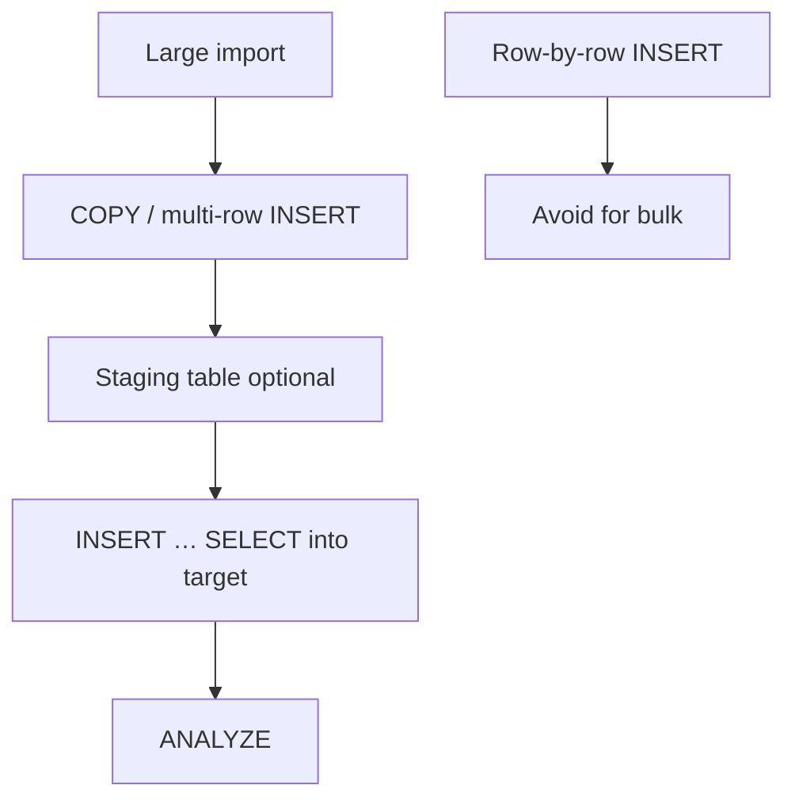

# Bulk Operations, Locking, and Concurrency

Write-heavy workloads and concurrent access need different strategies than tuning individual SELECT statements.

> **Related:** Stats after bulk load → [§5 Statistics and the planner](05-statistics-and-planner.md) · Online index builds → [§15 Schema migration checklist](15-schema-migration-checklist.md) · Job queues at scale → [HTS §6 Async queues](../../high-throughput-systems/includes/06-async-queues-workers.md)

## Bulk load and backfill



| Method | Speed | Notes |
|--------|-------|-------|
| **`COPY`** | Fastest | Preferred for large imports |
| Multi-row `INSERT` | Good | Batches of 100–1000 rows |
| Row-by-row `INSERT` | Slowest | Avoid for bulk |

```sql
COPY staging_orders FROM '/path/orders.csv' WITH (FORMAT csv, HEADER true);
INSERT INTO orders SELECT ... FROM staging_orders;
ANALYZE orders;
```

### Large load tips

- Load into **unlogged staging table** first
- Drop nonessential indexes before load, recreate **`CONCURRENTLY`** after (only for very large loads)
- Run **`ANALYZE`** after load completes
- Increase **`maintenance_work_mem`** for index creation session

## Upserts at scale

```sql
INSERT INTO inventory (sku, qty)
VALUES ('ABC', 10)
ON CONFLICT (sku) DO UPDATE SET qty = inventory.qty + EXCLUDED.qty;
```

Requires a **unique index** on the conflict target (`sku`).

## Locking

PostgreSQL row-level locks are fine-grained, but long transactions and table-level locks still hurt.

| Lock type | Cause | Mitigation |
|-----------|-------|------------|
| Row exclusive | Normal UPDATE/DELETE | Keep transactions short |
| Waiting on row | Hot row contention | Queue pattern, advisory locks, partition |
| Access exclusive | `ALTER TABLE`, `VACUUM FULL` | Use `CONCURRENTLY` variants |
| Idle in transaction | App bug | Timeouts; fix ORM session handling |

### Job queue pattern

```sql
SELECT * FROM jobs
WHERE status = 'pending'
ORDER BY created_at
FOR UPDATE SKIP LOCKED
LIMIT 1;
```

Workers skip rows already locked — no thundering herd.

## Transaction isolation

Default **`READ COMMITTED`** is right for most OLTP.

Use **`REPEATABLE READ`** or **`SERIALIZABLE`** only when you have proven race conditions that application logic can't handle.

## Hardware and storage

| Factor | OLTP guidance |
|--------|---------------|
| **Storage** | NVMe SSD — random IO matters |
| **RAM** | Working set should fit in cache for hot data |
| **CPU** | More cores help parallel queries; OLTP needs fast single-core too |
| **Separate WAL(Write-Ahead Log) disk** | High-write bare metal; rarely needed on cloud managed |

## When to use

| Situation | Strategy |
|-----------|----------|
| Nightly ETL(Extract, Transform, Load) | `COPY` + staging table |
| Backfill column on 100M rows | Batch UPDATE in chunks; avoid one giant transaction |
| Job workers competing | `FOR UPDATE SKIP LOCKED` |
| Migration in production | `CREATE INDEX CONCURRENTLY`; online schema tools |
| Hot row updates (counters) | Advisory lock, atomic UPDATE, or async aggregation |

## Common mistakes

| Mistake | Problem | Fix |
|---------|---------|-----|
| One giant transaction for backfill | Long locks, WAL bloat, replay lag | Batch UPDATE in chunks with commits |
| Row-by-row INSERT for imports | Slow; high round-trip cost | `COPY` or multi-row INSERT |
| Skip `ANALYZE` after bulk load | Bad plans until autovacuum catches up | `ANALYZE` immediately after load |
| Hot row counter updates | Row lock contention | Queue pattern, advisory lock, or async aggregate |
| `SELECT … FOR UPDATE` without SKIP LOCKED | Workers block each other | `FOR UPDATE SKIP LOCKED` for job queues |
| `SERIALIZABLE` by default | Avoidable aborts and retries | `READ COMMITTED` unless proven race |

## Best practices

- Keep transactions **short** — especially those holding locks
- Batch writes; don't send 1000 single-row INSERTs from the app
- Use **`statement_timeout`** and **`lock_timeout`** on app roles
- For retention, **drop partitions** instead of massive DELETE
- Load test concurrency patterns before production deploy